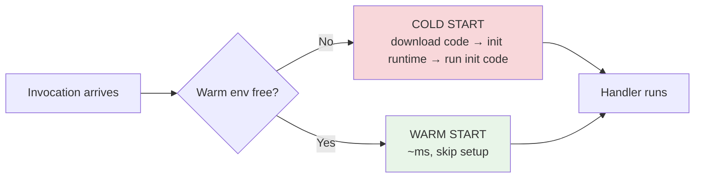
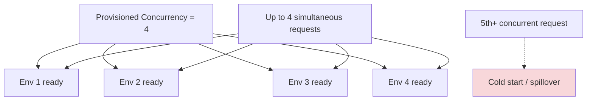
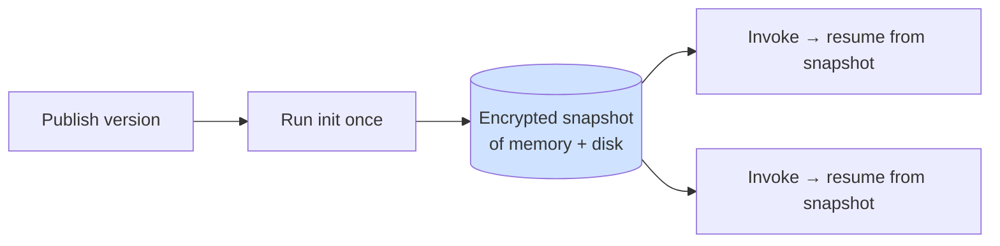
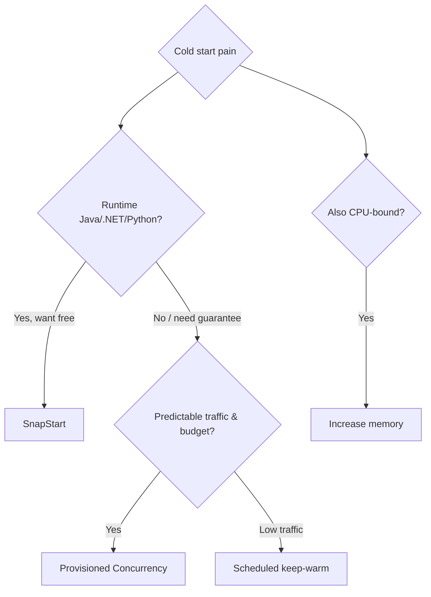

# 📘 Lambda Cold Starts & Performance - SAA-C03 Deep Dive

> Why is the _first_ request slow? Because Lambda must **provision an execution environment** before your handler runs. This file is the deep dive on **cold vs warm starts** and the five levers AWS gives you to fight latency: **warm start, provisioned concurrency, memory sizing, static-init optimization, and SnapStart**.

See also: [Lambda Core Concepts & Architecture](Lambda%20Core%20Concepts%20%26%20Architecture.md) · [Lambda Concurrency & Scaling](Lambda%20Concurrency%20%26%20Scaling.md) · [Lambda Invocation Modes](Lambda%20Invocation%20Modes.md) · [Lambda intro](Lambda%20intro.md) · [Lambda Scenario Questions](Lambda%20Scenario%20Questions.md)

---

## Table of Contents

- [1. What a Cold Start Actually Is](#1-what-a-cold-start-actually-is)
- [2. Warm Starts (Environment Reuse)](#2-warm-starts-environment-reuse)
- [3. Provisioned Concurrency](#3-provisioned-concurrency)
- [4. Memory Configuration = CPU = Speed](#4-memory-configuration--cpu--speed)
- [5. Static Initialization Optimization](#5-static-initialization-optimization)
- [6. SnapStart](#6-snapstart)
- [7. Picking the Right Lever (Decision Matrix)](#7-picking-the-right-lever-decision-matrix)
- [8. The INIT-Phase Billing Change](#8-the-init-phase-billing-change)
- [9. Mini Scenario Drills](#9-mini-scenario-drills)

---



---

## 1. What a Cold Start Actually Is

A **cold start** is the time Lambda spends preparing a brand-new execution environment **before** your handler can run:

1. **Download** the function code from S3 / pull image from ECR.
2. **Bootstrap** the runtime and attach **layers**.
3. **Run initialization code** (everything in global/module scope, outside the handler).

Only after all that does Lambda invoke your handler.

**Facts to remember**

- Typical cold start: **~100 ms to ~1 s** (much longer for un-optimized Java/.NET).
- AWS reports cold starts affect roughly **<1% of invocations** in steady production workloads.
- Cold starts happen on the **first invoke**, after **scaling up** (each new concurrent env is cold), and after an env is **recycled**.
- **You can't directly control when** a cold start occurs — Lambda decides based on traffic.

> 🧠 **Exam signal:** "users see latency on the _first_ request" / "function hasn't run recently" / "p99 latency spikes during scale-up" = **cold start** problem.

[⬆ Back to top](#table-of-contents)

---

## 2. Warm Starts (Environment Reuse)

After a function finishes, Lambda **doesn't immediately destroy** the environment — it **freezes** it and keeps it around to serve the next request, skipping all the setup. That reuse is a **warm start**.

- Reuse means **`/tmp` contents, cached DB connections, and SDK clients survive** between invocations in the _same_ environment.
- Lambda spins up **new (cold) environments** when concurrency rises — so warm reuse only covers steady, single-flight traffic.

### The "keep-warm" workaround (use with care)

You can **pre-invoke** with a dummy/ping event (e.g., EventBridge every 5 min) to keep an environment alive.

- ✅ Acceptable for **low-traffic / scheduled** functions.
- ❌ **Not for production at scale** — it only keeps _one_ env warm; concurrent traffic still cold-starts. For real guarantees use **Provisioned Concurrency**.

[⬆ Back to top](#table-of-contents)

---

## 3. Provisioned Concurrency

**Provisioned Concurrency (PC)** pre-initializes a set number of execution environments and keeps them **always warm and ready**, so invocations hit a warm env with **no cold start**.



- Best for **latency-critical, predictable-traffic** functions and functions with **heavy init** (large frameworks).
- **Costs money even when idle** (you pay to keep envs warm) — unlike on-demand Lambda which scales to zero.
- Combine with **Application Auto Scaling** to schedule/scale PC around known traffic peaks.
- Requests **beyond** the provisioned count fall back to normal (cold-capable) on-demand scaling.

> 🧠 **Exam contrast:** SnapStart = **free**, runtime-restricted, no idle cost. Provisioned Concurrency = **paid**, any runtime, guarantees zero cold start up to the provisioned count.

[⬆ Back to top](#table-of-contents)

---

## 4. Memory Configuration = CPU = Speed

Memory is configurable from **128 MB to 10,240 MB**, and **CPU (and network/IO) scale proportionally with memory**. More memory can make a function run _so much faster_ that total cost stays flat or even drops.

```
Example (CPU-bound data function):
128 MB  → 3000 ms  → $0.0000625   (slow & not even cheapest)
512 MB  →  800 ms  → ~same cost   ← good zone
1024 MB →  400 ms  → ~same cost   ← sweet spot for many workloads
```

**How to size it**

- Run **load tests**, or use **AWS Lambda Power Tuning** (a Step Functions state machine that runs your function across memory settings and charts cost vs latency).
- Don't reflexively pick 128 MB to "save money" — slow execution can cost the same or more **and** hurt latency.

> 🧠 **Exam keyword:** "Lambda is slow / CPU-bound and we want better performance, possibly without higher cost" → **increase memory** (raises CPU) and/or use **Power Tuning** to find the optimum.

[⬆ Back to top](#table-of-contents)

---

## 5. Static Initialization Optimization

The **init phase** runs all your global-scope code. Bloated init = bigger cold start.

**Do**

- Import **only the dependencies you actually use**; tree-shake/bundle (e.g., esbuild for Node).
- Initialize SDK clients, DB pools, and fetch secrets **once in global scope** (reused on warm invokes).
- Lazy-load rarely-used heavy modules inside the handler.

**Don't**

- Bundle giant monolithic dependency trees you barely touch.
- Re-create clients/connections inside the handler on every request.

**If the package is unavoidably large** → split the function into smaller **child functions**, move shared libs to **Layers**, or ship as a **container image**.

[⬆ Back to top](#table-of-contents)

---

## 6. SnapStart

**SnapStart** attacks cold starts by taking an **encrypted snapshot of the initialized memory + disk state** of the execution environment and caching it. New invocations **resume from the snapshot** instead of running full init — cutting cold starts dramatically (e.g., multi-second Java init → ~sub-second).



**Must-know facts**

- Originally **Java** (the classic SAA-C03 fact: "Java cold starts → SnapStart"); AWS has since extended SnapStart to **Python and .NET** runtimes.
- **No extra charge** for the SnapStart mechanism itself.
- Works on **published versions** (not `$LATEST`).
- **Uniqueness caveat:** anything generated during init (random seeds, unique IDs, ephemeral connections) is captured in the snapshot and **shared across restores** — re-initialize such state **inside the handler** or via runtime hooks.

> 🧠 **Exam line:** "Java/.NET function, slow cold starts, want a fix with **no extra cost**" → **SnapStart**. "Any runtime, must **guarantee** zero cold start for steady traffic, cost acceptable" → **Provisioned Concurrency**.

[⬆ Back to top](#table-of-contents)

---

## 7. Picking the Right Lever (Decision Matrix)

| Symptom / requirement                                  | Best lever                                             |
| :----------------------------------------------------- | :----------------------------------------------------- |
| Java/.NET cold start, want free fix                    | **SnapStart**                                          |
| Any runtime, guarantee no cold start, predictable peak | **Provisioned Concurrency** (+ scheduled scaling)      |
| General latency, CPU-bound                             | **Increase memory** / Power Tuning                     |
| Low-traffic function, occasional cold start            | **Scheduled keep-warm ping** (cheap)                   |
| Big package inflating init                             | **Smaller deps / Layers / container / split function** |
| Cheaper + often faster cold start, no code change      | **ARM64 (Graviton2)**                                  |



[⬆ Back to top](#table-of-contents)

---

## 8. The INIT-Phase Billing Change

Historically, the **init phase was not billed** for managed runtimes — only the invoke phase. AWS changed this so the **INIT (cold start) duration is billed** for managed runtimes.

- **Practical impact is small** for most workloads (cold starts are <1% of invocations).
- Watch the **`InitDuration`** CloudWatch metric to spot heavy init and optimize.
- Yet another reason to keep **init lean** (see [5. Static Initialization Optimization](#5-static-initialization-optimization)).

[⬆ Back to top](#table-of-contents)

---

## 9. Mini Scenario Drills

**Q1.** A customer-facing **Java** API's first hourly request takes ~6 s; later requests ~200 ms. Most cost-effective fix?
_A:_ **SnapStart** (purpose-built for Java cold starts, no extra charge). Provisioned Concurrency works but costs more.

**Q2.** A checkout function must have **near-zero cold start during a known daily 7–9 pm peak**, any runtime.
_A:_ **Provisioned Concurrency** with **scheduled Application Auto Scaling** for the peak window.

**Q3.** A function is slow and CPU-bound; raising it from 256 MB to 1024 MB cut runtime 4×. Net effect?
_A:_ CPU scales with memory; runtime dropped enough that **cost is roughly flat while latency improves** — confirm the optimum with **Lambda Power Tuning**.

**Q4.** Keeping one function warm via a 5-minute EventBridge ping still shows cold starts during traffic bursts. Why?
_A:_ Keep-warm holds **one** environment; **concurrent** requests each need their own env and **cold-start**. Use **Provisioned Concurrency** for guarantees.

**Q5.** Team wants ~20% cost reduction and slightly faster cold starts with a config-only change.
_A:_ Switch architecture to **ARM64 (Graviton2)** (re-test native deps).

[⬆ Back to top](#table-of-contents)
