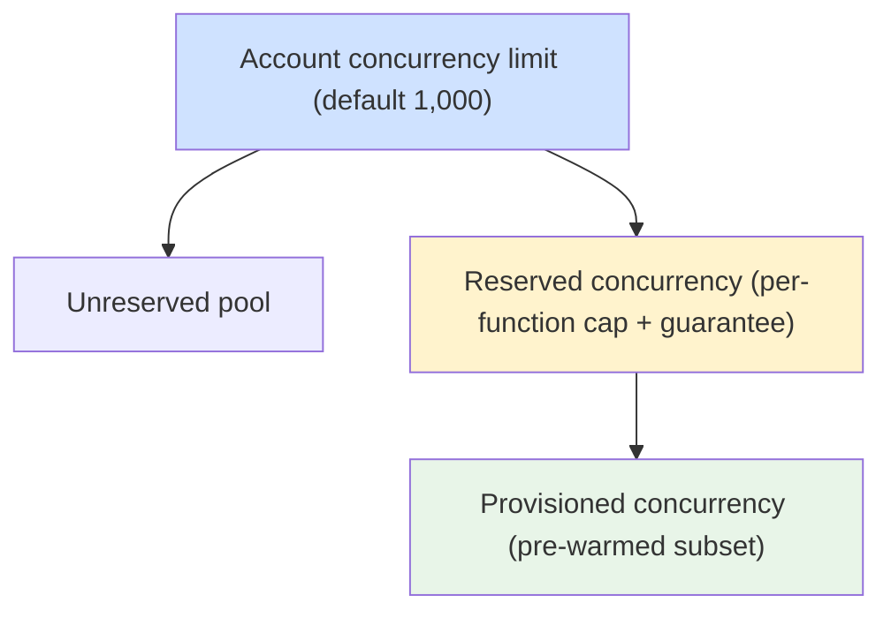
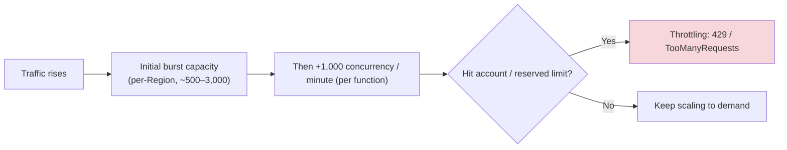
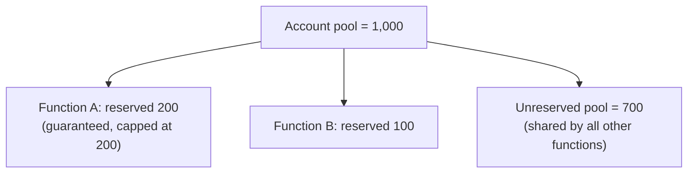

# 📘 Lambda Concurrency & Scaling - SAA-C03 Deep Dive

> Lambda scales automatically — but _how_ it scales, and the three concurrency controls (**account limit, reserved concurrency, provisioned concurrency**) are heavily tested. Get throttling, burst limits, and the `Throttles` metric right and you'll nail the "why are requests failing under load?" questions.

See also: [Lambda Cold Starts & Performance](Lambda%20Cold%20Starts%20%26%20Performance.md) · [Lambda Invocation Modes](Lambda%20Invocation%20Modes.md) · [Lambda Core Concepts & Architecture](Lambda%20Core%20Concepts%20%26%20Architecture.md) · [Lambda intro](Lambda%20intro.md) · [Lambda Scenario Questions](Lambda%20Scenario%20Questions.md)

---

## Table of Contents

- [1. Concurrency Defined](#1-concurrency-defined)
- [2. How Lambda Scales (Burst + Steady)](#2-how-lambda-scales-burst--steady)
- [3. The Three Concurrency Controls](#3-the-three-concurrency-controls)
- [4. Reserved Concurrency Deep Dive](#4-reserved-concurrency-deep-dive)
- [5. Provisioned Concurrency Deep Dive](#5-provisioned-concurrency-deep-dive)
- [6. Throttling & Error Behaviour by Mode](#6-throttling--error-behaviour-by-mode)
- [7. Concurrency Math Cheat Sheet](#7-concurrency-math-cheat-sheet)
- [8. Mini Scenario Drills](#8-mini-scenario-drills)

---



---

## 1. Concurrency Defined

**Concurrency = the number of requests your function is serving _at the same instant_.**

A useful approximation (Little's Law):

```
Concurrency ≈ Requests per second × Average duration (seconds)

e.g. 100 req/s × 0.2 s avg = 20 concurrent executions
```

Each concurrent execution needs its **own execution environment**. New environments mean **cold starts** during scale-up (see [Lambda Cold Starts & Performance](Lambda%20Cold%20Starts%20%26%20Performance.md)).

[⬆ Back to top](#table-of-contents)

---

## 2. How Lambda Scales (Burst + Steady)



- **Burst:** Lambda can instantly create a burst of environments (region-dependent, historically ~500–3,000), then **ramps further** (modern per-function scaling adds up to **1,000 concurrency per minute**).
- **Default account concurrency: 1,000** concurrent executions (a **soft limit** — open a Service Quotas request to raise it).
- When the limit is hit, additional invocations are **throttled** (HTTP 429 / `TooManyRequestsException`).

[⬆ Back to top](#table-of-contents)

---

## 3. The Three Concurrency Controls

| Control                       | Scope                      | Purpose                                                                          | Cost                 |
| :---------------------------- | :------------------------- | :------------------------------------------------------------------------------- | :------------------- |
| **Account concurrency limit** | Whole account/Region       | Hard ceiling for all functions combined (default 1,000, raisable)                | n/a                  |
| **Reserved concurrency**      | Per function               | **Caps** a function _and_ **guarantees** it that slice; protects other functions | Free                 |
| **Provisioned concurrency**   | Per function/version/alias | **Pre-warms** N environments → no cold start                                     | **Paid** (even idle) |

> 🧠 **Don't confuse them:** _Reserved_ = a **carved-out share** of the account pool (both a guarantee and a ceiling, no warm-up). _Provisioned_ = **pre-initialized warm** environments (latency, costs money). You can set both on one function.

[⬆ Back to top](#table-of-contents)

---

## 4. Reserved Concurrency Deep Dive

Reserved concurrency does **two things at once** for a function:

1. **Guarantees** that function can always reach up to its reserved number (carved out of the account pool).
2. **Caps** it at that number — it can **never exceed** it.



**Why it's tested**

- **Protect a critical function** from noisy neighbors → give it **reserved concurrency**.
- **Protect a downstream system** (e.g., a small RDS instance) from being overwhelmed → **cap** the function's concurrency with reserved concurrency (set it low).
- **Setting reserved = 0** effectively **disables/throttles** a function (kill-switch).
- Reserved capacity is **subtracted** from the unreserved pool available to everything else.

> 🧠 **Exam keyword:** "Lambda is overwhelming a downstream database / API with too many connections" → **set reserved concurrency** to throttle it. (Pair with **RDS Proxy** for connection pooling.)

[⬆ Back to top](#table-of-contents)

---

## 5. Provisioned Concurrency Deep Dive

Pre-initializes environments so they're **warm and ready** — eliminating cold starts up to the provisioned count. Covered in depth in [Lambda Cold Starts & Performance > 3. Provisioned Concurrency](Lambda%20Cold%20Starts%20%26%20Performance.md#3-provisioned-concurrency).

- Applied to a **version or alias** (not `$LATEST`).
- Use **Application Auto Scaling** to schedule it around predictable peaks (e.g., scale up before a product launch).
- Requests beyond the provisioned count **spill over** to standard on-demand scaling (which can cold-start).
- **Costs money while provisioned**, even with zero traffic.

[⬆ Back to top](#table-of-contents)

---

## 6. Throttling & Error Behaviour by Mode

When concurrency is exhausted, what happens depends on the **invocation mode**:

| Mode                     | On throttle                                                                                |
| :----------------------- | :----------------------------------------------------------------------------------------- |
| **Synchronous**          | Caller gets **429 `TooManyRequestsException`** → client must retry/back off                |
| **Asynchronous**         | Lambda **retries internally** for up to ~6 h; unresolved → **DLQ / OnFailure Destination** |
| **SQS (ESM)**            | Messages stay in queue → reprocessed after visibility timeout → **DLQ** if poison          |
| **Stream (Kinesis/DDB)** | Lambda backs off and retries the batch; throttling shows as **`IteratorAge`** growth       |

**Key metric to watch:** `Throttles` (CloudWatch). Rising `Throttles` = hitting a concurrency limit → raise account limit, add **reserved** capacity, or **buffer with SQS**.

> 🧠 **Exam pattern:** "During flash sales, orders are throttled and must not be lost." → put **SQS in front** of Lambda as a buffer (messages persist until processed); raising the account limit alone just moves the ceiling.

[⬆ Back to top](#table-of-contents)

---

## 7. Concurrency Math Cheat Sheet

| Need                                  | Answer                                                    |
| :------------------------------------ | :-------------------------------------------------------- |
| Estimate concurrency                  | `req/s × avg duration (s)`                                |
| Default account limit                 | **1,000** (soft, raisable)                                |
| Per-function guarantee + cap          | **Reserved concurrency**                                  |
| Eliminate cold start for N concurrent | **Provisioned concurrency = N**                           |
| Disable a function (kill switch)      | Reserved concurrency = **0**                              |
| Protect downstream DB                 | Low **reserved** concurrency (+ RDS Proxy)                |
| Absorb spikes without loss            | **SQS buffer** in front                                   |
| Scale rate (modern)                   | up to **+1,000 concurrency/min per function** after burst |

[⬆ Back to top](#table-of-contents)

---

## 8. Mini Scenario Drills

**Q1.** Function A's traffic spike starves all other functions in the account. Fix?
_A:_ Give the **other critical functions reserved concurrency** (or cap A with reserved concurrency) so A can't consume the whole pool.

**Q2.** A Lambda opens a DB connection per invocation and exhausts a small RDS instance's connections under load.
_A:_ **Reserve (cap) the function's concurrency** to limit simultaneous connections, and front RDS with **RDS Proxy**.

**Q3.** Synchronous API callers intermittently get HTTP 429 during peaks.
_A:_ Concurrency throttling. Raise the **account limit** (Service Quotas), add **provisioned/reserved** capacity, or decouple with a **queue** if async is acceptable.

**Q4.** Orders during flash sales are throttled and occasionally lost.
_A:_ Insert **SQS** between source and Lambda → messages buffer and aren't lost; Lambda drains at its concurrency limit (+ DLQ for poison messages).

**Q5.** A new launch needs guaranteed warm capacity for a 2-hour window only.
_A:_ **Provisioned concurrency** with **scheduled Application Auto Scaling** for that window, then scale back to avoid idle cost.

[⬆ Back to top](#table-of-contents)
