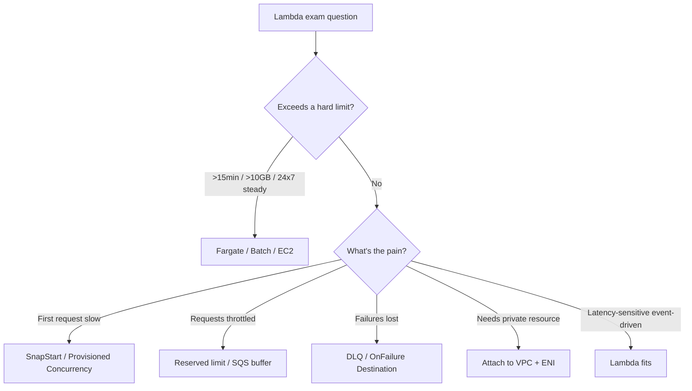

# 📘 Lambda Scenario Questions - SAA-C03 Exam Bank

> A focused bank of **scenario-style SAA-C03 questions** on Lambda, grouped by theme, each with the answer, an explanation, and the **exam trap** to avoid. Use this as your final review pass. For the underlying concepts, jump to the linked deep-dive files.

See also: [Lambda intro](Lambda%20intro.md) · [Lambda Core Concepts & Architecture](Lambda%20Core%20Concepts%20%26%20Architecture.md) · [Lambda Invocation Modes](Lambda%20Invocation%20Modes.md) · [Lambda Cold Starts & Performance](Lambda%20Cold%20Starts%20%26%20Performance.md) · [Lambda Concurrency & Scaling](Lambda%20Concurrency%20%26%20Scaling.md) · [Lambda edge](Lambda%20edge.md)

---

## Table of Contents

- [Part 1: Compute Selection (Lambda vs the World)](#part-1-compute-selection-lambda-vs-the-world)
- [Part 2: Invocation, Retries & Error Handling](#part-2-invocation-retries--error-handling)
- [Part 3: Concurrency, Scaling & Throttling](#part-3-concurrency-scaling--throttling)
- [Part 4: Cold Starts & Performance](#part-4-cold-starts--performance)
- [Part 5: Networking & VPC](#part-5-networking--vpc)
- [Part 6: Security & Secrets](#part-6-security--secrets)
- [Part 7: Architecture & Integration Patterns](#part-7-architecture--integration-patterns)
- [Part 8: Quick Keyword → Answer Map](#part-8-quick-keyword--answer-map)
- [Part 9: Exam-Day Cheat Sheet](#part-9-exam-day-cheat-sheet)

---

---

## Part 1: Compute Selection (Lambda vs the World)

### Q1 — Infrequent short job

A process pulls an API every 5 minutes, transforms data (~30 s), writes to DynamoDB. Most cost-effective compute?

**A)** EC2 `t4g.nano` 24/7 · **B)** Lambda · **C)** Fargate Spot task · **D)** Batch with Spot

**Answer: B.** Infrequent + short (<15 min) + event/schedule-driven = textbook Lambda; pay only per invocation, scales to zero.
**Trap:** EC2 24/7 bills constantly for a job that runs ~0.1% of the time.

### Q2 — Job exceeds 15 minutes

A nightly job processes large files and takes ~45 minutes. Which service?

**A)** Lambda with max timeout · **B)** AWS Batch / Fargate · **C)** Lambda + Step Functions loop · **D)** API Gateway + Lambda

**Answer: B.** Lambda's hard ceiling is **15 minutes**. Long-running batch → **AWS Batch** (or **Fargate**/EC2).
**Trap:** "Raise the Lambda timeout" — impossible past 900 s.

### Q3 — Huge dependency package

A function needs a 4 GB ML model + libraries. How to deploy?

**A)** Lambda **container image** (≤10 GB) · **B)** Bigger zip · **C)** Layers only · **D)** Not possible on Lambda

**Answer: A.** Container images allow up to **10 GB**; zip caps at **250 MB unzipped**. Layers also count toward 250 MB.
**Trap:** Thinking Layers bypass the size limit — they don't.

### Q4 — Steady high throughput

A service handles a constant ~5,000 req/s, 24/7, each ~300 ms. Lambda or containers?

**Answer: Containers (Fargate/ECS/EKS) or EC2.** At constant high volume, Lambda's per-invocation pricing and concurrency churn usually cost more than always-on containers.
**Trap:** Lambda is _not_ always cheapest — steady saturation favors provisioned compute.

[⬆ Back to top](#table-of-contents)

---

## Part 2: Invocation, Retries & Error Handling

### Q5 — API Gateway timeout

An API Gateway → Lambda integration fails at ~29 s though the function legitimately needs ~2 minutes. Best fix?

**A)** Increase Lambda timeout to 900 s · **B)** Make it asynchronous (202 + background processing) · **C)** Add provisioned concurrency · **D)** Switch to ALB

**Answer: B.** The block is the **API Gateway 29-second integration timeout**, not Lambda. Return `202` and process via SQS/Step Functions, or poll for status.
**Trap:** Raising the Lambda timeout doesn't help — the gateway cuts the connection at 29 s.

### Q6 — Don't lose failed async events

S3-triggered processing occasionally errors and events vanish. Keep failures for reprocessing?

**Answer: Configure a DLQ or `OnFailure` Destination.** S3 invokes Lambda **asynchronously**; after 2 retries, route failures to **SQS/SNS**.
**Trap:** Assuming S3 retries forever — async retries default to **2**.

### Q7 — React to success AND failure

An async pipeline must route **successful** records to one queue and **failures** to another.

**Answer: Lambda Destinations** (`OnSuccess` + `OnFailure`). A **DLQ only captures failures**, so it can't satisfy the success path.
**Trap:** Choosing DLQ when the requirement includes successes.

### Q8 — Poison pill blocks a stream

One malformed record stalls a Kinesis consumer; the shard stops advancing.

**Answer:** Enable **bisect batch on function error**, set **maximum retry attempts / record age**, and add an **on-failure destination**.
**Trap:** Stream ESM retries the whole batch until expiry — without these knobs the shard is stuck.

### Q9 — Idempotency

An async S3 event sometimes triggers the same processing twice, creating duplicate DynamoDB rows.

**Answer:** Make the handler **idempotent** (conditional writes / dedupe key). At-least-once delivery means **duplicates are expected**.
**Trap:** Treating Lambda as exactly-once.

[⬆ Back to top](#table-of-contents)

---

## Part 3: Concurrency, Scaling & Throttling

### Q10 — Flash-sale throttling

During flash sales, order-processing Lambda is throttled and orders are lost.

**A)** Raise account concurrency only · **B)** Put **SQS** in front of Lambda · **C)** Provisioned concurrency · **D)** Move to EC2

**Answer: B.** SQS **buffers** the spike; messages persist until Lambda drains them at its concurrency limit → nothing lost. Add a DLQ for poison messages.
**Trap:** Raising the account limit just relocates the ceiling and still risks loss at the source.

### Q11 — Noisy neighbor

One function's spike consumes the entire account concurrency pool and starves critical functions.

**Answer:** Assign **reserved concurrency** to the critical functions (guaranteed slice) and/or cap the noisy one.
**Trap:** Provisioned concurrency doesn't _isolate_ the pool — **reserved** does.

### Q12 — Protect a small database

A Lambda opens a DB connection per invocation and exhausts RDS connections under load.

**Answer:** **Cap concurrency with reserved concurrency** + use **RDS Proxy** to pool connections.
**Trap:** Just increasing RDS size; the real issue is unbounded concurrent connections.

### Q13 — Kill switch

You must immediately stop a misbehaving function from running without deleting it.

**Answer:** Set **reserved concurrency = 0** (it throttles all invocations).
**Trap:** Deleting the function (loses config/history) instead of throttling to zero.

[⬆ Back to top](#table-of-contents)

---

## Part 4: Cold Starts & Performance

### Q14 — Java cold start

A customer-facing **Java** function's first request takes ~6 s; later ones ~200 ms. Most cost-effective fix?

**Answer: SnapStart** — built for Java cold starts, **no extra charge**.
**Trap:** Provisioned concurrency works but **costs more**; the question asks for cost-effective.

### Q15 — Guaranteed warm during a known peak

Any-runtime function must have near-zero cold start during a daily 7–9 pm spike.

**Answer: Provisioned concurrency** + **scheduled Application Auto Scaling** for the window.
**Trap:** A keep-warm ping only holds **one** environment; concurrent traffic still cold-starts.

### Q16 — CPU-bound slowness

A data-crunching function is slow at 128 MB. Cheapest way to speed it up — possibly without raising cost?

**Answer:** **Increase memory** (CPU scales with memory); use **Lambda Power Tuning** to find the optimum. Faster runtime can keep cost flat.
**Trap:** Assuming low memory always = lower cost.

### Q17 — 20% cheaper, no code change

Reduce a fleet of functions' cost with a config-only change.

**Answer:** Switch architecture to **ARM64 (Graviton2)** (re-test native deps).

[⬆ Back to top](#table-of-contents)

---

## Part 5: Networking & VPC

### Q18 — Reach a private RDS

A Lambda must read an RDS instance in a private subnet but currently can't connect. First thing to check?

**Answer:** **RDS security group inbound** — allow the Lambda's security group/CIDR. (And the function must be **VPC-attached** with subnets + SG.)
**Trap:** Blaming the Lambda timeout or memory before checking the SG.

### Q19 — VPC Lambda lost internet

After attaching a function to a VPC, it can no longer reach a public API (e.g., a third-party endpoint).

**Answer:** VPC Lambdas have **no public internet** by default. Place them in **private subnets** and route egress through a **NAT Gateway**, or use a **VPC endpoint** for AWS services.
**Trap:** Putting Lambda in a _public_ subnet — that does **not** give it internet (no public IP). NAT in private subnet is the pattern.

### Q20 — Access S3/DynamoDB privately

A VPC-attached function should reach S3/DynamoDB without traversing the internet or a NAT.

**Answer:** Use a **Gateway VPC Endpoint** for S3/DynamoDB (no NAT cost).
**Trap:** Defaulting to NAT Gateway when a free gateway endpoint exists.

[⬆ Back to top](#table-of-contents)

---

## Part 6: Security & Secrets

### Q21 — Don't hardcode credentials

A function needs DB credentials that rotate regularly. Where to store them?

**Answer:** **AWS Secrets Manager** (supports rotation); fetch + cache in **init/global scope**. SSM **Parameter Store SecureString** is the lower-cost option for static config.
**Trap:** **Environment variables** for secrets (plaintext, 4 KB, no rotation).

### Q22 — Least-privilege function access

A function should write only to one DynamoDB table and read one S3 prefix.

**Answer:** Scope the **IAM execution role** to exactly those actions/resources (least privilege).
**Trap:** Attaching `AdministratorAccess` or `*` "to make it work."

### Q23 — Cross-account invoke

Account B must allow a function/role in Account A to invoke its Lambda.

**Answer:** Add a **resource-based policy** on the Lambda granting `lambda:InvokeFunction` to Account A's principal (or use cross-account role assumption).
**Trap:** Editing only the _execution role_ (identity policy) when a **resource policy** is needed for cross-account invoke.

[⬆ Back to top](#table-of-contents)

---

## Part 7: Architecture & Integration Patterns

### Q24 — Real-time PII scrubbing pipeline

Stream millions of financial transactions near-real-time, strip sensitive fields, store for low-latency reads, and let multiple internal apps consume.

**Answer:** **Kinesis Data Streams → Lambda (remove PII) → DynamoDB**; other apps consume from the same Kinesis stream.
**Trap:** S3/S3-batch (not near-real-time) or expecting DynamoDB to redact data itself.

### Q25 — Decoupled upload processing with spike buffering

Users upload images to S3; processing must absorb bursts and not overload the processor.

**Answer:** **S3 → Lambda → SQS → Lambda (processor) → DynamoDB**, with SQS as a buffer between fast uploads and slower processing.
**Trap:** Direct S3→processor with no buffer, which throttles under burst.

### Q26 — Scheduled job (cron)

Run a report generator every day at 01:00.

**Answer:** **EventBridge Scheduler / rule (cron) → Lambda.**
**Trap:** Keeping an EC2 box running just to fire a daily cron.

### Q27 — Canary / weighted deploy

Roll out a new function version to 5% of traffic first.

**Answer:** Use an **alias with weighted routing** (e.g., 95% v42 / 5% v43); shift weight as confidence grows.
**Trap:** Editing `$LATEST` directly with no rollback point — use **versions + alias**.

### Q28 — Edge logic / latency

Add lightweight request manipulation (headers/redirects) at the CDN edge near users.

**Answer:** **CloudFront Functions** (sub-ms, viewer events) for simple logic; **Lambda@Edge** when you need Node/Python, origin events, network access, or larger logic. See [Lambda edge](Lambda%20edge.md).
**Trap:** Reaching for Lambda@Edge for trivial header rewrites that **CloudFront Functions** handle far cheaper.

### Q29 — Fan-out

One event must trigger many independent consumers (email, analytics, audit).

**Answer:** **SNS fan-out** (or EventBridge) → multiple Lambda subscribers; for buffered/decoupled consumers, **SNS → SQS → Lambda**.
**Trap:** Chaining Lambdas serially instead of fanning out.

[⬆ Back to top](#table-of-contents)

---

## Part 8: Quick Keyword → Answer Map

| Question says…                                | Think…                                                               |
| :-------------------------------------------- | :------------------------------------------------------------------- |
| "first request slow" / "not invoked recently" | Cold start → SnapStart (Java/.NET/Python) or Provisioned Concurrency |
| "Java cold start, cost-effective"             | **SnapStart**                                                        |
| "guarantee warm for a known peak"             | Provisioned Concurrency + scheduled scaling                          |
| "process takes >15 min"                       | NOT Lambda → **Batch / Fargate**                                     |
| "package / model >250 MB"                     | **Container image (10 GB)**                                          |
| "throttled during spikes, can't lose data"    | **SQS buffer** (+ DLQ)                                               |
| "one function starves others"                 | **Reserved concurrency**                                             |
| "Lambda overwhelms RDS"                       | Reserved concurrency cap + **RDS Proxy**                             |
| "store failed async events"                   | **DLQ / OnFailure Destination**                                      |
| "react to success and failure"                | **Destinations** (not DLQ)                                           |
| "ordered real-time stream"                    | **Kinesis / DynamoDB Streams**                                       |
| "decouple components"                         | **SQS + Lambda**                                                     |
| "run on a schedule"                           | **EventBridge → Lambda**                                             |
| "secrets that rotate"                         | **Secrets Manager** (not env vars)                                   |
| "access private RDS"                          | VPC-attach + check **RDS SG inbound**                                |
| "VPC Lambda needs internet"                   | Private subnet + **NAT Gateway**                                     |
| "private S3/DynamoDB access"                  | **Gateway VPC Endpoint**                                             |
| "cross-account invoke"                        | **Resource-based policy** on the function                            |
| "canary deploy"                               | **Weighted alias**                                                   |
| "~20% cheaper, no code change"                | **ARM64 (Graviton2)**                                                |
| "edge header rewrite, ultra-cheap"            | **CloudFront Functions**                                             |
| "fan-out to many consumers"                   | **SNS / EventBridge**                                                |

[⬆ Back to top](#table-of-contents)

---

## Part 9: Exam-Day Cheat Sheet

- **Hard limits that disqualify Lambda:** >15 min, >10 GB package, sustained 24/7 saturation, GPU, persistent local state.
- **Invocation mode decides retries:** sync = caller retries; async = 2 retries → DLQ/Destination; poll = source retention governs.
- **Two concurrency controls:** **reserved** (cap + guarantee + isolate, free) vs **provisioned** (pre-warm, paid).
- **Cold-start levers:** SnapStart (free, Java/.NET/Python) · Provisioned Concurrency (paid, any runtime) · more memory (CPU) · ARM64 · lean init.
- **Failure capture:** Destinations (success+failure, 4 targets) > DLQ (failure-only, SQS/SNS).
- **VPC:** attach only when you need private resources; private subnet + NAT for egress; gateway endpoints for S3/DynamoDB.
- **Secrets:** Secrets Manager / SSM SecureString — never env vars.
- **Idempotency:** assume at-least-once delivery for async + poll.

[⬆ Back to top](#table-of-contents)
