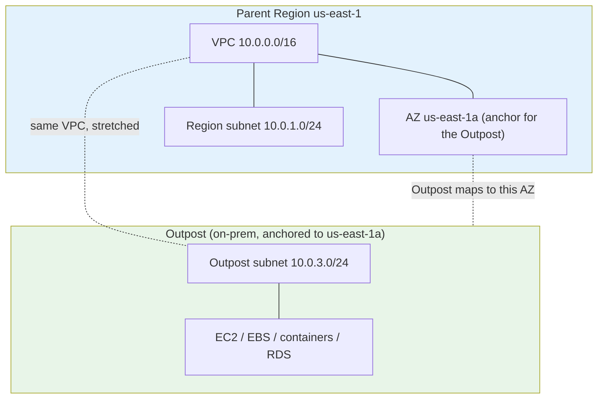
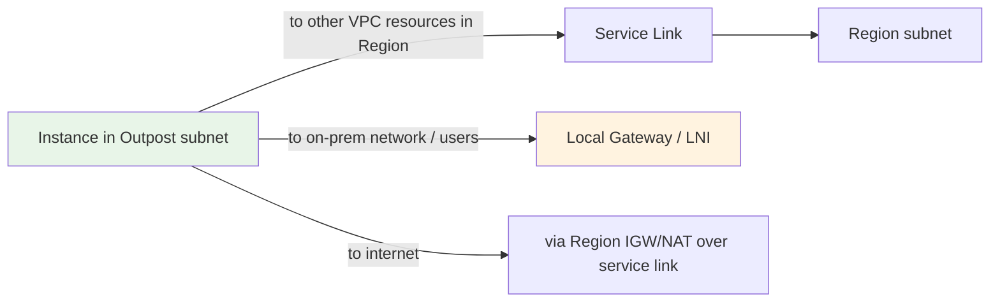
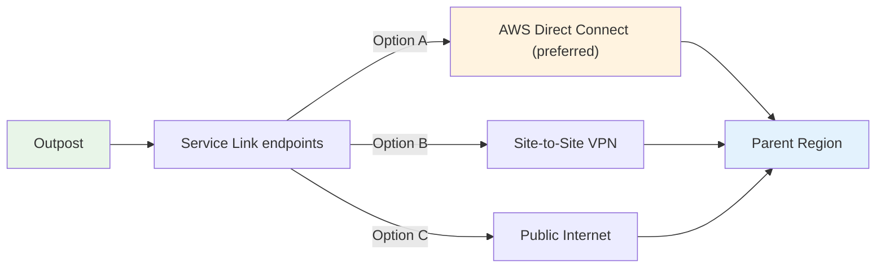
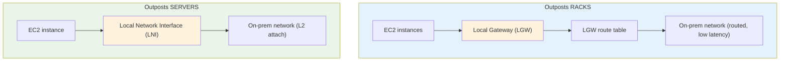
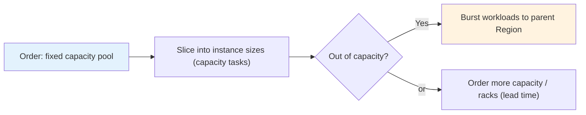
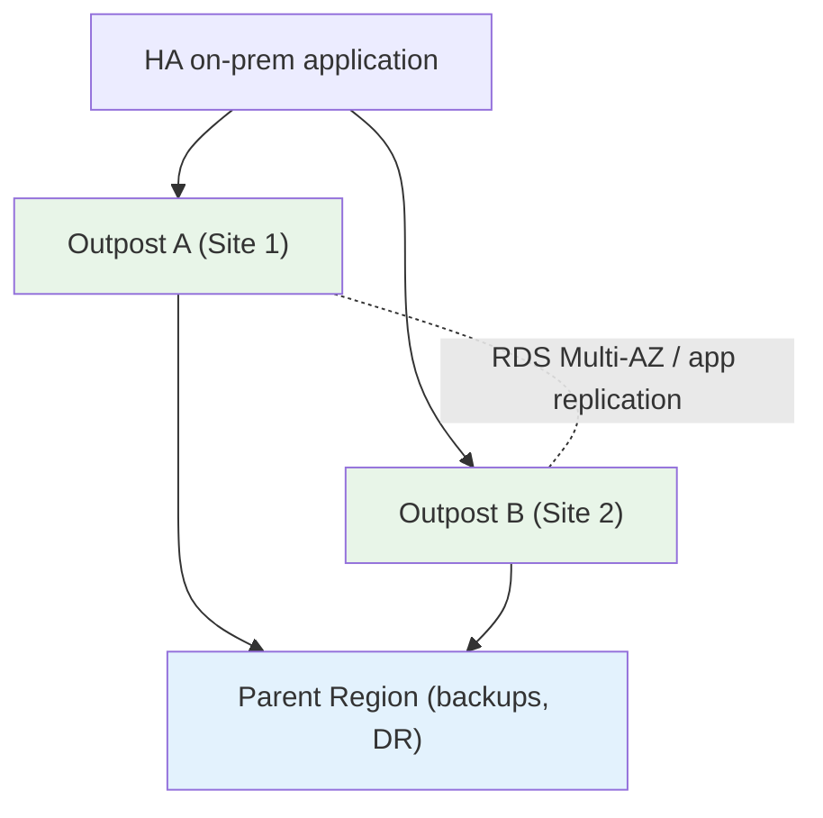
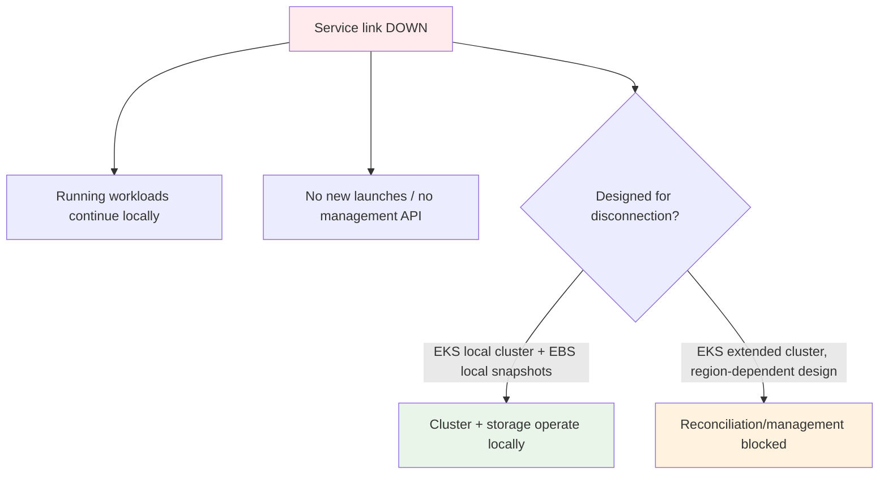

# AWS Outposts - Architecture Deep Dive

> How Outposts actually fits into a VPC: the parent Region link, the Outpost subnet, the Local Gateway vs Local Network Interface, the capacity model, and what survives a network partition. This is where the exam's "which connectivity option / what happens when the link drops" questions are won.

See also: [01 - Outposts Intro](01%20-%20Outposts%20Intro.md) · [03 - Outposts Services Deep Dive](03%20-%20Outposts%20Services%20Deep%20Dive.md) · [04 - Outposts Examples & Patterns](04%20-%20Outposts%20Examples%20%26%20Patterns.md) · [05 - Outposts Scenario Questions](05%20-%20Outposts%20Scenario%20Questions.md) · [06 - Outposts Important Facts & Cheat Sheet](06%20-%20Outposts%20Important%20Facts%20%26%20Cheat%20Sheet.md)

---

## Table of Contents

- [Part 1: The Logical Model — Outpost, Region, AZ, VPC](#part-1-the-logical-model--outpost-region-az-vpc)
- [Part 2: Outposts Subnets & the VPC Stretch](#part-2-outposts-subnets--the-vpc-stretch)
- [Part 3: Service Link — the Control-Plane Lifeline](#part-3-service-link--the-control-plane-lifeline)
- [Part 4: Local Gateway (Racks) vs Local Network Interface (Servers)](#part-4-local-gateway-racks-vs-local-network-interface-servers)
- [Part 5: Racks vs Servers — Full Comparison](#part-5-racks-vs-servers--full-comparison)
- [Part 6: Capacity Model & Right-Sizing](#part-6-capacity-model--right-sizing)
- [Part 7: Resilience — Single Outpost is a Single AZ](#part-7-resilience--single-outpost-is-a-single-az)
- [Part 8: The Disconnection Design Pattern](#part-8-the-disconnection-design-pattern)
- [Part 9: Ordering & Site Requirements](#part-9-ordering--site-requirements)
- [Summary](#summary)

---

## Part 1: The Logical Model — Outpost, Region, AZ, VPC

Four facts define how Outposts sits in AWS:

1. An Outpost is **homed to exactly one parent Region** (chosen at order time, cannot be changed later).
2. An Outpost is **associated with exactly one Availability Zone** in that Region.
3. Your **VPC is "stretched"** from the Region into the Outpost — you create Outpost subnets inside an existing VPC.
4. The **control plane runs in the Region**; the Outpost runs the **data plane** (your instances, volumes, containers, databases).

> **Exam nugget:** Because an Outpost maps to a _single_ AZ, it inherits that AZ's failure domain. It does **not** give you multi-AZ resilience by itself.

---

## Part 2: Outposts Subnets & the VPC Stretch

- You extend an **existing VPC** by creating one or more **Outpost subnets** and associating them with the Outpost.
- Instances launched into an Outpost subnet **physically run on the Outpost hardware**, but logically behave like any VPC resource: ENIs, security groups, route tables, NACLs all work the same.
- Traffic between the Outpost subnet and Region subnets flows over the **service link** privately, as if they were in the same VPC.

**Three traffic paths from an Outpost instance:**

| Destination                                   | Path                                                                              |
| :-------------------------------------------- | :-------------------------------------------------------------------------------- |
| Other resources in the same VPC (Region side) | Over the **service link**                                                         |
| On-premises local network / local users       | Via the **Local Gateway** (racks) or **LNI** (servers) — low latency, stays local |
| The internet / regional AWS service endpoints | Routed back through the Region (IGW/NAT in Region) over the service link          |

---

## Part 3: Service Link — the Control-Plane Lifeline

The **service link** is the encrypted connection from the Outpost back to its parent Region. It is the single most important architectural concept for the exam.

- Carries **control-plane traffic** (provisioning, monitoring, telemetry, AWS management) and **VPC traffic** between Outpost and Region.
- Always-on and **AWS-managed** — you provide the network path, AWS encrypts the tunnel.
- Can run over: **public internet**, **AWS Direct Connect** (public VIF or, with a public endpoint, private connectivity), or a **VPN/Site-to-Site VPN**.
- **Direct Connect is recommended** for production: predictable bandwidth + low jitter.

> **Bandwidth/redundancy tip:** AWS recommends redundant links and sufficient bandwidth for the service link. Outage of the service link is the key disconnection scenario tested below.

---

## Part 4: Local Gateway (Racks) vs Local Network Interface (Servers)

This distinction is a favorite exam trap.

| Feature     | Local Gateway (LGW)                                                                | Local Network Interface (LNI)                             |
| :---------- | :--------------------------------------------------------------------------------- | :-------------------------------------------------------- |
| Form factor | **Racks only**                                                                     | **Servers only**                                          |
| Function    | Routes between Outpost subnets and on-prem LAN                                     | Attaches an instance directly to the on-prem network      |
| Layer       | Routing (with LGW route table)                                                     | Layer-2 style local interface                             |
| Use it for  | Local ingress, low-latency access from on-prem clients, on-prem-to-Outpost routing | Giving a server instance direct presence on the local LAN |

> **Exam trap:** If a question describes **Outposts servers** and talks about a "Local Gateway," that's wrong — servers use a **Local Network Interface**. LGW is a **racks** concept.

---

## Part 5: Racks vs Servers — Full Comparison

| Dimension          | Outposts Servers (1U / 2U)               | Outposts Racks (42U)                              |
| :----------------- | :--------------------------------------- | :------------------------------------------------ |
| Compute scale      | Single server, limited instances         | Many instances, scalable to multiple racks        |
| Processor          | 1U = Graviton2; 2U = Intel Xeon Scalable | Full Region instance families (M/C/R, G4dn, etc.) |
| Local connectivity | **Local Network Interface (LNI)**        | **Local Gateway (LGW)**                           |
| Services           | EC2, EBS, ECS, EKS                       | + RDS, ElastiCache, EMR, S3 on Outposts, ALB      |
| Power / space      | Low — fits an edge closet                | High — data-center rack, dedicated power/cooling  |
| Install            | Can be rack-mounted by customer          | AWS delivers and installs                         |
| Typical site       | Retail, clinic, factory floor, branch    | Enterprise/co-lo data center                      |

---

## Part 6: Capacity Model & Right-Sizing

- An Outpost ships with a **fixed pool of physical capacity** that you select at order time (a mix of instance types/sizes and EBS storage).
- Within a family, you can **reconfigure** how capacity is sliced into instance sizes using **capacity tasks** (no new hardware needed) — e.g., turn capacity that ran a few `m5.24xlarge` into many `m5.large`.
- There is **no elastic auto-scaling beyond the physical hardware** you bought. If you need more, you **order more capacity/racks** (lead time applies).
- This is why **bursting to the Region** is a common pattern: keep steady-state local, spill overflow to the cloud.

> **Cost-domain nugget:** Outposts is a **3-year commitment** (all upfront / partial upfront / no upfront). The price bundles hardware, shipping, installation, and ongoing maintenance. You do **not** pay EC2 on-demand rates per hour the way you do in-Region — capacity is pre-purchased.

---

## Part 7: Resilience — Single Outpost is a Single AZ

A single Outpost = one AZ = one failure domain. To build genuinely highly available on-prem architecture:

- For HA, deploy **two Outposts** (ideally at two physical sites) and replicate across them — e.g., **RDS on Outposts Multi-AZ** across two Outposts, or app-level replication.
- Use the **parent Region for backup/DR**: EBS snapshots, RDS backups, and S3 on Outposts → DataSync → regional S3.
- Remember the trap: if a question asks how to make a cloud app highly available, the answer is **Availability Zones**, not Outposts.

---

## Part 8: The Disconnection Design Pattern

What happens when the **service link goes down** (the most-tested operational scenario):

| Capability                                                       | During service-link outage                    |
| :--------------------------------------------------------------- | :-------------------------------------------- |
| Existing EC2 instances / containers running locally              | **Keep running** (data plane is local)        |
| Local network traffic via LGW/LNI                                | **Keeps working** (does not depend on Region) |
| Launching **new** instances, modifying config, API/Console calls | **Fail** (control plane is in Region)         |
| EKS **extended cluster** worker nodes (control plane in Region)  | Degraded — can't reach control plane          |
| EKS **local cluster** (control plane on Outpost)                 | **Keeps operating** locally                   |
| Regional services (regional S3, DynamoDB, CloudWatch ingestion)  | Unreachable until link restored               |

**Design takeaways for disconnection tolerance:**

- Prefer **EKS local clusters** when the workload must survive a Region partition.
- Use **EBS local snapshots** (stored on S3 on Outposts) so backups don't depend on the link.
- Keep critical dependencies (DNS, auth, databases) **local** rather than in the Region.
- Provision **redundant, well-sized** service-link connectivity (DX + VPN backup).

---

## Part 9: Ordering & Site Requirements

For the exam you don't need install detail, but know the shape:

1. **Check site requirements** — power, cooling, networking uplinks, space, weight, temperature/humidity (racks have strict requirements; servers are lighter).
2. **Place the order** — choose parent Region, capacity configuration, and form factor.
3. **AWS validates the site** and ships. **Racks are installed by AWS**; **servers can be installed by the customer**.
4. **Activate** — the Outpost registers with the parent Region over the service link; you then create Outpost subnets and launch resources.

> **Lead time** is real (weeks). The exam may contrast Outposts (long lead, permanent) with **Snow Family** (fast, temporary/edge data transfer) — don't confuse the two.

---

## Summary

- One Outpost = one parent Region + one AZ; your VPC stretches into it.
- **Service link** carries control-plane + VPC traffic to the Region (DX preferred). **LGW (racks)** / **LNI (servers)** carry local traffic.
- Capacity is **pre-purchased and fixed**; reconfigure with capacity tasks, burst to the Region for overflow.
- A single Outpost is a **single AZ / SPOF** — use **two Outposts** + Region DR for HA.
- On disconnection, **local workloads keep running** but **management stops**; design with **EKS local clusters** and **EBS local snapshots**.

> Next: [03 - Outposts Services Deep Dive](03%20-%20Outposts%20Services%20Deep%20Dive.md) — EC2, EBS, S3 on Outposts, RDS, EKS/ECS behavior in detail.
