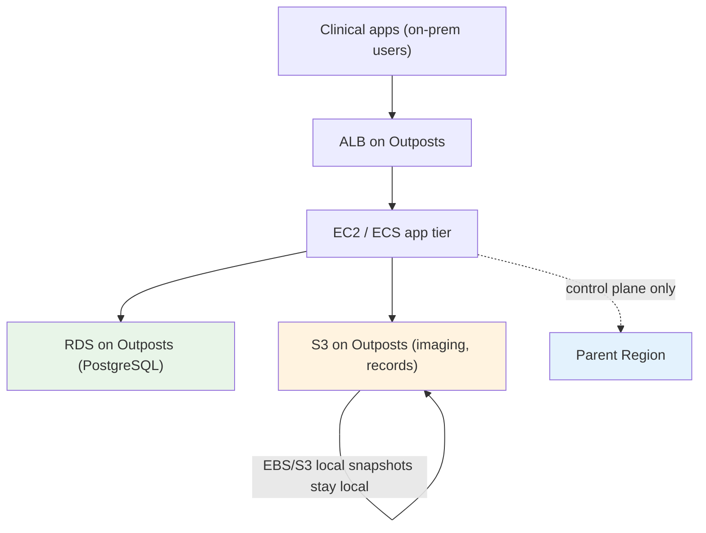
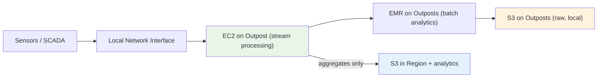
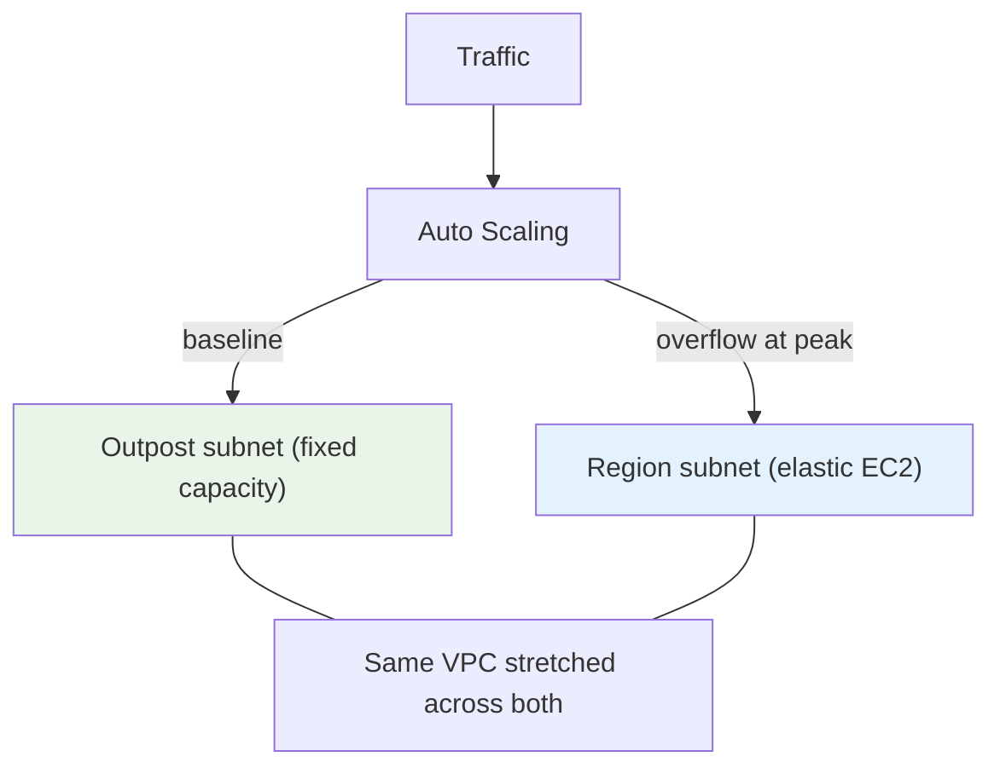
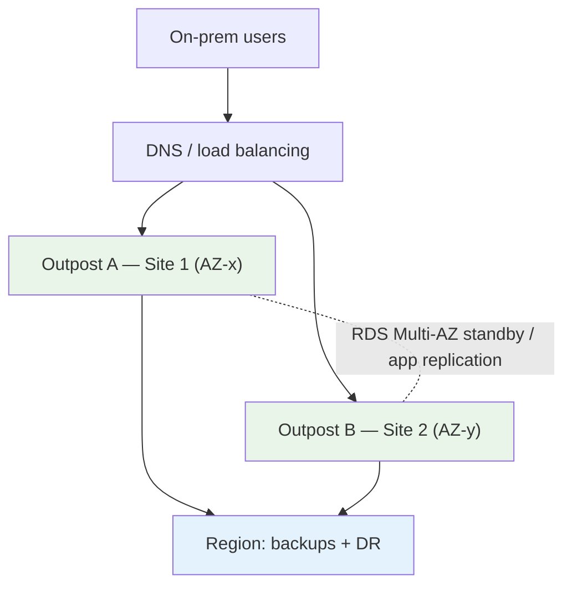
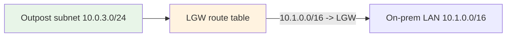
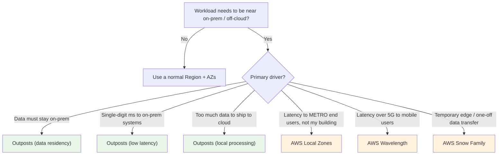

# AWS Outposts - Examples & Reference Patterns

> End-to-end reference architectures the exam draws from — hospital data residency, factory/edge processing, retail low-latency, hybrid bursting, and HA across two Outposts — plus the CLI/CloudFormation snippets that show how an Outpost is wired into a VPC.

See also: [01 - Outposts Intro](01%20-%20Outposts%20Intro.md) · [02 - Outposts Architecture Deep Dive](02%20-%20Outposts%20Architecture%20Deep%20Dive.md) · [03 - Outposts Services Deep Dive](03%20-%20Outposts%20Services%20Deep%20Dive.md) · [05 - Outposts Scenario Questions](05%20-%20Outposts%20Scenario%20Questions.md) · [06 - Outposts Important Facts & Cheat Sheet](06%20-%20Outposts%20Important%20Facts%20%26%20Cheat%20Sheet.md)

---

## Table of Contents

- [Pattern 1: Data Residency — Regulated Healthcare](#pattern-1-data-residency--regulated-healthcare)
- [Pattern 2: Local Data Processing — Factory / Edge](#pattern-2-local-data-processing--factory--edge)
- [Pattern 3: Low-Latency Retail / Branch](#pattern-3-low-latency-retail--branch)
- [Pattern 4: Hybrid Bursting to the Region](#pattern-4-hybrid-bursting-to-the-region)
- [Pattern 5: High Availability Across Two Outposts](#pattern-5-high-availability-across-two-outposts)
- [Pattern 6: Disconnection-Tolerant Edge (EKS Local)](#pattern-6-disconnection-tolerant-edge-eks-local)
- [Wiring an Outpost into a VPC (CLI)](#wiring-an-outpost-into-a-vpc-cli)
- [Local Gateway Route Table (Concept + CLI)](#local-gateway-route-table-concept--cli)
- [Decision Flowchart: Is Outposts the Answer?](#decision-flowchart-is-outposts-the-answer)

---

## Pattern 1: Data Residency — Regulated Healthcare

**Requirement:** A hospital must keep patient records (PHI) physically on-site for regulatory compliance, but wants AWS-managed databases, containers, and the cloud operating model.



- **Data stays local**: S3 on Outposts + EBS **local snapshots** keep PHI on-prem.
- **Watch-out**: RDS on Outposts ships _backups_ to the Region. If even backups must stay local, use a **self-managed DB on EC2 + local EBS snapshots** instead.
- Same IAM, KMS, and bucket policies as the cloud satisfy the "consistent operating model" ask.

---

## Pattern 2: Local Data Processing — Factory / Edge

**Requirement:** A manufacturing plant generates terabytes/day from SCADA and sensors. Moving raw data to the cloud is too slow/expensive; only aggregates should go up.



- Raw data processed **locally** (low latency, no egress cost), only **summaries** sent to the Region.
- Servers + LNI for the smallest sites; racks + EMR/S3 on Outposts for heavier analytics.

---

## Pattern 3: Low-Latency Retail / Branch

**Requirement:** A retail chain needs single-digit-ms point-of-sale and inventory responses even with an unreliable WAN.

- Deploy **Outposts servers (1U/2U)** in each store; POS apps run on local EC2/ECS.
- **LNI** puts instances directly on the store LAN for the registers.
- **EKS local cluster** (or ECS) so the store keeps selling if the WAN to the Region drops.
- Nightly sync of transactions to the Region for consolidation.

---

## Pattern 4: Hybrid Bursting to the Region

**Requirement:** Steady-state workload fits the Outpost, but month-end spikes exceed local capacity.



- Because the Outpost subnet and Region subnet share **one VPC**, an ASG or load balancer can place baseline on the Outpost and **burst overflow into the Region**.
- Solves the "fixed capacity ceiling" limitation without buying more hardware.

---

## Pattern 5: High Availability Across Two Outposts

**Requirement:** On-prem app must survive the failure of a single Outpost / single site.



- One Outpost = one AZ = SPOF → use **two Outposts** (different sites) for HA.
- **RDS on Outposts Multi-AZ** spans the two Outposts; app tier replicated across both.
- Region remains the **DR target** (backups, snapshots, optional pilot-light).

---

## Pattern 6: Disconnection-Tolerant Edge (EKS Local)

**Requirement:** A remote site (ship, mine, oil rig) has intermittent connectivity but must keep running containerized workloads.

- **EKS local cluster** — Kubernetes control plane runs **on the Outpost**, so scheduling/healing continues offline.
- **EBS local snapshots** for backups that don't need the Region.
- Reconcile/state-sync to the Region opportunistically when the link is up.

---

## Wiring an Outpost into a VPC (CLI)

Conceptual flow — extend an existing VPC with an Outpost subnet and launch an instance on the Outpost:

```bash
# 1. Identify your Outpost (already provisioned & activated)
aws outposts list-outposts \
  --query "Outposts[].{Id:OutpostId,AZ:AvailabilityZone,Region:SiteId}"

# 2. Create an Outpost subnet inside an EXISTING VPC.
#    The subnet is tied to the Outpost via --outpost-arn and inherits the Outpost's AZ.
aws ec2 create-subnet \
  --vpc-id vpc-0abc123 \
  --cidr-block 10.0.3.0/24 \
  --availability-zone us-east-1a \
  --outpost-arn arn:aws:outposts:us-east-1:111122223333:outpost/op-0example

# 3. Launch an instance ONTO the Outpost simply by targeting that subnet.
aws ec2 run-instances \
  --image-id ami-0abc \
  --instance-type m5.large \
  --subnet-id subnet-0outpost \
  --security-group-ids sg-0abc
```

> The instance physically runs on the Outpost because its subnet is associated with the Outpost ARN — there is no separate "deploy to Outpost" API. Placement = subnet choice.

---

## Local Gateway Route Table (Concept + CLI)

For **racks**, the **Local Gateway (LGW)** uses a route table to reach the on-prem network:



```bash
# Inspect the local gateway and its route table (racks only)
aws ec2 describe-local-gateways
aws ec2 describe-local-gateway-route-tables

# Associate the Outpost VPC with the LGW route table, then add a local route
aws ec2 create-local-gateway-route \
  --local-gateway-route-table-id lgw-rtb-0abc \
  --destination-cidr-block 10.1.0.0/16 \
  --local-gateway-virtual-interface-group-id lgw-vif-grp-0abc
```

> **Servers** have no LGW — they use a **Local Network Interface (LNI)** attached to the instance instead. See [02 - Outposts Architecture Deep Dive > Part 4: Local Gateway (Racks) vs Local Network Interface (Servers)](02%20-%20Outposts%20Architecture%20Deep%20Dive.md#part-4-local-gateway-racks-vs-local-network-interface-servers).

---

## Decision Flowchart: Is Outposts the Answer?



> Next: [05 - Outposts Scenario Questions](05%20-%20Outposts%20Scenario%20Questions.md) — exam-style scenarios with full explanations.
