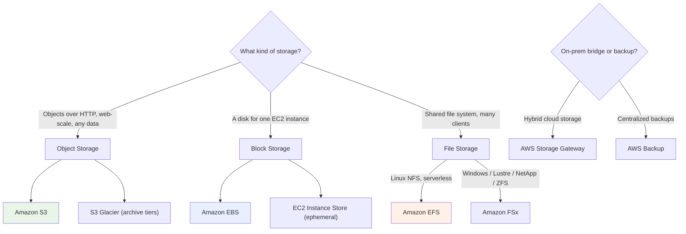

# AWS Storage Overview - SAA-C03 Deep Dive

> The Storage domain is a heavy slice of the SAA-C03 blueprint. This page is the **map**: the three storage paradigms (object, block, file), how each AWS storage service fits, and a decision framework for picking the right one in an exam scenario. Use the wikilinks below to dive into each service.

See also: [01 - S3 Intro & Core Concepts](01%20-%20S3%20Intro%20%26%20Core%20Concepts.md) · [01 - Glacier Intro & Archive Tiers](01%20-%20Glacier%20Intro%20%26%20Archive%20Tiers.md) · [01 - EBS Intro & Volume Types](01%20-%20EBS%20Intro%20%26%20Volume%20Types.md) · [01 - EFS Intro & Architecture](01%20-%20EFS%20Intro%20%26%20Architecture.md) · [01 - FSx Intro & Overview](01%20-%20FSx%20Intro%20%26%20Overview.md) · [01 - Storage Gateway Intro & Types](01%20-%20Storage%20Gateway%20Intro%20%26%20Types.md) · [01 - AWS Backup Intro & Core Concepts](01%20-%20AWS%20Backup%20Intro%20%26%20Core%20Concepts.md)

---

## Table of Contents

- [1. The Three Storage Paradigms](#1-the-three-storage-paradigms)
- [2. The Service Map](#2-the-service-map)
- [3. Object vs Block vs File - Master Comparison](#3-object-vs-block-vs-file---master-comparison)
- [4. The Exam Decision Framework](#4-the-exam-decision-framework)
- [5. Durability, Availability & Resilience Cheat Sheet](#5-durability-availability--resilience-cheat-sheet)
- [6. Hybrid & Data Movement](#6-hybrid--data-movement)
- [7. Study Path Through This Folder](#7-study-path-through-this-folder)
- [Summary](#summary)

---

---

## 1. The Three Storage Paradigms

Every AWS storage service is one of three fundamental types. Knowing the paradigm instantly narrows the answer in the exam.

| Paradigm   | What it is                                                    | Access method                     | AWS services                                                                                     |
| :--------- | :------------------------------------------------------------ | :-------------------------------- | :----------------------------------------------------------------------------------------------- |
| **Object** | Flat namespace of objects (data + metadata) addressed by key  | HTTP(S) API (`GET`/`PUT`)         | [Amazon S3](01%20-%20S3%20Intro%20%26%20Core%20Concepts.md), [S3 Glacier](01%20-%20Glacier%20Intro%20%26%20Archive%20Tiers.md) |
| **Block**  | Raw block device (a "virtual hard disk") you format and mount | Attached to one instance (mostly) | [Amazon EBS](01%20-%20EBS%20Intro%20%26%20Volume%20Types.md), EC2 Instance Store                                |
| **File**   | Hierarchical file system shared over a network protocol       | NFS / SMB / Lustre mount          | [Amazon EFS](01%20-%20EFS%20Intro%20%26%20Architecture.md), [Amazon FSx](01%20-%20FSx%20Intro%20%26%20Overview.md)         |

> 🎯 **Exam reflex:** "shared by many instances at once" → **file** (EFS/FSx). "a boot/data disk for one instance" → **block** (EBS). "store files/backups/media accessed over HTTP, any scale" → **object** (S3).

[⬆ Back to top](#table-of-contents)

---

## 2. The Service Map

| Service                 | Paradigm         | One-line role                                                      | Deep dive                                                     |
| :---------------------- | :--------------- | :----------------------------------------------------------------- | :------------------------------------------------------------ |
| **Amazon S3**           | Object           | Web-scale object store, 11 9s durability, the backbone of AWS data | [S3 notes](01%20-%20S3%20Intro%20%26%20Core%20Concepts.md)                   |
| **Amazon S3 Glacier**   | Object (archive) | Lowest-cost long-term archive tiers + Vault Lock WORM              | [Glacier notes](01%20-%20Glacier%20Intro%20%26%20Archive%20Tiers.md)         |
| **Amazon EBS**          | Block            | Network-attached disks for EC2 (AZ-scoped, persistent)             | [EBS notes](01%20-%20EBS%20Intro%20%26%20Volume%20Types.md)                  |
| **Amazon EFS**          | File (NFS)       | Elastic, multi-AZ, serverless Linux shared file system             | [EFS notes](01%20-%20EFS%20Intro%20%26%20Architecture.md)                  |
| **Amazon FSx**          | File             | Managed Windows / Lustre / NetApp ONTAP / OpenZFS file systems     | [FSx notes](01%20-%20FSx%20Intro%20%26%20Overview.md)                      |
| **AWS Storage Gateway** | Hybrid           | Bridge on-prem apps to AWS storage (File/Volume/Tape)              | [Storage Gateway notes](01%20-%20Storage%20Gateway%20Intro%20%26%20Types.md) |
| **AWS Backup**          | Management       | Centralized, policy-driven backup across services                  | [AWS Backup notes](01%20-%20AWS%20Backup%20Intro%20%26%20Core%20Concepts.md)   |

[⬆ Back to top](#table-of-contents)

---

## 3. Object vs Block vs File - Master Comparison

| Dimension       | **S3 (Object)**                           | **EBS (Block)**                       | **EFS (File)**                        | **FSx (File)**                  |
| :-------------- | :---------------------------------------- | :------------------------------------ | :------------------------------------ | :------------------------------ |
| **Access**      | HTTPS API                                 | Single EC2 (Multi-Attach for io1/io2) | Many clients (NFS)                    | Many clients (SMB/NFS/Lustre)   |
| **Scope**       | Regional (global namespace)               | One AZ                                | Multi-AZ (Regional) or One Zone       | One or Multi-AZ                 |
| **Scaling**     | Virtually unlimited, automatic            | Provisioned size (resizable)          | Elastic, automatic                    | Provisioned (some auto-grow)    |
| **Durability**  | 99.999999999% (11 9s)                     | Replicated within AZ                  | Multi-AZ (Regional)                   | Multi-AZ (with HA option)       |
| **Typical use** | Backups, data lakes, static assets, media | Boot/data disks, databases            | Linux shared storage, CMS, containers | Windows shares, HPC, NetApp/ZFS |
| **Mount?**      | No (object API)                           | Yes (block device)                    | Yes (NFS mount)                       | Yes (SMB/NFS/Lustre mount)      |

[⬆ Back to top](#table-of-contents)

---

## 4. The Exam Decision Framework

Walk these questions in order when a scenario asks "which storage?":

1. **Is it accessed over HTTP / needs unlimited scale / is a backup or data lake?** → **S3** (and Glacier tiers for archive).
2. **Is it a disk for a single EC2 instance (boot volume, database files)?** → **EBS** (or Instance Store if ephemeral, ultra-low-latency, throwaway).
3. **Do many Linux instances/containers need to share the same files concurrently?** → **EFS**.
4. **Do you need Windows SMB shares, Active Directory, HPC Lustre, or NetApp/ZFS features?** → **FSx** (pick the matching flavour).
5. **Is on-prem involved (keep apps local but back to AWS, or migrate)?** → **Storage Gateway** (or DataSync for one-time/bulk transfer).
6. **Do you need centralized, auditable, policy-driven backups across services?** → **AWS Backup**.

> ⚠️ **Common trap:** EFS is **Linux/NFS only**. If the workload is **Windows**, the answer is **FSx for Windows File Server**, never EFS.

[⬆ Back to top](#table-of-contents)

---

## 5. Durability, Availability & Resilience Cheat Sheet

| Service                               | Resilience model                               | Key fact                                                                 |
| :------------------------------------ | :--------------------------------------------- | :----------------------------------------------------------------------- |
| **S3 Standard**                       | Stored across ≥3 AZs                           | 11 9s durability, 99.99% availability SLA                                |
| **S3 One Zone-IA / Express One Zone** | Single AZ                                      | Cheaper, but data lost if the AZ is destroyed                            |
| **EBS**                               | Replicated within a **single AZ**              | Survives disk failure, **not** AZ failure → use snapshots (in S3) for DR |
| **EFS (Regional)**                    | Across multiple AZs                            | Survives AZ failure automatically                                        |
| **EFS One Zone**                      | Single AZ                                      | ~47% cheaper, AZ-failure exposed                                         |
| **FSx**                               | Single-AZ or Multi-AZ (depends on type/config) | Multi-AZ gives automatic failover                                        |

> 💡 **Snapshots = your DR bridge.** EBS snapshots and AMIs live in S3 and can be copied cross-region; this is how you make AZ-scoped block storage survive a regional event.

[⬆ Back to top](#table-of-contents)

---

## 6. Hybrid & Data Movement

| Need                                              | Service                                                 | Notes                                             |
| :------------------------------------------------ | :------------------------------------------------------ | :------------------------------------------------ |
| Keep apps on-prem, store/cache in AWS             | [Storage Gateway](01%20-%20Storage%20Gateway%20Intro%20%26%20Types.md) | File / Volume (Cached/Stored) / Tape gateways     |
| One-time or scheduled bulk transfer on-prem → AWS | **AWS DataSync**                                        | Fast, managed sync; NOT a permanent mount         |
| Petabyte-scale offline transfer                   | **AWS Snow Family**                                     | Physical appliance shipping                       |
| Centralized backups across AWS services           | [AWS Backup](01%20-%20AWS%20Backup%20Intro%20%26%20Core%20Concepts.md)   | Plans, vaults, Vault Lock WORM, cross-region copy |

> 🎯 **Storage Gateway vs DataSync:** Storage Gateway is for **ongoing hybrid access** (apps keep talking to it); DataSync is for **moving data** (migration/replication jobs).

[⬆ Back to top](#table-of-contents)

---

## 7. Study Path Through This Folder

A suggested order — each links to its own intro + deep-dive + SRE/exam pages:

1. [Amazon S3](01%20-%20S3%20Intro%20%26%20Core%20Concepts.md) — the most-tested service; learn it cold.
2. [S3 Glacier](01%20-%20Glacier%20Intro%20%26%20Archive%20Tiers.md) — archive tiers, retrieval, Vault Lock.
3. [Amazon EBS](01%20-%20EBS%20Intro%20%26%20Volume%20Types.md) — volume types, snapshots, performance.
4. [Amazon EFS](01%20-%20EFS%20Intro%20%26%20Architecture.md) — shared NFS, performance/throughput modes.
5. [Amazon FSx](01%20-%20FSx%20Intro%20%26%20Overview.md) — the four types and which to pick.
6. [AWS Storage Gateway](01%20-%20Storage%20Gateway%20Intro%20%26%20Types.md) — hybrid gateways.
7. [AWS Backup](01%20-%20AWS%20Backup%20Intro%20%26%20Core%20Concepts.md) — centralized backup & compliance.

[⬆ Back to top](#table-of-contents)

---

## Summary

| Remember this                                         | Because                                         |
| :---------------------------------------------------- | :---------------------------------------------- |
| Object = S3/Glacier, Block = EBS, File = EFS/FSx      | Paradigm narrows the answer instantly           |
| EFS = Linux/NFS, FSx for Windows = SMB/AD             | The Windows-vs-Linux trap is everywhere         |
| EBS is AZ-scoped; snapshots → S3 enable DR            | AZ vs Region resilience questions               |
| One Zone tiers trade durability for cost              | Watch for "cost-optimize, can tolerate AZ loss" |
| Storage Gateway = hybrid access; DataSync = migration | Classic distractor pairing                      |
| AWS Backup = centralized, auditable, Vault Lock WORM  | Compliance & ransomware scenarios               |

[⬆ Back to top](#table-of-contents)
