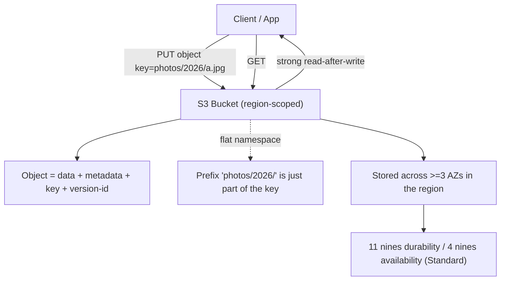

# Amazon S3 Intro & Core Concepts - SAA-C03 Deep Dive

> **Amazon Simple Storage Service (S3)** is AWS's infinitely-scalable object store: durable (11 nines), highly available, region-scoped, with a flat namespace addressed by bucket + key. It is the single most-tested storage service on the SAA-C03.

See also: [02 - S3 Storage Classes & Lifecycle](02%20-%20S3%20Storage%20Classes%20%26%20Lifecycle.md) · [03 - S3 Security & Encryption](03%20-%20S3%20Security%20%26%20Encryption.md) · [04 - S3 Versioning Replication & Data Protection](04%20-%20S3%20Versioning%20Replication%20%26%20Data%20Protection.md) · [05 - S3 Performance & Advanced Features](05%20-%20S3%20Performance%20%26%20Advanced%20Features.md) · [06 - S3 SRE Troubleshooting & Best Practices](06%20-%20S3%20SRE%20Troubleshooting%20%26%20Best%20Practices.md) · [07 - S3 Exam Scenarios & Questions](07%20-%20S3%20Exam%20Scenarios%20%26%20Questions.md) · [Glacier Intro & Archive Tiers](Glacier%20Intro%20%26%20Archive%20Tiers.md)

---

## Table of Contents

- [1. What S3 Is](#1-what-s3-is)
- [2. Buckets, Objects, Keys](#2-buckets-objects-keys)
- [3. Durability & Availability (the 9s)](#3-durability--availability-the-9s)
- [4. Regions & Data Residency](#4-regions--data-residency)
- [5. Consistency Model](#5-consistency-model)
- [6. Bucket Naming Rules](#6-bucket-naming-rules)
- [7. Flat Namespace & Prefixes](#7-flat-namespace--prefixes)
- [8. Object Size Limits & Multipart Upload](#8-object-size-limits--multipart-upload)
- [9. Static Website Hosting](#9-static-website-hosting)
- [10. Requester Pays](#10-requester-pays)
- [11. S3 Pricing Dimensions](#11-s3-pricing-dimensions)
- [12. Exam Tips (SAA-C03)](#12-exam-tips-saa-c03)
- [Summary](#summary)

---



---

## 1. What S3 Is

S3 is a **fully managed object storage service**. You do not provision capacity, disks, or servers - you `PUT` and `GET` objects over HTTPS against a regional endpoint.

| Property      | Detail                                                                            |
| :------------ | :-------------------------------------------------------------------------------- |
| Storage model | **Object** (not block like EBS, not file like EFS)                                |
| Scale         | Effectively unlimited total storage; unlimited number of objects                  |
| Access        | REST API / HTTPS, SDK, CLI, console, signed URLs                                  |
| Scope         | **Bucket lives in one AWS Region**                                                |
| Use cases     | Backups, data lakes, static websites, media, logs, big-data analytics, app assets |

> 🎯 **Exam framing:** When a question needs _cheap, durable, internet-accessible, unstructured_ storage with no size planning -> S3. Block storage for a single EC2 boot/data volume -> [EBS Intro & Volume Types](EBS%20Intro%20%26%20Volume%20Types.md). Shared POSIX file system across many EC2 -> [EFS Intro & Core Concepts](EFS%20Intro%20%26%20Core%20Concepts.md).

[⬆ Back to top](#table-of-contents)

---

## 2. Buckets, Objects, Keys

- **Bucket** - top-level container. Name is **globally unique across all AWS accounts** (DNS namespace). Created in a specific region.
- **Object** - the file you store. Max **5 TB**. Made of: the **data (body)**, a **key**, **metadata** (system + user-defined), a **version ID**, and **tags**.
- **Key** - the full object name, e.g. `photos/2026/cat.jpg`. Key = prefix + object name, but technically the _entire_ string is the key. Max key length **1024 bytes (UTF-8)**.

```bash
# The object URL pattern (virtual-hosted style, recommended)
https://my-bucket.s3.us-east-1.amazonaws.com/photos/2026/cat.jpg
#       └ bucket ─┘             └ region ─┘            └─ key ─────┘
```

> ⚠️ **Trap:** There are NO real "folders" in S3. The console _shows_ folders, but `photos/` is purely a key prefix. Deleting a "folder" just deletes objects with that prefix.

[⬆ Back to top](#table-of-contents)

---

## 3. Durability & Availability (the 9s)

| Metric           | S3 Standard value            | What it means                                                                           |
| :--------------- | :--------------------------- | :-------------------------------------------------------------------------------------- |
| **Durability**   | **99.999999999% (11 nines)** | Across all storage classes. Lose ~1 object every 10,000 years if you store 10M objects. |
| **Availability** | 99.99% (Standard)            | SLA-backed uptime for retrieval. Varies by class.                                       |

> 💡 **Durability is identical (11 nines) for every storage class** _except_ One Zone-IA which is still 11 nines of durability but only within **1 AZ** (so AZ loss = data loss). The thing that changes between classes is **availability**, **AZ redundancy**, **retrieval latency/cost**, and **minimum duration**, NOT durability. (See [02 - S3 Storage Classes & Lifecycle](02%20-%20S3%20Storage%20Classes%20%26%20Lifecycle.md).)

S3 achieves durability by redundantly storing objects across **a minimum of 3 Availability Zones** (Standard, Standard-IA, Intelligent-Tiering, Glacier classes).

[⬆ Back to top](#table-of-contents)

---

## 4. Regions & Data Residency

- A bucket is created in **one region** and data **never leaves that region** unless you explicitly enable replication ([04 - S3 Versioning Replication & Data Protection](04%20-%20S3%20Versioning%20Replication%20%26%20Data%20Protection.md)) or copy it.
- Choose a region for **latency** (close to users), **compliance/data residency**, and **cost** (prices vary by region).
- S3 is a **global service in the console** but **regional in storage**. The bucket _namespace_ is global (unique names), but the _data_ is regional.

[⬆ Back to top](#table-of-contents)

---

## 5. Consistency Model

Since December 2020, S3 provides **strong read-after-write consistency** for ALL operations, automatically and at no extra cost:

| Operation                            | Consistency                                |
| :----------------------------------- | :----------------------------------------- |
| `PUT` of a **new** object then `GET` | ✅ Strong - you read the latest            |
| **Overwrite** `PUT` then `GET`       | ✅ Strong - you read the new version       |
| `DELETE` then `GET`/`LIST`           | ✅ Strong                                  |
| `LIST` after `PUT`                   | ✅ Strong - new object appears immediately |

> 🎯 **Exam trap:** Old SAA material talked about "eventual consistency for overwrite PUTS and DELETES." **That is now obsolete.** S3 is strongly consistent today. Any answer claiming you must "wait for propagation" or "add random retries because of eventual consistency" is **wrong** for current exams.

[⬆ Back to top](#table-of-contents)

---

## 6. Bucket Naming Rules

| Rule         | Detail                                                                           |
| :----------- | :------------------------------------------------------------------------------- |
| Length       | 3-63 characters                                                                  |
| Characters   | lowercase letters, numbers, hyphens (`-`), dots (`.`)                            |
| Start/end    | Must start and end with a letter or number                                       |
| Uniqueness   | **Globally unique** across all AWS accounts & regions                            |
| No IP format | Cannot be formatted like `192.168.0.1`                                           |
| Dots         | Avoid dots if you use virtual-hosted-style HTTPS (breaks TLS wildcard cert)      |
| Prefixes     | Cannot start with `xn--`, `sthree-`, or end with `-s3alias`/`--ol-s3` (reserved) |

[⬆ Back to top](#table-of-contents)

---

## 7. Flat Namespace & Prefixes

S3 stores all objects in a **flat namespace** within a bucket. The slashes in a key create the _illusion_ of hierarchy.

- A **prefix** is the part of the key before the last delimiter (commonly `/`).
- Prefixes are the unit of **performance scaling** (3,500 writes / 5,500 reads **per prefix per second** - see [05 - S3 Performance & Advanced Features](05%20-%20S3%20Performance%20%26%20Advanced%20Features.md)).
- `LIST` operations use the **delimiter + prefix** parameters to emulate folder browsing.

```bash
aws s3api list-objects-v2 --bucket my-bucket --prefix "logs/2026/" --delimiter "/"
```

[⬆ Back to top](#table-of-contents)

---

## 8. Object Size Limits & Multipart Upload

| Limit                            | Value                                  |
| :------------------------------- | :------------------------------------- |
| Max single object                | **5 TB**                               |
| Max single `PUT` (one operation) | **5 GB**                               |
| Multipart upload required above  | **5 GB** (recommended above 100 MB)    |
| Part size                        | 5 MB - 5 GB (last part can be smaller) |
| Max parts                        | 10,000                                 |

**Multipart upload** splits an object into parts uploaded in parallel, then S3 reassembles them:

1. `CreateMultipartUpload` -> get an `UploadId`.
2. Upload parts in parallel (`UploadPart`), each returns an `ETag`.
3. `CompleteMultipartUpload` with the list of parts.

Benefits: **parallelism (speed)**, **resume on failure** (retry one part), and it is **required** for objects > 5 GB.

> 💡 **SRE/cost tip:** Failed/abandoned multipart uploads leave orphaned parts you still **pay for**. Add a lifecycle rule to **abort incomplete multipart uploads** after N days. (See [02 - S3 Storage Classes & Lifecycle](02%20-%20S3%20Storage%20Classes%20%26%20Lifecycle.md).)

[⬆ Back to top](#table-of-contents)

---

## 9. Static Website Hosting

S3 can serve a static website (HTML/CSS/JS, no server-side compute) directly:

- Enable **Static website hosting** on the bucket; set **index** and **error** documents.
- Endpoint: `http://<bucket>.s3-website-<region>.amazonaws.com` (**HTTP only**, path differs from the REST endpoint).
- Objects must be **publicly readable** (bucket policy) and **Block Public Access** must be turned off for that path.

> 🎯 **Exam pattern:** "Static website needs **HTTPS** and a **custom domain**" -> put **CloudFront** in front of the S3 bucket (CloudFront provides TLS via ACM and caching). Use **Origin Access Control (OAC)** so the bucket stays private and only CloudFront can read it. (See [CloudFront Intro & Caching](CloudFront%20Intro%20%26%20Caching.md).)

[⬆ Back to top](#table-of-contents)

---

## 10. Requester Pays

By default the **bucket owner pays** for storage AND data transfer/request costs. With **Requester Pays** enabled:

- The **requester** (not the owner) pays for **requests and data transfer**; the owner still pays for **storage**.
- Requesters must be **authenticated** (no anonymous access) and include `x-amz-request-payer: requester`.

Use case: sharing large datasets (open data, logs) without footing the egress bill.

[⬆ Back to top](#table-of-contents)

---

## 11. S3 Pricing Dimensions

You are billed on several axes - know them for cost-optimization questions:

| Dimension                         | Notes                                                                             |
| :-------------------------------- | :-------------------------------------------------------------------------------- |
| **Storage** ($/GB-month)          | Varies by **storage class**; cheaper for IA/Glacier                               |
| **Requests**                      | `PUT`/`COPY`/`POST`/`LIST` cost more than `GET`/`SELECT`                          |
| **Data transfer OUT** to internet | Charged; **transfer IN is free**; **transfer to same-region services often free** |
| **Retrieval fees**                | IA and Glacier classes charge **per-GB retrieval**                                |
| **Management features**           | Inventory, Analytics, Storage Lens advanced, replication, tags                    |
| **Early deletion**                | Min storage duration penalties (IA 30d, Glacier 90/180d)                          |

> 💡 **Free:** Data transfer **into** S3, and transfer from S3 to **CloudFront** or to EC2 **in the same region** (within the same region/no internet). Cross-region replication transfer is **not** free.

[⬆ Back to top](#table-of-contents)

---

## 12. Exam Tips (SAA-C03)

- ✅ S3 = **object storage**, **11 nines durability**, **regional**, **strongly consistent**.
- ✅ Max object **5 TB**; single PUT **5 GB**; use **multipart** above 5 GB (recommended >100 MB).
- ✅ Bucket names are **globally unique**, lowercase, 3-63 chars.
- ❌ "Eventual consistency / wait for propagation" is **outdated** - S3 is strongly consistent now.
- ✅ Static site + HTTPS + custom domain = **CloudFront + OAC** in front of S3.
- ✅ Sharing datasets without paying egress = **Requester Pays**.
- ✅ Orphaned multipart parts cost money -> lifecycle **abort incomplete multipart** rule.

[⬆ Back to top](#table-of-contents)

---

## Summary

Amazon S3 stores **objects** in **globally-named, region-scoped buckets**, delivering **11 nines durability** and **strong read-after-write consistency**. Objects are addressed by a **key** in a **flat namespace**; max size is **5 TB** (multipart above 5 GB). It powers static websites (best fronted by CloudFront for HTTPS), supports **Requester Pays**, and is billed on **storage, requests, transfer, retrieval, and management** dimensions. The follow-on notes drill into storage classes, security, replication, performance, and troubleshooting.

[⬆ Back to top](#table-of-contents)
