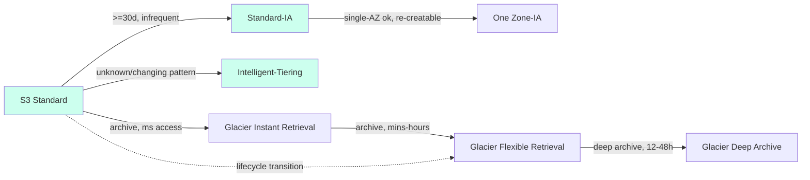

# Amazon S3 Storage Classes & Lifecycle - SAA-C03 Deep Dive

> S3 offers a spectrum of **storage classes** trading retrieval latency/cost for storage price, and **lifecycle rules** to transition or expire objects automatically. Picking the right class for an access pattern is a guaranteed exam question.

See also: [01 - S3 Intro & Core Concepts](01%20-%20S3%20Intro%20%26%20Core%20Concepts.md) · [03 - S3 Security & Encryption](03%20-%20S3%20Security%20%26%20Encryption.md) · [04 - S3 Versioning Replication & Data Protection](04%20-%20S3%20Versioning%20Replication%20%26%20Data%20Protection.md) · [05 - S3 Performance & Advanced Features](05%20-%20S3%20Performance%20%26%20Advanced%20Features.md) · [06 - S3 SRE Troubleshooting & Best Practices](06%20-%20S3%20SRE%20Troubleshooting%20%26%20Best%20Practices.md) · [07 - S3 Exam Scenarios & Questions](07%20-%20S3%20Exam%20Scenarios%20%26%20Questions.md) · [Glacier Intro & Archive Tiers](Glacier%20Intro%20%26%20Archive%20Tiers.md)

---

## Table of Contents

- [1. The Storage Class Spectrum](#1-the-storage-class-spectrum)
- [2. Comparison Table](#2-comparison-table)
- [3. Standard, Standard-IA, One Zone-IA](#3-standard-standard-ia-one-zone-ia)
- [4. Intelligent-Tiering](#4-intelligent-tiering)
- [5. Glacier Family](#5-glacier-family)
- [6. S3 Express One Zone](#6-s3-express-one-zone)
- [7. Lifecycle Rules](#7-lifecycle-rules)
- [8. Allowed Transition Paths](#8-allowed-transition-paths)
- [9. S3 Storage Lens](#9-s3-storage-lens)
- [10. S3 Storage Class Analysis](#10-s3-storage-class-analysis)
- [11. Exam Tips (SAA-C03)](#11-exam-tips-saa-c03)
- [Summary](#summary)

---



---

## 1. The Storage Class Spectrum

Think of it as **hot -> warm -> cold -> frozen**. As you move colder: storage gets **cheaper**, retrieval gets **slower and/or pricier**, and **minimum storage duration** appears.

- **Hot, frequent:** Standard, Express One Zone
- **Warm, infrequent:** Standard-IA, One Zone-IA, Intelligent-Tiering
- **Cold/archive:** Glacier Instant Retrieval, Glacier Flexible Retrieval
- **Frozen/deep archive:** Glacier Deep Archive

[⬆ Back to top](#table-of-contents)

---

## 2. Comparison Table

| Storage Class                  | Durability | AZs               | Availability SLA       | Min storage duration | Min billable object size | Retrieval fee                | Typical use                                     |
| :----------------------------- | :--------- | :---------------- | :--------------------- | :------------------- | :----------------------- | :--------------------------- | :---------------------------------------------- |
| **Standard**                   | 11 nines   | ≥3                | 99.99%                 | none                 | none                     | none                         | Frequently accessed, hot data                   |
| **Intelligent-Tiering**        | 11 nines   | ≥3                | 99.9%                  | none\*               | none                     | **none** (no retrieval fees) | Unknown/changing access patterns                |
| **Standard-IA**                | 11 nines   | ≥3                | 99.9%                  | **30 days**          | 128 KB                   | per-GB                       | Infrequent, rapid when needed                   |
| **One Zone-IA**                | 11 nines   | **1**             | 99.5%                  | **30 days**          | 128 KB                   | per-GB                       | Re-creatable, infrequent, single-AZ ok          |
| **Glacier Instant Retrieval**  | 11 nines   | ≥3                | 99.9%                  | **90 days**          | 128 KB                   | per-GB                       | Archive, **ms** access, quarterly access        |
| **Glacier Flexible Retrieval** | 11 nines   | ≥3                | 99.99% (after restore) | **90 days**          | 40 KB                    | per-GB + request             | Archive, mins-hours retrieval                   |
| **Glacier Deep Archive**       | 11 nines   | ≥3                | 99.99% (after restore) | **180 days**         | 40 KB                    | per-GB + request             | Lowest cost, 12-48h retrieval, 7-10yr retention |
| **Express One Zone**           | 11 nines   | **1 (single AZ)** | 99.95%                 | none                 | none                     | none                         | Ultra-low latency, single-digit ms, hot         |

\* Intelligent-Tiering has **no min duration**, but objects < 128 KB are never moved to a cheaper tier and are always charged at the frequent-access rate.

> 🎯 **Memorize:** Durability is **11 nines for ALL** classes. What differs is **AZ count, availability, min duration, and retrieval fees**. One Zone-IA & Express One Zone live in a **single AZ** -> AZ failure = data loss.

[⬆ Back to top](#table-of-contents)

---

## 3. Standard, Standard-IA, One Zone-IA

- **Standard** - default; no min duration, no retrieval fee. Highest storage $/GB but cheapest to access.
- **Standard-IA** - ~half the storage cost of Standard but you pay a **per-GB retrieval fee** and have a **30-day minimum**. For data accessed maybe **once a month**.
- **One Zone-IA** - ~20% cheaper than Standard-IA because it stores in **one AZ only**. Use ONLY for **easily re-creatable** data (e.g., secondary backups, thumbnails you can regenerate).

> ⚠️ **Trap:** Storing tiny objects in IA classes is wasteful - they have a **128 KB minimum billable size** and **30-day minimum duration**. Lots of small, short-lived objects -> keep in Standard or use Intelligent-Tiering.

[⬆ Back to top](#table-of-contents)

---

## 4. Intelligent-Tiering

S3 **automatically moves objects between access tiers** based on usage, for a small **monitoring & automation fee per object**. **No retrieval fees**, no operational overhead.

| Tier                                   | Moves here when...                        | Access latency |
| :------------------------------------- | :---------------------------------------- | :------------- |
| Frequent Access                        | default on ingest                         | ms             |
| Infrequent Access                      | not accessed for **30 days**              | ms             |
| Archive Instant Access                 | not accessed for **90 days**              | ms             |
| Archive Access (optional, opt-in)      | not accessed for 90+ days (configurable)  | mins-hours     |
| Deep Archive Access (optional, opt-in) | not accessed for 180+ days (configurable) | 12+ hours      |

> 🎯 **Exam answer:** "Access pattern is **unknown or unpredictable** and we want to optimize cost automatically without retrieval fees" -> **S3 Intelligent-Tiering**. It is the safe default when you can't predict access.

[⬆ Back to top](#table-of-contents)

---

## 5. Glacier Family

| Class                                               | Retrieval options & speed                                         | Cost posture                                           |
| :-------------------------------------------------- | :---------------------------------------------------------------- | :----------------------------------------------------- |
| **Glacier Instant Retrieval**                       | **Milliseconds** (like Standard-IA but cheaper storage)           | Archive accessed ~once/quarter                         |
| **Glacier Flexible Retrieval** (formerly "Glacier") | **Expedited** 1-5 min, **Standard** 3-5 h, **Bulk** 5-12 h (free) | Cheap archive, occasional access                       |
| **Glacier Deep Archive**                            | **Standard** 12 h, **Bulk** up to 48 h                            | **Cheapest** AWS storage; 7-10 yr retention/compliance |

- Retrieval requires a **restore** request (except Glacier Instant Retrieval which is direct GET).
- Restored copies are temporary; you specify how many days the restored copy stays in Standard.

> 💡 Glacier classes integrate with **lifecycle transitions** and **S3 Object Lock** (WORM/compliance) - see [04 - S3 Versioning Replication & Data Protection](04%20-%20S3%20Versioning%20Replication%20%26%20Data%20Protection.md) and [Glacier Intro & Archive Tiers](Glacier%20Intro%20%26%20Archive%20Tiers.md).

[⬆ Back to top](#table-of-contents)

---

## 6. S3 Express One Zone

A **high-performance, single-AZ** class for the most latency-sensitive workloads:

- **Single-digit millisecond** consistent latency; up to **10x faster** than Standard.
- Uses **directory buckets** (different bucket type, `--bucket-name--azid--x-s3`).
- Stored in **one AZ** you choose (co-locate with compute for lowest latency).
- Use cases: ML training, interactive analytics, high-RPS app data.

> ⚠️ Single AZ = no AZ-failure protection. Trade durability-of-location for speed. Higher request cost but very low per-request latency.

[⬆ Back to top](#table-of-contents)

---

## 7. Lifecycle Rules

Lifecycle configuration automates moving and deleting objects. A rule has **transition actions** and **expiration actions**, scoped by **prefix** and/or **object tags**.

```json
{
  "Rules": [
    {
      "ID": "logs-tiering",
      "Filter": { "Prefix": "logs/" },
      "Status": "Enabled",
      "Transitions": [
        { "Days": 30, "StorageClass": "STANDARD_IA" },
        { "Days": 90, "StorageClass": "GLACIER" },
        { "Days": 365, "StorageClass": "DEEP_ARCHIVE" }
      ],
      "Expiration": { "Days": 2555 },
      "NoncurrentVersionExpiration": { "NoncurrentDays": 90 },
      "AbortIncompleteMultipartUpload": { "DaysAfterInitiation": 7 }
    }
  ]
}
```

Actions you can configure:

- **Transition** current versions to a colder class after N days.
- **Transition noncurrent versions** (needs [versioning](04%20-%20S3%20Versioning%20Replication%20%26%20Data%20Protection.md)).
- **Expire** (delete) current versions; **permanently delete noncurrent** versions.
- **Abort incomplete multipart uploads** after N days (cost hygiene).
- **Expire delete markers** with no noncurrent versions.

[⬆ Back to top](#table-of-contents)

---

## 8. Allowed Transition Paths

Transitions can only flow **down the cost/temperature ladder** (you cannot lifecycle-transition "up"; to warm data back you must `COPY`/restore):

```
Standard
  → Standard-IA (after >= 30 days)
  → Intelligent-Tiering
  → One Zone-IA
  → Glacier Instant Retrieval
  → Glacier Flexible Retrieval
  → Glacier Deep Archive
```

> ⚠️ **Gotchas:** Standard -> Standard-IA/One Zone-IA requires the object to be **at least 30 days old**. You **cannot** transition One Zone-IA back to Standard-IA via lifecycle. Smaller objects may cost more in IA due to the 128 KB minimum.

[⬆ Back to top](#table-of-contents)

---

## 9. S3 Storage Lens

**Organization-wide visibility** into storage usage and activity:

- Dashboards across **all accounts in an AWS Organization**, all regions, all buckets.
- **Free (default) metrics**: ~28 usage metrics, 14-day retention.
- **Advanced metrics (paid)**: activity metrics, prefix-level aggregation, 15-month retention, CloudWatch publishing.
- Surfaces **cost-optimization recommendations** (e.g., buckets without lifecycle rules, incomplete multipart uploads).

> 🎯 "Single pane of glass for storage cost/usage across the **whole org**" -> **S3 Storage Lens**.

[⬆ Back to top](#table-of-contents)

---

## 10. S3 Storage Class Analysis

**Analytics** observes access patterns at the bucket/prefix/tag level and **recommends when to transition** Standard -> Standard-IA. It does NOT move data itself - it generates a report (exportable to S3, viewable in console) to inform your lifecycle rules.

> 💡 Use **Storage Class Analysis** to _decide_ lifecycle thresholds; use **Intelligent-Tiering** to let AWS do it automatically without analysis.

[⬆ Back to top](#table-of-contents)

---

## 11. Exam Tips (SAA-C03)

- ✅ **All classes = 11 nines durability.** Differences: AZ count, availability, min duration, retrieval fee.
- ✅ **Unknown/changing access pattern** -> **Intelligent-Tiering** (no retrieval fees).
- ✅ **Re-creatable, infrequent, save cost** -> **One Zone-IA**.
- ✅ **Archive, but must retrieve in milliseconds** -> **Glacier Instant Retrieval**.
- ✅ **Cheapest, compliance, retrieve in 12-48h** -> **Glacier Deep Archive**.
- ✅ Lifecycle: Standard->Standard-IA needs **30 days**; IA classes have **30-day min + 128 KB min**; Glacier **90/180-day min**.
- ✅ Always add **abort incomplete multipart upload** lifecycle action.
- ✅ Org-wide cost visibility -> **Storage Lens**; per-bucket transition advice -> **Storage Class Analysis**.

[⬆ Back to top](#table-of-contents)

---

## Summary

S3 storage classes range from hot **Standard / Express One Zone** through warm **IA / Intelligent-Tiering** to cold **Glacier Instant / Flexible / Deep Archive** - all sharing **11 nines durability** but differing on **AZ redundancy, availability, minimum duration, and retrieval fees**. **Lifecycle rules** automate transitions (down the ladder only) and expirations, while **Intelligent-Tiering** automates tiering with no retrieval fees. Use **Storage Class Analysis** to set thresholds and **Storage Lens** for org-wide cost visibility.

[⬆ Back to top](#table-of-contents)
