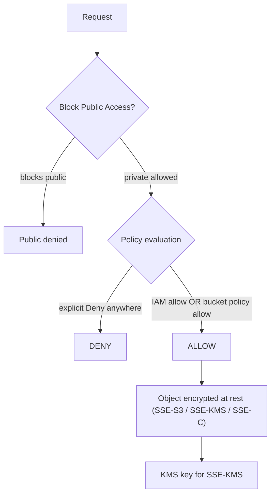

# Amazon S3 Security & Encryption - SAA-C03 Deep Dive

> S3 security is layered: **identity (IAM) + resource (bucket policy/ACL) + Block Public Access + encryption + network controls (VPC endpoints/Access Points)**. Encryption and access-control questions are heavily weighted on the SAA-C03.

See also: [01 - S3 Intro & Core Concepts](01%20-%20S3%20Intro%20%26%20Core%20Concepts.md) · [02 - S3 Storage Classes & Lifecycle](02%20-%20S3%20Storage%20Classes%20%26%20Lifecycle.md) · [04 - S3 Versioning Replication & Data Protection](04%20-%20S3%20Versioning%20Replication%20%26%20Data%20Protection.md) · [05 - S3 Performance & Advanced Features](05%20-%20S3%20Performance%20%26%20Advanced%20Features.md) · [06 - S3 SRE Troubleshooting & Best Practices](06%20-%20S3%20SRE%20Troubleshooting%20%26%20Best%20Practices.md) · [07 - S3 Exam Scenarios & Questions](07%20-%20S3%20Exam%20Scenarios%20%26%20Questions.md) · [20 - KMS & Envelope Encryption](20%20-%20KMS%20%26%20Envelope%20Encryption.md)

---

## Table of Contents

- [1. Access Control Layers](#1-access-control-layers)
- [2. IAM vs Bucket Policy vs ACL](#2-iam-vs-bucket-policy-vs-acl)
- [3. Evaluation Logic](#3-evaluation-logic)
- [4. Block Public Access](#4-block-public-access)
- [5. Encryption Options](#5-encryption-options)
- [6. SSE-KMS & Bucket Keys](#6-sse-kms--bucket-keys)
- [7. Enforcing Encryption via Policy](#7-enforcing-encryption-via-policy)
- [8. VPC Gateway Endpoint for S3](#8-vpc-gateway-endpoint-for-s3)
- [9. S3 Access Points](#9-s3-access-points)
- [10. S3 Object Lambda](#10-s3-object-lambda)
- [11. Pre-signed URLs](#11-pre-signed-urls)
- [12. CORS](#12-cors)
- [13. MFA Delete](#13-mfa-delete)
- [14. Exam Tips (SAA-C03)](#14-exam-tips-saa-c03)
- [Summary](#summary)

---



---

## 1. Access Control Layers

A request to S3 passes through multiple gates - **all must permit** (and **no explicit Deny**):

1. **Block Public Access (BPA)** - account/bucket-level guardrail against public exposure.
2. **Identity-based policies (IAM)** - what a principal is allowed to do.
3. **Resource-based policies (bucket policy)** - what the bucket allows, including cross-account.
4. **ACLs** (legacy) - per-object/per-bucket grants (AWS now recommends disabling them).
5. **VPC endpoint policy / Access Point policy** - network-scoped controls.
6. **Encryption** - protects data at rest; policies can _require_ it.

[⬆ Back to top](#table-of-contents)

---

## 2. IAM vs Bucket Policy vs ACL

| Mechanism         | Attached to                 | Best for                                                                           | Granularity                   |
| :---------------- | :-------------------------- | :--------------------------------------------------------------------------------- | :---------------------------- |
| **IAM policy**    | User/role/group             | Controlling what **your account's principals** can do across many buckets          | Action + resource + condition |
| **Bucket policy** | The bucket (resource-based) | **Cross-account** access, public read, IP/VPC restrictions, enforce encryption/TLS | Bucket + prefix + condition   |
| **ACL** (legacy)  | Bucket or object            | Coarse grants; **avoid** - disable via "Bucket owner enforced"                     | Predefined grantees only      |

> 🎯 **Modern best practice (and exam answer):** **Disable ACLs** ("Bucket owner enforced" Object Ownership) and use **bucket policies + IAM** exclusively. ACLs are the legacy mechanism.

[⬆ Back to top](#table-of-contents)

---

## 3. Evaluation Logic

S3 authorization = **(IAM allow) OR (bucket policy allow)**, then **any explicit Deny wins**.

- **Explicit Deny** (anywhere: SCP, IAM, bucket policy, BPA) -> **denied**, always.
- **No Deny + at least one Allow** (IAM _or_ bucket policy) -> **allowed**.
- **No Allow anywhere** -> implicit deny.
- **Cross-account** requires an Allow on **both** sides (the role's IAM policy AND the bucket policy).

[⬆ Back to top](#table-of-contents)

---

## 4. Block Public Access

A **safety net** that overrides policies/ACLs to prevent accidental public exposure. Four toggles, settable at **account** and **bucket** level:

| Setting                 | Effect                                                          |
| :---------------------- | :-------------------------------------------------------------- |
| `BlockPublicAcls`       | Reject PUTs of public ACLs                                      |
| `IgnorePublicAcls`      | Ignore existing public ACLs                                     |
| `BlockPublicPolicy`     | Reject bucket policies granting public access                   |
| `RestrictPublicBuckets` | Only authorized principals can access, even if policy is public |

> ⚠️ **Default since 2023:** All four are **ON by default** for new buckets. To host a public static website you must explicitly turn the relevant ones off. **Account-level BPA overrides bucket-level** - if account BPA is on, the bucket can't be public regardless.

[⬆ Back to top](#table-of-contents)

---

## 5. Encryption Options

All four options encrypt **at rest**; choose based on **who controls the key**:

| Method                        | Key managed by     | Key stored                  | Use when                                                |
| :---------------------------- | :----------------- | :-------------------------- | :------------------------------------------------------ |
| **SSE-S3** (default, AES-256) | **AWS**            | AWS                         | Simplest; no key management needed                      |
| **SSE-KMS**                   | **You via KMS**    | KMS                         | Audit (CloudTrail), key rotation, access control on key |
| **SSE-C**                     | **You (customer)** | **You** (sent per request)  | You must hold/manage keys; S3 never stores them         |
| **Client-side**               | **You**            | You (encrypt before upload) | Zero trust in cloud for encryption                      |

> 💡 **Default encryption is ON.** Since Jan 2023, **all new objects are encrypted with at least SSE-S3** automatically - there is no "unencrypted" S3 object anymore. You can override the default to SSE-KMS.

[⬆ Back to top](#table-of-contents)

---

## 6. SSE-KMS & Bucket Keys

SSE-KMS uses a **KMS customer-managed or AWS-managed key** and envelope encryption (see [20 - KMS & Envelope Encryption](20%20-%20KMS%20%26%20Envelope%20Encryption.md)):

- Every object encrypt/decrypt calls **KMS** -> CloudTrail audit + KMS key-policy access control.
- **Downside:** high-throughput workloads hammer KMS `GenerateDataKey`/`Decrypt` and can hit **KMS request quotas** (cost + throttling).
- **S3 Bucket Keys** solve this: S3 generates a short-lived **bucket-level data key** and reuses it, **reducing KMS API calls by up to 99%** -> lower cost and fewer throttles.

```json
{
  "Rule": {
    "ApplyServerSideEncryptionByDefault": {
      "SSEAlgorithm": "aws:kms",
      "KMSMasterKeyID": "arn:aws:kms:us-east-1:111122223333:key/abcd"
    },
    "BucketKeyEnabled": true
  }
}
```

> 🎯 "SSE-KMS is throttling under high request rates / KMS costs too high" -> **enable S3 Bucket Keys**.

[⬆ Back to top](#table-of-contents)

---

## 7. Enforcing Encryption via Policy

Default encryption guarantees objects are encrypted, but to **mandate a specific method** (or block plaintext/HTTP), use a **bucket policy with conditions**:

```json
{
  "Version": "2012-10-17",
  "Statement": [
    {
      "Sid": "DenyUnEncryptedUploads",
      "Effect": "Deny",
      "Principal": "*",
      "Action": "s3:PutObject",
      "Resource": "arn:aws:s3:::my-bucket/*",
      "Condition": {
        "StringNotEquals": { "s3:x-amz-server-side-encryption": "aws:kms" }
      }
    },
    {
      "Sid": "DenyInsecureTransport",
      "Effect": "Deny",
      "Principal": "*",
      "Action": "s3:*",
      "Resource": ["arn:aws:s3:::my-bucket", "arn:aws:s3:::my-bucket/*"],
      "Condition": { "Bool": { "aws:SecureTransport": "false" } }
    }
  ]
}
```

> 🎯 **`aws:SecureTransport: false` Deny** = "enforce HTTPS / deny HTTP" - a very common exam answer.

[⬆ Back to top](#table-of-contents)

---

## 8. VPC Gateway Endpoint for S3

To let EC2 in a **private subnet** reach S3 **without** an internet/NAT gateway and keep traffic on the AWS network:

- **S3 Gateway VPC Endpoint** - **free**, adds a route-table prefix-list route to S3. Region-local.
- **S3 Interface Endpoint (PrivateLink)** - uses an ENI with a private IP; needed for **on-prem/cross-region** access; **hourly + data charges**.

Endpoint policies + bucket policy `aws:SourceVpce`/`aws:SourceVpc` conditions can lock a bucket to a specific VPC.

> 🎯 Private subnet -> S3, no NAT, lowest cost -> **Gateway Endpoint** (free). Access from on-prem via Direct Connect/VPN -> **Interface Endpoint**.

[⬆ Back to top](#table-of-contents)

---

## 9. S3 Access Points

Named network endpoints with **their own policy**, attached to a bucket, to simplify access at scale:

- Each Access Point has a **distinct hostname and dedicated policy** - decompose one giant bucket policy into many app-specific ones.
- Can be **VPC-only** (no internet) for network isolation.
- **Multi-Region Access Points** route to the nearest/replicated bucket across regions (works with replication).

> 💡 Great when many teams/apps share one bucket - give each its own Access Point + policy instead of one unwieldy bucket policy.

[⬆ Back to top](#table-of-contents)

---

## 10. S3 Object Lambda

Run a **Lambda function inline on `GET`** to transform data as it's retrieved, without storing multiple copies:

- Redact PII, resize images, convert formats, filter rows - **on the fly**.
- Sits on top of an **Access Point** -> **Object Lambda Access Point**.
- One canonical object, many derived views per consumer.

[⬆ Back to top](#table-of-contents)

---

## 11. Pre-signed URLs

A time-limited URL granting temporary access to a **private** object using the **signer's credentials**:

- Generated via SDK/CLI; default/maximum expiry depends on credential type (up to **7 days** for IAM user/role sig v4).
- Used for **temporary download/upload** without making objects public (e.g., "download your invoice for 15 minutes").

```bash
aws s3 presign s3://my-bucket/report.pdf --expires-in 900   # 15 minutes
```

> 🎯 "Grant a user temporary, time-limited access to a private object" -> **pre-signed URL**.

[⬆ Back to top](#table-of-contents)

---

## 12. CORS

**Cross-Origin Resource Sharing** lets a web page on origin A request S3 objects on origin B (the bucket). Configure a CORS rule on the bucket specifying allowed origins, methods, and headers.

```json
[
  {
    "AllowedOrigins": ["https://www.example.com"],
    "AllowedMethods": ["GET", "PUT"],
    "AllowedHeaders": ["*"],
    "MaxAgeSeconds": 3000
  }
]
```

> 🎯 Browser error "blocked by CORS policy" when JS fetches from S3 -> add a **CORS configuration** to the bucket.

[⬆ Back to top](#table-of-contents)

---

## 13. MFA Delete

An extra protection (requires **versioning**) so that **deleting an object version** or **disabling versioning** requires an **MFA token**:

- Can only be enabled/disabled by the **bucket owner (root account)** using the CLI - not the console.
- Protects against accidental or malicious permanent deletes.

> ⚠️ Exam trap: MFA Delete requires **versioning enabled** and can only be toggled by the **root user via CLI**.

[⬆ Back to top](#table-of-contents)

---

## 14. Exam Tips (SAA-C03)

- ✅ Auth = (IAM **or** bucket policy allow) and **no explicit Deny**; cross-account needs allow on **both** sides.
- ✅ **Disable ACLs** (Bucket owner enforced) is the modern best practice.
- ✅ **BPA on by default**; account-level overrides bucket-level.
- ✅ **Enforce HTTPS** = Deny on `aws:SecureTransport=false`.
- ✅ **KMS throttling/cost** -> enable **S3 Bucket Keys**.
- ✅ Private subnet -> S3 without NAT = **Gateway VPC Endpoint** (free).
- ✅ Temporary private object access = **pre-signed URL**.
- ✅ Transform objects on retrieval = **S3 Object Lambda**.
- ✅ Many apps, one bucket = **Access Points** with per-app policies.

[⬆ Back to top](#table-of-contents)

---

## Summary

S3 security stacks **Block Public Access**, **IAM**, **bucket policies**, (legacy) **ACLs**, and **network controls**. Authorization needs an allow with no explicit deny; cross-account needs both sides. Encryption is **always on** (SSE-S3 default), with **SSE-KMS** for audit/control (use **Bucket Keys** to cut KMS cost/throttling), plus **SSE-C** and client-side. Policies enforce encryption and **HTTPS**. **Gateway endpoints** give free private access, **Access Points** scale policy management, **Object Lambda** transforms on read, and **pre-signed URLs** grant temporary access.

[⬆ Back to top](#table-of-contents)
