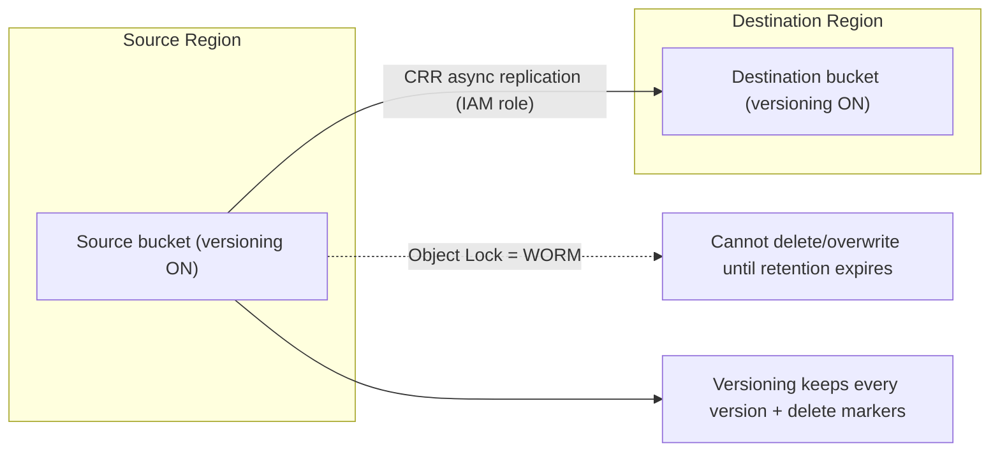

# Amazon S3 Versioning, Replication & Data Protection - SAA-C03 Deep Dive

> **Versioning** protects against overwrite/delete, **replication (CRR/SRR)** copies objects across regions/accounts, and **Object Lock** enforces WORM compliance. These are the data-protection and DR levers the exam tests for S3.

See also: [01 - S3 Intro & Core Concepts](01%20-%20S3%20Intro%20%26%20Core%20Concepts.md) · [02 - S3 Storage Classes & Lifecycle](02%20-%20S3%20Storage%20Classes%20%26%20Lifecycle.md) · [03 - S3 Security & Encryption](03%20-%20S3%20Security%20%26%20Encryption.md) · [05 - S3 Performance & Advanced Features](05%20-%20S3%20Performance%20%26%20Advanced%20Features.md) · [06 - S3 SRE Troubleshooting & Best Practices](06%20-%20S3%20SRE%20Troubleshooting%20%26%20Best%20Practices.md) · [07 - S3 Exam Scenarios & Questions](07%20-%20S3%20Exam%20Scenarios%20%26%20Questions.md) · [AWS Backup Intro & Core Concepts](AWS%20Backup%20Intro%20%26%20Core%20Concepts.md) · [Glacier Intro & Archive Tiers](Glacier%20Intro%20%26%20Archive%20Tiers.md)

---

## Table of Contents

- [1. Versioning](#1-versioning)
- [2. Delete Markers & Suspending](#2-delete-markers--suspending)
- [3. Replication Overview (CRR & SRR)](#3-replication-overview-crr--srr)
- [4. Replication Requirements](#4-replication-requirements)
- [5. What Gets Replicated](#5-what-gets-replicated)
- [6. Replica Modification Sync & RTC](#6-replica-modification-sync--rtc)
- [7. S3 Object Lock (WORM)](#7-s3-object-lock-worm)
- [8. Legal Hold vs Retention Modes](#8-legal-hold-vs-retention-modes)
- [9. S3 Batch Operations](#9-s3-batch-operations)
- [10. Object Lock vs Glacier Vault Lock](#10-object-lock-vs-glacier-vault-lock)
- [11. Exam Tips (SAA-C03)](#11-exam-tips-saa-c03)
- [Summary](#summary)

---

---

## 1. Versioning

Versioning keeps **every version** of an object in the same bucket - new uploads create a new **version ID**; overwrites and deletes never destroy prior versions.

- Enabled at the **bucket level**; once enabled it can be **suspended** but **never fully disabled**.
- Protects against **accidental overwrite and delete** + enables easy rollback.
- **Pre-versioning objects** have version ID `null`.
- You pay storage for **all versions** - pair with lifecycle **noncurrent version expiration** to control cost.

> 🎯 **Prerequisite:** Versioning is **required** for **MFA Delete**, **Replication (CRR/SRR)**, and **Object Lock**.

[⬆ Back to top](#table-of-contents)

---

## 2. Delete Markers & Suspending

- **Deleting** a versioned object (no version specified) inserts a **delete marker** as the new "current" version; the object appears gone but prior versions remain. Removing the delete marker **restores** the object.
- **Permanent delete** requires specifying the **version ID** (`DELETE` with `versionId`).
- **Suspending** versioning: new objects get version ID `null` and overwrites replace the `null` version; existing versions are retained.

[⬆ Back to top](#table-of-contents)

---

## 3. Replication Overview (CRR & SRR)

Asynchronous copying of objects between buckets:

| Type                               | Buckets           | Common use                                                          |
| :--------------------------------- | :---------------- | :------------------------------------------------------------------ |
| **CRR** (Cross-Region Replication) | Different regions | DR, lower-latency reads in other regions, compliance/data residency |
| **SRR** (Same-Region Replication)  | Same region       | Log aggregation, prod->test sync, **cross-account** consolidation   |

Both can replicate **across accounts**. Replication is **asynchronous** (not instant).

[⬆ Back to top](#table-of-contents)

---

## 4. Replication Requirements

- **Versioning enabled** on **both** source and destination buckets.
- An **IAM role** giving S3 permission to replicate.
- Proper **bucket policies** for cross-account (destination owner grants access).
- Destination can use a **different storage class** and **different ownership**.

[⬆ Back to top](#table-of-contents)

---

## 5. What Gets Replicated

| Replicated ✅                                                    | NOT replicated ❌                                                                 |
| :--------------------------------------------------------------- | :-------------------------------------------------------------------------------- |
| New objects after replication is enabled                         | Objects that existed **before** enabling (use **Batch Replication** for backfill) |
| Metadata, tags, ACLs                                             | Objects encrypted with **SSE-C**                                                  |
| Objects encrypted with SSE-S3 / SSE-KMS (KMS must be configured) | Replicas of replicas (no **chaining** by default)                                 |
| Delete markers (optional, must enable)                           | Actual version-ID deletes (deletes by versionId are NOT replicated - protective)  |
|                                                                  | Lifecycle actions in source (each bucket lifecycle is independent)                |

> ⚠️ **Traps:** (1) Existing objects need **S3 Batch Replication** to backfill. (2) Replication is **not chained** - if A->B and B->C, an object from A does NOT auto-reach C. (3) **SSE-C objects are not replicated.**

[⬆ Back to top](#table-of-contents)

---

## 6. Replica Modification Sync & RTC

- **Replica Modification Sync** - replicates **metadata changes made on the replica** back to the source (two-way metadata sync) for bidirectional setups.
- **S3 Replication Time Control (RTC)** - SLA-backed: **99.99% of objects replicated within 15 minutes**, with replication metrics and CloudWatch events. Use when you have a **strict replication RPO/SLA**.

> 🎯 "Need a guaranteed/predictable replication time (SLA)" -> **S3 RTC**.

[⬆ Back to top](#table-of-contents)

---

## 7. S3 Object Lock (WORM)

**Write Once Read Many** - prevents objects from being **deleted or overwritten** for a retention period. Requires **versioning**. Enabled at bucket creation (or enabled later via support for existing buckets).

| Mode           | Who can override                                                        | Use                                        |
| :------------- | :---------------------------------------------------------------------- | :----------------------------------------- |
| **Governance** | Users with `s3:BypassGovernanceRetention` permission can remove/shorten | Protect data but allow privileged override |
| **Compliance** | **No one** - not even the root account - until retention expires        | Strict regulatory WORM (SEC 17a-4, etc.)   |

[⬆ Back to top](#table-of-contents)

---

## 8. Legal Hold vs Retention Modes

| Control                                      | Tied to time?          | Behavior                                                                                                       |
| :------------------------------------------- | :--------------------- | :------------------------------------------------------------------------------------------------------------- |
| **Retention period** (Governance/Compliance) | Yes - fixed days/years | Object immutable until the date passes                                                                         |
| **Legal Hold**                               | **No**                 | Independent on/off flag; blocks delete/overwrite **indefinitely** until removed; needs `s3:PutObjectLegalHold` |

> 💡 Legal Hold has **no expiry** - it's removed manually. Useful for litigation where you don't know the end date.

[⬆ Back to top](#table-of-contents)

---

## 9. S3 Batch Operations

Performs a **single action across billions of existing objects**, driven by an **inventory report or CSV manifest**:

- Actions: **copy** (re-tier/replicate existing data), set/replace **tags**, set **ACLs**, **restore** from Glacier, apply **Object Lock retention/legal hold**, invoke a **Lambda** per object.
- Provides retries, progress tracking, and a **completion report**.

> 🎯 "Apply a change (re-encrypt, copy, restore, tag) to **millions of existing objects**" -> **S3 Batch Operations**. (Backfilling replication = **Batch Replication**, a Batch Operations job.)

[⬆ Back to top](#table-of-contents)

---

## 10. Object Lock vs Glacier Vault Lock

| Feature     | S3 Object Lock                                      | S3 Glacier Vault Lock                                                 |
| :---------- | :-------------------------------------------------- | :-------------------------------------------------------------------- |
| Applies to  | S3 objects (any class incl. Glacier classes via S3) | **Glacier vaults** (the separate Glacier service)                     |
| Granularity | Per-object/version                                  | Whole **vault** policy                                                |
| Modes       | Governance / Compliance + Legal Hold                | Single immutable **vault lock policy** (e.g., deny deletes < N years) |
| Once locked | Compliance mode immutable until expiry              | Vault lock policy **immutable forever** once locked                   |

> 🎯 Per-object WORM in S3 -> **Object Lock (Compliance)**. Vault-wide immutable retention policy in Glacier -> **Glacier Vault Lock**. (See [Glacier Intro & Archive Tiers](Glacier%20Intro%20%26%20Archive%20Tiers.md).)

[⬆ Back to top](#table-of-contents)

---

## 11. Exam Tips (SAA-C03)

- ✅ Versioning is the **prerequisite** for MFA Delete, Replication, and Object Lock.
- ✅ Delete on a versioned object = **delete marker** (recoverable); permanent delete needs **versionId**.
- ✅ Replication needs **versioning on both sides** + an **IAM role**; it's **async**.
- ✅ Existing objects need **Batch Replication** to backfill; replication is **not chained**; **SSE-C not replicated**.
- ✅ Strict replication SLA (15 min) -> **RTC**.
- ✅ Immutable, no override even by root -> **Object Lock Compliance**.
- ✅ Indefinite immutability with no end date -> **Legal Hold**.
- ✅ Action across millions of existing objects -> **S3 Batch Operations**.

[⬆ Back to top](#table-of-contents)

---

## Summary

**Versioning** retains every object version (delete = recoverable delete marker) and is the foundation for **MFA Delete**, **replication**, and **Object Lock**. **CRR/SRR** asynchronously copy objects across regions/accounts (versioning + IAM role required; existing objects need **Batch Replication**; not chained; SSE-C excluded), with **RTC** offering a 15-minute SLA. **Object Lock** enforces WORM via **Governance/Compliance** modes plus indefinite **Legal Holds**, while **Glacier Vault Lock** locks whole-vault policies. **S3 Batch Operations** applies bulk changes across billions of existing objects.

[⬆ Back to top](#table-of-contents)
