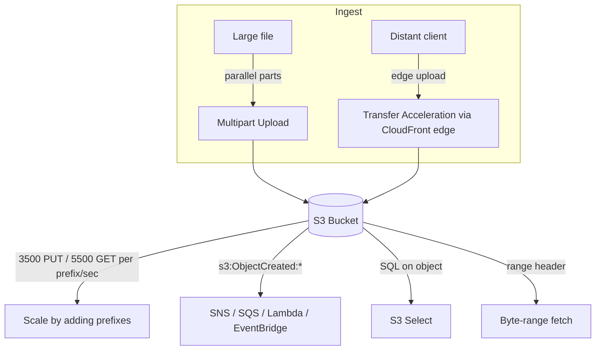

# Amazon S3 Performance & Advanced Features - SAA-C03 Deep Dive

> S3 scales to **thousands of requests per second per prefix**, and adds power features - **Transfer Acceleration, multipart, byte-range fetch, S3 Select, event notifications, inventory, Mountpoint** - that turn up repeatedly in performance and integration scenarios.

See also: [01 - S3 Intro & Core Concepts](01%20-%20S3%20Intro%20%26%20Core%20Concepts.md) · [02 - S3 Storage Classes & Lifecycle](02%20-%20S3%20Storage%20Classes%20%26%20Lifecycle.md) · [03 - S3 Security & Encryption](03%20-%20S3%20Security%20%26%20Encryption.md) · [04 - S3 Versioning Replication & Data Protection](04%20-%20S3%20Versioning%20Replication%20%26%20Data%20Protection.md) · [06 - S3 SRE Troubleshooting & Best Practices](06%20-%20S3%20SRE%20Troubleshooting%20%26%20Best%20Practices.md) · [07 - S3 Exam Scenarios & Questions](07%20-%20S3%20Exam%20Scenarios%20%26%20Questions.md) · [CloudFront Intro & Caching](CloudFront%20Intro%20%26%20Caching.md)

---

## Table of Contents

- [1. Request Rate & Prefixes](#1-request-rate--prefixes)
- [2. Multipart Upload (Performance)](#2-multipart-upload-performance)
- [3. Byte-Range Fetches](#3-byte-range-fetches)
- [4. S3 Transfer Acceleration](#4-s3-transfer-acceleration)
- [5. S3 Select & Glacier Select](#5-s3-select--glacier-select)
- [6. Event Notifications](#6-event-notifications)
- [7. EventBridge Integration](#7-eventbridge-integration)
- [8. S3 Inventory](#8-s3-inventory)
- [9. Mountpoint for Amazon S3](#9-mountpoint-for-amazon-s3)
- [10. Performance Best Practices](#10-performance-best-practices)
- [11. Exam Tips (SAA-C03)](#11-exam-tips-saa-c03)
- [Summary](#summary)

---



---

## 1. Request Rate & Prefixes

S3 automatically scales to high request rates **per prefix**:

| Operation                    | Per-prefix limit   |
| :--------------------------- | :----------------- |
| `PUT`/`COPY`/`POST`/`DELETE` | **3,500 / second** |
| `GET`/`HEAD`                 | **5,500 / second** |

- There is **no limit on the number of prefixes** - spread the key space across many prefixes to scale **linearly** (e.g., 10 prefixes -> ~35,000 PUT/s, 55,000 GET/s).
- A **prefix** is the portion of the key path up to the last delimiter; design keys for parallelism (hashing/sharding the leading characters helps).

> 🎯 "S3 is throttling (`503 SlowDown`) at high request rate" -> **increase parallelism by spreading requests across more prefixes**. The old "random hex prefix" trick is no longer needed for scaling but multiple prefixes still help.

[⬆ Back to top](#table-of-contents)

---

## 2. Multipart Upload (Performance)

Beyond being required above 5 GB (see [01 - S3 Intro & Core Concepts](01%20-%20S3%20Intro%20%26%20Core%20Concepts.md)), multipart upload **boosts throughput**:

- Upload parts **in parallel** to saturate bandwidth.
- **Retry only the failed part** on network errors.
- Recommended for objects **> 100 MB**.

[⬆ Back to top](#table-of-contents)

---

## 3. Byte-Range Fetches

Use the HTTP `Range` header on `GET` to fetch **only part of an object**:

- **Parallelize downloads** by fetching ranges concurrently (speed).
- Retrieve just the **head/footer** of a file (e.g., read a file's first bytes for a header) without downloading the whole object - saves time and transfer cost.

```bash
aws s3api get-object --bucket my-bucket --key big.bin --range bytes=0-1048575 part0
```

[⬆ Back to top](#table-of-contents)

---

## 4. S3 Transfer Acceleration

Speeds up uploads/downloads over **long distances** by routing through the nearest **CloudFront edge location**, then over AWS's optimized backbone to the bucket:

- Best for **geographically distant clients** uploading large objects.
- Compatible with **multipart upload**.
- Uses a distinct endpoint: `<bucket>.s3-accelerate.amazonaws.com`.
- Extra per-GB fee; only charged if it's actually faster.

> 🎯 "Users worldwide upload large files to a bucket in one region - speed it up" -> **S3 Transfer Acceleration** (uploads). For global low-latency **downloads** of cached content -> **CloudFront**.

[⬆ Back to top](#table-of-contents)

---

## 5. S3 Select & Glacier Select

Run **SQL** to retrieve **only a subset of an object's data** (rows/columns) from CSV, JSON, or Parquet, server-side:

- Reduces data transferred and client-side parsing -> faster, cheaper than downloading the whole object.
- **Glacier Select** runs the same idea against archived objects during restore.

```sql
SELECT s.name, s.region FROM s3object s WHERE s.cost > 100
```

> 💡 S3 Select is single-object filtering. For querying **across many objects / a data lake**, use **Amazon Athena** (which is the more common exam answer for ad-hoc analytics over S3).

[⬆ Back to top](#table-of-contents)

---

## 6. Event Notifications

S3 emits events on object actions; route them to targets to trigger workflows:

| Target          | Use                                           |
| :-------------- | :-------------------------------------------- |
| **SNS**         | Fan-out notification to many subscribers      |
| **SQS**         | Buffer/decouple for worker processing         |
| **Lambda**      | Run code per event (e.g., generate thumbnail) |
| **EventBridge** | Advanced filtering, many AWS targets          |

Event types: `s3:ObjectCreated:*`, `s3:ObjectRemoved:*`, `s3:ObjectRestore:*`, replication events, etc. Delivery is typically within seconds. Destinations need a **resource policy** allowing S3 to publish.

> ⚠️ Standard event notifications can target only **SNS, SQS, Lambda, EventBridge**. For richer filtering/many targets, prefer **EventBridge**.

[⬆ Back to top](#table-of-contents)

---

## 7. EventBridge Integration

Enabling **EventBridge** on a bucket sends **all** events to EventBridge, where you get:

- **Advanced filtering** on metadata, object size, key prefix/suffix.
- Fan-out to **18+ AWS services** as targets.
- **Archive & replay**, reliable delivery.

> 🎯 "Need to filter S3 events by object metadata and route to multiple services" -> **EventBridge**.

[⬆ Back to top](#table-of-contents)

---

## 8. S3 Inventory

A scheduled (daily/weekly) **flat-file report** (CSV/ORC/Parquet) listing objects and metadata in a bucket/prefix:

- Fields: size, last modified, **storage class**, **encryption status**, **replication status**, **Object Lock** status, version ID, etc.
- Used to **audit** encryption/replication compliance and as the **manifest for S3 Batch Operations** (see [04 - S3 Versioning Replication & Data Protection](04%20-%20S3%20Versioning%20Replication%20%26%20Data%20Protection.md)).

> 🎯 "Audit which objects are unencrypted / not replicated across a huge bucket" -> **S3 Inventory** (don't `LIST` billions of objects via API).

[⬆ Back to top](#table-of-contents)

---

## 9. Mountpoint for Amazon S3

An **open-source file client** that mounts an S3 bucket as a **local file system** on Linux:

- Translates file operations into S3 API calls; great for **read-heavy** and large sequential workloads (ML training, analytics).
- **Limitations:** not a full POSIX FS - no random writes to existing objects, no renames; best for **sequential write of new objects + reads**.

> 💡 Need a true shared POSIX file system with full semantics -> use **[Amazon EFS](EFS%20Intro%20%26%20Core%20Concepts.md)**, not Mountpoint. Mountpoint is for apps that expect files but really want S3's scale/cost.

[⬆ Back to top](#table-of-contents)

---

## 10. Performance Best Practices

- ✅ **Parallelize** with multipart upload and byte-range fetches.
- ✅ **Spread across prefixes** to multiply request throughput.
- ✅ Put **CloudFront** in front for cached, low-latency global reads; **Transfer Acceleration** for distant uploads.
- ✅ Use **S3 Select/Athena** to retrieve only needed data.
- ✅ Use **Express One Zone** for single-digit-ms latency hot data (see [02 - S3 Storage Classes & Lifecycle](02%20-%20S3%20Storage%20Classes%20%26%20Lifecycle.md)).
- ✅ Implement **retry with exponential backoff** for `503 SlowDown`.

[⬆ Back to top](#table-of-contents)

---

## 11. Exam Tips (SAA-C03)

- ✅ **3,500 PUT / 5,500 GET per prefix per second**; scale by adding prefixes (no prefix limit).
- ✅ **Distant clients uploading large files** -> **Transfer Acceleration**.
- ✅ **Faster large transfers / resumable** -> **multipart**; **partial reads/parallel** -> **byte-range fetch**.
- ✅ **Filter rows/columns from one object server-side** -> **S3 Select**; across many objects -> **Athena**.
- ✅ **Trigger processing on upload** -> event notification to **Lambda/SQS/SNS** or **EventBridge** (advanced filtering).
- ✅ **Audit/manifest huge bucket** -> **S3 Inventory**.
- ✅ **Mount S3 as a filesystem (read-heavy)** -> **Mountpoint**; full POSIX -> **EFS**.

[⬆ Back to top](#table-of-contents)

---

## Summary

S3 scales to **3,500 PUT / 5,500 GET per prefix per second**, scaling linearly as you add prefixes. **Multipart upload** and **byte-range fetches** parallelize transfers; **Transfer Acceleration** speeds distant uploads via edge locations. **S3 Select** filters data server-side (Athena for cross-object queries). **Event notifications** (SNS/SQS/Lambda) and **EventBridge** trigger workflows on object events; **S3 Inventory** audits and feeds Batch Operations; and **Mountpoint** exposes S3 as a file system for read-heavy apps.

[⬆ Back to top](#table-of-contents)
