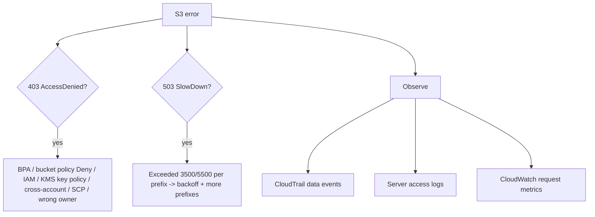

# Amazon S3 SRE Troubleshooting & Best Practices - SAA-C03 Deep Dive

> From an operator's seat: the recurring S3 failures are **403 AccessDenied**, **503 SlowDown**, and **encryption/KMS** errors. This note maps symptoms to root causes, the right observability tools, and security/cost/operational best practices.

See also: [01 - S3 Intro & Core Concepts](01%20-%20S3%20Intro%20%26%20Core%20Concepts.md) · [02 - S3 Storage Classes & Lifecycle](02%20-%20S3%20Storage%20Classes%20%26%20Lifecycle.md) · [03 - S3 Security & Encryption](03%20-%20S3%20Security%20%26%20Encryption.md) · [04 - S3 Versioning Replication & Data Protection](04%20-%20S3%20Versioning%20Replication%20%26%20Data%20Protection.md) · [05 - S3 Performance & Advanced Features](05%20-%20S3%20Performance%20%26%20Advanced%20Features.md) · [07 - S3 Exam Scenarios & Questions](07%20-%20S3%20Exam%20Scenarios%20%26%20Questions.md) · [CloudTrail Intro & Event Types](CloudTrail%20Intro%20%26%20Event%20Types.md)

---

## Table of Contents

- [1. 403 AccessDenied Root Causes](#1-403-accessdenied-root-causes)
- [2. 503 SlowDown & Request Rate](#2-503-slowdown--request-rate)
- [3. Consistency Myths](#3-consistency-myths)
- [4. Encryption / KMS Errors](#4-encryption--kms-errors)
- [5. Observability: Logs & Metrics](#5-observability-logs--metrics)
- [6. Troubleshooting Matrix](#6-troubleshooting-matrix)
- [7. Cost Optimization](#7-cost-optimization)
- [8. Security Best Practices](#8-security-best-practices)
- [9. Operational Best Practices](#9-operational-best-practices)
- [10. Exam Tips (SAA-C03)](#10-exam-tips-saa-c03)
- [Summary](#summary)

---

---

## 1. 403 AccessDenied Root Causes

`403 AccessDenied` is the #1 S3 support case. Walk these in order:

| Cause                              | Check                                                                                      |
| :--------------------------------- | :----------------------------------------------------------------------------------------- |
| **Block Public Access**            | Account or bucket BPA blocking the (public) request                                        |
| **Explicit Deny** in bucket policy | Deny statements (e.g., `aws:SecureTransport=false`, missing encryption header, wrong VPCe) |
| **No Allow** in IAM                | Principal's identity policy lacks `s3:GetObject`/`s3:PutObject` on the resource            |
| **Cross-account**                  | Missing allow on the **other** side (IAM role AND bucket policy)                           |
| **Object ownership**               | Object owned by another account (ACLs) - "bucket owner enforced" fixes this                |
| **KMS key policy**                 | For SSE-KMS objects, the principal lacks `kms:Decrypt`/`GenerateDataKey` on the key        |
| **SCP / permissions boundary**     | Org SCP denies S3 actions regardless of IAM                                                |
| **Wrong condition**                | `aws:SourceVpce`, `aws:SourceIp`, `s3:x-amz-server-side-encryption` conditions not met     |
| **Requester Pays**                 | Forgot `x-amz-request-payer: requester` header                                             |

> 🎯 **Exam framing:** A 403 on an SSE-KMS object where IAM looks fine -> the **KMS key policy / grant** is the culprit. A 403 only over HTTP -> the **SecureTransport Deny**.

[⬆ Back to top](#table-of-contents)

---

## 2. 503 SlowDown & Request Rate

`503 SlowDown` (or `ServiceUnavailable`) means you've exceeded the **per-prefix request rate** (3,500 PUT / 5,500 GET per prefix/sec):

- **Fix:** distribute load across **more prefixes**, and implement **exponential backoff with jitter** on retries (the SDKs do this by default).
- S3 scales the prefix automatically over time, but bursts beyond the current capacity throttle.

> ⚠️ Don't confuse `503 SlowDown` (rate) with `500 InternalError` (transient server) - both warrant retry with backoff, but SlowDown also means **redesign the key space**.

[⬆ Back to top](#table-of-contents)

---

## 3. Consistency Myths

- ❌ "I must wait/retry because of eventual consistency after overwrite/delete." -> **False.** S3 is **strongly read-after-write consistent** for all operations since Dec 2020.
- ❌ "LIST may not show a just-uploaded object." -> **False** now; LIST is strongly consistent.
- ✅ The only async behaviors to remember: **replication is async**, **lifecycle transitions/expirations run on a schedule (not instant)**, and **event notifications are near-real-time, not synchronous**.

[⬆ Back to top](#table-of-contents)

---

## 4. Encryption / KMS Errors

| Symptom                                   | Cause / Fix                                                                                   |
| :---------------------------------------- | :-------------------------------------------------------------------------------------------- |
| `403` on GET of SSE-KMS object            | Caller lacks `kms:Decrypt` on the key, or wrong key/region                                    |
| `KMS.ThrottlingException` / slow at scale | KMS request quota hit -> **enable S3 Bucket Keys** to cut KMS calls ~99%                      |
| Upload rejected                           | Bucket policy **requires** `aws:kms` but request used SSE-S3/none                             |
| Replication of KMS objects fails          | Destination KMS key not granted to the replication role / not specified in replication config |
| SSE-C errors                              | Wrong/missing customer key header; SSE-C objects **cannot be replicated**                     |

(See [03 - S3 Security & Encryption](03%20-%20S3%20Security%20%26%20Encryption.md) and [20 - KMS & Envelope Encryption](20%20-%20KMS%20%26%20Envelope%20Encryption.md).)

[⬆ Back to top](#table-of-contents)

---

## 5. Observability: Logs & Metrics

| Tool                                   | What it gives                                                       | Use for                                               |
| :------------------------------------- | :------------------------------------------------------------------ | :---------------------------------------------------- |
| **CloudTrail (management events)**     | API calls to bucket-level/config (PutBucketPolicy, etc.) - **free** | Audit who changed config                              |
| **CloudTrail (data events)**           | Object-level `GetObject`/`PutObject`/`DeleteObject` (paid)          | Forensics, "who deleted/read this object"             |
| **S3 Server Access Logs**              | Detailed request records delivered to a log bucket                  | Request-level access analysis, billing investigations |
| **CloudWatch request/storage metrics** | Latency, 4xx/5xx counts, bytes, request counts                      | Alarms on error spikes, throttling                    |
| **S3 Storage Lens**                    | Org-wide usage/activity & recommendations                           | Cost & hygiene                                        |

> 🎯 "Who deleted this specific object?" -> **CloudTrail data events** (object-level). "Who changed the bucket policy?" -> **CloudTrail management events**. "Detailed per-request access analytics" -> **server access logs**.

> ⚠️ Don't log access logs **into the same bucket** they monitor (recursion/cost). Use a separate log bucket.

[⬆ Back to top](#table-of-contents)

---

## 6. Troubleshooting Matrix

| Symptom                   | Likely cause                                     | Action                                                 |
| :------------------------ | :----------------------------------------------- | :----------------------------------------------------- | --------------- |
| 403 AccessDenied          | Policy/BPA/KMS/cross-account                     | Walk the [403 checklist](#1-403-accessdenied-root-causes) |
| 503 SlowDown              | Per-prefix rate exceeded                         | Backoff + more prefixes                                |
| 500 InternalError         | Transient                                        | Retry with backoff                                     |
| 400 KMS errors            | KMS perms/quota                                  | Grant key / enable Bucket Keys                         |
| Object "missing"          | Delete marker (versioning)                       | Remove delete marker / restore version                 |
| Slow distant uploads      | Geographic latency                               | Transfer Acceleration / multipart                      |
| CORS error in browser     | No CORS config                                   | Add CORS rule to bucket                                |
| Replica not appearing     | Async / pre-existing object / SSE-C              | Wait; Batch Replication backfill; check exclusions     |
| Higher-than-expected bill | Small objects in IA, orphan multiparts, requests | Lifecycle abort MPU, right storage class, Storage Lens |

[⬆ Back to top](#table-of-contents)

---

## 7. Cost Optimization

- ✅ **Lifecycle to colder classes** (IA/Glacier) for aging data; **Intelligent-Tiering** for unknown patterns.
- ✅ **Abort incomplete multipart uploads** via lifecycle (orphan parts cost money).
- ✅ **Expire noncurrent versions** to bound versioning storage.
- ✅ Watch the **128 KB min** (IA) and **min duration** penalties - tiny/short-lived objects belong in Standard.
- ✅ **S3 Bucket Keys** cut KMS request costs.
- ✅ Use **CloudFront** to reduce repeated S3 GET/egress; same-region transfer to EC2 is free.
- ✅ **Storage Lens** to find waste org-wide.

[⬆ Back to top](#table-of-contents)

---

## 8. Security Best Practices

- ✅ **Block Public Access ON** unless a documented public use case; account-level guardrail.
- ✅ **Disable ACLs** ("Bucket owner enforced"); use bucket policy + IAM.
- ✅ **Enforce TLS** (`Deny aws:SecureTransport=false`) and **encryption** via policy.
- ✅ **Least privilege** IAM; scope to specific prefixes/conditions.
- ✅ **SSE-KMS + Bucket Keys** for auditable, controlled encryption.
- ✅ **VPC endpoints** + `aws:SourceVpce` conditions to keep traffic private.
- ✅ **Object Lock / MFA Delete** for critical, immutable data.
- ✅ Enable **CloudTrail data events** for sensitive buckets.

[⬆ Back to top](#table-of-contents)

---

## 9. Operational Best Practices

- ✅ **Versioning + replication** for DR; document **RPO/RTO** (use RTC for SLA).
- ✅ **Lifecycle policies** as code; review with **Storage Class Analysis**.
- ✅ **Alarms** on 4xx/5xx and replication latency in CloudWatch.
- ✅ **Tag** objects/buckets for cost allocation and policy targeting.
- ✅ Use **S3 Inventory** for periodic compliance audits (encryption/replication status).
- ✅ Implement **retry/backoff** in clients; rely on SDK defaults.
- ✅ Separate **log destination bucket**; lifecycle-expire logs.

[⬆ Back to top](#table-of-contents)

---

## 10. Exam Tips (SAA-C03)

- ✅ 403 on SSE-KMS object = **KMS key permissions**, not just IAM.
- ✅ 503 SlowDown = **per-prefix rate**; backoff + more prefixes.
- ✅ "Eventual consistency" answers are **wrong** - S3 is strongly consistent.
- ✅ Object-level "who did X" = **CloudTrail data events**; config changes = **management events**.
- ✅ KMS throttling at scale = **S3 Bucket Keys**.
- ✅ Unexpected cost = small objects in IA, **orphan multiparts**, missing lifecycle.

[⬆ Back to top](#table-of-contents)

---

## Summary

The big-three S3 operational failures are **403 AccessDenied** (walk BPA -> policy Deny -> IAM allow -> cross-account -> KMS key -> SCP), **503 SlowDown** (per-prefix rate; fix with backoff + more prefixes), and **KMS/encryption** errors (grant `kms:Decrypt`, enable **Bucket Keys** at scale). Modern S3 is **strongly consistent**, so eventual-consistency reasoning is obsolete. Observe with **CloudTrail data events**, **server access logs**, **CloudWatch metrics**, and **Storage Lens**, and apply layered **security, cost, and operational** best practices.

[⬆ Back to top](#table-of-contents)
