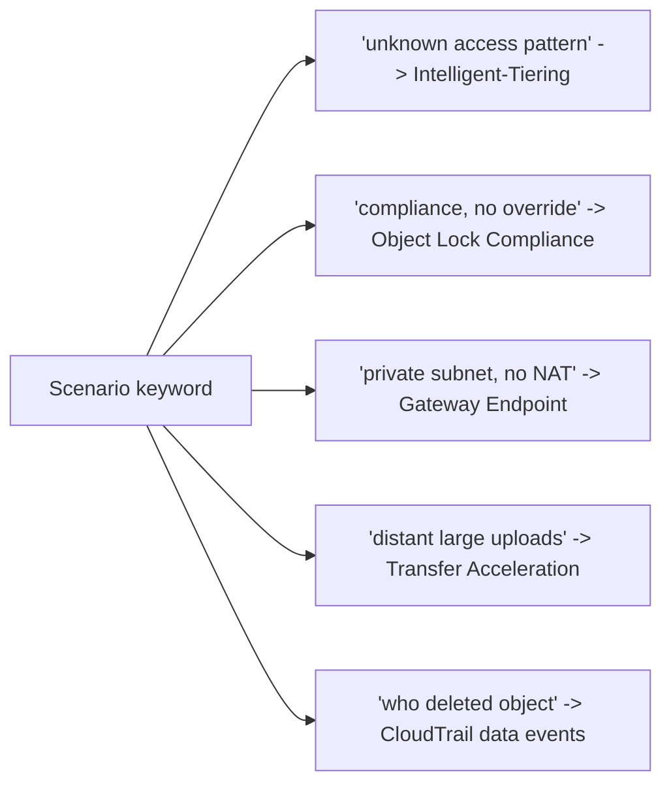

# Amazon S3 Exam Scenarios & Questions - SAA-C03 Deep Dive

> Scenario-based practice across **storage-class selection, security, replication, performance, and cost** - the exact decision points SAA-C03 tests. Each question has the answer, a detailed explanation, and an exam tip.

See also: [01 - S3 Intro & Core Concepts](01%20-%20S3%20Intro%20%26%20Core%20Concepts.md) · [02 - S3 Storage Classes & Lifecycle](02%20-%20S3%20Storage%20Classes%20%26%20Lifecycle.md) · [03 - S3 Security & Encryption](03%20-%20S3%20Security%20%26%20Encryption.md) · [04 - S3 Versioning Replication & Data Protection](04%20-%20S3%20Versioning%20Replication%20%26%20Data%20Protection.md) · [05 - S3 Performance & Advanced Features](05%20-%20S3%20Performance%20%26%20Advanced%20Features.md) · [06 - S3 SRE Troubleshooting & Best Practices](06%20-%20S3%20SRE%20Troubleshooting%20%26%20Best%20Practices.md)

---

## Table of Contents

- [Q1. Unknown Access Pattern](#q1-unknown-access-pattern)
- [Q2. Re-creatable Thumbnails](#q2-re-creatable-thumbnails)
- [Q3. Compliance WORM](#q3-compliance-worm)
- [Q4. Archive with Instant Access](#q4-archive-with-instant-access)
- [Q5. Enforce HTTPS](#q5-enforce-https)
- [Q6. KMS Throttling](#q6-kms-throttling)
- [Q7. Private Subnet to S3](#q7-private-subnet-to-s3)
- [Q8. Temporary Object Access](#q8-temporary-object-access)
- [Q9. DR Across Regions](#q9-dr-across-regions)
- [Q10. Distant Large Uploads](#q10-distant-large-uploads)
- [Q11. Query a Subset](#q11-query-a-subset)
- [Q12. Trigger Processing on Upload](#q12-trigger-processing-on-upload)
- [Q13. Who Deleted the Object](#q13-who-deleted-the-object)
- [Q14. Backfill Replication](#q14-backfill-replication)
- [Q15. Cost-Optimize Aging Logs](#q15-cost-optimize-aging-logs)
- [Answer Key](#answer-key)
- [Summary](#summary)

---

---

## Q1. Unknown Access Pattern

A new analytics app stores objects in S3 but the team **cannot predict** how often each object will be read; some are hot for a week then cold, others are read randomly. They want **automatic cost optimization with no retrieval fees**.

- A. S3 Standard with a lifecycle rule to Standard-IA after 30 days
- B. S3 One Zone-IA
- C. **S3 Intelligent-Tiering**
- D. S3 Glacier Flexible Retrieval

**Answer: C.** Intelligent-Tiering auto-moves objects between tiers based on access, with **no retrieval fees** and **no min duration** - ideal for unpredictable patterns. Lifecycle (A) requires you to know the pattern; One Zone-IA (B) risks data loss and assumes infrequency; Glacier (D) adds retrieval latency.

> 🎯 **Tip:** "Unknown/unpredictable access" almost always = **Intelligent-Tiering**.

[⬆ Back to top](#table-of-contents)

---

## Q2. Re-creatable Thumbnails

A service generates **thumbnails** from master images. Thumbnails are **easily regenerated** if lost and accessed infrequently. Minimize cost.

- A. S3 Standard
- B. S3 Standard-IA
- C. **S3 One Zone-IA**
- D. S3 Glacier Deep Archive

**Answer: C.** One Zone-IA is ~20% cheaper than Standard-IA because it stores in a **single AZ**; acceptable since the data is **re-creatable**. Deep Archive (D) adds retrieval delay for no benefit here.

> 🎯 **Tip:** "Re-creatable / reproducible + infrequent + save cost" = **One Zone-IA**.

[⬆ Back to top](#table-of-contents)

---

## Q3. Compliance WORM

A financial firm must store records so that **no one - not even the root/admin - can delete or modify them** for 7 years (regulatory).

- A. S3 Object Lock in **Governance** mode
- B. **S3 Object Lock in Compliance mode**
- C. Bucket policy denying `s3:DeleteObject`
- D. MFA Delete

**Answer: B.** Compliance mode makes objects immutable until retention expires - **even root cannot override**. Governance (A) allows privileged bypass. A bucket policy (C) can be changed by an admin. MFA Delete (D) deters but doesn't enforce a retention period.

> 🎯 **Tip:** "No one, including root, until retention expires" = **Object Lock Compliance**. Requires versioning.

[⬆ Back to top](#table-of-contents)

---

## Q4. Archive with Instant Access

Medical images are **rarely accessed (about once a quarter)** but when needed must be retrieved in **milliseconds**. Minimize storage cost.

- A. S3 Standard-IA
- B. **S3 Glacier Instant Retrieval**
- C. S3 Glacier Flexible Retrieval
- D. S3 Glacier Deep Archive

**Answer: B.** Glacier Instant Retrieval offers **millisecond** retrieval at lower storage cost than Standard-IA, designed for archive data accessed ~quarterly. Flexible (C) and Deep Archive (D) need minutes-to-hours.

> 🎯 **Tip:** "Archive cost + millisecond retrieval" = **Glacier Instant Retrieval**.

[⬆ Back to top](#table-of-contents)

---

## Q5. Enforce HTTPS

Security requires that **all** S3 requests use **TLS**; plaintext HTTP must be rejected at the bucket.

- A. Enable default encryption
- B. **Bucket policy Deny when `aws:SecureTransport` is false**
- C. Block Public Access
- D. Enable SSE-KMS

**Answer: B.** Encryption-in-transit is enforced by a bucket policy `Deny` on the condition `aws:SecureTransport=false`. Default encryption (A/D) protects at rest, not in transit. BPA (C) is about public access.

> 🎯 **Tip:** `aws:SecureTransport=false` Deny = enforce HTTPS.

[⬆ Back to top](#table-of-contents)

---

## Q6. KMS Throttling

A high-throughput app uses **SSE-KMS** and is now seeing **KMS throttling** and rising KMS costs from millions of GET/PUT.

- A. Switch to SSE-S3
- B. **Enable S3 Bucket Keys**
- C. Increase object size
- D. Use SSE-C

**Answer: B.** S3 Bucket Keys generate a bucket-level data key reused across objects, **cutting KMS API calls by up to 99%** - lower cost, fewer throttles, while keeping SSE-KMS audit/control. Switching to SSE-S3 (A) loses KMS control; SSE-C (D) shifts key management to you.

> 🎯 **Tip:** "SSE-KMS + throttling/cost at scale" = **S3 Bucket Keys**.

[⬆ Back to top](#table-of-contents)

---

## Q7. Private Subnet to S3

EC2 instances in a **private subnet** (no internet/NAT gateway) must read/write S3 in the **same region** at the **lowest cost**.

- A. NAT Gateway
- B. **S3 Gateway VPC Endpoint**
- C. S3 Interface Endpoint (PrivateLink)
- D. Internet Gateway

**Answer: B.** A Gateway VPC Endpoint is **free**, adds a route to S3, keeps traffic on the AWS network - perfect for same-region private access. NAT (A) costs money and routes via internet. Interface Endpoint (C) is needed for on-prem/cross-region but has hourly + data charges.

> 🎯 **Tip:** Private subnet -> S3, same region, cheapest = **Gateway Endpoint** (free).

[⬆ Back to top](#table-of-contents)

---

## Q8. Temporary Object Access

A web app must let an authenticated user **download a private report for 15 minutes** without making the object public or creating IAM users.

- A. Make the object public temporarily
- B. **Generate a pre-signed URL**
- C. Add a bucket policy for the user's IP
- D. Use a CloudFront signed cookie for the whole bucket

**Answer: B.** A pre-signed URL grants time-limited access to a specific object using the signer's credentials - exactly the use case. Making it public (A) is insecure; IP policy (C) is brittle; signed cookies (D) are broader/CDN-oriented.

> 🎯 **Tip:** "Temporary, time-limited access to a specific private object" = **pre-signed URL**.

[⬆ Back to top](#table-of-contents)

---

## Q9. DR Across Regions

A company needs a **DR copy** of a bucket in **another region** with a **guaranteed 15-minute** replication SLA.

- A. CRR only
- B. **CRR with S3 Replication Time Control (RTC)**
- C. SRR
- D. Periodic Batch Copy job

**Answer: B.** CRR provides cross-region copies; **RTC** adds the **99.99% within 15 minutes** SLA plus replication metrics. Plain CRR (A) has no SLA; SRR (C) is same-region; Batch Copy (D) is for one-time/existing backfill, not continuous.

> 🎯 **Tip:** "Replication with a time/SLA guarantee" = **RTC**. Requires versioning on both buckets + IAM role.

[⬆ Back to top](#table-of-contents)

---

## Q10. Distant Large Uploads

Users **across the globe** upload large media files to a bucket in **us-east-1**, and uploads are slow.

- A. **S3 Transfer Acceleration**
- B. CloudFront distribution
- C. Multi-Region buckets
- D. Larger instance for the uploader

**Answer: A.** Transfer Acceleration routes uploads through the nearest **edge location** then over AWS's backbone - built for distant, large uploads. CloudFront (B) accelerates **downloads/caching**, not uploads to origin.

> 🎯 **Tip:** Distant **uploads** -> **Transfer Acceleration**; global **downloads** -> **CloudFront**.

[⬆ Back to top](#table-of-contents)

---

## Q11. Query a Subset

An app needs only **a few columns** from large CSV objects in S3 and wants to avoid downloading whole files.

- A. **S3 Select**
- B. Download and parse client-side
- C. S3 Inventory
- D. Byte-range fetch by guessing offsets

**Answer: A.** S3 Select runs SQL server-side to return only the needed rows/columns, reducing transfer and client work. Inventory (C) lists objects, not contents. (For querying across **many** objects, Athena is the typical choice.)

> 🎯 **Tip:** "Retrieve a subset of one object's data with SQL" = **S3 Select**; across many = **Athena**.

[⬆ Back to top](#table-of-contents)

---

## Q12. Trigger Processing on Upload

When a new image lands in S3, a function must **generate a thumbnail automatically**, with reliable buffering if the processor is busy.

- A. Poll the bucket every minute
- B. **S3 Event Notification -> SQS -> Lambda (or directly to Lambda)**
- C. CloudTrail trigger
- D. Lifecycle rule

**Answer: B.** S3 event notifications fire on `s3:ObjectCreated:*`; routing to **SQS** buffers/decouples for the Lambda worker (or invoke Lambda directly). Polling (A) is inefficient; lifecycle (D) is for tiering/expiry.

> 🎯 **Tip:** "Process objects on upload" = **event notification** to Lambda/SQS/SNS or **EventBridge** (advanced filtering).

[⬆ Back to top](#table-of-contents)

---

## Q13. Who Deleted the Object

A specific object was deleted and the team must find **which principal deleted it and when**.

- A. S3 Server access logs only
- B. **CloudTrail data events (object-level logging)**
- C. CloudWatch metrics
- D. S3 Inventory

**Answer: B.** Object-level operations (`DeleteObject`) are captured by **CloudTrail data events**, identifying the principal, time, and source. CloudTrail management events would catch config changes, not object deletes. Server access logs (A) can help but data events are the canonical, queryable audit source.

> 🎯 **Tip:** "Who did X to a specific object" = **CloudTrail data events**. Enable versioning to recover.

[⬆ Back to top](#table-of-contents)

---

## Q14. Backfill Replication

Replication was just enabled, but **existing (pre-existing) objects** are not appearing in the destination bucket.

- A. Wait longer; it's eventual
- B. **Run S3 Batch Replication for existing objects**
- C. Re-upload every object manually
- D. Enable RTC

**Answer: B.** Replication only applies to objects created **after** it's enabled; existing objects need **S3 Batch Replication** (a Batch Operations job) to backfill. Waiting (A) won't help; RTC (D) only affects the SLA for new replications.

> 🎯 **Tip:** "Existing objects not replicating" = **Batch Replication** backfill.

[⬆ Back to top](#table-of-contents)

---

## Q15. Cost-Optimize Aging Logs

Application logs are written to S3, accessed heavily for **30 days**, occasionally for the next **60 days**, then needed only for **compliance for 7 years** (rare retrieval, hours acceptable).

- A. Keep all in Standard
- B. **Lifecycle: Standard -> Standard-IA at 30d -> Glacier Flexible/Deep Archive at 90d -> expire at ~7y**
- C. Intelligent-Tiering only
- D. One Zone-IA for everything

**Answer: B.** A lifecycle policy matches the known access curve: hot in Standard, warm in Standard-IA, cold/compliance in Glacier (Deep Archive for lowest cost given hours-acceptable retrieval), with eventual expiration. This is the classic tiering scenario; Intelligent-Tiering (C) is for **unknown** patterns and adds monitoring fees.

> 🎯 **Tip:** **Known** aging pattern -> **lifecycle transitions**; **unknown** -> **Intelligent-Tiering**.

[⬆ Back to top](#table-of-contents)

---

## Answer Key

| Q   | Ans | Theme                              |
| :-- | :-- | :--------------------------------- |
| Q1  | C   | Storage class: Intelligent-Tiering |
| Q2  | C   | Storage class: One Zone-IA         |
| Q3  | B   | Object Lock Compliance             |
| Q4  | B   | Glacier Instant Retrieval          |
| Q5  | B   | Enforce HTTPS policy               |
| Q6  | B   | S3 Bucket Keys                     |
| Q7  | B   | Gateway VPC Endpoint               |
| Q8  | B   | Pre-signed URL                     |
| Q9  | B   | CRR + RTC                          |
| Q10 | A   | Transfer Acceleration              |
| Q11 | A   | S3 Select                          |
| Q12 | B   | Event notification + SQS/Lambda    |
| Q13 | B   | CloudTrail data events             |
| Q14 | B   | Batch Replication backfill         |
| Q15 | B   | Lifecycle transitions              |

[⬆ Back to top](#table-of-contents)

---

## Summary

These 15 scenarios drill the S3 decision reflexes: **unknown access -> Intelligent-Tiering**, **re-creatable -> One Zone-IA**, **immutable compliance -> Object Lock Compliance**, **archive + ms -> Glacier Instant Retrieval**, **enforce HTTPS -> SecureTransport Deny**, **KMS at scale -> Bucket Keys**, **private subnet -> Gateway Endpoint**, **temporary access -> pre-signed URL**, **DR SLA -> CRR + RTC**, **distant uploads -> Transfer Acceleration**, **subset query -> S3 Select**, **on-upload processing -> event notifications**, **object forensics -> CloudTrail data events**, **backfill -> Batch Replication**, and **known aging -> lifecycle**.

[⬆ Back to top](#table-of-contents)
