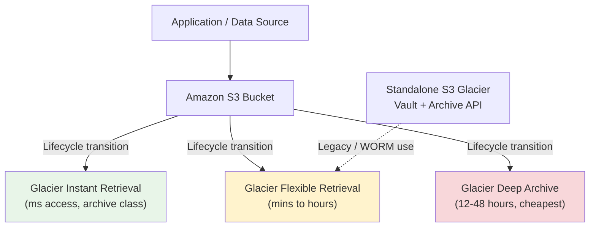

# Amazon S3 Glacier - Intro & Archive Tiers - SAA-C03 Deep Dive

> Amazon S3 Glacier is AWS's family of **low-cost archival storage** for cold/infrequently accessed data. On SAA-C03 it appears in two forms: the **Glacier S3 storage classes** (managed inside an S3 bucket via lifecycle rules) and the older **standalone S3 Glacier vault/archive service** (its own API). Picking the right archive tier = balancing retrieval time vs cost.

See also: [02 - Glacier Retrieval & Vault Operations](02%20-%20Glacier%20Retrieval%20%26%20Vault%20Operations.md) · [03 - Glacier SRE & Exam Scenarios](03%20-%20Glacier%20SRE%20%26%20Exam%20Scenarios.md) · [02 - S3 Storage Classes & Lifecycle](02%20-%20S3%20Storage%20Classes%20%26%20Lifecycle.md) · [01 - AWS Backup Intro & Core Concepts](01%20-%20AWS%20Backup%20Intro%20%26%20Core%20Concepts.md)

---

## Table of Contents

- [1. What Is Amazon S3 Glacier?](#1-what-is-amazon-s3-glacier)
- [2. Two Faces of Glacier: S3 Storage Classes vs Standalone Vault Service](#2-two-faces-of-glacier-s3-storage-classes-vs-standalone-vault-service)
- [3. The Three Archive Tiers](#3-the-three-archive-tiers)
- [4. Archive Tier Comparison Table (Must Memorize)](#4-archive-tier-comparison-table-must-memorize)
- [5. Minimum Storage Duration & Early-Delete Fees](#5-minimum-storage-duration--early-delete-fees)
- [6. When to Use Each Tier (Decision Guide)](#6-when-to-use-each-tier-decision-guide)
- [7. How Glacier Relates to S3 Lifecycle](#7-how-glacier-relates-to-s3-lifecycle)
- [8. Key Exam Traps & Takeaways](#8-key-exam-traps--takeaways)

---



---

Amazon S3 Glacier is purpose-built for data you rarely touch but must keep — backups, compliance archives, media masters, log retention, scientific data. It trades **instant access for dramatically lower per-GB storage cost** (Deep Archive is the cheapest storage AWS offers).

---

## 1. What Is Amazon S3 Glacier?

S3 Glacier provides **durable (11 nines), secure, extremely low-cost** object storage for archival and long-term backup.

### Core characteristics

| Property             | Detail                                                                      |
| :------------------- | :-------------------------------------------------------------------------- |
| **Durability**       | 99.999999999% (11 nines) — same as S3 Standard                              |
| **Availability SLA** | Tier-dependent (Instant Retrieval is highest; Deep Archive lowest)          |
| **Encryption**       | At rest by default (SSE-S3 / SSE-KMS); in transit via TLS                   |
| **Designed for**     | Cold data: backups, compliance, media archives, logs                        |
| **Cost model**       | Very low storage $/GB, but you **pay extra to retrieve** + per-request fees |
| **Key trade-off**    | Cheaper storage = slower and/or costlier retrieval                          |

💡 **Mental model:** Glacier is "data you put in a deep freezer." Cheap to keep frozen, but you pay (in money and time) to thaw it.

[⬆ Back to top](#table-of-contents)

---

## 2. Two Faces of Glacier: S3 Storage Classes vs Standalone Vault Service

This distinction trips people up. AWS uses the word "Glacier" for **two different things**:

| Aspect                    | Glacier S3 Storage Classes                                    | Standalone S3 Glacier (Vault Service)         |
| :------------------------ | :------------------------------------------------------------ | :-------------------------------------------- |
| **What it is**            | Storage classes _inside_ an S3 bucket                         | A separate, older service with its own API    |
| **Unit of storage**       | S3 **objects** (keys)                                         | **Archives** stored inside **vaults**         |
| **API**                   | S3 API (`PutObject`, lifecycle, `RestoreObject`)              | Glacier API (`UploadArchive`, `InitiateJob`)  |
| **How data lands there**  | Direct PUT (Instant Retrieval) or S3 **lifecycle transition** | Direct upload to a vault                      |
| **Naming**                | GIR, GFR, Deep Archive                                        | Vaults / Archives / Vault Lock                |
| **Modern recommendation** | ✅ Preferred for almost all new workloads                     | Legacy; mainly for WORM/Vault Lock compliance |
| **Visibility**            | Browse objects in S3 console                                  | Archives are opaque; inventory needed to list |

🎯 **Exam tip:** Most modern exam scenarios use the **S3 storage classes** approach (lifecycle into Glacier). The **standalone vault service** shows up specifically when the question mentions **Vault Lock / WORM / compliance lock** (see [02 - Glacier Retrieval & Vault Operations](02%20-%20Glacier%20Retrieval%20%26%20Vault%20Operations.md)).

⚠️ **Trap:** "Glacier" (the storage class) was _renamed_ to **Glacier Flexible Retrieval**. If an old question says "S3 Glacier," it means Flexible Retrieval.

[⬆ Back to top](#table-of-contents)

---

## 3. The Three Archive Tiers

### 3.1 S3 Glacier Instant Retrieval (GIR)

- **Millisecond retrieval** — same speed as S3 Standard-IA.
- For archive data that is **rarely accessed but needs instant access** when it is.
- Lowest storage cost among the _millisecond-access_ classes.
- **Use case:** medical images, news media assets, user-generated content archives accessed a few times a year.
- ✅ No "restore job" needed — read it like any object.

### 3.2 S3 Glacier Flexible Retrieval (GFR) — formerly "S3 Glacier"

- Retrieval in **minutes to hours** depending on the option chosen (Expedited / Standard / Bulk).
- ~10% cheaper storage than Instant Retrieval.
- **Free Bulk retrievals** (great for large, occasional restores).
- **Use case:** backups, DR copies, data restored a few times a year where minutes-to-hours is acceptable.

### 3.3 S3 Glacier Deep Archive (GDA)

- **Lowest-cost storage in all of AWS.**
- Retrieval in **12 hours (Standard)** up to **48 hours (Bulk)**.
- **Use case:** long-term compliance/regulatory retention (7–10+ years), data accessed maybe once or twice a year, replacing on-prem tape libraries.

[⬆ Back to top](#table-of-contents)

---

## 4. Archive Tier Comparison Table (Must Memorize)

| Tier                           | Retrieval Time                                                | Min Storage Duration | Relative Storage Cost                | Best For                                                         |
| :----------------------------- | :------------------------------------------------------------ | :------------------- | :----------------------------------- | :--------------------------------------------------------------- |
| **Glacier Instant Retrieval**  | **Milliseconds** (instant)                                    | **90 days**          | $$ (higher than other archive tiers) | Rarely accessed but needs instant access (e.g., medical imaging) |
| **Glacier Flexible Retrieval** | Expedited 1–5 min · Standard 3–5 hr · **Bulk 5–12 hr (free)** | **90 days**          | $                                    | Backups/DR, occasional restores, minutes-to-hours OK             |
| **Glacier Deep Archive**       | Standard **12 hr** · Bulk **48 hr**                           | **180 days**         | ¢ (cheapest in AWS)                  | Long-term compliance, tape replacement, 7–10 yr retention        |

> Approximate, exam-relevant figures. AWS occasionally tweaks exact minutes; the **relative ordering and the 90/90/180-day minimums** are what the exam tests.

🎯 **Memory hook:** **GIR = Instant. GFR = Flexible (you choose how fast). GDA = Deep & Slow (hours-to-days), but Dirt cheap.**

⚠️ Note: **Glacier Instant Retrieval has no Expedited/Standard/Bulk concept** — it's always instant. Retrieval _options_ only apply to **Flexible Retrieval** and **Deep Archive**. Full retrieval detail is in [02 - Glacier Retrieval & Vault Operations](02%20-%20Glacier%20Retrieval%20%26%20Vault%20Operations.md).

[⬆ Back to top](#table-of-contents)

---

## 5. Minimum Storage Duration & Early-Delete Fees

Every Glacier tier has a **minimum billable storage duration**. Delete or transition an object earlier and you are **still charged for the remaining days** (early-delete / prorated fee).

| Tier                       | Minimum Duration | If deleted early...       |
| :------------------------- | :--------------- | :------------------------ |
| Glacier Instant Retrieval  | 90 days          | Charged for full 90 days  |
| Glacier Flexible Retrieval | 90 days          | Charged for full 90 days  |
| Glacier Deep Archive       | 180 days         | Charged for full 180 days |

💡 Also relevant: **S3 Standard-IA and One Zone-IA = 30-day minimum.** A common exam comparison.

⚠️ **Trap:** Transitioning data into a Glacier tier and then deleting it after a week does **not** save money — you eat the early-delete fee. Glacier only makes sense for data you will keep at least the minimum duration.

[⬆ Back to top](#table-of-contents)

---

## 6. When to Use Each Tier (Decision Guide)

| If the requirement is...                                                               | Choose                                                                                 |
| :------------------------------------------------------------------------------------- | :------------------------------------------------------------------------------------- |
| Archive, but must be readable **instantly** when needed                                | **Glacier Instant Retrieval**                                                          |
| Backups/DR, restored a few times a year, **minutes-to-hours** acceptable               | **Glacier Flexible Retrieval**                                                         |
| Compliance/regulatory retention for years, accessed almost never, **hours-to-days** OK | **Glacier Deep Archive**                                                               |
| WORM / regulatory immutability lock (cannot ever be changed/deleted)                   | Standalone **Glacier Vault Lock** (see [02 - Glacier Retrieval & Vault Operations](02%20-%20Glacier%20Retrieval%20%26%20Vault%20Operations.md))  |
| Unknown/changing access patterns, don't want to manage tiers                           | **S3 Intelligent-Tiering** (has optional Archive tiers) — _not_ a Glacier class itself |

🎯 **Exam phrasing decoder:**

- "lowest possible storage cost" + "retrieval within 12 hours is fine" → **Deep Archive**
- "rarely accessed but needs immediate retrieval" → **Glacier Instant Retrieval**
- "occasional restores within a few hours, lowest cost archive" → **Flexible Retrieval**
- "data restored in 1–5 minutes (urgent)" → **Expedited** retrieval on **Flexible Retrieval**

[⬆ Back to top](#table-of-contents)

---

## 7. How Glacier Relates to S3 Lifecycle

Most data reaches Glacier via **S3 Lifecycle transition rules**, not by uploading there directly.

### Typical lifecycle path

```
S3 Standard → (30d) → Standard-IA → (90d) → Glacier Flexible Retrieval → (180d) → Glacier Deep Archive → (expire)
```

### Transition rules to know

- You can transition **directly to GIR, GFR, or GDA** from S3 Standard / Standard-IA.
- ⚠️ You **cannot** transition from a "colder/cheaper" class back to a "hotter" one via lifecycle — to access archived data you must **restore** it (creates a temporary copy), see [02 - Glacier Retrieval & Vault Operations](02%20-%20Glacier%20Retrieval%20%26%20Vault%20Operations.md).
- **Glacier Instant Retrieval** objects are read directly (no restore); **Flexible Retrieval** and **Deep Archive** objects require a **`RestoreObject`** request first.
- Objects **< 128 KB** are generally not cost-effective to transition (per-object overhead + monitoring) — lifecycle skips tiny objects by default for some classes.

💡 See [02 - S3 Storage Classes & Lifecycle](02%20-%20S3%20Storage%20Classes%20%26%20Lifecycle.md) for the full lifecycle rule engine, filters, and Intelligent-Tiering.

[⬆ Back to top](#table-of-contents)

---

## 8. Key Exam Traps & Takeaways

- ✅ **Three tiers, three speeds:** Instant (ms) → Flexible (min–hr) → Deep Archive (hr–days).
- ✅ **Min durations: 90 / 90 / 180 days.** Deleting early = full charge.
- ✅ **Deep Archive = absolute cheapest storage in AWS**, slowest retrieval.
- ✅ **Glacier Instant Retrieval needs NO restore job**; Flexible & Deep Archive do.
- ✅ "S3 Glacier" (old name) = **Glacier Flexible Retrieval**.
- ⚠️ Glacier storage classes (in S3) are different from the **standalone Glacier vault service** — the vault service is the answer when **Vault Lock / WORM** is mentioned.
- ⚠️ Cheap storage ≠ cheap retrieval. **Expedited retrievals and large data egress can cost a lot** (see [03 - Glacier SRE & Exam Scenarios](03%20-%20Glacier%20SRE%20%26%20Exam%20Scenarios.md)).
- ⚠️ Glacier is **not** for frequently accessed data — retrieval fees and latency make it expensive/slow for that.

[⬆ Back to top](#table-of-contents)
