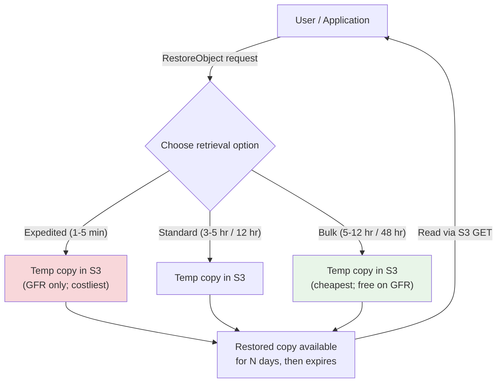

# Glacier Retrieval & Vault Operations - SAA-C03 Deep Dive

> How you get data **back out** of Glacier and how the **standalone vault service** works. Covers the three retrieval options (Expedited, Standard, Bulk) with times/costs per tier, provisioned retrieval capacity, vaults, **Vault Lock (WORM)** with its two-step 24-hour lock, archives, inventory, Glacier Select, and restoring archived objects from S3 via `RestoreObject` + lifecycle transitions.

See also: [01 - Glacier Intro & Archive Tiers](01%20-%20Glacier%20Intro%20%26%20Archive%20Tiers.md) · [03 - Glacier SRE & Exam Scenarios](03%20-%20Glacier%20SRE%20%26%20Exam%20Scenarios.md) · [02 - S3 Storage Classes & Lifecycle](02%20-%20S3%20Storage%20Classes%20%26%20Lifecycle.md) · [01 - AWS Backup Intro & Core Concepts](01%20-%20AWS%20Backup%20Intro%20%26%20Core%20Concepts.md)

---

## Table of Contents

- [1. Retrieval Options Overview (Expedited, Standard, Bulk)](#1-retrieval-options-overview-expedited-standard-bulk)
- [2. Retrieval Times & Costs Per Tier](#2-retrieval-times--costs-per-tier)
- [3. Provisioned Retrieval Capacity](#3-provisioned-retrieval-capacity)
- [4. Restoring Archived Objects from S3 (RestoreObject)](#4-restoring-archived-objects-from-s3-restoreobject)
- [5. Lifecycle Transitions Into Glacier](#5-lifecycle-transitions-into-glacier)
- [6. The Standalone S3 Glacier Vault Service](#6-the-standalone-s3-glacier-vault-service)
- [7. Vault Lock (WORM Compliance & the Two-Step Lock)](#7-vault-lock-worm-compliance--the-two-step-lock)
- [8. Vault Inventory & Archives](#8-vault-inventory--archives)
- [9. S3 Glacier Select (Query in Place)](#9-s3-glacier-select-query-in-place)
- [10. Exam Traps & Takeaways](#10-exam-traps--takeaways)

---



---

Retrieving Glacier data is **asynchronous** for Flexible Retrieval and Deep Archive: you submit a request, wait, then read a **temporary restored copy**. Only **Glacier Instant Retrieval** is synchronous (read immediately).

---

## 1. Retrieval Options Overview (Expedited, Standard, Bulk)

For **Glacier Flexible Retrieval** and **Glacier Deep Archive**, you pick a retrieval option that trades **speed vs cost**:

| Option        | Speed   | Cost                          | Notes                                                                                                                |
| :------------ | :------ | :---------------------------- | :------------------------------------------------------------------------------------------------------------------- |
| **Expedited** | Fastest | 💰💰💰 Most expensive         | **Not available on Deep Archive.** Only GFR. Optionally back with _provisioned capacity_ for guaranteed availability |
| **Standard**  | Medium  | 💰💰 Moderate                 | Default. Available on all retrievable tiers                                                                          |
| **Bulk**      | Slowest | 💰 Cheapest (**free on GFR**) | Best for large, non-urgent restores (petabytes)                                                                      |

⚠️ **Key trap:** **Glacier Instant Retrieval has NO retrieval options** — it's always millisecond, synchronous, no restore job. These options only matter for **GFR and GDA**.

⚠️ **Expedited is NOT available for Deep Archive.** Deep Archive only supports **Standard** and **Bulk**.

[⬆ Back to top](#table-of-contents)

---

## 2. Retrieval Times & Costs Per Tier

| Tier                           | Expedited         | Standard      | Bulk                            |
| :----------------------------- | :---------------- | :------------ | :------------------------------ |
| **Glacier Instant Retrieval**  | n/a (instant, ms) | n/a           | n/a                             |
| **Glacier Flexible Retrieval** | **1–5 minutes**   | **3–5 hours** | **5–12 hours (FREE retrieval)** |
| **Glacier Deep Archive**       | ❌ not supported  | **~12 hours** | **~48 hours**                   |

🎯 **Memorize these numbers — they are directly tested:**

- GFR Expedited = **1–5 min**, Standard = **3–5 hr**, Bulk = **5–12 hr**.
- Deep Archive Standard = **12 hr**, Bulk = **48 hr**.
- Instant Retrieval = **milliseconds**, no job.

### Cost components when retrieving

1. **Retrieval request fee** (per request).
2. **Retrieval data fee** (per GB retrieved — Expedited > Standard > Bulk).
3. **Data transfer out** to internet (if applicable).
4. Restored copies sit in **Standard-IA-priced temporary storage** for the requested number of days.

💡 Bulk retrieval on **Flexible Retrieval is free** of per-GB retrieval charges — ideal for large, patient restores.

[⬆ Back to top](#table-of-contents)

---

## 3. Provisioned Retrieval Capacity

For **Expedited** retrievals on **Glacier Flexible Retrieval**, capacity is normally best-effort and can occasionally be rejected with **`InsufficientCapacityException`** during peak demand.

- **Provisioned capacity** lets you **pre-purchase** dedicated Expedited retrieval throughput so urgent restores are **guaranteed available**.
- Purchased in **units** (each unit guarantees a certain number of Expedited retrievals capacity over time).
- Use when you have **business-critical, time-sensitive** restore SLAs.

🎯 **Exam cue:** "must guarantee expedited retrievals are always available even at peak" → **purchase provisioned retrieval capacity**.

[⬆ Back to top](#table-of-contents)

---

## 4. Restoring Archived Objects from S3 (RestoreObject)

When an object is in **Glacier Flexible Retrieval** or **Deep Archive** (via S3 storage classes), you cannot GET it directly. You must first issue a **`RestoreObject`** request, which creates a **temporary, readable copy** in the bucket.

```bash
aws s3api restore-object \
  --bucket my-archive-bucket \
  --key reports/2019/audit.zip \
  --restore-request '{"Days":7,"GlacierJobParameters":{"Tier":"Bulk"}}'
```

- **`Days`** = how long the restored copy stays available before it expires (you stop paying after expiry).
- **`Tier`** = `Expedited` | `Standard` | `Bulk`.
- The restore is **asynchronous** — poll object metadata; `x-amz-restore: ongoing-request="true"` until ready.
- The **original archived object stays in Glacier**; the restore is a temporary copy, not a class change.
- ⚠️ **Glacier Instant Retrieval needs no restore** — GET it directly.

💡 **S3 Restore Speed Upgrade:** while a Standard/Bulk restore is in progress you can submit a _faster_ tier request to "upgrade" it.

[⬆ Back to top](#table-of-contents)

---

## 5. Lifecycle Transitions Into Glacier

Lifecycle rules move objects between classes on a schedule based on age.

| From                                            | To (allowed)                                                |
| :---------------------------------------------- | :---------------------------------------------------------- |
| S3 Standard / Standard-IA / Intelligent-Tiering | Glacier Instant Retrieval, Flexible Retrieval, Deep Archive |
| Glacier Flexible Retrieval                      | Glacier Deep Archive                                        |

- Transitions are **one-directional (warmer → colder)**. You cannot lifecycle data back to a hotter class; use **restore** instead.
- Remember the **minimum storage durations** (90 / 90 / 180 days) — early transition/delete incurs prorated charges. See [01 - Glacier Intro & Archive Tiers](01%20-%20Glacier%20Intro%20%26%20Archive%20Tiers.md).
- Combine with an **Expiration** action to delete objects after the retention period.

[⬆ Back to top](#table-of-contents)

---

## 6. The Standalone S3 Glacier Vault Service

The original Glacier service predates the S3 storage classes. It has its own vocabulary:

| Term             | Meaning                                                                                          |
| :--------------- | :----------------------------------------------------------------------------------------------- |
| **Vault**        | A container for archives (analogous to an S3 bucket). Has a vault access policy + lock policy    |
| **Archive**      | The unit of data stored (a file, or a TAR/ZIP of files). Up to 40 TB each; immutable once stored |
| **Job**          | Asynchronous operation: retrieval (`archive-retrieval`) or inventory (`inventory-retrieval`)     |
| **Notification** | SNS notification when a job completes                                                            |

- You **upload** with `UploadArchive` (or multipart for large), receive an **archive ID** (no human-friendly name).
- To retrieve: `InitiateJob` (archive-retrieval) → wait → `GetJobOutput`.
- Archives **cannot be modified** — you delete and re-upload.

🎯 **Exam cue:** Choose the **standalone vault service** primarily when the scenario requires **Vault Lock / WORM / regulatory immutability**. Otherwise prefer S3 + Glacier storage classes.

[⬆ Back to top](#table-of-contents)

---

## 7. Vault Lock (WORM Compliance & the Two-Step Lock)

**S3 Glacier Vault Lock** enforces **WORM (Write Once Read Many)** and time-based retention via an **immutable Vault Lock Policy** — ideal for regulatory compliance (SEC 17a-4, FINRA, etc.).

### The two-step lock process (heavily tested)

1. **InitiateVaultLock** — attach the lock policy in an **in-progress** state and receive a **lock ID**. The policy is testable but **not yet permanent**.
2. You have a **24-hour window** to validate/test the policy.
3. **CompleteVaultLock** (with the lock ID) within 24 hours → the policy becomes **permanent and immutable — it can NEVER be changed or removed**.
   - If you find a mistake during the window, call **AbortVaultLock** to discard and start over.
   - If the 24-hour window expires without completing, the lock attempt is voided.

| Vault Lock Policy                           | Vault Access Policy                                   |
| :------------------------------------------ | :---------------------------------------------------- |
| **Immutable** once locked (WORM, retention) | Mutable like an IAM/bucket policy (day-to-day access) |
| Used for compliance controls                | Used for normal permissions                           |

⚠️ **Trap:** Once `CompleteVaultLock` runs, even the **root account / AWS** cannot alter or delete the policy. This is the point of compliance WORM — design carefully.

💡 The S3-side equivalent for objects is **S3 Object Lock** (Governance/Compliance modes) — different feature, similar WORM intent. Vault Lock is on the _Glacier vault_ itself.

🎯 **Exam cue:** "regulatory requirement that archived records cannot be deleted or modified for N years, even by administrators" → **Glacier Vault Lock** (or S3 Object Lock in Compliance mode).

[⬆ Back to top](#table-of-contents)

---

## 8. Vault Inventory & Archives

- A vault's archive list is **not real-time**. AWS produces a **vault inventory** roughly **once per day**.
- To list archives, run an **inventory-retrieval job** (`InitiateJob`), then `GetJobOutput` — this returns archive IDs, sizes, creation dates.
- Because there are no friendly names, **you must track archive IDs yourself** (or rely on inventory).
- ⚠️ **Trap:** Newly uploaded archives may **not appear in inventory immediately** (up to ~24h lag) — but you can still retrieve them by archive ID right away.

[⬆ Back to top](#table-of-contents)

---

## 9. S3 Glacier Select (Query in Place)

**Glacier Select** lets you run **SQL expressions** directly against archived objects, retrieving **only the subset of data** you need instead of the whole archive.

- Works on objects in **Glacier Flexible Retrieval** (and via S3 Select on S3 objects).
- Reduces retrieval cost & time when you only need a few rows/columns from a large archive.
- Supports CSV/JSON/Parquet-style structured data with `SELECT ... WHERE ...`.

🎯 **Exam cue:** "need to analyze a small portion of archived data without restoring the entire object" → **Glacier Select / S3 Select**.

[⬆ Back to top](#table-of-contents)

---

## 10. Exam Traps & Takeaways

- ✅ **Retrieval options (Expedited/Standard/Bulk) apply only to GFR & GDA**, never Instant Retrieval.
- ✅ **Expedited is NOT available on Deep Archive** (Standard 12h, Bulk 48h only).
- ✅ **Bulk on Flexible Retrieval = free** per-GB retrieval — best for huge, non-urgent restores.
- ✅ **`RestoreObject`** creates a _temporary_ copy for `Days` days; original stays in Glacier.
- ✅ **Provisioned capacity** = guaranteed Expedited retrievals (avoid `InsufficientCapacityException`).
- ✅ **Vault Lock = WORM**; two steps: `InitiateVaultLock` → **24h window** → `CompleteVaultLock` (then immutable forever); `AbortVaultLock` to cancel.
- ✅ **Vault inventory updates ~daily**; track archive IDs yourself.
- ✅ **Glacier/S3 Select** = query in place, retrieve only needed data.
- ⚠️ Vault **Lock** policy = immutable compliance; Vault **Access** policy = mutable permissions. Don't confuse them.

[⬆ Back to top](#table-of-contents)
