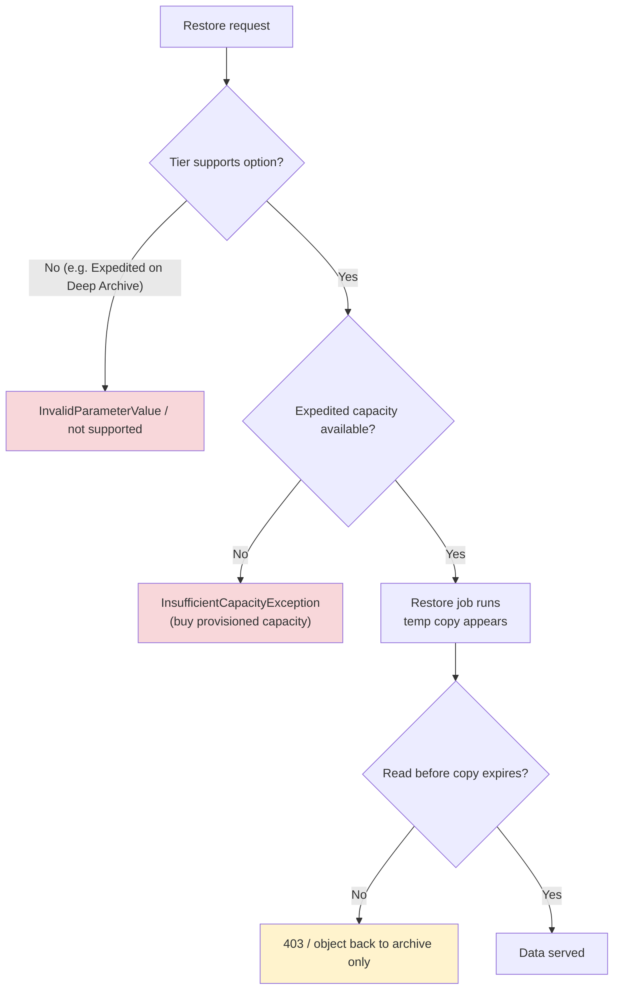

# Glacier SRE & Exam Scenarios - SAA-C03 Deep Dive

> Operating Glacier in the real world: the failure modes you actually hit (retrieval timeouts, tier-not-available, surprise Expedited bills, early-delete fees), cost-optimization levers, best practices, and a bank of **scenario-based exam questions** with answers, explanations, and exam tips.

See also: [01 - Glacier Intro & Archive Tiers](01%20-%20Glacier%20Intro%20%26%20Archive%20Tiers.md) · [02 - Glacier Retrieval & Vault Operations](02%20-%20Glacier%20Retrieval%20%26%20Vault%20Operations.md) · [02 - S3 Storage Classes & Lifecycle](02%20-%20S3%20Storage%20Classes%20%26%20Lifecycle.md) · [01 - AWS Backup Intro & Core Concepts](01%20-%20AWS%20Backup%20Intro%20%26%20Core%20Concepts.md)

---

## Table of Contents

- [1. Common Errors & Troubleshooting (SRE View)](#1-common-errors--troubleshooting-sre-view)
- [2. Cost Surprises & How to Avoid Them](#2-cost-surprises--how-to-avoid-them)
- [3. Cost-Optimization Playbook](#3-cost-optimization-playbook)
- [4. Best Practices](#4-best-practices)
- [5. Quick Decision Cheat Sheet](#5-quick-decision-cheat-sheet)
- [6. Scenario-Based Exam Questions](#6-scenario-based-exam-questions)
- [7. Final Exam Tips](#7-final-exam-tips)

---

---

Glacier failures are rarely about durability (11 nines). They are about **retrieval latency, capacity, configuration, and cost**. This page is the operational + exam-prep companion to [01 - Glacier Intro & Archive Tiers](01%20-%20Glacier%20Intro%20%26%20Archive%20Tiers.md) and [02 - Glacier Retrieval & Vault Operations](02%20-%20Glacier%20Retrieval%20%26%20Vault%20Operations.md).

---

## 1. Common Errors & Troubleshooting (SRE View)

| Symptom                                            | Likely Cause                                                      | Fix                                                                  |
| :------------------------------------------------- | :---------------------------------------------------------------- | :------------------------------------------------------------------- |
| `InvalidObjectState` on GET                        | Object is in GFR/Deep Archive and **not restored**                | Issue `RestoreObject` first; wait for completion before GET          |
| Restore "stuck" for hours                          | **Standard/Bulk** times are normal (3–5h / 12h / 48h) — not stuck | Upgrade in-flight restore to a faster tier if urgent                 |
| `InsufficientCapacityException`                    | Expedited retrieval capacity exhausted at peak                    | **Buy provisioned capacity**, or fall back to Standard               |
| `400 InvalidParameterValue` (Expedited)            | Requested **Expedited on Deep Archive** (unsupported)             | Use **Standard (12h)** or **Bulk (48h)** for Deep Archive            |
| Restored object 403 / gone                         | **Restore copy expired** (`Days` elapsed)                         | Re-issue restore; set adequate `Days`                                |
| New vault archive missing from list                | **Inventory lag (~24h)**                                          | Retrieve by archive ID directly; don't rely on inventory immediately |
| Cannot edit/delete a vault policy                  | **Vault Lock completed** → immutable forever                      | By design; cannot be undone (even by root)                           |
| Lifecycle transition "did nothing" for small files | Objects **< 128 KB** skipped / not cost-effective                 | Aggregate small objects before archiving                             |

🎯 **Top exam-relevant errors:** `InvalidObjectState` (forgot to restore), `InsufficientCapacityException` (need provisioned capacity), and Expedited-on-Deep-Archive (not supported).

[⬆ Back to top](#table-of-contents)

---

## 2. Cost Surprises & How to Avoid Them

| Surprise                             | Why it happens                                            | Avoidance                                                                               |
| :----------------------------------- | :-------------------------------------------------------- | :-------------------------------------------------------------------------------------- |
| **Huge Expedited bill**              | Expedited retrieval $/GB is the most expensive option     | Default to **Standard/Bulk**; reserve Expedited for true emergencies                    |
| **Early-delete fee**                 | Deleted/transitioned before min duration (90/90/180 days) | Only archive data you'll keep ≥ minimum duration                                        |
| **Per-request fees on tiny objects** | Millions of small archives = millions of requests         | **Aggregate** into larger archives/objects                                              |
| **Re-restoring repeatedly**          | Restored copies expire; re-restoring re-charges retrieval | If accessed often, it shouldn't be in Glacier — use **Instant Retrieval / Standard-IA** |
| **Data transfer out**                | Egress to internet billed separately from retrieval       | Keep processing in-Region; use VPC endpoints                                            |

⚠️ **Classic trap:** Picking Deep Archive for "cheapest storage" then doing **frequent Expedited-style restores** — total cost balloons. Match the tier to the **access pattern**, not just storage price.

[⬆ Back to top](#table-of-contents)

---

## 3. Cost-Optimization Playbook

- 🔹 **Lifecycle everything cold.** Auto-transition S3 → Glacier tiers by age; expire when retention ends.
- 🔹 **Use Bulk (free on GFR)** for large, non-urgent restores.
- 🔹 **Deep Archive for true cold/compliance** data accessed ≤ once or twice a year.
- 🔹 **Instant Retrieval** when you need ms access but rarely read — cheaper than Standard-IA at low access frequency.
- 🔹 **Aggregate small files** (TAR/ZIP) to cut per-request and per-object overhead.
- 🔹 **S3 Storage Lens / Cost Explorer** to spot retrieval-cost spikes.
- 🔹 **S3 Intelligent-Tiering** (with optional Archive Access + Deep Archive Access tiers) when access patterns are unknown — no retrieval fees for tier movement, but a small monitoring charge.

[⬆ Back to top](#table-of-contents)

---

## 4. Best Practices

- ✅ **Encrypt** (SSE-KMS for audited keys); enable bucket/vault policies + least privilege.
- ✅ **Vault Lock / S3 Object Lock (Compliance mode)** for regulatory WORM — test the policy during the **24h window** before `CompleteVaultLock`.
- ✅ **Tag** archive data with retention class for lifecycle + cost allocation.
- ✅ **Document archive IDs / object keys** — Glacier vault archive IDs are not human-friendly.
- ✅ **Set realistic restore SLAs** with stakeholders (hours/days, not seconds) unless using Instant Retrieval/Expedited+provisioned.
- ✅ **Monitor restores** via SNS notifications / EventBridge; alarm on `InsufficientCapacityException`.
- ✅ **Test DR restores** periodically so a real incident isn't your first restore.

[⬆ Back to top](#table-of-contents)

---

## 5. Quick Decision Cheat Sheet

| Need                                              | Answer                                                       |
| :------------------------------------------------ | :----------------------------------------------------------- |
| Cheapest AWS storage, retrieval in hours/days OK  | **Glacier Deep Archive**                                     |
| Archive but instant read when needed              | **Glacier Instant Retrieval**                                |
| Backups/DR, restore in minutes-to-hours, low cost | **Glacier Flexible Retrieval**                               |
| Urgent restore in 1–5 minutes                     | **Expedited** (GFR) + **provisioned capacity** if guaranteed |
| Large restore, cost-sensitive, time OK            | **Bulk** (free on GFR)                                       |
| Regulatory immutability (WORM)                    | **Vault Lock** / **S3 Object Lock (Compliance)**             |
| Query a small subset of archived data             | **Glacier / S3 Select**                                      |
| Unknown access pattern, hands-off                 | **S3 Intelligent-Tiering**                                   |

[⬆ Back to top](#table-of-contents)

---

## 6. Scenario-Based Exam Questions

**Q1.** A company must retain financial records for 7 years at the lowest possible storage cost. Records are essentially never accessed, and a 12–48 hour retrieval is acceptable. Which storage class?

- ✅ **A: S3 Glacier Deep Archive.** Cheapest storage; 12h Standard / 48h Bulk retrieval fits the requirement.
- 💡 _Tip:_ "lowest cost" + "retrieval in hours/days OK" = Deep Archive.

**Q2.** Medical images are accessed only a few times a year, but when a doctor requests one it must load **immediately**. Cheapest class meeting this?

- ✅ **A: S3 Glacier Instant Retrieval.** Millisecond access, lower storage cost than Standard-IA for rarely accessed data.
- ⚠️ Flexible Retrieval/Deep Archive fail the "immediately" requirement (need restore).

**Q3.** A regulator requires that audit archives **cannot be modified or deleted by anyone, including administrators**, for 5 years. What do you use?

- ✅ **A: S3 Glacier Vault Lock** with a compliance lock policy (or **S3 Object Lock in Compliance mode**). Two-step lock; once completed it is immutable.
- 💡 The 24-hour window + `CompleteVaultLock` detail is a favorite distractor.

**Q4.** During a major incident, an ops team submits an **Expedited** restore on **Deep Archive** objects and it fails. Why?

- ✅ **A: Expedited is not supported on Deep Archive.** Only Standard (12h) and Bulk (48h) are available.
- 💡 If they need fast access to such data regularly, Deep Archive was the wrong tier.

**Q5.** Expedited retrievals on Flexible Retrieval are intermittently rejected with `InsufficientCapacityException` during business-critical restores. How do you guarantee availability?

- ✅ **A: Purchase provisioned retrieval capacity** for Expedited retrievals.

**Q6.** An object lifecycled to Glacier Flexible Retrieval is deleted after 20 days. The bill shows a charge as if it were stored 90 days. Why?

- ✅ **A: Minimum storage duration is 90 days** for GFR; early deletion incurs a prorated early-delete fee for the remaining days.
- 💡 Minimums: GIR 90, GFR 90, **GDA 180**, Standard-IA/One Zone-IA 30.

**Q7.** A data lake team must run a SQL filter over a large archived CSV to extract a few rows, without restoring the whole multi-GB object. Best approach?

- ✅ **A: Use S3 Glacier Select / S3 Select** to query in place and retrieve only matching data — lower cost and time.

**Q8.** Petabytes of backups must be restored for a migration; cost matters far more than speed (days are fine). Which retrieval option on Flexible Retrieval?

- ✅ **A: Bulk retrieval** (free per-GB on GFR, 5–12 hours).

**Q9.** Application gets `InvalidObjectState` when calling GET on an object stored in Glacier Deep Archive. What's missing?

- ✅ **A: A `RestoreObject` request first.** GFR/Deep Archive objects must be restored to a temporary copy before they can be read; only Glacier Instant Retrieval is directly readable.

**Q10.** Access patterns for a new dataset are unpredictable and the team doesn't want to manage transitions or pay retrieval fees for tier changes. Best fit?

- ✅ **A: S3 Intelligent-Tiering** (auto-moves objects across access tiers, incl. optional Archive Access tiers, with no retrieval charges for movement — only a small monitoring fee).
- ⚠️ Not a Glacier _class_ per se; it's the "I don't know the pattern" answer.

[⬆ Back to top](#table-of-contents)

---

## 7. Final Exam Tips

- 🎯 **Match tier to access pattern + retrieval SLA**, not just storage price.
- 🎯 **Memorize times:** GFR Expedited 1–5 min / Standard 3–5 hr / Bulk 5–12 hr; Deep Archive 12 hr / 48 hr; Instant = ms.
- 🎯 **Min durations 90 / 90 / 180** days; early delete = full charge.
- 🎯 **Expedited ≠ Deep Archive.** Instant Retrieval = no restore job.
- 🎯 **Vault Lock = immutable WORM**, two-step with a 24-hour validation window.
- 🎯 **Provisioned capacity** guarantees Expedited; **Bulk on GFR is free**.
- 🎯 Cheap storage, **not** cheap retrieval — watch Expedited + egress costs.
- 🎯 **Glacier/S3 Select** = retrieve only the subset you query.

[⬆ Back to top](#table-of-contents)
