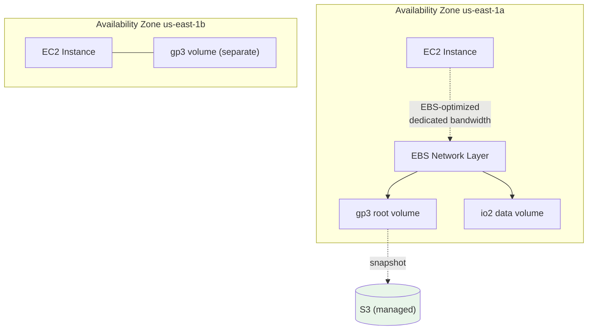

# EBS Intro & Volume Types - SAA-C03 Deep Dive

> **Amazon EBS** is network-attached, AZ-scoped block storage you mount to EC2 instances like a virtual hard drive - durable, resizable, and persistent beyond the instance lifecycle. Picking the right **volume type** (gp3 vs io2 vs st1...) is one of the most common SAA-C03 cost/performance questions.

See also: [02 - EBS Snapshots & Encryption](02%20-%20EBS%20Snapshots%20%26%20Encryption.md) · [03 - EBS Performance & Architecture](03%20-%20EBS%20Performance%20%26%20Architecture.md) · [04 - EBS SRE Troubleshooting & Exam Scenarios](04%20-%20EBS%20SRE%20Troubleshooting%20%26%20Exam%20Scenarios.md) · [01 - EFS Intro & Architecture](01%20-%20EFS%20Intro%20%26%20Architecture.md) · [01 - S3 Intro & Core Concepts](01%20-%20S3%20Intro%20%26%20Core%20Concepts.md)

---

## Table of Contents

- [1. What EBS Is](#1-what-ebs-is)
- [2. EBS vs Instance Store](#2-ebs-vs-instance-store)
- [3. AZ Scope & Attachment Rules](#3-az-scope--attachment-rules)
- [4. Volume Type Families](#4-volume-type-families)
- [5. SSD Volumes Deep Dive (gp3, gp2, io1, io2, io2 Block Express)](#5-ssd-volumes-deep-dive-gp3-gp2-io1-io2-io2-block-express)
- [6. HDD Volumes Deep Dive (st1, sc1)](#6-hdd-volumes-deep-dive-st1-sc1)
- [7. Master Comparison Table](#7-master-comparison-table)
- [8. gp2 Burst Credits vs gp3 Baseline](#8-gp2-burst-credits-vs-gp3-baseline)
- [9. EBS Multi-Attach (io1 / io2)](#9-ebs-multi-attach-io1--io2)
- [10. EBS-Optimized Instances](#10-ebs-optimized-instances)
- [11. Exam Tips (SAA-C03)](#11-exam-tips-saa-c03)
- [Summary](#summary)

---

---

## 1. What EBS Is

**Elastic Block Store (EBS)** provides **block-level** storage volumes that behave like raw, unformatted block devices. You format them with a filesystem (ext4, xfs, NTFS) and mount them to an EC2 instance.

Key properties:

- **Network-attached** - the volume lives on storage hardware connected to the instance over the AWS network, _not_ physically inside the host. This is why a volume survives instance stop/start and even instance termination.
- **Persistent** - data remains until you delete the volume (or `DeleteOnTermination` is set for root volumes).
- **AZ-scoped** - a volume exists in exactly **one Availability Zone** and can only attach to instances in that same AZ.
- **Replicated within the AZ** - AWS automatically replicates each volume inside its AZ to protect against single-component failure (this is _not_ cross-AZ; it is _not_ a backup).
- **Elastic** - resize capacity, change type, and change IOPS/throughput **live** without detaching (see [03 - EBS Performance & Architecture](03%20-%20EBS%20Performance%20%26%20Architecture.md)).

> EBS is **block** storage. Compare with [01 - S3 Intro & Core Concepts](01%20-%20S3%20Intro%20%26%20Core%20Concepts.md) (object) and [01 - EFS Intro & Architecture](01%20-%20EFS%20Intro%20%26%20Architecture.md) (file/NFS). The exam tests which storage paradigm fits a workload.

[⬆ Back to top](#table-of-contents)

---

## 2. EBS vs Instance Store

**Instance store** is physically-attached, ephemeral storage on the host hardware. It is fast but **temporary**.

| Feature         | EBS                                   | Instance Store                                           |
| :-------------- | :------------------------------------ | :------------------------------------------------------- |
| Location        | Network-attached                      | Physically on the host                                   |
| Persistence     | Survives stop/start & termination     | **Lost on stop, terminate, or hardware failure**         |
| Performance     | High, consistent (up to 256k IOPS)    | Very high, lowest latency (NVMe)                         |
| Resizable       | Yes (elastic volumes)                 | No - fixed by instance type                              |
| Snapshots       | Yes (to S3)                           | No                                                       |
| Reboot survival | Yes                                   | **Yes** (reboot keeps data; stop/terminate loses it)     |
| Use case        | Boot volumes, databases, durable data | Buffers, caches, scratch, temp data, replicated clusters |

> **Exam trap:** "Lowest latency / highest IOPS scratch space, data can be regenerated" = **instance store**. "Must persist across stop/start" = **EBS**. Remember a **reboot** keeps instance-store data; a **stop/start** does not (the instance may move to new hardware).

[⬆ Back to top](#table-of-contents)

---

## 3. AZ Scope & Attachment Rules

- A volume and the instance it attaches to **must be in the same AZ**.
- To move a volume to another AZ: take a **snapshot**, then create a new volume **from the snapshot** in the target AZ.
- To move to another **Region**: copy the snapshot cross-region, then create the volume there. See [02 - EBS Snapshots & Encryption](02%20-%20EBS%20Snapshots%20%26%20Encryption.md).
- One volume attaches to **one instance** at a time - **except Multi-Attach** (io1/io2) within the same AZ (see [9. EBS Multi-Attach (io1 / io2)](#9-ebs-multi-attach-io1--io2)).
- An instance can have **many** volumes attached.

> **Exam trap:** "Attach a volume in us-east-1a to an instance in us-east-1b" → impossible directly. You must snapshot and recreate. This "cross-AZ mistake" appears in [04 - EBS SRE Troubleshooting & Exam Scenarios](04%20-%20EBS%20SRE%20Troubleshooting%20%26%20Exam%20Scenarios.md).

[⬆ Back to top](#table-of-contents)

---

## 4. Volume Type Families

EBS volumes split into two physical media families:

| Family  | Optimized for                          | Boot volume? | Types                                 |
| :------ | :------------------------------------- | :----------- | :------------------------------------ |
| **SSD** | IOPS (random small I/O, transactional) | ✅ Yes       | gp3, gp2, io1, io2, io2 Block Express |
| **HDD** | Throughput (large sequential I/O)      | ❌ No        | st1, sc1                              |

> **Rule of thumb:** SSD = **IOPS**-driven (databases, boot, low-latency). HDD = **throughput**-driven, big streaming files (logs, big data, data warehouse). HDD volumes **cannot be boot volumes**.

[⬆ Back to top](#table-of-contents)

---

## 5. SSD Volumes Deep Dive (gp3, gp2, io1, io2, io2 Block Express)

### gp3 - General Purpose SSD (current default, best value)

- **Baseline 3,000 IOPS and 125 MB/s included free**, regardless of volume size.
- Provision **independently** up to **16,000 IOPS** and **1,000 MB/s** for an extra cost - throughput and IOPS are decoupled from capacity.
- Size **1 GiB - 16 TiB**.
- ~**20% cheaper per GB than gp2**. The exam's go-to "reduce cost / right-size" answer.

### gp2 - General Purpose SSD (legacy)

- Performance is **tied to size**: **3 IOPS per GB**, min 100 IOPS, max 16,000 IOPS (reached at ~5,334 GiB).
- Volumes < 1,000 GiB use a **burst credit** model that can burst to 3,000 IOPS.
- Size **1 GiB - 16 TiB**. Being superseded by gp3.

### io1 - Provisioned IOPS SSD

- Provision IOPS explicitly up to **64,000 IOPS** (on Nitro instances), max **50:1 IOPS-to-GiB** ratio.
- Size **4 GiB - 16 TiB**. Supports **Multi-Attach**.

### io2 - Provisioned IOPS SSD (better io1)

- Same price as io1 but **higher durability (99.999%)** and **500:1 IOPS:GiB** ratio.
- Up to **64,000 IOPS**. Size **4 GiB - 16 TiB**. Supports **Multi-Attach**.

### io2 Block Express - Highest performance

- Next-gen SAN-like architecture. Up to **256,000 IOPS**, **4,000 MB/s**, and **64 TiB** per volume, sub-millisecond latency.
- For the largest, most I/O-intensive single-instance databases (SAP HANA, Oracle, MS SQL, large NoSQL).

[⬆ Back to top](#table-of-contents)

---

## 6. HDD Volumes Deep Dive (st1, sc1)

### st1 - Throughput Optimized HDD

- Low-cost HDD for **frequently accessed, throughput-intensive** workloads.
- Baseline **40 MB/s per TB**, burst to **250 MB/s per TB**, max **500 MB/s** per volume.
- Size **125 GiB - 16 TiB**. Use cases: big data, data warehouses, log processing, streaming.

### sc1 - Cold HDD

- **Lowest-cost** EBS, for **infrequently accessed** data where low cost matters most.
- Baseline **12 MB/s per TB**, burst to **80 MB/s per TB**, max **250 MB/s** per volume.
- Size **125 GiB - 16 TiB**. Use case: cold archival data needing block storage.

> **Neither st1 nor sc1 can be a boot volume**, and both are measured in **MB/s (throughput)** not IOPS.

[⬆ Back to top](#table-of-contents)

---

## 7. Master Comparison Table

| Type                  | Media | Max IOPS | Max Throughput | Size Range       | Boot? | Multi-Attach | Primary Use Case                                  |
| :-------------------- | :---- | :------- | :------------- | :--------------- | :---- | :----------- | :------------------------------------------------ |
| **gp3**               | SSD   | 16,000   | 1,000 MB/s     | 1 GiB - 16 TiB   | ✅    | ❌           | Default; most workloads, cost-effective boot/data |
| **gp2**               | SSD   | 16,000   | 250 MB/s       | 1 GiB - 16 TiB   | ✅    | ❌           | Legacy general purpose (migrate to gp3)           |
| **io1**               | SSD   | 64,000   | 1,000 MB/s     | 4 GiB - 16 TiB   | ✅    | ✅           | High-IOPS databases (legacy of io2)               |
| **io2**               | SSD   | 64,000   | 1,000 MB/s     | 4 GiB - 16 TiB   | ✅    | ✅           | Mission-critical DBs, 99.999% durability          |
| **io2 Block Express** | SSD   | 256,000  | 4,000 MB/s     | 4 GiB - 64 TiB   | ✅    | ✅           | Largest I/O-intensive DBs (SAP HANA)              |
| **st1**               | HDD   | 500 (×)  | 500 MB/s       | 125 GiB - 16 TiB | ❌    | ❌           | Throughput: big data, logs, streaming             |
| **sc1**               | HDD   | 250 (×)  | 250 MB/s       | 125 GiB - 16 TiB | ❌    | ❌           | Cold, infrequently accessed, cheapest             |

> (×) HDD performance is throughput-driven; "IOPS" figures are nominal max and not the selection criterion. gp3 baseline = **3,000 IOPS / 125 MB/s free**.

[⬆ Back to top](#table-of-contents)

---

## 8. gp2 Burst Credits vs gp3 Baseline

This distinction is a classic exam trap.

| Aspect                 | gp2 (burst model)                                                             | gp3 (baseline model)                                |
| :--------------------- | :---------------------------------------------------------------------------- | :-------------------------------------------------- |
| Baseline IOPS          | 3 IOPS/GiB (size-dependent)                                                   | **3,000 IOPS flat**                                 |
| Bursting               | Small volumes accrue **I/O credits** to burst to 3,000 IOPS                   | No credits - **3,000 is the always-on baseline**    |
| Throughput             | Scales with IOPS, max 250 MB/s                                                | **125 MB/s baseline**, provision up to 1,000        |
| Provisioning           | Add IOPS only by **growing the volume**                                       | Provision IOPS/throughput **independently of size** |
| Credit exhaustion risk | A small, busy gp2 volume can run out of burst credits → throttled to baseline | None (no credit concept)                            |

> **Exam phrasing:** "A 100 GiB gp2 volume is intermittently slow under sustained load." → It exhausts burst credits (baseline only 300 IOPS). Fix: switch to **gp3** (3,000 baseline) or enlarge the gp2 volume. Monitor with the **BurstBalance** CloudWatch metric (see [03 - EBS Performance & Architecture](03%20-%20EBS%20Performance%20%26%20Architecture.md)).

[⬆ Back to top](#table-of-contents)

---

## 9. EBS Multi-Attach (io1 / io2)

**Multi-Attach** lets a single io1/io2 volume attach to **up to 16 Nitro instances simultaneously**, all in the **same AZ**, each with full read/write access.

- Only **io1 and io2** support it (including io2 Block Express).
- All instances must be in the **same Availability Zone**.
- Requires a **cluster-aware filesystem** (e.g., GFS2) - standard ext4/xfs are **not** cluster-aware and will corrupt data. It is **not** a general-purpose shared filesystem.
- Use case: clustered Linux applications needing concurrent block access with their own write coordination.

> **Exam trap:** Need a **shared filesystem across many instances and across AZs**? That is **[01 - EFS Intro & Architecture](01%20-%20EFS%20Intro%20%26%20Architecture.md)** (NFS), **not** EBS Multi-Attach. Multi-Attach is single-AZ, block-level, needs cluster-aware FS.

[⬆ Back to top](#table-of-contents)

---

## 10. EBS-Optimized Instances

Because EBS is network-attached, EBS I/O competes with general network traffic. **EBS-optimized** instances provide **dedicated bandwidth** between the instance and EBS.

- Most modern instance types (all Nitro-based) are **EBS-optimized by default** at no extra charge.
- Dedicated throughput ranges from hundreds of MB/s to tens of GB/s depending on instance size.
- To actually hit a volume's max IOPS/throughput, the **instance** must support enough EBS bandwidth - a small instance can bottleneck a fast io2 volume.

> **Exam tip:** "Provisioned 64,000 IOPS but only getting a fraction" → the **instance type** isn't EBS-optimized enough / too small. Match instance EBS bandwidth to the volume.

[⬆ Back to top](#table-of-contents)

---

## 11. Exam Tips (SAA-C03)

- **Default / cost-effective** general purpose volume = **gp3** (cheaper than gp2, independent IOPS/throughput).
- **gp2 slow under load** = burst credits exhausted → go gp3 or enlarge.
- **Highest IOPS single volume** = **io2 Block Express** (256,000 IOPS).
- **Mission-critical DB, max durability** = **io2** (99.999%).
- **Big sequential throughput, cheap** = **st1**; **cheapest cold block** = **sc1**.
- **HDD (st1/sc1) cannot boot** and are throughput-measured.
- **Persist across stop/start** = EBS; **ephemeral scratch, lowest latency** = instance store.
- **Cross-AZ / cross-Region move** = snapshot then recreate.
- **Shared across instances same AZ, cluster FS** = Multi-Attach (io1/io2); **shared file across AZs** = EFS.

[⬆ Back to top](#table-of-contents)

---

## Summary

EBS is durable, AZ-scoped, network-attached block storage for EC2. Choose **SSD (gp3 default, io2/io2 Block Express for high IOPS)** for transactional/IOPS workloads and **HDD (st1/sc1)** for cheap throughput. Know the limits: gp3 16k IOPS/1,000 MB/s with a free 3,000/125 baseline, io2 Block Express 256k IOPS/64 TiB. Volumes live in one AZ - snapshot to migrate. Multi-Attach is io1/io2, single-AZ, needs a cluster-aware FS. Next: [02 - EBS Snapshots & Encryption](02%20-%20EBS%20Snapshots%20%26%20Encryption.md).

[⬆ Back to top](#table-of-contents)
