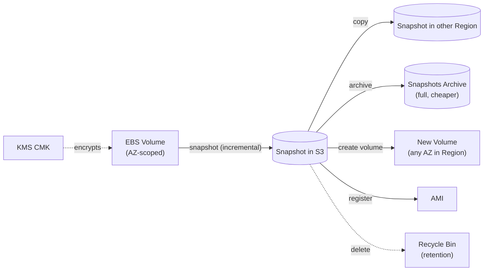

# EBS Snapshots & Encryption - SAA-C03 Deep Dive

> **EBS Snapshots** are incremental point-in-time backups stored in S3, the foundation for backup, migration (cross-AZ/Region/account), and AMIs. **EBS Encryption** uses KMS envelope encryption transparently at rest and in transit. Together they cover most EBS "durability, DR, and at-rest encryption" exam questions.

See also: [01 - EBS Intro & Volume Types](01%20-%20EBS%20Intro%20%26%20Volume%20Types.md) · [03 - EBS Performance & Architecture](03%20-%20EBS%20Performance%20%26%20Architecture.md) · [04 - EBS SRE Troubleshooting & Exam Scenarios](04%20-%20EBS%20SRE%20Troubleshooting%20%26%20Exam%20Scenarios.md) · [01 - EFS Intro & Architecture](01%20-%20EFS%20Intro%20%26%20Architecture.md) · [01 - S3 Intro & Core Concepts](01%20-%20S3%20Intro%20%26%20Core%20Concepts.md)

---

## Table of Contents

- [1. Snapshots in a Sentence](#1-snapshots-in-a-sentence)
- [2. Incremental Snapshots Explained](#2-incremental-snapshots-explained)
- [3. Cross-Region & Cross-Account Copy](#3-cross-region--cross-account-copy)
- [4. EBS Snapshots Archive](#4-ebs-snapshots-archive)
- [5. Recycle Bin for Snapshots](#5-recycle-bin-for-snapshots)
- [6. Fast Snapshot Restore (FSR)](#6-fast-snapshot-restore-fsr)
- [7. Data Lifecycle Manager (DLM)](#7-data-lifecycle-manager-dlm)
- [8. Creating Volumes & AMIs from Snapshots](#8-creating-volumes--amis-from-snapshots)
- [9. EBS Encryption with KMS](#9-ebs-encryption-with-kms)
- [10. Encrypting an Unencrypted Volume](#10-encrypting-an-unencrypted-volume)
- [11. Sharing Encrypted Snapshots](#11-sharing-encrypted-snapshots)
- [12. Exam Tips (SAA-C03)](#12-exam-tips-saa-c03)
- [Summary](#summary)

---



---

## 1. Snapshots in a Sentence

A **snapshot** is a **point-in-time, incremental backup** of an EBS volume, stored durably and redundantly in **Amazon S3** (in an AWS-managed bucket you don't see). Snapshots are **Region-scoped**, not AZ-scoped - so they are the mechanism to move volumes across AZs.

- You can snapshot while the volume is **attached and in use**, but for crash-consistency, ideally **flush/freeze the filesystem** (or detach) for application-consistent backups.
- Snapshots are **chargeable** based on stored (changed) data.

[⬆ Back to top](#table-of-contents)

---

## 2. Incremental Snapshots Explained

Only the **blocks changed since the last snapshot** are saved; unchanged blocks reference earlier snapshots.

- The **first** snapshot copies all used blocks; each subsequent one stores only deltas.
- Deleting an intermediate snapshot is **safe** - AWS retains blocks still needed by later snapshots. You never lose the ability to restore from any remaining snapshot.
- Restores are still **full** - a new volume can be built from any single snapshot regardless of incrementals.

> **Exam trap:** "If I delete snapshot #2, do I lose snapshot #3?" → **No.** Incrementality is internal; each snapshot is independently restorable.

[⬆ Back to top](#table-of-contents)

---

## 3. Cross-Region & Cross-Account Copy

- **Copy a snapshot to another Region** for DR or migration → then create volumes/AMIs there. This is the standard EBS **disaster recovery** answer.
- **Copy/share to another account** for sharing AMIs, migrating workloads.
- During copy you can **re-encrypt** with a different KMS key (including encrypting a previously unencrypted snapshot).
- Cross-Region copy of an encrypted snapshot requires a **KMS key in the destination Region** (keys are Region-scoped, unless using multi-region keys).

[⬆ Back to top](#table-of-contents)

---

## 4. EBS Snapshots Archive

**Snapshots Archive** is a low-cost tier for snapshots you keep for **long-term retention** but rarely restore.

| Aspect        | Standard Snapshot                | Archived Snapshot                       |
| :------------ | :------------------------------- | :-------------------------------------- |
| Storage cost  | Higher (incremental)             | **~75% cheaper** (full snapshot stored) |
| Restore       | Instant (create volume directly) | Must **restore** first (24-72 hrs)      |
| Stored as     | Incremental                      | **Full** snapshot                       |
| Min retention | None                             | **90 days**                             |

> Use for compliance/audit snapshots accessed maybe once a year. Restoring takes **24-72 hours**, so not for active recovery.

[⬆ Back to top](#table-of-contents)

---

## 5. Recycle Bin for Snapshots

**Recycle Bin** protects against accidental deletion of snapshots (and AMIs).

- Define **retention rules** (by tag or all resources) with a retention period (1 day - 1 year).
- Deleted snapshots go to the Recycle Bin instead of being permanently removed; you can **restore** them within the window.
- After the retention period, they are permanently deleted.

> **Exam phrasing:** "Protect against accidental/malicious snapshot deletion" → **Recycle Bin** retention rules.

[⬆ Back to top](#table-of-contents)

---

## 6. Fast Snapshot Restore (FSR)

By default, a volume created from a snapshot is **lazily loaded** - blocks are pulled from S3 on first access, causing **initial latency** (the I/O penalty on first read).

**Fast Snapshot Restore (FSR)** pre-warms a snapshot so volumes created from it deliver **full provisioned performance immediately**, with no first-touch latency.

- Enabled **per snapshot, per AZ**.
- Billed per AZ while enabled (can be expensive across many AZs).
- Use for: AMIs that must boot fleets fast, DR volumes that must perform instantly on failover.

> **Exam phrasing:** "Volumes restored from snapshot have high latency on first use / must perform at full speed immediately" → **enable FSR**.

[⬆ Back to top](#table-of-contents)

---

## 7. Data Lifecycle Manager (DLM)

**DLM** automates the creation, retention, and deletion of EBS snapshots (and AMIs).

- Define **policies** targeting resources by **tags**, with schedules (e.g., daily/weekly) and retention counts/age.
- Can **copy snapshots cross-Region/cross-account** automatically and enable **FSR** as part of a policy.
- Removes the need for custom Lambda/cron backup scripts.

> **Exam phrasing:** "Automate daily EBS backups, retain N copies, no custom scripts" → **Data Lifecycle Manager**. For multi-service backups across the account, consider **[07 - AWS Backup](07%20-%20AWS%20Backup.md)** instead.

[⬆ Back to top](#table-of-contents)

---

## 8. Creating Volumes & AMIs from Snapshots

- **Create a volume from a snapshot** in any AZ of that Region → the canonical way to **move a volume across AZs** or restore data.
- **Register an AMI** from a snapshot of a root volume → reproducible instance launches.
- AMIs reference one or more snapshots (root + data volumes); launching an instance creates fresh volumes from those snapshots.
- Copy an AMI cross-Region to launch instances elsewhere.

[⬆ Back to top](#table-of-contents)

---

## 9. EBS Encryption with KMS

EBS encryption uses **AES-256** with **KMS envelope encryption** (see [20 - KMS & Envelope Encryption](20%20-%20KMS%20%26%20Envelope%20Encryption.md)). It is **transparent** - no application changes.

What gets encrypted:

- Data **at rest** on the volume.
- Data **in transit** between the instance and the volume.
- **All snapshots** created from an encrypted volume (encryption propagates).
- Volumes **created from** an encrypted snapshot.

Key facts:

- Minimal performance impact (handled by Nitro hardware).
- Enable **Encryption by Default** per Region/account → every new volume is encrypted automatically with a default or specified KMS key.
- Each volume gets a unique **data key**, wrapped by your KMS CMK.

> **Exam trap:** Snapshots of an encrypted volume are **always encrypted**; you cannot create an unencrypted volume from an encrypted snapshot.

[⬆ Back to top](#table-of-contents)

---

## 10. Encrypting an Unencrypted Volume

You **cannot encrypt an existing unencrypted volume in place**, nor toggle encryption off once on. The supported flow:

```text
1. Create a snapshot of the unencrypted volume.
2. Copy the snapshot → enable "Encrypt this snapshot" + choose a KMS key.
3. Create a new (encrypted) volume from the encrypted snapshot copy.
4. Detach the old volume, attach the new encrypted volume (or build an AMI).
```

> **Exam phrasing:** "Encrypt an existing unencrypted EBS volume" → **snapshot → copy with encryption enabled → create new volume**. There is no in-place toggle.

[⬆ Back to top](#table-of-contents)

---

## 11. Sharing Encrypted Snapshots

- **Unencrypted** snapshots can be shared publicly or with specific accounts directly.
- **Encrypted** snapshots **cannot be shared publicly**.
- To share an encrypted snapshot with another account you must:
  1. Encrypt it with a **customer managed KMS key** (not the AWS-managed `aws/ebs` key).
  2. Share the **KMS key** with the target account (via key policy/grant).
  3. Share the **snapshot** with that account.
- The receiving account typically **copies** the snapshot and re-encrypts with its own key.

> **Exam trap:** "Cannot share an encrypted snapshot" → it was encrypted with the **default AWS-managed key**, which can't be shared. Re-encrypt with a **customer managed CMK** first.

[⬆ Back to top](#table-of-contents)

---

## 12. Exam Tips (SAA-C03)

- Snapshots are **incremental**, stored in **S3**, **Region-scoped**; deleting one never breaks others.
- **Cross-Region copy** = DR / migration; can re-encrypt during copy.
- **Move volume across AZ** = snapshot → create volume in target AZ.
- **Encrypt existing volume** = snapshot → copy with encryption → new volume (no in-place).
- **Long-term cheap retention** = **Snapshots Archive** (90-day min, 24-72h restore).
- **Accidental deletion protection** = **Recycle Bin**.
- **No first-read latency on restored volumes** = **Fast Snapshot Restore**.
- **Automate snapshot lifecycle** = **Data Lifecycle Manager** (or AWS Backup for multi-service).
- **Share encrypted snapshot to another account** = use a **customer managed KMS key** + share the key.

[⬆ Back to top](#table-of-contents)

---

## Summary

Snapshots are incremental, S3-backed, Region-scoped backups that enable cross-AZ/Region/account migration and AMI creation. Manage them with **Recycle Bin** (deletion protection), **Snapshots Archive** (cheap long-term), **FSR** (instant performance), and **DLM** (automation). EBS encryption is KMS-based, transparent, propagates to snapshots and derived volumes; encrypt an existing volume via snapshot-copy, and share encrypted snapshots only via a customer-managed CMK. Next: [03 - EBS Performance & Architecture](03%20-%20EBS%20Performance%20%26%20Architecture.md).

[⬆ Back to top](#table-of-contents)
