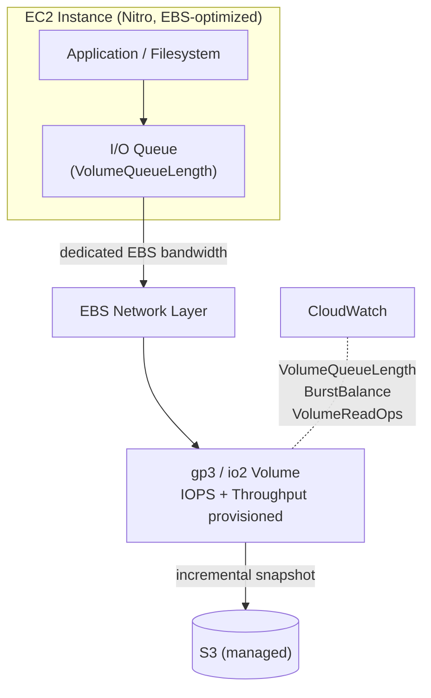
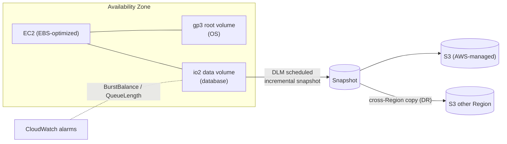

# EBS Performance & Architecture - SAA-C03 Deep Dive

> **EBS performance** comes down to three knobs - **IOPS**, **throughput**, and **instance EBS bandwidth** - plus the elasticity to resize and change type live. This page covers tuning, gp3's independent provisioning, RAID on EBS, Elastic Volumes, and the CloudWatch metrics the exam loves (VolumeQueueLength, BurstBalance).

See also: [01 - EBS Intro & Volume Types](01%20-%20EBS%20Intro%20%26%20Volume%20Types.md) · [02 - EBS Snapshots & Encryption](02%20-%20EBS%20Snapshots%20%26%20Encryption.md) · [04 - EBS SRE Troubleshooting & Exam Scenarios](04%20-%20EBS%20SRE%20Troubleshooting%20%26%20Exam%20Scenarios.md) · [01 - EFS Intro & Architecture](01%20-%20EFS%20Intro%20%26%20Architecture.md) · [01 - S3 Intro & Core Concepts](01%20-%20S3%20Intro%20%26%20Core%20Concepts.md)

---

## Table of Contents

- [1. IOPS vs Throughput](#1-iops-vs-throughput)
- [2. gp3 Independent Provisioning](#2-gp3-independent-provisioning)
- [3. Instance Bandwidth Is the Real Ceiling](#3-instance-bandwidth-is-the-real-ceiling)
- [4. RAID on EBS (0 and 1)](#4-raid-on-ebs-0-and-1)
- [5. Elastic Volumes - Live Resize & Type Change](#5-elastic-volumes---live-resize--type-change)
- [6. Boot vs Data Volumes](#6-boot-vs-data-volumes)
- [7. Monitoring with CloudWatch](#7-monitoring-with-cloudwatch)
- [8. Architecture Diagram](#8-architecture-diagram)
- [9. Performance Tuning Checklist](#9-performance-tuning-checklist)
- [10. Exam Tips (SAA-C03)](#10-exam-tips-saa-c03)
- [Summary](#summary)

---



---

## 1. IOPS vs Throughput

Two independent performance dimensions:

| Metric         | Definition                | Bottleneck for                                     | Unit    |
| :------------- | :------------------------ | :------------------------------------------------- | :------ |
| **IOPS**       | I/O operations per second | Small, random reads/writes (databases, OLTP)       | ops/sec |
| **Throughput** | Bytes moved per second    | Large, sequential I/O (logs, big files, streaming) | MB/s    |

Relationship: `Throughput ≈ IOPS × I/O size`. A workload doing 16,000 IOPS at 64 KiB ≈ 1,000 MB/s. Small block sizes → IOPS-bound; large block sizes → throughput-bound.

> **Exam tip:** "Random small reads, transactional DB" → optimize **IOPS** (gp3/io2). "Streaming large sequential files" → optimize **throughput** (gp3 throughput or st1).

[⬆ Back to top](#table-of-contents)

---

## 2. gp3 Independent Provisioning

gp3's headline advantage over gp2: **IOPS and throughput are decoupled from capacity**.

- Baseline (free): **3,000 IOPS + 125 MB/s** regardless of size.
- Provision **independently**: up to **16,000 IOPS** and **1,000 MB/s**.
- You can have a **small** volume with **high** IOPS (gp2 would force you to over-provision capacity to get IOPS).
- Ratio limit: up to **500 IOPS per GiB**; throughput up to **0.25 MB/s per provisioned IOPS** (max 1,000 MB/s).

> **gp2 → gp3 win:** A team running a 1 TiB gp2 volume just to get 3,000 IOPS can switch to gp3, shrink nothing, and provision exactly the IOPS they need - cheaper. See cost notes in [04 - EBS SRE Troubleshooting & Exam Scenarios](04%20-%20EBS%20SRE%20Troubleshooting%20%26%20Exam%20Scenarios.md).

[⬆ Back to top](#table-of-contents)

---

## 3. Instance Bandwidth Is the Real Ceiling

A volume's provisioned numbers are a **maximum** - you only reach them if the **instance** can push that much EBS traffic.

- Each instance type has a documented **max EBS bandwidth** and **max EBS IOPS**.
- Multiple volumes on one instance **share** that instance-level EBS bandwidth.
- **EBS-optimized** (default on Nitro) gives dedicated bandwidth; small instances cap out early.

> **Exam trap:** "Provisioned 64,000 IOPS on io2 but only seeing 20,000" → the **instance type** is the bottleneck. Use a larger / more EBS-capable instance.

[⬆ Back to top](#table-of-contents)

---

## 4. RAID on EBS (0 and 1)

EBS already replicates within an AZ, but the OS can stripe/mirror multiple EBS volumes for extra performance or redundancy. AWS does **not** recommend RAID 5/6 on EBS (parity write penalty wastes IOPS).

| RAID       | Layout                   | Benefit                               | Trade-off                                     | Use when                                                |
| :--------- | :----------------------- | :------------------------------------ | :-------------------------------------------- | :------------------------------------------------------ |
| **RAID 0** | Striping across volumes  | **More IOPS / throughput** (combined) | No redundancy - one volume failure loses all  | Need performance beyond a single volume's max           |
| **RAID 1** | Mirroring across volumes | **Redundancy** (data on both)         | Doubles cost, no perf gain; writes go to both | Extra fault tolerance beyond EBS's built-in replication |

- **RAID 0** aggregates the IOPS/throughput of N volumes - good before io2 Block Express existed; still useful to exceed single-volume limits.
- **Avoid RAID 5/6** on EBS.

> **Exam tip:** "Maximize EBS performance beyond a single volume" → **RAID 0**. "Maximize fault tolerance" → **RAID 1**. Snapshotting RAID arrays needs application/filesystem coordination for consistency.

[⬆ Back to top](#table-of-contents)

---

## 5. Elastic Volumes - Live Resize & Type Change

**Elastic Volumes** let you modify a volume **with no downtime, no detach, no snapshot/restore**:

- **Increase size** (cannot shrink).
- **Change volume type** (e.g., gp2 → gp3, gp3 → io2).
- **Change provisioned IOPS / throughput** (gp3, io1, io2).

Process:

```bash
# Modify a volume live
aws ec2 modify-volume \
  --volume-id vol-0abc123 \
  --volume-type gp3 \
  --iops 6000 \
  --throughput 250 \
  --size 200
```

Important follow-up: after **increasing size**, you must **extend the filesystem** inside the OS:

```bash
# Linux example after growing the volume
sudo growpart /dev/nvme0n1 1     # grow the partition
sudo resfs/xfs_growfs ...        # ext4: sudo resize2fs ; xfs: sudo xfs_growfs /
```

- A volume can only be modified again after a **cooldown (~6 hours)**.

> **Exam trap:** "Increased EBS volume size but the OS still shows old capacity" → you grew the **volume** but didn't **grow the filesystem/partition**. Covered as a scenario in [04 - EBS SRE Troubleshooting & Exam Scenarios](04%20-%20EBS%20SRE%20Troubleshooting%20%26%20Exam%20Scenarios.md).

[⬆ Back to top](#table-of-contents)

---

## 6. Boot vs Data Volumes

| Aspect         | Boot (root) volume                             | Data volume                            |
| :------------- | :--------------------------------------------- | :------------------------------------- |
| Contains       | OS, `DeleteOnTermination=true` by default      | Application data                       |
| Types allowed  | **SSD only** (gp3, gp2, io1, io2) - **no HDD** | Any (SSD or HDD)                       |
| On termination | Deleted by default (changeable)                | `DeleteOnTermination=false` by default |
| Resize         | Live, but plan FS grow                         | Live, then FS grow                     |

> **Exam trap:** "Use st1/sc1 (HDD) as the root volume" → **invalid**; root must be SSD. Also, root volume is **deleted on termination by default** - flip `DeleteOnTermination` to keep it.

[⬆ Back to top](#table-of-contents)

---

## 7. Monitoring with CloudWatch

Key EBS metrics (per volume):

| Metric                                 | Meaning                                      | Watch for                                                         |
| :------------------------------------- | :------------------------------------------- | :---------------------------------------------------------------- |
| **VolumeQueueLength**                  | Pending I/O requests queued                  | Consistently high → volume saturated / under-provisioned IOPS     |
| **BurstBalance**                       | % of burst credits remaining (gp2, st1, sc1) | Approaching 0 → throttled to baseline → upgrade to gp3 or enlarge |
| **VolumeReadOps / VolumeWriteOps**     | IOPS being served                            | Compare to provisioned limit                                      |
| **VolumeThroughputPercentage**         | % of provisioned IOPS delivered (io1/io2)    | < 100% sustained → instance bottleneck                            |
| **VolumeReadBytes / VolumeWriteBytes** | Throughput                                   | Compare to MB/s limit                                             |
| **VolumeIdleTime**                     | Time with no I/O                             | Idle, possibly deletable volume                                   |

- A good latency proxy: **VolumeQueueLength** vs IOPS. Rising queue length with flat IOPS = saturation.
- **BurstBalance** is the canonical "gp2 ran out of credits" alarm.

> **Exam phrasing:** "Detect when a gp2/st1 volume exhausts its burst capacity" → CloudWatch **BurstBalance** alarm. "Diagnose I/O bottleneck" → **VolumeQueueLength**.

[⬆ Back to top](#table-of-contents)

---

## 8. Architecture Diagram



[⬆ Back to top](#table-of-contents)

---

## 9. Performance Tuning Checklist

- Start with **gp3**; raise IOPS/throughput independently as needed.
- Confirm the **instance** has enough EBS bandwidth (and is EBS-optimized).
- For > single-volume limits, **RAID 0** stripe or move to **io2 Block Express**.
- Pre-initialize restored volumes with **FSR** to avoid first-read latency ([02 - EBS Snapshots & Encryption](02%20-%20EBS%20Snapshots%20%26%20Encryption.md)).
- Match **block size** to workload (large blocks for throughput, small for IOPS).
- Alarm on **BurstBalance** and **VolumeQueueLength**.
- After resizing, **grow the filesystem**.

[⬆ Back to top](#table-of-contents)

---

## 10. Exam Tips (SAA-C03)

- **IOPS** = small random I/O; **throughput** = large sequential I/O.
- **gp3** decouples IOPS/throughput from size - cheaper than over-provisioned gp2.
- Volume max is capped by **instance EBS bandwidth**.
- **RAID 0** for performance, **RAID 1** for redundancy; never RAID 5/6 on EBS.
- **Elastic Volumes**: resize/change type/IOPS live; then **grow the OS filesystem**; ~6h cooldown.
- **Root volume must be SSD** and is deleted on termination by default.
- Metrics: **VolumeQueueLength** (saturation), **BurstBalance** (gp2/st1/sc1 credits).

[⬆ Back to top](#table-of-contents)

---

## Summary

EBS performance balances IOPS, throughput, and instance EBS bandwidth. gp3 provisions IOPS/throughput independently of capacity (3,000/125 free, up to 16,000/1,000). Exceed single-volume limits with RAID 0 or io2 Block Express. Elastic Volumes resize/retype live - but you must grow the filesystem afterward. Monitor VolumeQueueLength and BurstBalance. Root volumes are SSD-only. Next: [04 - EBS SRE Troubleshooting & Exam Scenarios](04%20-%20EBS%20SRE%20Troubleshooting%20%26%20Exam%20Scenarios.md).

[⬆ Back to top](#table-of-contents)
