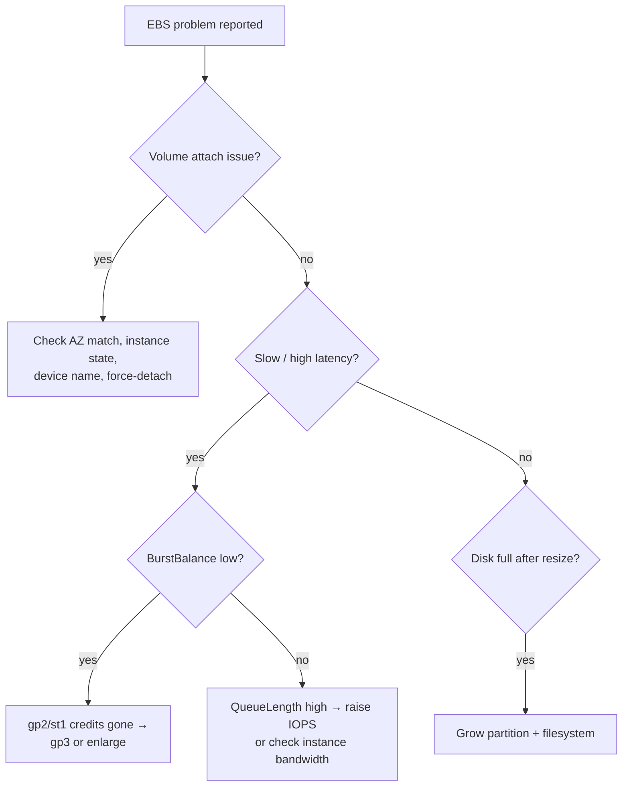

# EBS SRE Troubleshooting & Exam Scenarios - SAA-C03 Deep Dive

> The operational reality of EBS: volumes stuck attaching, mysterious latency, burst balance hitting zero, IOPS throttling, "disk full but I resized it," and the classic cross-AZ mistake. This page is the troubleshooting runbook plus **10-12 scenario questions** with answers, explanations, and exam tips.

See also: [01 - EBS Intro & Volume Types](01%20-%20EBS%20Intro%20%26%20Volume%20Types.md) · [02 - EBS Snapshots & Encryption](02%20-%20EBS%20Snapshots%20%26%20Encryption.md) · [03 - EBS Performance & Architecture](03%20-%20EBS%20Performance%20%26%20Architecture.md) · [01 - EFS Intro & Architecture](01%20-%20EFS%20Intro%20%26%20Architecture.md) · [01 - S3 Intro & Core Concepts](01%20-%20S3%20Intro%20%26%20Core%20Concepts.md)

---

## Table of Contents

- [1. Troubleshooting Runbook](#1-troubleshooting-runbook)
- [2. Volume Stuck in Attaching / Detaching](#2-volume-stuck-in-attaching--detaching)
- [3. High Latency & IOPS Throttling](#3-high-latency--iops-throttling)
- [4. Burst Balance Exhausted](#4-burst-balance-exhausted)
- [5. Full Disk vs Volume Resize (Filesystem Grow)](#5-full-disk-vs-volume-resize-filesystem-grow)
- [6. The Cross-AZ Mistake](#6-the-cross-az-mistake)
- [7. Best Practices](#7-best-practices)
- [8. Cost Optimization](#8-cost-optimization)
- [9. Scenario-Based Exam Questions](#9-scenario-based-exam-questions)
- [10. Exam Tips (SAA-C03)](#10-exam-tips-saa-c03)
- [Summary](#summary)

---



---

## 1. Troubleshooting Runbook

| Symptom                              | Likely cause                                        | Fix                                               |
| :----------------------------------- | :-------------------------------------------------- | :------------------------------------------------ |
| Volume won't attach                  | AZ mismatch, busy device name, instance not running | Match AZ, pick free device, ensure instance state |
| Volume stuck `attaching`/`detaching` | OS holding the device, hung instance                | **Force-detach**, then reattach; reboot if needed |
| High read/write latency              | Under-provisioned IOPS, queue saturation            | Raise IOPS (gp3/io2), check VolumeQueueLength     |
| Intermittent slowness on small gp2   | Burst credits exhausted                             | Switch to gp3 or enlarge gp2                      |
| Throttled below provisioned IOPS     | Instance EBS bandwidth cap                          | Use bigger / EBS-optimized instance               |
| "No space left" after resizing       | Filesystem not grown                                | `growpart` + `resize2fs`/`xfs_growfs`             |
| Can't attach across AZ               | EBS is AZ-scoped                                    | Snapshot → create volume in target AZ             |
| Can't share encrypted snapshot       | AWS-managed key used                                | Re-encrypt with customer managed CMK              |

[⬆ Back to top](#table-of-contents)

---

## 2. Volume Stuck in Attaching / Detaching

- Confirm the **volume and instance are in the same AZ** - the most common cause of "won't attach."
- Ensure the **device name** isn't already in use (e.g., `/dev/sdf`).
- If a volume is **stuck detaching**, the OS may still have it mounted/open; **unmount in the OS first**, then detach. As a last resort use **force-detach** (risks data loss if writes are in flight).
- A hung instance can block detach - **reboot or stop** the instance, then retry.

[⬆ Back to top](#table-of-contents)

---

## 3. High Latency & IOPS Throttling

Diagnose with CloudWatch (see [03 - EBS Performance & Architecture](03%20-%20EBS%20Performance%20%26%20Architecture.md)):

- **VolumeQueueLength** consistently high + IOPS at the provisioned ceiling → the volume is **saturated**; raise provisioned IOPS or stripe with **RAID 0**.
- Delivered IOPS **below** what you provisioned → the **instance** EBS bandwidth is the limit; choose a larger EBS-optimized instance.
- Latency spikes only on **freshly restored** volumes → first-read lazy loading; enable **Fast Snapshot Restore**.

[⬆ Back to top](#table-of-contents)

---

## 4. Burst Balance Exhausted

Applies to **gp2** (small volumes) and **st1/sc1** (HDD throughput credits).

- gp2 < 1,000 GiB has a baseline of `3 × GiB` IOPS and bursts to 3,000 using credits.
- Under sustained load, **credits drain to 0** → throttled to baseline → app feels slow.
- Detect with the **BurstBalance** metric (alarm near 0).
- **Fix:** migrate to **gp3** (3,000 IOPS baseline always-on, no credits) or **grow** the gp2 volume to raise its baseline.

[⬆ Back to top](#table-of-contents)

---

## 5. Full Disk vs Volume Resize (Filesystem Grow)

A frequent operational gotcha:

```text
You: modify-volume from 100 GiB → 200 GiB (succeeds, "optimizing").
OS:  df -h still shows 100 GiB. "No space left on device."
```

The EBS **volume** grew, but the **partition and filesystem** inside the OS did not. Steps:

```bash
lsblk                                   # see new device size vs partition
sudo growpart /dev/nvme0n1 1            # extend the partition
sudo resize2fs /dev/nvme0n1p1           # ext4
# or
sudo xfs_growfs /                       # xfs (mount point)
df -h                                   # now shows full size
```

> **Exam phrasing:** "Increased EBS size but OS shows old capacity / disk full" → **grow the filesystem** (`resize2fs`/`xfs_growfs`), not a new volume.

[⬆ Back to top](#table-of-contents)

---

## 6. The Cross-AZ Mistake

- EBS volumes are **AZ-scoped**; you cannot attach a us-east-1a volume to a us-east-1b instance.
- Migrating an instance to another AZ (or launching a replica there) and expecting the old volume to follow → **fails**.
- **Correct flow:** snapshot the volume → create a new volume **from the snapshot in the target AZ** → attach. To another Region: **copy the snapshot cross-Region** first.

> **Exam trap:** Multi-AZ resilience for block data is **not** native to a single EBS volume. Use snapshots + recreate, or use **[01 - EFS Intro & Architecture](01%20-%20EFS%20Intro%20%26%20Architecture.md)** (multi-AZ file system) when a shared, AZ-resilient filesystem is required.

[⬆ Back to top](#table-of-contents)

---

## 7. Best Practices

- Use **gp3** by default; reserve **io2/io2 Block Express** for high-IOPS, mission-critical DBs.
- **Encrypt** with KMS; enable **Encryption by Default** account-wide.
- Automate backups with **DLM** (or **AWS Backup**), copy snapshots **cross-Region** for DR.
- Protect snapshots/AMIs with **Recycle Bin**.
- Alarm on **BurstBalance** and **VolumeQueueLength**.
- Set `DeleteOnTermination` deliberately (root deletes by default; data volumes don't).
- Test restores - a backup you can't restore isn't a backup.

[⬆ Back to top](#table-of-contents)

---

## 8. Cost Optimization

- **gp2 → gp3 migration**: gp3 is ~**20% cheaper per GiB** and you stop over-provisioning capacity just to buy IOPS. Migrate live with `modify-volume` (no downtime). Common exam "reduce storage cost without performance loss" answer.
- **Delete unattached (`available`) volumes** - they keep billing while detached. Find via **VolumeIdleTime** / unattached state.
- **Delete orphaned snapshots** - old, unneeded snapshots accumulate cost; automate retention with **DLM**.
- **Archive** rarely-restored snapshots to **Snapshots Archive** (~75% cheaper, 90-day min).
- **Right-size IOPS/throughput** on gp3 instead of leaving high io2 provisioning.
- Disable **FSR** when not needed (billed per AZ while enabled).
- Move cold, throughput data to **sc1**; warm throughput to **st1**.

[⬆ Back to top](#table-of-contents)

---

## 9. Scenario-Based Exam Questions

**Q1.** A 100 GiB gp2 volume backing a database slows down only during peak hours. CloudWatch shows BurstBalance dropping to 0%. Cheapest fix?
**Answer:** Switch the volume to **gp3**.
**Why:** gp2 baseline here is 300 IOPS, bursting to 3,000 via credits that exhaust at peak. gp3 gives a flat **3,000 IOPS baseline** with no credits, and is cheaper. Enlarging the gp2 volume also works but costs more for unused capacity.

---

**Q2.** You must attach a volume from `us-east-1a` to an instance in `us-east-1b`. How?
**Answer:** **Snapshot** the volume, **create a new volume from the snapshot in us-east-1b**, then attach.
**Why:** EBS is AZ-scoped; you cannot move a volume across AZs directly.

---

**Q3.** A team needs a shared filesystem mounted read/write by 30 instances across **3 AZs**. Which service?
**Answer:** **Amazon EFS** ([01 - EFS Intro & Architecture](01%20-%20EFS%20Intro%20%26%20Architecture.md)).
**Why:** EBS Multi-Attach is **single-AZ**, **≤16 instances**, and needs a cluster-aware FS. EFS is a managed multi-AZ NFS file system.

---

**Q4.** After increasing an EBS volume from 50 GiB to 100 GiB, the OS still reports 50 GiB and the app gets "disk full." What's wrong?
**Answer:** The **filesystem/partition wasn't extended**. Run `growpart` then `resize2fs`/`xfs_growfs`.
**Why:** Growing the EBS volume doesn't auto-grow the OS filesystem.

---

**Q5.** A mission-critical database needs 99.999% durability and 60,000 IOPS on a single volume. Which type?
**Answer:** **io2** (or **io2 Block Express** for higher limits).
**Why:** io2 offers 99.999% durability and up to 64,000 IOPS; io2 Block Express extends to 256,000 IOPS.

---

**Q6.** You need an existing **unencrypted** EBS volume to become encrypted. Steps?
**Answer:** Snapshot it → **copy the snapshot with encryption enabled** (choose KMS key) → create a new volume from the encrypted copy → attach.
**Why:** There is no in-place encryption toggle for EBS.

---

**Q7.** An io2 volume is provisioned at 64,000 IOPS but the application only achieves ~16,000 IOPS. The volume metrics show it's not saturated. Cause?
**Answer:** The **instance type's EBS bandwidth** is the bottleneck.
**Why:** Volume max is only reachable if the (EBS-optimized) instance supports that throughput/IOPS. Use a larger instance.

---

**Q8.** You want automated daily EBS snapshots, retain the last 7, copy them to a DR Region, with no custom scripts. Which service?
**Answer:** **Data Lifecycle Manager (DLM)**.
**Why:** DLM policies handle scheduling, retention, cross-Region copy, and FSR by tag. (AWS Backup also works for multi-service.)

---

**Q9.** Snapshots restored to new volumes for DR failover suffer high latency on first access until "warmed up." Fix?
**Answer:** Enable **Fast Snapshot Restore (FSR)** on the snapshot in the target AZ(s).
**Why:** FSR pre-initializes blocks so restored volumes deliver full performance immediately.

---

**Q10.** A compliance snapshot must be kept 7 years but is almost never restored. Cheapest option?
**Answer:** **EBS Snapshots Archive**.
**Why:** ~75% cheaper storage; acceptable because restore (24-72h) is rare. 90-day minimum retention applies.

---

**Q11.** You try to share an encrypted snapshot with a partner AWS account but the share fails. Why, and fix?
**Answer:** It's encrypted with the **AWS-managed key**, which can't be shared. Re-encrypt with a **customer managed KMS key**, share the **key** with the account, then share the snapshot.

---

**Q12.** A workload needs lowest-latency, very high IOPS scratch space; data is fully reproducible and need not survive a stop. Cheapest/fastest storage?
**Answer:** **Instance store** (ephemeral NVMe).
**Why:** No need for EBS persistence; instance store gives lowest latency at no extra storage cost. (See [01 - EBS Intro & Volume Types](01%20-%20EBS%20Intro%20%26%20Volume%20Types.md) for the EBS vs instance store comparison.)

[⬆ Back to top](#table-of-contents)

---

## 10. Exam Tips (SAA-C03)

- **Won't attach / stuck** → check **AZ match**, device name, force-detach as last resort.
- **gp2 slow + BurstBalance 0** → **gp3**.
- **Provisioned IOPS not reached** → **instance bandwidth** bottleneck.
- **Disk full after resize** → **grow the filesystem**.
- **Cross-AZ/Region move** → snapshot then recreate (copy cross-Region for DR).
- **Encrypt existing volume** → snapshot → copy w/ encryption → new volume.
- **Share encrypted snapshot** → customer managed CMK.
- **Cheapest IOPS fix / cost cut** → migrate **gp2 → gp3**; delete unattached volumes & orphan snapshots; **archive** cold snapshots.
- **Shared multi-AZ filesystem** → **EFS**, not EBS.

[⬆ Back to top](#table-of-contents)

---

## Summary

Most EBS operational issues map to a handful of root causes: AZ scoping (attach failures, cross-AZ mistakes), credit/IOPS limits (BurstBalance, instance bandwidth), and the resize-vs-filesystem-grow gap. Best practice is gp3 by default, KMS encryption on, DLM/AWS Backup automation, Recycle Bin protection, and CloudWatch alarms. Cost wins come from gp2→gp3 migration, deleting unattached volumes/orphan snapshots, and archiving cold snapshots. Back to start: [01 - EBS Intro & Volume Types](01%20-%20EBS%20Intro%20%26%20Volume%20Types.md).

[⬆ Back to top](#table-of-contents)
