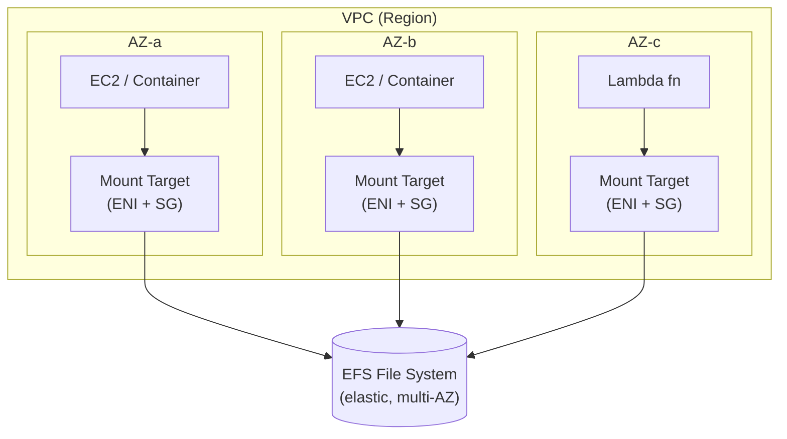

# EFS Intro & Architecture - SAA-C03 Deep Dive

> **Amazon EFS** is a fully managed, elastic **NFS v4.1** file system that many Linux EC2 instances, containers, and Lambda functions can mount and share **concurrently across multiple AZs** — pay only for what you store.

See also: [02 - EFS Performance Storage Classes & Security](02%20-%20EFS%20Performance%20Storage%20Classes%20%26%20Security.md) · [03 - EFS SRE Troubleshooting & Exam Scenarios](03%20-%20EFS%20SRE%20Troubleshooting%20%26%20Exam%20Scenarios.md) · [01 - EBS Intro & Volume Types](01%20-%20EBS%20Intro%20%26%20Volume%20Types.md) · [01 - FSx Intro & Overview](01%20-%20FSx%20Intro%20%26%20Overview.md) · [01 - S3 Intro & Core Concepts](01%20-%20S3%20Intro%20%26%20Core%20Concepts.md)

---

## Table of Contents

- [1. What EFS Is](#1-what-efs-is)
- [2. Regional vs One Zone](#2-regional-vs-one-zone)
- [3. Mount Targets & Security Groups](#3-mount-targets--security-groups)
- [4. Multi-AZ Architecture](#4-multi-az-architecture)
- [5. EFS Access Points](#5-efs-access-points)
- [6. Compute Integrations (EC2 / ECS / EKS / Lambda)](#6-compute-integrations-ec2--ecs--eks--lambda)
- [7. EFS vs EBS vs FSx vs S3](#7-efs-vs-ebs-vs-fsx-vs-s3)
- [8. Exam Tips (SAA-C03)](#8-exam-tips-saa-c03)
- [Summary](#summary)

---



> One **mount target per AZ**; all mount targets front the **same** file system, so every AZ sees the same data.

---

## 1. What EFS Is

- Fully managed, **shared file storage** using **NFS v4.1 / v4.0** protocol.
- **POSIX-compliant** file system semantics: users, groups, permissions, file locking, hierarchical directories.
- **Linux only** — Windows workloads use **Amazon FSx for Windows File Server** (SMB), not EFS.
- **Elastic capacity**: grows and shrinks automatically (to **petabyte scale**); no provisioning of size. **Pay per GB stored** (plus throughput options).
- **Massively concurrent**: thousands of EC2 instances / containers / Lambda functions can mount and read/write the same file system **at the same time**.
- Highly available and durable: data stored **redundantly across multiple AZs** (Standard/Regional class).

> **Key trap:** EBS = one AZ, usually one instance (except io1/io2 Multi-Attach). EFS = multi-AZ, many instances. If a question says "shared file system across instances in multiple AZs," the answer is **EFS**.

[⬆ Back to top](#table-of-contents)

---

## 2. Regional vs One Zone

|                  | **Regional (Standard)**               | **One Zone**                                  |
| :--------------- | :------------------------------------ | :-------------------------------------------- |
| Data redundancy  | Across **multiple AZs** in the Region | Single AZ only                                |
| Availability SLA | **99.99%**                            | 99.90%                                        |
| Durability       | Highest (multi-AZ)                    | Lower — lost if the AZ is destroyed           |
| Cost             | Higher                                | **~47% cheaper** storage                      |
| Use case         | Production, HA workloads              | Dev/test, single-AZ, easily re-creatable data |
| Mount targets    | One per AZ                            | Single mount target in chosen AZ              |

> **One Zone** is a cost-optimization lever. It can still be paired with **IA/Archive** lifecycle classes for further savings, but you sacrifice multi-AZ resilience.

[⬆ Back to top](#table-of-contents)

---

## 3. Mount Targets & Security Groups

- A **mount target** is an **ENI** (elastic network interface) with an IP address that lives **inside a subnet of one AZ**. EC2 instances mount EFS _through_ the mount target in **their own AZ** (lower latency, no cross-AZ data charges).
- Best practice: **one mount target per AZ** that has compute. Instances connect to the mount target via its **DNS name** `fs-xxxx.efs.<region>.amazonaws.com`.
- **NFS uses TCP port 2049.** The mount target's **security group** must allow **inbound 2049** from the instances' security group. The instance's SG must allow **outbound 2049**.
- Mount command (NFS):

```bash
sudo mount -t nfs4 -o nfsvers=4.1,rsize=1048576,wsize=1048576,hard,timeo=600,retrans=2 \
  fs-0123456789abcdef0.efs.us-east-1.amazonaws.com:/ /mnt/efs
```

- Or with the **EFS mount helper** (recommended — handles TLS/IAM):

```bash
sudo mount -t efs -o tls fs-0123456789abcdef0:/ /mnt/efs
```

[⬆ Back to top](#table-of-contents)

---

## 4. Multi-AZ Architecture

- The file system is a **regional resource**; mount targets project it into each AZ.
- An instance in `AZ-a` mounts the `AZ-a` mount target → traffic stays in-AZ (no cross-AZ charge, lowest latency).
- If an AZ fails, instances in surviving AZs keep accessing the same data through their own mount targets — this is the **multi-AZ HA story**.
- Combine with an **Auto Scaling Group spanning AZs** + a load balancer: every instance shares the same `/mnt/efs`, ideal for content management systems, shared web roots, home directories, and shared config.

[⬆ Back to top](#table-of-contents)

---

## 5. EFS Access Points

- **Access points** are application-specific entry points into an EFS file system that **enforce a POSIX user/group and a root directory** for any connection made through them.
- Each access point can:
  - Pin a **root directory** (e.g. `/app1`) so clients are jailed to that subtree.
  - Override the **POSIX user (UID/GID)** so all access uses a fixed identity regardless of the connecting user.
- Great for **multi-tenant** apps and **container** workloads where each service should see only its own directory with a consistent identity.
- Work hand-in-hand with **IAM authorization** (see [02 - EFS Performance Storage Classes & Security](02%20-%20EFS%20Performance%20Storage%20Classes%20%26%20Security.md)) to restrict _which clients_ may use an access point.

[⬆ Back to top](#table-of-contents)

---

## 6. Compute Integrations (EC2 / ECS / EKS / Lambda)

| Service           | How it uses EFS                                                                                                                                       |
| :---------------- | :---------------------------------------------------------------------------------------------------------------------------------------------------- |
| **EC2**           | Mount via NFS / mount helper; shared across instances and AZs.                                                                                        |
| **ECS / Fargate** | EFS **volumes** in the task definition; persistent, shared storage for containers (Fargate supports EFS, not EBS as task storage in the same way).    |
| **EKS**           | **EFS CSI driver** provides `ReadWriteMany` (RWX) PersistentVolumes — multiple pods on different nodes share one volume (EBS CSI is RWO single-node). |
| **Lambda**        | Mount EFS via an **access point** (function must be in the **VPC**); shared state, large dependencies, ML models, `/tmp` overflow.                    |
| **On-prem**       | Access over **Direct Connect** or **VPN** (NFS to mount targets).                                                                                     |

> **EKS trap:** Need **ReadWriteMany** across nodes → **EFS**. EBS is **ReadWriteOnce** (single node).

[⬆ Back to top](#table-of-contents)

---

## 7. EFS vs EBS vs FSx vs S3

| Attribute         | **EFS**                                | **EBS**                                           | **FSx (Windows/Lustre/etc.)**                | **S3**                                      |
| :---------------- | :------------------------------------- | :------------------------------------------------ | :------------------------------------------- | :------------------------------------------ |
| Type              | File (NFS)                             | Block                                             | File (SMB / Lustre / ONTAP / OpenZFS)        | Object                                      |
| Protocol          | NFS v4.1                               | Block device                                      | SMB, Lustre, NFS, iSCSI                      | HTTPS API                                   |
| OS                | **Linux only**                         | Any (attached to instance)                        | **Windows (SMB)** / HPC Linux (Lustre)       | Any (API)                                   |
| Multi-AZ          | **Yes (Regional)**                     | No (single AZ)                                    | Yes (Multi-AZ deployment option)             | Yes (regional)                              |
| Concurrent access | **Thousands of clients**               | 1 (or few w/ io1/io2 Multi-Attach)                | Many (SMB/NFS clients)                       | Unlimited (API)                             |
| Capacity          | Elastic, automatic                     | Provisioned                                       | Provisioned (Lustre scales)                  | Unlimited                                   |
| Use case          | Shared Linux files, web roots, EKS RWX | Single-instance boot/DB volume, low-latency block | Windows shares, AD/SMB, HPC (Lustre), NetApp | Static assets, backups, data lake, archives |

> Decision shortcut: **Shared Linux file system → EFS. Windows/SMB file share → FSx for Windows. HPC/ML high-throughput → FSx for Lustre. Object/static/archive → S3. Single-instance block volume → EBS.**

[⬆ Back to top](#table-of-contents)

---

## 8. Exam Tips (SAA-C03)

- "Shared across **multiple EC2 instances in different AZs**, Linux, POSIX" → **EFS**.
- "**Windows** file share / Active Directory integrated / SMB" → **FSx for Windows**, never EFS.
- NFS / mount failures almost always come down to **port 2049 security group** rules or **DNS** — see [03 - EFS SRE Troubleshooting & Exam Scenarios](03%20-%20EFS%20SRE%20Troubleshooting%20%26%20Exam%20Scenarios.md).
- **Lambda needs shared persistent storage** → EFS via access point (function in VPC).
- **EKS needs RWX volumes** → EFS CSI driver.
- Pay-per-use **elastic** capacity — no need to provision size (contrast with EBS where you size the volume).
- One **mount target per AZ**; instances connect to the mount target in their **own** AZ.

[⬆ Back to top](#table-of-contents)

---

## Summary

- EFS = managed, elastic, **multi-AZ NFS v4.1** file storage for **Linux**, shared concurrently by EC2, ECS/Fargate, EKS (RWX), and Lambda.
- **Mount targets** (one per AZ, an ENI + security group) expose the file system; clients use **port 2049**.
- **Regional** for HA; **One Zone** for cheaper single-AZ data.
- **Access points** enforce POSIX identity + root directory per application/tenant.
- Choose EFS for shared Linux files; EBS for single-instance block; FSx for Windows/HPC; S3 for objects.

[⬆ Back to top](#table-of-contents)
