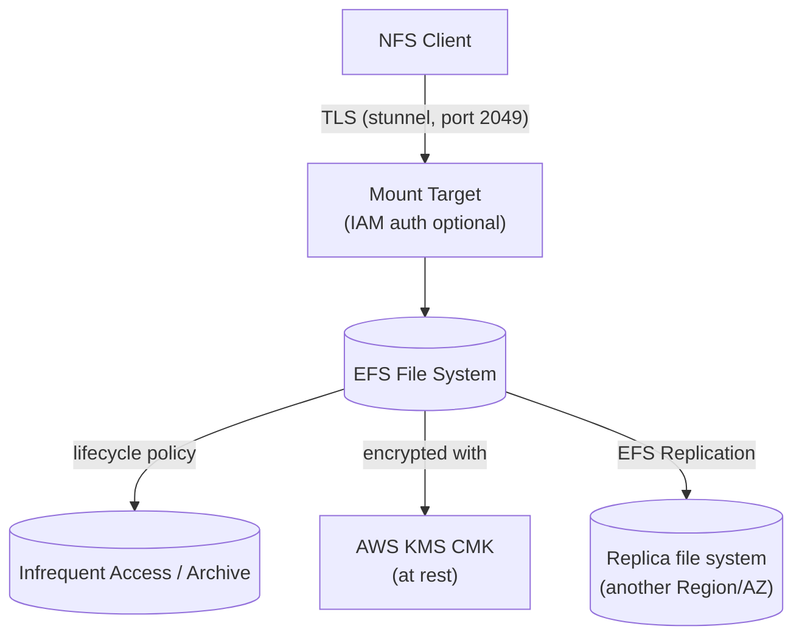

# EFS Performance Storage Classes & Security - SAA-C03 Deep Dive

> EFS tuning is three independent dials — **performance mode**, **throughput mode**, and **storage class/lifecycle** — wrapped in **KMS encryption at rest**, **TLS in transit**, and **IAM + access point** authorization, with **EFS Replication** for DR.

See also: [01 - EFS Intro & Architecture](01%20-%20EFS%20Intro%20%26%20Architecture.md) · [03 - EFS SRE Troubleshooting & Exam Scenarios](03%20-%20EFS%20SRE%20Troubleshooting%20%26%20Exam%20Scenarios.md) · [01 - EBS Intro & Volume Types](01%20-%20EBS%20Intro%20%26%20Volume%20Types.md) · [01 - FSx Intro & Overview](01%20-%20FSx%20Intro%20%26%20Overview.md) · [01 - S3 Intro & Core Concepts](01%20-%20S3%20Intro%20%26%20Core%20Concepts.md)

---

## Table of Contents

- [1. Performance Modes](#1-performance-modes)
- [2. Throughput Modes](#2-throughput-modes)
- [3. Storage Classes](#3-storage-classes)
- [4. Lifecycle Management](#4-lifecycle-management)
- [5. Encryption at Rest (KMS)](#5-encryption-at-rest-kms)
- [6. Encryption in Transit (TLS / stunnel)](#6-encryption-in-transit-tls--stunnel)
- [7. IAM Authorization & Access Points](#7-iam-authorization--access-points)
- [8. EFS Replication](#8-efs-replication)
- [9. Exam Tips (SAA-C03)](#9-exam-tips-saa-c03)
- [Summary](#summary)

---



---

## 1. Performance Modes

| Mode                          | Description                                                                                                 | When to use                                                                                      |
| :---------------------------- | :---------------------------------------------------------------------------------------------------------- | :----------------------------------------------------------------------------------------------- |
| **General Purpose** (default) | **Lowest latency** per operation; recommended for the vast majority of workloads.                           | Web serving, CMS, home dirs, dev, most apps.                                                     |
| **Max I/O**                   | Scales to **higher aggregate throughput & IOPS**, at the cost of **slightly higher latency** per operation. | Massively parallel: big data, media processing, large-scale analytics with thousands of clients. |

> **Set at creation; cannot be changed later.** AWS now generally steers you to **General Purpose + Elastic throughput**, which scales without Max I/O's latency penalty. On exams, "thousands of clients needing max aggregate throughput" historically maps to **Max I/O**.

[⬆ Back to top](#table-of-contents)

---

## 2. Throughput Modes

| Mode                           | Behavior                                                                                                         | Billing                            | Use case                                                                               |
| :----------------------------- | :--------------------------------------------------------------------------------------------------------------- | :--------------------------------- | :------------------------------------------------------------------------------------- |
| **Bursting** (classic default) | Throughput **scales with file system size** (more data stored = higher baseline), with burst credits for spikes. | Included with storage              | General workloads where throughput tracks size.                                        |
| **Elastic** (recommended)      | Automatically scales throughput **up and down with demand**; no provisioning, no credits.                        | **Pay per actual throughput used** | Spiky/unpredictable traffic; the modern default.                                       |
| **Provisioned**                | You **set a fixed throughput** independent of storage size.                                                      | Pay for provisioned level          | Need high throughput on a **small** file system (size would otherwise limit Bursting). |

> **Trap:** Small file system but needs lots of throughput, and Bursting credits run out → use **Provisioned** (or **Elastic**). Unpredictable spikes → **Elastic**.

[⬆ Back to top](#table-of-contents)

---

## 3. Storage Classes

| Storage class       | Latency                    | Cost                       | Notes                                                           |
| :------------------ | :------------------------- | :------------------------- | :-------------------------------------------------------------- |
| **EFS Standard**    | Lowest (ms)                | Highest                    | Frequently accessed data; multi-AZ.                             |
| **EFS Standard–IA** | Slightly higher first-byte | ~Up to 92% cheaper storage | Infrequent Access; small per-GB **retrieval fee**.              |
| **EFS Archive**     | Higher first-byte          | Cheapest                   | Rarely accessed (a few times/year); lowest cost regional class. |
| **EFS One Zone**    | Lowest (single AZ)         | Cheaper than Standard      | Single-AZ; less resilient.                                      |
| **EFS One Zone–IA** | Slightly higher            | Cheapest single-AZ         | One Zone + IA combined.                                         |

> IA and Archive charge **per-GB retrieval** but slash storage cost. Files **transparently move back** to a frequent-access tier on access if configured.

[⬆ Back to top](#table-of-contents)

---

## 4. Lifecycle Management

EFS **Lifecycle Management** automatically moves files between access tiers based on **last access time** — analogous to S3 Lifecycle but for file storage.

| Policy setting                           | What it does                                                                   |
| :--------------------------------------- | :----------------------------------------------------------------------------- |
| **Transition into IA**                   | Move files not accessed for _N_ days (1, 7, 14, 30, 60, 90) to **IA**.         |
| **Transition into Archive**              | Move files not accessed for a longer period (e.g. 90–365 days) to **Archive**. |
| **Transition into Standard (on access)** | Optionally bring a file back to Standard the next time it's read.              |

```json
{
  "TransitionToIA": "AFTER_30_DAYS",
  "TransitionToArchive": "AFTER_90_DAYS",
  "TransitionToPrimaryStorageClass": "AFTER_1_ACCESS"
}
```

> **Cost optimization on the exam:** "Most files rarely accessed, want to cut EFS cost without managing it" → enable **Lifecycle Management** to tier into **IA / Archive**. Metadata operations and `ls` listings do **not** count as access (so cold files stay cold).

[⬆ Back to top](#table-of-contents)

---

## 5. Encryption at Rest (KMS)

- Enable **encryption at rest at file-system creation** — it **cannot be enabled on an existing unencrypted file system** (you'd create a new encrypted FS and copy data, e.g. via DataSync).
- Uses **AWS KMS** — an AWS-managed key (`aws/elasticfilesystem`) or a **customer-managed CMK** for control over rotation, policy, and audit (CloudTrail).
- Encrypts data and metadata transparently; negligible performance impact.

> **Trap:** Compliance requires encryption at rest but the FS is already created unencrypted → you must **create a new encrypted EFS and migrate** the data; you cannot toggle it in place.

[⬆ Back to top](#table-of-contents)

---

## 6. Encryption in Transit (TLS / stunnel)

- **In-transit encryption is opt-in per mount** using the **EFS mount helper** with the `-o tls` flag; the helper sets up a local **stunnel** that wraps NFS traffic in **TLS**.

```bash
sudo mount -t efs -o tls fs-0123456789abcdef0:/ /mnt/efs
```

- For **IAM authorization** combine flags: `-o tls,iam` (TLS is required for IAM auth).
- Plain `mount -t nfs4 ...` is **unencrypted in transit** — use the helper when encryption is required.

[⬆ Back to top](#table-of-contents)

---

## 7. IAM Authorization & Access Points

Two layers of access control protect EFS data:

1. **Network layer** — security groups on mount targets (port **2049**) decide who can reach the file system.
2. **Authorization layer:**
   - **POSIX permissions** (UID/GID, mode bits) — classic file permissions enforced by NFS.
   - **IAM identity-based / EFS file system policies** — control _which IAM principals_ may mount, read, or write (`elasticfilesystem:ClientMount`, `ClientWrite`, `ClientRootAccess`). Mount with `-o iam` (requires TLS).
   - **EFS file system resource policy** — attach a policy to the FS to, e.g., **enforce encryption in transit** or deny anonymous access.
   - **Access points** — enforce a fixed **POSIX user** and **root directory**, restricting an app/tenant to its subtree.

```json
{
  "Version": "2012-10-17",
  "Statement": [
    {
      "Effect": "Deny",
      "Principal": { "AWS": "*" },
      "Action": "*",
      "Resource": "*",
      "Condition": { "Bool": { "aws:SecureTransport": "false" } }
    }
  ]
}
```

> **Permission denied** can come from **POSIX** (wrong UID/GID) **or** from **IAM** (no `ClientWrite`). The exam often tests distinguishing the two — see [03 - EFS SRE Troubleshooting & Exam Scenarios](03%20-%20EFS%20SRE%20Troubleshooting%20%26%20Exam%20Scenarios.md).

[⬆ Back to top](#table-of-contents)

---

## 8. EFS Replication

- **EFS Replication** creates and keeps a **read-only replica** file system, replicating **continuously** to another **Region** (cross-region DR) or another AZ.
- Provides an **RPO and RTO of minutes** for disaster recovery, fully managed (no DataSync scripting needed for ongoing sync).
- The destination FS is **read-only** while replication is active; you **fail over** by deleting the replication configuration, which makes the replica writable.
- Use **AWS DataSync** instead when you need a **one-time / scheduled** migration, on-prem ↔ EFS transfer, or copies between EFS and S3/FSx.

| Tool                | Purpose                                                          |
| :------------------ | :--------------------------------------------------------------- |
| **EFS Replication** | Continuous, managed DR replica (cross-Region/AZ).                |
| **AWS DataSync**    | One-time/scheduled bulk transfers (on-prem ↔ EFS, EFS ↔ S3/FSx). |
| **AWS Backup**      | Scheduled, policy-based backups of EFS (point-in-time restore).  |

[⬆ Back to top](#table-of-contents)

---

## 9. Exam Tips (SAA-C03)

- **Most workloads:** General Purpose performance + **Elastic** throughput.
- **Small FS, high throughput** needed → **Provisioned** throughput.
- **Cut cost on cold data** → **Lifecycle Management** into **IA / Archive** (and/or **One Zone**).
- Encryption at rest = **KMS**, must be set **at creation**; in transit = **TLS via mount helper** (`-o tls`).
- **IAM auth** requires TLS (`-o tls,iam`); use a **file system policy** to **enforce `aws:SecureTransport`**.
- **Cross-region DR** for EFS → **EFS Replication** (continuous, read-only replica). **Bulk/one-time copy** → **DataSync**.

[⬆ Back to top](#table-of-contents)

---

## Summary

- Three dials: **performance mode** (General Purpose vs Max I/O — set at creation), **throughput mode** (Bursting / **Elastic** / Provisioned), and **storage class + lifecycle** (Standard, IA, Archive, One Zone variants).
- **Lifecycle Management** auto-tiers cold files into IA/Archive for big savings.
- Security: **KMS at rest** (set at creation), **TLS in transit** via mount helper, **IAM + POSIX + file system policy + access points** for authorization.
- **EFS Replication** = managed continuous DR replica; **DataSync** = bulk transfer; **AWS Backup** = scheduled backups.

[⬆ Back to top](#table-of-contents)
