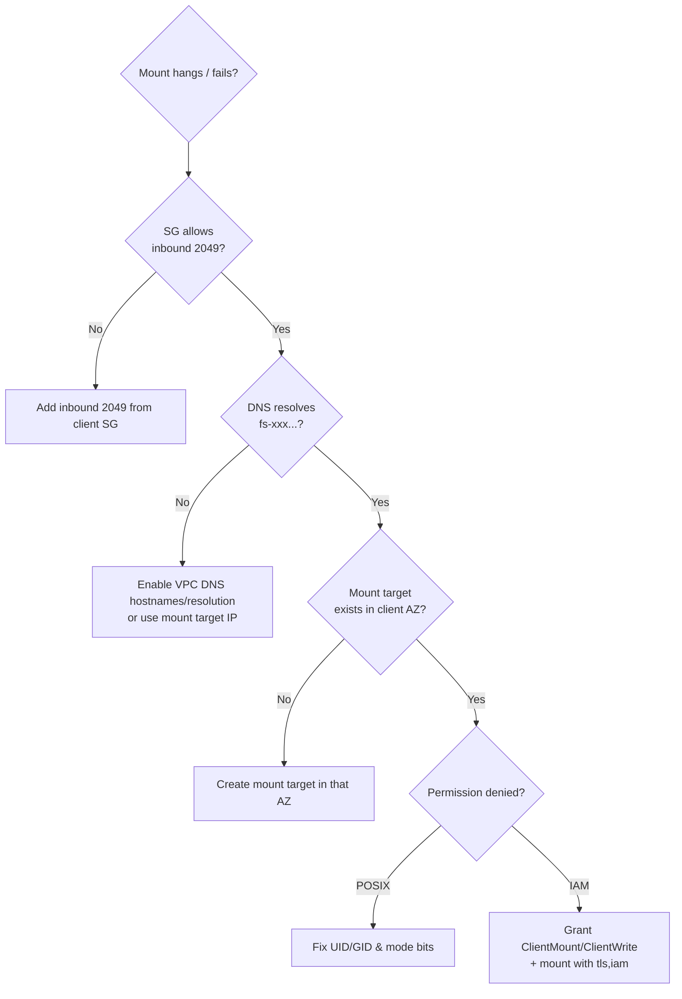

# EFS SRE Troubleshooting & Exam Scenarios - SAA-C03 Deep Dive

> The EFS failure surface is small and predictable: **port 2049 security groups**, **DNS resolution**, **POSIX vs IAM permission denied**, and **throughput throttling** — master these plus the EFS-vs-EBS-vs-FSx-vs-S3 decision tree and the scenario questions take care of themselves.

See also: [01 - EFS Intro & Architecture](01%20-%20EFS%20Intro%20%26%20Architecture.md) · [02 - EFS Performance Storage Classes & Security](02%20-%20EFS%20Performance%20Storage%20Classes%20%26%20Security.md) · [01 - EBS Intro & Volume Types](01%20-%20EBS%20Intro%20%26%20Volume%20Types.md) · [01 - FSx Intro & Overview](01%20-%20FSx%20Intro%20%26%20Overview.md) · [01 - S3 Intro & Core Concepts](01%20-%20S3%20Intro%20%26%20Core%20Concepts.md)

---

## Table of Contents

- [1. Mount Failure Troubleshooting](#1-mount-failure-troubleshooting)
- [2. Permission Denied — POSIX vs IAM](#2-permission-denied--posix-vs-iam)
- [3. Throughput & Performance Throttling](#3-throughput--performance-throttling)
- [4. Cross-Region & DR Pitfalls](#4-cross-region--dr-pitfalls)
- [5. Best Practices](#5-best-practices)
- [6. Cost Optimization](#6-cost-optimization)
- [7. Scenario-Based Exam Questions](#7-scenario-based-exam-questions)
- [8. Decision Cheat Sheet](#8-decision-cheat-sheet)
- [Summary](#summary)

---

---

## 1. Mount Failure Troubleshooting

| Symptom                                    | Likely cause                                                                           | Fix                                                                                                   |
| :----------------------------------------- | :------------------------------------------------------------------------------------- | :---------------------------------------------------------------------------------------------------- |
| `mount.nfs4: Connection timed out` / hangs | **Security group** not allowing **inbound TCP 2049** from the client's SG              | Add inbound 2049 on the mount target SG; ensure client SG allows outbound 2049.                       |
| `Failed to resolve "fs-xxxx.efs...."`      | VPC **DNS resolution / DNS hostnames** disabled, or using EFS DNS from outside the VPC | Enable **`enableDnsSupport` + `enableDnsHostnames`** on the VPC; on-prem use the **mount target IP**. |
| `mount.nfs4: No route to host`             | No **mount target in the client's AZ**, or wrong subnet/route table                    | Create a mount target in that AZ; verify routing.                                                     |
| Mount works but `-o tls` fails             | **`amazon-efs-utils`** (mount helper / stunnel) not installed                          | `sudo yum install -y amazon-efs-utils` (or `apt`).                                                    |
| On-prem mount fails                        | NFS port **2049** not open over **Direct Connect / VPN**, or DNS unreachable           | Open 2049 across the link; use mount target IP; ensure route.                                         |

> **#1 exam answer for "EC2 can't mount EFS / connection times out": the security group is missing inbound NFS port 2049.**

[⬆ Back to top](#table-of-contents)

---

## 2. Permission Denied — POSIX vs IAM

Two distinct sources of `Permission denied` — diagnose which layer:

- **POSIX layer:** the file/dir mode bits and ownership (UID/GID) don't permit the operation. Common when an **access point** pins a UID/GID that doesn't own the target directory, or the root dir wasn't created with the right ownership. Fix ownership/mode or the access point's POSIX settings.
- **IAM layer:** mounted with `-o iam` but the instance role lacks `elasticfilesystem:ClientWrite` / `ClientMount` / `ClientRootAccess`, or the **file system policy** denies it (e.g. requires `aws:SecureTransport=true` and you mounted without TLS). Fix the IAM policy / FS policy / add `tls`.

> Quick tell: if it fails **at mount time** → usually IAM/SG/TLS. If it mounts fine but **writes fail** → usually POSIX ownership or missing `ClientWrite`.

[⬆ Back to top](#table-of-contents)

---

## 3. Throughput & Performance Throttling

- **Bursting mode** uses **burst credits** that accrue with stored data. A **small file system** earning few credits can **exhaust them** under sustained load → throughput drops to a low baseline (throttling).
  - **Fix:** switch to **Elastic** (scales automatically) or **Provisioned** throughput. Watch `BurstCreditBalance` and `PermittedThroughput` in CloudWatch.
- **High latency per op** on **Max I/O** is expected — if latency-sensitive, use **General Purpose**. Monitor `PercentIOLimit` (near 100% on General Purpose means consider Max I/O / Elastic).
- **Single-client throughput** is limited; EFS shines on **aggregate parallel** throughput. A single-threaded workload may underperform — parallelize.
- Key CloudWatch metrics: `BurstCreditBalance`, `PermittedThroughput`, `MeteredIOBytes`, `PercentIOLimit`, `ClientConnections`.

[⬆ Back to top](#table-of-contents)

---

## 4. Cross-Region & DR Pitfalls

- EFS is **regional** — you **cannot mount** a file system from another Region directly. For another Region, use **EFS Replication** (continuous read-only replica) and fail over by deleting the replication config.
- Replica is **read-only** until you promote it (delete replication configuration) — apps writing to a replica will fail.
- **Encryption can't be enabled in place** — DR/migration to an encrypted FS means **create new + copy** (DataSync) or use Replication to an encrypted destination.
- On-prem access needs **mount target IP** (DNS often won't resolve over DX/VPN) and **2049** open on the link.

[⬆ Back to top](#table-of-contents)

---

## 5. Best Practices

- Use the **EFS mount helper** (`amazon-efs-utils`) with `-o tls` (and `iam` where appropriate) instead of raw `nfs4`.
- One **mount target per AZ**; let instances mount the target in **their own AZ** to avoid cross-AZ latency/cost.
- Prefer **General Purpose + Elastic throughput** as the modern default.
- Use **access points** to isolate apps/tenants (root dir + POSIX identity).
- Enable **encryption at rest at creation**; enforce **in-transit** encryption via an FS policy (`aws:SecureTransport`).
- Use **Lifecycle Management** for cold data; back up with **AWS Backup**.
- Auto-mount on boot via `/etc/fstab` (with the `_netdev` option) so reboots re-mount EFS.
- Monitor `BurstCreditBalance` / `PercentIOLimit` with CloudWatch alarms.

[⬆ Back to top](#table-of-contents)

---

## 6. Cost Optimization

| Lever                              | Saving                                                                                           |
| :--------------------------------- | :----------------------------------------------------------------------------------------------- |
| **Lifecycle Management → IA**      | Up to ~92% off storage for files not accessed in _N_ days.                                       |
| **Lifecycle Management → Archive** | Lowest regional storage cost for rarely accessed data.                                           |
| **One Zone (and One Zone–IA)**     | Cheaper single-AZ storage when multi-AZ resilience isn't required (dev/test, re-creatable data). |
| **Elastic throughput**             | Pay only for throughput used vs over-provisioning.                                               |
| **Delete stale data / right-size** | EFS bills per GB; lifecycle + cleanup compound savings.                                          |
| **Use S3 for truly cold archives** | If data doesn't need file semantics, S3 Glacier is cheaper than EFS Archive.                     |

> Remember IA/Archive have **per-GB retrieval fees** — great for cold data, not for frequently re-read data.

[⬆ Back to top](#table-of-contents)

---

## 7. Scenario-Based Exam Questions

**Q1.** A fleet of Linux EC2 instances across **3 AZs**, behind an ALB, must read/write a **shared** file set with **POSIX** semantics. Which storage?
**A.** **Amazon EFS (Regional).** Multi-AZ shared NFS for Linux. EBS can't be shared multi-AZ; S3 isn't POSIX/file. _(Trap: EBS Multi-Attach is single-AZ only.)_

---

**Q2.** After launching new instances, `mount` to EFS **times out**. What's the most likely cause?
**A.** The **mount target's security group doesn't allow inbound TCP 2049** from the instances' SG. Add the rule.

---

**Q3.** A **Windows** application needs an **SMB** file share integrated with **Active Directory**. EFS?
**A.** **No — use FSx for Windows File Server.** EFS is **Linux/NFS only**.

---

**Q4.** A **small** EFS file system on **Bursting** throughput throttles under sustained load. Fix?
**A.** Switch to **Elastic** or **Provisioned** throughput; small FS earns too few burst credits.

---

**Q5.** Compliance requires **encryption in transit** for all EFS traffic, enforced centrally. How?
**A.** Mount with the **EFS mount helper `-o tls`**, and attach an **EFS file system policy** denying access when `aws:SecureTransport=false`.

---

**Q6.** Multiple **Kubernetes pods on different EKS nodes** must share one volume **ReadWriteMany**. Solution?
**A.** **EFS via the EFS CSI driver** (RWX). EBS CSI is **ReadWriteOnce** (single node).

---

**Q7.** A **Lambda** function needs **persistent shared storage** for large ML models across invocations. Option?
**A.** Mount **EFS through an access point** (function deployed in the **VPC**).

---

**Q8.** Most files on an EFS share are **rarely accessed**; reduce cost without manual effort.
**A.** Enable **Lifecycle Management** to transition cold files to **IA / Archive** (consider **One Zone** if single-AZ acceptable).

---

**Q9.** A team needs an EFS file system **replicated to another Region** for DR with **minutes-level RPO**, fully managed.
**A.** **EFS Replication** (continuous read-only cross-Region replica). For one-time/scheduled bulk copies use **DataSync**.

---

**Q10.** An existing **unencrypted** EFS must become **encrypted at rest** for compliance.
**A.** You **cannot enable it in place** — create a **new encrypted** file system (KMS) and **migrate** the data (e.g. **DataSync** or EFS Replication to an encrypted target).

[⬆ Back to top](#table-of-contents)

---

## 8. Decision Cheat Sheet

| Requirement                                          | Choose                          |
| :--------------------------------------------------- | :------------------------------ |
| Shared Linux file system, multi-AZ, POSIX            | **EFS**                         |
| Single-instance low-latency block volume / boot disk | **EBS**                         |
| Windows / SMB / Active Directory file share          | **FSx for Windows File Server** |
| HPC / ML high-throughput scratch over S3             | **FSx for Lustre**              |
| Object storage, static assets, backups, data lake    | **S3**                          |
| RWX shared volume for EKS pods                       | **EFS (CSI)**                   |
| Shared persistent storage for Lambda                 | **EFS access point (VPC)**      |
| Continuous cross-Region DR for a file system         | **EFS Replication**             |

[⬆ Back to top](#table-of-contents)

---

## Summary

- Mount problems are almost always **SG port 2049**, **DNS resolution**, or **no mount target in the AZ**.
- `Permission denied` splits into **POSIX** (UID/GID/mode) vs **IAM** (`ClientMount/ClientWrite`, FS policy, missing TLS).
- Throttling on **Bursting** → move to **Elastic/Provisioned**; watch `BurstCreditBalance` & `PercentIOLimit`.
- Cost levers: **Lifecycle → IA/Archive**, **One Zone**, **Elastic throughput**.
- Decision: **EFS** = shared Linux files; **EBS** = single-instance block; **FSx** = Windows/HPC; **S3** = objects.

[⬆ Back to top](#table-of-contents)
