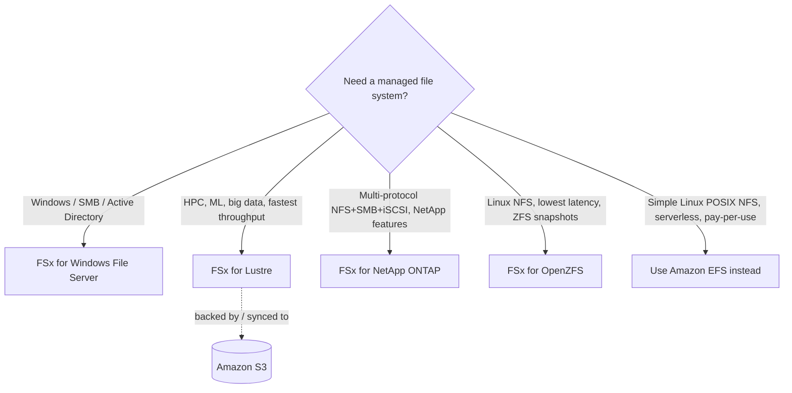

# Amazon FSx Intro & Overview - SAA-C03 Deep Dive

> **Amazon FSx** is a family of **fully managed, third-party file systems** on AWS. Instead of running your own Windows file server, Lustre cluster, NetApp filer, or ZFS box on EC2, you launch a managed FSx file system. There are **four** flavours: **Windows File Server**, **Lustre**, **NetApp ONTAP**, and **OpenZFS** - knowing _which one to pick_ is the single highest-value FSx skill on the exam.

See also: [02 - FSx for Windows File Server](02%20-%20FSx%20for%20Windows%20File%20Server.md) · [03 - FSx for Lustre](03%20-%20FSx%20for%20Lustre.md) · [04 - FSx for NetApp ONTAP & OpenZFS](04%20-%20FSx%20for%20NetApp%20ONTAP%20%26%20OpenZFS.md) · [05 - FSx SRE Troubleshooting & Exam Scenarios](05%20-%20FSx%20SRE%20Troubleshooting%20%26%20Exam%20Scenarios.md) · [01 - EFS Intro & Architecture](01%20-%20EFS%20Intro%20%26%20Architecture.md) · [01 - EBS Intro & Volume Types](01%20-%20EBS%20Intro%20%26%20Volume%20Types.md) · [01 - S3 Intro & Core Concepts](01%20-%20S3%20Intro%20%26%20Core%20Concepts.md)

---

## Table of Contents

- [1. What Amazon FSx Is](#1-what-amazon-fsx-is)
- [2. The Four FSx Types at a Glance](#2-the-four-fsx-types-at-a-glance)
- [3. Master Comparison Table](#3-master-comparison-table)
- [4. EFS vs FSx vs EBS vs S3](#4-efs-vs-fsx-vs-ebs-vs-s3)
- [5. Decision Guidance - When to Pick Which](#5-decision-guidance---when-to-pick-which)
- [6. Common Concepts Across All FSx](#6-common-concepts-across-all-fsx)
- [7. Exam Tips (SAA-C03)](#7-exam-tips-saa-c03)
- [Summary](#summary)

---

---

## 1. What Amazon FSx Is

Amazon FSx lets you launch **industry-standard file systems** without managing the underlying hardware, OS patching, or replication.

| Property      | Detail                                                                                   |
| :------------ | :--------------------------------------------------------------------------------------- |
| Storage model | **File** (shared file system), not object (S3) or single-attach block (EBS)              |
| Management    | Fully managed: provisioning, patching, backups, failover handled by AWS                  |
| Access        | Over the network via **SMB**, **NFS**, **Lustre client**, or **iSCSI** depending on type |
| Scope         | Lives in a **VPC**; mounted by EC2, on-prem (via Direct Connect/VPN), containers         |
| Backups       | Automatic + manual, integrated with [AWS Backup](AWS%20Backup.md) (most types)                          |

> 🎯 **Exam framing:** FSx = "I need a _specific, full-featured_ file system (Windows shares, Lustre HPC, NetApp/ZFS features)." If the question just says "shared POSIX Linux file system, serverless, auto-scaling" -> that's **EFS**, not FSx.

[⬆ Back to top](#table-of-contents)

---

## 2. The Four FSx Types at a Glance

- **FSx for Windows File Server** - native Windows shares over **SMB**, integrates with **Active Directory**, NTFS permissions, DFS, shadow copies. For Windows-based apps.
- **FSx for Lustre** - **massively parallel, high-throughput** file system for **HPC, machine learning, video processing, financial modelling**. Deeply integrated with **S3**.
- **FSx for NetApp ONTAP** - runs **NetApp ONTAP** (the storage OS). **Multi-protocol** (NFS, SMB, iSCSI), with snapshots, SnapMirror replication, FlexClone, dedup/compression, and tiering. Ideal for **lift-and-shift of existing NetApp workloads**.
- **FSx for OpenZFS** - runs the **OpenZFS** file system over **NFS**. **Very low latency**, in-place compression, ZFS snapshots/clones. Great for moving **on-prem ZFS / Linux NAS** workloads to AWS.

[⬆ Back to top](#table-of-contents)

---

## 3. Master Comparison Table

| Feature                 | Windows File Server                         | Lustre                                            | NetApp ONTAP                                | OpenZFS                                |
| :---------------------- | :------------------------------------------ | :------------------------------------------------ | :------------------------------------------ | :------------------------------------- |
| **Protocol**            | SMB                                         | Lustre (POSIX)                                    | **NFS + SMB + iSCSI** (multi)               | NFS (v3/v4/v4.1/v4.2)                  |
| **Client OS**           | Windows (also Linux/macOS via SMB)          | Linux                                             | Linux, Windows, macOS                       | Linux, Windows, macOS                  |
| **Primary use case**    | Windows apps, home dirs, SharePoint         | HPC, ML, analytics, media                         | Multi-protocol, NetApp lift-and-shift       | Linux NAS / ZFS migration, low latency |
| **Multi-AZ**            | ✅ Yes (single or multi-AZ)                 | ⚠️ Persistent: single-AZ only (Multi-AZ for some) | ✅ Yes (single or multi-AZ)                 | ✅ Yes (single or multi-AZ)            |
| **AD integration**      | ✅ Required (Managed MS AD or self-managed) | ❌                                                | ✅ (for SMB access)                         | ❌ (POSIX)                             |
| **S3 integration**      | ❌                                          | ✅ **Native** (lazy load + export)                | ⚠️ via tiering to capacity pool             | ❌                                     |
| **Storage tiers**       | SSD / HDD                                   | SSD / HDD (scratch & persistent)                  | SSD primary + **capacity pool (S3-backed)** | SSD                                    |
| **Snapshots / clones**  | Shadow copies                               | —                                                 | Snapshots, **SnapMirror**, **FlexClone**    | ZFS snapshots & clones                 |
| **Dedup / compression** | Dedup                                       | —                                                 | **Dedup + compression**                     | In-place compression                   |
| **Backed by**           | Native Windows FS                           | Lustre                                            | NetApp ONTAP                                | OpenZFS                                |

[⬆ Back to top](#table-of-contents)

---

## 4. EFS vs FSx vs EBS vs S3

| Service                                           | Storage type            | Access                               | Best for                                                  |
| :------------------------------------------------ | :---------------------- | :----------------------------------- | :-------------------------------------------------------- |
| **[Amazon S3](01%20-%20S3%20Intro%20%26%20Core%20Concepts.md)**  | Object                  | HTTPS/API                            | Unstructured data, data lakes, backups, static sites      |
| **[Amazon EBS](01%20-%20EBS%20Intro%20%26%20Volume%20Types.md)** | Block (single-attach\*) | Attached to **one** EC2 (AZ-locked)  | Boot volumes, single-instance databases                   |
| **[Amazon EFS](01%20-%20EFS%20Intro%20%26%20Architecture.md)** | File (NFS)              | Many Linux EC2, multi-AZ, serverless | Shared **Linux** POSIX storage, auto-scaling, pay-per-use |
| **FSx for Windows**                               | File (SMB)              | Many Windows EC2                     | **Windows** shares with AD/NTFS                           |
| **FSx for Lustre**                                | File (Lustre)           | Many Linux EC2                       | **Extreme performance** HPC/ML, S3-linked                 |
| **FSx for ONTAP**                                 | File (multi)            | Linux + Windows                      | Multi-protocol, NetApp features                           |
| **FSx for OpenZFS**                               | File (NFS)              | Linux                                | Low-latency Linux NAS / ZFS migration                     |

> 🎯 **Exam line:** **EFS = managed NFS for Linux. FSx for Windows = managed SMB for Windows.** This single distinction resolves a large fraction of exam questions.

[⬆ Back to top](#table-of-contents)

---

## 5. Decision Guidance - When to Pick Which

- **"Windows / .NET app needs a shared drive with Active Directory & NTFS ACLs"** -> **FSx for Windows File Server**.
- **"Highest throughput, sub-millisecond latency, HPC / ML training / genomics, link to S3"** -> **FSx for Lustre**.
- **"We use NetApp on-prem and want the same features (SnapMirror, FlexClone, multi-protocol NFS+SMB+iSCSI)"** -> **FSx for NetApp ONTAP**.
- **"Migrating an on-prem ZFS or Linux NAS, want lowest latency NFS, ZFS snapshots"** -> **FSx for OpenZFS**.
- **"Simple shared Linux file system, serverless, auto-scale, don't care about a specific vendor FS"** -> **Amazon EFS** (not FSx).
- **"Both Linux AND Windows must mount the same file system"** -> **FSx for NetApp ONTAP** (multi-protocol) is the cleanest answer.

[⬆ Back to top](#table-of-contents)

---

## 6. Common Concepts Across All FSx

- **VPC-based:** every FSx file system lives in a VPC; access controlled by **security groups** + **subnets**. Use VPC peering / Transit Gateway / Direct Connect for cross-account or on-prem access.
- **Deployment type:** **Single-AZ** (cheaper, AZ-bound) vs **Multi-AZ** (synchronous standby + automatic failover, higher availability/cost).
- **Backups:** automatic daily backups + on-demand backups, stored in S3-backed managed storage; integrates with **[AWS Backup](AWS%20Backup.md)**.
- **Encryption:** at rest with **KMS**, in transit (SMB encryption, NFS Kerberos, TLS for OpenZFS/ONTAP).
- **Scaling:** you can increase storage capacity and (for some) throughput after creation.

[⬆ Back to top](#table-of-contents)

---

## 7. Exam Tips (SAA-C03)

- ✅ **FSx for Windows** is the answer whenever you see **SMB**, **Active Directory**, **NTFS**, **DFS**, **Windows file shares**.
- ✅ **FSx for Lustre** wins on **performance keywords**: HPC, ML, "millions of IOPS", "hundreds of GB/s", "sub-millisecond", and **S3 integration**.
- ✅ **FSx for ONTAP** is the go-to for **multi-protocol** (NFS + SMB + iSCSI) and **NetApp migration**; only ONTAP serves Linux and Windows simultaneously with native features.
- ✅ **FSx for OpenZFS** for **on-prem ZFS migration** and **lowest-latency NFS**.
- ⚠️ Don't confuse **EFS** (managed Linux NFS, serverless) with **FSx** (specific vendor file systems).
- ⚠️ **Lustre persistent** stores data durably; **Lustre scratch** does NOT replicate - data is lost on failure.

[⬆ Back to top](#table-of-contents)

---

## Summary

Amazon FSx delivers four fully managed file systems. Memorise the mapping: **Windows->SMB/AD**, **Lustre->HPC+S3**, **ONTAP->multi-protocol/NetApp**, **OpenZFS->low-latency Linux NFS**. For generic shared Linux storage, reach for **EFS** instead. The comparison and decision tables above are the core of what SAA-C03 tests.

[⬆ Back to top](#table-of-contents)
