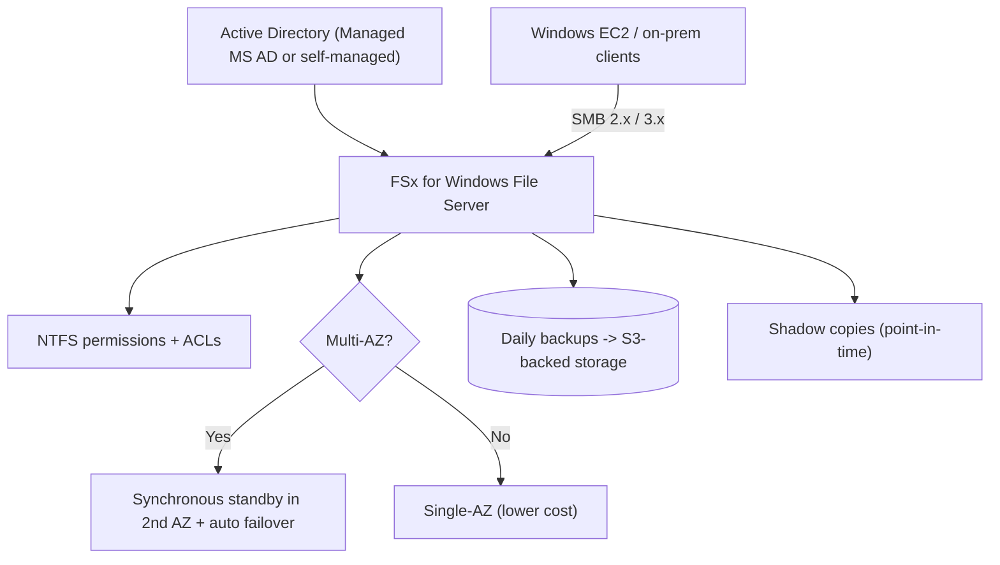

# Amazon FSx for Windows File Server - SAA-C03 Deep Dive

> **FSx for Windows File Server** is a fully managed, **native Windows** file system accessed over the **SMB** protocol, integrated with **Active Directory** and built on **Windows NTFS**. It is the AWS answer to "we need a Windows file share with AD-based permissions."

See also: [01 - FSx Intro & Overview](01%20-%20FSx%20Intro%20%26%20Overview.md) · [03 - FSx for Lustre](03%20-%20FSx%20for%20Lustre.md) · [04 - FSx for NetApp ONTAP & OpenZFS](04%20-%20FSx%20for%20NetApp%20ONTAP%20%26%20OpenZFS.md) · [05 - FSx SRE Troubleshooting & Exam Scenarios](05%20-%20FSx%20SRE%20Troubleshooting%20%26%20Exam%20Scenarios.md) · [01 - EFS Intro & Architecture](01%20-%20EFS%20Intro%20%26%20Architecture.md) · [01 - S3 Intro & Core Concepts](01%20-%20S3%20Intro%20%26%20Core%20Concepts.md)

---

## Table of Contents

- [1. Overview & SMB Protocol](#1-overview--smb-protocol)
- [2. Active Directory Integration](#2-active-directory-integration)
- [3. Single-AZ vs Multi-AZ](#3-single-az-vs-multi-az)
- [4. DFS Namespaces](#4-dfs-namespaces)
- [5. Deduplication & Shadow Copies](#5-deduplication--shadow-copies)
- [6. Storage & Throughput (SSD/HDD)](#6-storage--throughput-ssdhdd)
- [7. Backups & Data Protection](#7-backups--data-protection)
- [8. Use Cases](#8-use-cases)
- [9. Exam Traps & Tips](#9-exam-traps--tips)
- [Summary](#summary)

---

---

## 1. Overview & SMB Protocol

- Accessed over the **SMB** protocol (versions 2.0 through 3.1.1), the standard Windows file-sharing protocol.
- Although Windows-native, it can be mounted by **Linux and macOS** clients too (any SMB client), but its sweet spot is Windows workloads.
- Built on **Windows Server** with full **NTFS** semantics: file/folder ACLs, ownership, attributes.
- Supports **SMB encryption in transit** (enforced via SMB 3.x) and **KMS encryption at rest**.

| Property              | Detail                          |
| :-------------------- | :------------------------------ |
| Protocol              | SMB 2.0 - 3.1.1                 |
| Permissions           | NTFS ACLs tied to AD identities |
| Min/typical access    | Windows, Linux (cifs), macOS    |
| In-transit encryption | SMB 3.x (Kerberos)              |

[⬆ Back to top](#table-of-contents)

---

## 2. Active Directory Integration

FSx for Windows **requires** an Active Directory to authenticate users and apply NTFS permissions. Two options:

- **AWS Managed Microsoft AD** - AWS runs the directory for you (Directory Service). Simplest.
- **Self-managed Active Directory** - join FSx to your **existing on-prem or EC2-hosted AD** (over Direct Connect/VPN). Used when you must keep a single corporate directory.

> 🎯 **Exam:** "Users must authenticate with their existing corporate AD credentials" -> FSx for Windows joined to a **self-managed AD**. "No existing directory" -> **AWS Managed Microsoft AD**.

[⬆ Back to top](#table-of-contents)

---

## 3. Single-AZ vs Multi-AZ

|              | Single-AZ                   | Multi-AZ                                                |
| :----------- | :-------------------------- | :------------------------------------------------------ |
| Availability | Within **one** AZ           | **Synchronous** replication to standby in **second** AZ |
| Failover     | None (AZ outage = downtime) | **Automatic failover** to standby (~seconds)            |
| Cost         | Lower                       | Higher                                                  |
| Use when     | Dev/test, non-critical      | Production, high availability required                  |

> ⚠️ **Trap:** Single-AZ FSx is still durable (data replicated within the AZ) but is **not highly available** across AZ failure. For production HA, choose **Multi-AZ**.

[⬆ Back to top](#table-of-contents)

---

## 4. DFS Namespaces

- **Microsoft DFS Namespaces (DFS-N)** let you group multiple file shares (even multiple FSx file systems) under a **single namespace/path**, e.g. `\\company\share`.
- Used to **scale out** beyond a single file system's capacity and to provide a unified view.
- **DFS Replication (DFS-R)** can be used between FSx file systems for multi-region/multi-AZ replication patterns (though Multi-AZ deployment is the native HA mechanism).

> 🎯 **Exam:** "Combine multiple Windows file systems under one share path / scale beyond one file system" -> **DFS Namespaces**.

[⬆ Back to top](#table-of-contents)

---

## 5. Deduplication & Shadow Copies

- **Data Deduplication** - identifies and removes redundant data, typically saving **50-60%** for general-purpose shares (more for VDI/user docs). Reduces storage cost.
- **Volume Shadow Copies (VSS)** - point-in-time snapshots of the file system. End users can **self-service restore** previous versions of files via the Windows "Previous Versions" tab - no admin ticket needed.

> 🎯 **Exam:** "Users need to restore previous versions of their own files without admin help" -> enable **Shadow Copies**.

[⬆ Back to top](#table-of-contents)

---

## 6. Storage & Throughput (SSD/HDD)

- **SSD storage** - low latency, high IOPS; for latency-sensitive workloads (databases, latency-sensitive apps, high transaction shares).
- **HDD storage** - lower cost; for throughput-oriented, less latency-sensitive workloads (home dirs, dept shares).
- **Throughput capacity** is provisioned separately (MB/s) and can be **scaled up/down**; it determines network throughput and the size of the in-memory cache.
- Storage capacity can be **increased** after creation; throughput can be adjusted.

| Storage type | Latency | Cost   | Use                              |
| :----------- | :------ | :----- | :------------------------------- |
| SSD          | Sub-ms  | Higher | Transactional, latency-sensitive |
| HDD          | Higher  | Lowest | Throughput, archival shares      |

[⬆ Back to top](#table-of-contents)

---

## 7. Backups & Data Protection

- **Automatic daily backups** (configurable window + retention) and **on-demand** backups, stored in highly durable S3-backed storage.
- Integrates with **[AWS Backup](AWS%20Backup.md)** for centralized policy-driven backup.
- **Encryption at rest** via **KMS** (default or customer-managed key); **in transit** via SMB encryption.
- Restores create a **new file system** from the backup.

[⬆ Back to top](#table-of-contents)

---

## 8. Use Cases

- **Windows-based applications** needing shared storage (.NET apps, IIS content).
- **Home directories / user profiles / roaming profiles** (often with dedup).
- **Microsoft SharePoint** and **SQL Server** (FCI shared storage via SMB).
- **Media / content management** for Windows shops.
- **Lift-and-shift** of on-prem Windows file servers to AWS.

[⬆ Back to top](#table-of-contents)

---

## 9. Exam Traps & Tips

- ✅ Keywords **SMB**, **Active Directory**, **NTFS**, **Windows shares**, **DFS**, **SharePoint** -> **FSx for Windows**.
- ✅ **Self-service file restore** -> **Shadow Copies**. **Reduce storage footprint** -> **Deduplication**.
- ✅ **Single namespace across multiple file systems** -> **DFS Namespaces**.
- ⚠️ **EFS is Linux/NFS only** - it cannot serve native Windows SMB shares with AD/NTFS. Don't pick EFS for Windows.
- ⚠️ For **HA across AZs**, you must choose **Multi-AZ** at creation (it provides synchronous standby + auto failover).
- ⚠️ For **multi-protocol** (Linux NFS + Windows SMB on the _same_ data), use **FSx for NetApp ONTAP**, not Windows File Server.

[⬆ Back to top](#table-of-contents)

---

## Summary

FSx for Windows File Server is managed Windows file storage over **SMB**, anchored on **Active Directory** and **NTFS**. Remember the feature flags the exam loves: **Multi-AZ** (HA), **Shadow Copies** (self-service restore), **Deduplication** (cost), and **DFS Namespaces** (scale-out). It is the default answer for any Windows file-share scenario.

[⬆ Back to top](#table-of-contents)
