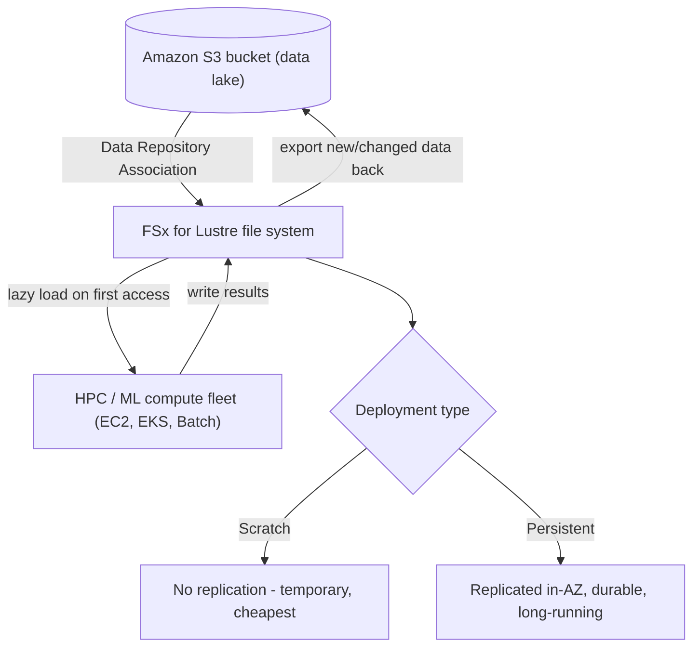

# Amazon FSx for Lustre - SAA-C03 Deep Dive

> **FSx for Lustre** is a fully managed, **massively parallel, high-performance** file system for compute-intensive workloads - **HPC, machine learning, genomics, video rendering, financial modelling**. It delivers **hundreds of GB/s of throughput** and **millions of IOPS** with **sub-millisecond latency**, and integrates **natively with Amazon S3**.

See also: [01 - FSx Intro & Overview](01%20-%20FSx%20Intro%20%26%20Overview.md) · [02 - FSx for Windows File Server](02%20-%20FSx%20for%20Windows%20File%20Server.md) · [04 - FSx for NetApp ONTAP & OpenZFS](04%20-%20FSx%20for%20NetApp%20ONTAP%20%26%20OpenZFS.md) · [05 - FSx SRE Troubleshooting & Exam Scenarios](05%20-%20FSx%20SRE%20Troubleshooting%20%26%20Exam%20Scenarios.md) · [01 - S3 Intro & Core Concepts](01%20-%20S3%20Intro%20%26%20Core%20Concepts.md) · [01 - EFS Intro & Architecture](01%20-%20EFS%20Intro%20%26%20Architecture.md)

---

## Table of Contents

- [1. What Lustre Is](#1-what-lustre-is)
- [2. Scratch vs Persistent Deployment](#2-scratch-vs-persistent-deployment)
- [3. S3 Integration (Lazy Load, DRA, Export)](#3-s3-integration-lazy-load-dra-export)
- [4. Throughput & Performance](#4-throughput--performance)
- [5. Storage Types & Compression](#5-storage-types--compression)
- [6. Access & Clients](#6-access--clients)
- [7. Use Cases](#7-use-cases)
- [8. Exam Traps & Tips](#8-exam-traps--tips)
- [Summary](#summary)

---

---

## 1. What Lustre Is

- **Lustre** = "**L**inux + cl**uster**" - an open-source parallel distributed file system designed for the world's fastest supercomputers.
- FSx for Lustre exposes a **POSIX** file system mounted by Linux clients using the **Lustre client**.
- Designed for **parallel access** by thousands of compute nodes - throughput and IOPS scale with provisioned storage.

[⬆ Back to top](#table-of-contents)

---

## 2. Scratch vs Persistent Deployment

This is the **most-tested** Lustre distinction.

|            | Scratch                                               | Persistent                                                   |
| :--------- | :---------------------------------------------------- | :----------------------------------------------------------- |
| Durability | **No replication** - data lost if a file server fails | **Replicated within a single AZ**, auto-heals failed servers |
| Lifespan   | **Temporary** / short-term processing                 | **Long-term**, long-running workloads                        |
| Cost       | **Cheapest**                                          | Higher                                                       |
| Use when   | Burst HPC jobs, reproducible-from-S3 data             | Persistent datasets, throughput-sensitive long jobs          |

> ⚠️ **Trap:** **Scratch** file systems do **NOT** replicate and have **no failover** - on hardware failure, **data is lost**. Use scratch only when data can be regenerated or re-loaded from S3. For anything that must survive, use **Persistent**.

[⬆ Back to top](#table-of-contents)

---

## 3. S3 Integration (Lazy Load, DRA, Export)

FSx for Lustre is uniquely tied to **S3** - it can present an S3 bucket as a high-performance file system.

- **Data Repository Association (DRA)** - links the Lustre file system to an **S3 bucket/prefix**. Metadata is imported so files appear immediately.
- **Lazy loading** - object data is **only pulled from S3 on first access** (not all at once), so you can attach a huge bucket and stream what you need.
- **Export back to S3** - new and changed files written to Lustre can be **exported/synced back to S3**, making S3 the durable system of record.
- This makes Lustre ideal as a **fast scratch layer over an S3 data lake**: process data at speed, write results back to S3.

> 🎯 **Exam:** "Process data stored in S3 with a high-performance file system and write results back to S3" -> **FSx for Lustre with an S3 data repository**.

[⬆ Back to top](#table-of-contents)

---

## 4. Throughput & Performance

- Throughput **scales with storage size**, expressed as **MB/s per TiB** of provisioned storage (selectable tiers, e.g. 125 / 250 / 500 / 1000 MB/s per TiB on persistent SSD).
- Aggregate performance: **hundreds of GB/s throughput**, **millions of IOPS**, **sub-millisecond latency**.
- Persistent tiers offer higher baseline throughput per TiB; you choose the per-TiB tier at creation.

> 🎯 **Exam keyword math:** more provisioned TiB = more throughput. "Need more aggregate throughput" -> increase storage capacity and/or pick a higher per-TiB tier.

[⬆ Back to top](#table-of-contents)

---

## 5. Storage Types & Compression

- **SSD storage** - for low-latency, IOPS-intensive, random/small-file workloads.
- **HDD storage** - for large, sequential, throughput-oriented workloads at lower cost (optionally with an SSD read cache).
- **Data compression** (LZ4) can be enabled to reduce storage footprint and increase effective throughput.

[⬆ Back to top](#table-of-contents)

---

## 6. Access & Clients

- Mounted from **Linux** instances using the **Lustre client** (kernel module).
- Used by **EC2**, **Amazon EKS** (via CSI driver), **AWS Batch**, **AWS ParallelCluster**, and SageMaker for ML training.
- Lives in a **VPC**; access controlled by security groups.

[⬆ Back to top](#table-of-contents)

---

## 7. Use Cases

- **High-Performance Computing (HPC)** - simulations, CFD, weather, seismic.
- **Machine Learning** - feeding training data to GPU fleets from an S3 data lake at high speed.
- **Genomics / life sciences** - large-scale sequencing pipelines.
- **Media & entertainment** - video rendering and transcoding farms.
- **Financial modelling / risk analytics** - large parallel batch jobs.
- **Big data analytics** as a fast scratch layer over S3.

[⬆ Back to top](#table-of-contents)

---

## 8. Exam Traps & Tips

- ✅ **Performance keywords** (HPC, ML, sub-millisecond, hundreds of GB/s, millions of IOPS) + **Linux** -> **FSx for Lustre**.
- ✅ **S3 integration** (process S3 data fast, export back) -> **Lustre** (the only FSx with native S3 linking).
- ⚠️ **Scratch = no durability/failover**; **Persistent = replicated in one AZ**. Don't store irreplaceable data on scratch.
- ⚠️ Lustre is **Linux-only** - not for Windows shares (that's FSx for Windows) and not multi-protocol (that's ONTAP).
- ⚠️ Throughput scales with **storage size / per-TiB tier** - to get more speed, provision more TiB or a higher tier.
- ⚠️ For **general shared Linux storage that auto-scales and is serverless**, use **EFS**; Lustre is for **extreme performance**, not casual file sharing.

[⬆ Back to top](#table-of-contents)

---

## Summary

FSx for Lustre is the **performance champion** of the FSx family: a parallel POSIX file system for HPC/ML/media that scales to **hundreds of GB/s**. Its signature feature is **native S3 integration** with **lazy loading** and **export**, letting you compute fast over an S3 data lake. Remember **scratch (temporary, no replication)** vs **persistent (durable in-AZ)** - the exam tests it constantly.

[⬆ Back to top](#table-of-contents)
