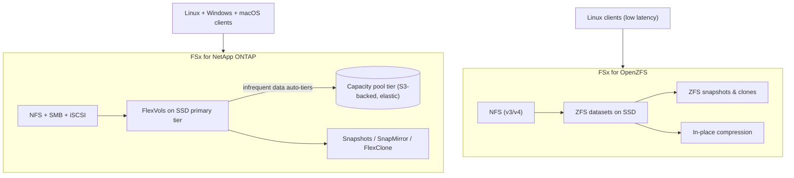

# Amazon FSx for NetApp ONTAP & OpenZFS - SAA-C03 Deep Dive

> **FSx for NetApp ONTAP** runs the **NetApp ONTAP** storage OS - **multi-protocol (NFS + SMB + iSCSI)** with snapshots, SnapMirror, FlexClone, dedup/compression, and S3-backed tiering. **FSx for OpenZFS** runs the **OpenZFS** file system over **NFS** with **very low latency**, in-place compression, and ZFS snapshots/clones. Both shine for **migrating existing on-prem workloads** to AWS with minimal change.

See also: [01 - FSx Intro & Overview](01%20-%20FSx%20Intro%20%26%20Overview.md) · [02 - FSx for Windows File Server](02%20-%20FSx%20for%20Windows%20File%20Server.md) · [03 - FSx for Lustre](03%20-%20FSx%20for%20Lustre.md) · [05 - FSx SRE Troubleshooting & Exam Scenarios](05%20-%20FSx%20SRE%20Troubleshooting%20%26%20Exam%20Scenarios.md) · [01 - EFS Intro & Architecture](01%20-%20EFS%20Intro%20%26%20Architecture.md) · [01 - EBS Intro & Volume Types](01%20-%20EBS%20Intro%20%26%20Volume%20Types.md)

---

## Table of Contents

- [1. FSx for NetApp ONTAP Overview](#1-fsx-for-netapp-ontap-overview)
- [2. ONTAP Multi-Protocol Access](#2-ontap-multi-protocol-access)
- [3. ONTAP Data Management Features](#3-ontap-data-management-features)
- [4. ONTAP Storage Tiering & Efficiency](#4-ontap-storage-tiering--efficiency)
- [5. FSx for OpenZFS Overview](#5-fsx-for-openzfs-overview)
- [6. OpenZFS Features](#6-openzfs-features)
- [7. ONTAP vs OpenZFS - When to Use Each](#7-ontap-vs-openzfs---when-to-use-each)
- [8. Migration Scenarios](#8-migration-scenarios)
- [9. Exam Traps & Tips](#9-exam-traps--tips)
- [Summary](#summary)

---

---

## 1. FSx for NetApp ONTAP Overview

- Fully managed **NetApp ONTAP** - the same enterprise storage OS many companies run on-prem.
- **Multi-protocol**: a single file system serves **NFS, SMB, and iSCSI** simultaneously - so **Linux, Windows, and macOS** clients (and block consumers) can all share it.
- Supports **Single-AZ** and **Multi-AZ** (synchronous standby + automatic failover) deployments.
- The premier choice for **lift-and-shift of existing NetApp environments** - same APIs, tools, and features.

[⬆ Back to top](#table-of-contents)

---

## 2. ONTAP Multi-Protocol Access

| Protocol  | Serves         | Typical client             |
| :-------- | :------------- | :------------------------- |
| **NFS**   | File (POSIX)   | Linux / macOS              |
| **SMB**   | File (Windows) | Windows (with AD)          |
| **iSCSI** | **Block**      | Databases, block consumers |

> 🎯 **Exam:** "Same dataset accessed by **both Linux (NFS) and Windows (SMB)**" or "file **and** block (iSCSI) from one system" -> **FSx for NetApp ONTAP**. ONTAP is the only FSx type that is genuinely multi-protocol.

[⬆ Back to top](#table-of-contents)

---

## 3. ONTAP Data Management Features

- **Snapshots** - instant, space-efficient point-in-time copies.
- **SnapMirror** - **replication** between ONTAP systems (e.g., on-prem NetApp <-> FSx ONTAP, or cross-region) for DR and migration.
- **FlexClone** - **instant, writable, zero-copy clones** of volumes (great for test/dev copies of production data without duplicating storage).
- **Point-in-time recovery** and integration with AWS Backup.

> 🎯 **Exam:** "Instantly create writable copies of production data for test/dev without consuming extra storage" -> **FlexClone**. "Replicate existing NetApp data to AWS / DR" -> **SnapMirror**.

[⬆ Back to top](#table-of-contents)

---

## 4. ONTAP Storage Tiering & Efficiency

- **Two-tier storage:**
  - **Primary SSD tier** - high-performance, for active/hot data.
  - **Capacity pool tier** - **fully elastic, S3-backed**, low-cost; **infrequently accessed data auto-tiers** here.
- **Storage efficiency:** **deduplication**, **compression**, and **compaction** dramatically reduce footprint.
- Tiering policy controls how aggressively cold data moves to the capacity pool, optimizing cost automatically.

> 🎯 **Exam:** "Automatically move cold file data to a cheaper tier while keeping hot data fast" -> **ONTAP capacity pool tiering**.

[⬆ Back to top](#table-of-contents)

---

## 5. FSx for OpenZFS Overview

- Fully managed **OpenZFS** file system, accessed over **NFS (v3, v4, v4.1, v4.2)**.
- Built for **very low latency** (sub-millisecond) and high IOPS on SSD, with powerful ZFS data management.
- Single-AZ and Multi-AZ deployment options.
- Ideal for **migrating on-prem ZFS / Linux NAS** workloads to AWS with minimal application changes.

[⬆ Back to top](#table-of-contents)

---

## 6. OpenZFS Features

- **ZFS snapshots** - fast, space-efficient point-in-time copies; users can roll back.
- **ZFS clones** - writable copies from snapshots.
- **In-place data compression** (LZ4/Zstandard) - reduces storage cost transparently.
- **Low-latency, high-throughput NFS** with SSD storage and an in-memory (ARC) cache.
- **NFS-only** (no native SMB/iSCSI) - it is a Linux/POSIX file system.

[⬆ Back to top](#table-of-contents)

---

## 7. ONTAP vs OpenZFS - When to Use Each

| Factor                    | NetApp ONTAP                                | OpenZFS                                 |
| :------------------------ | :------------------------------------------ | :-------------------------------------- |
| Protocols                 | **NFS + SMB + iSCSI** (multi)               | NFS only                                |
| Best for                  | NetApp shops, multi-protocol, Linux+Windows | ZFS/Linux NAS migration, lowest latency |
| Replication               | **SnapMirror**                              | (snapshots/clones; no SnapMirror)       |
| Clones                    | **FlexClone**                               | ZFS clones                              |
| Tiering to S3-backed pool | ✅ Capacity pool                            | ❌ (SSD only)                           |
| Dedup                     | ✅ + compression + compaction               | Compression (no dedup)                  |

- Pick **ONTAP** when you need **multiple protocols**, **NetApp features**, or **automatic cost tiering**.
- Pick **OpenZFS** when you need a **Linux NFS file system with the lowest latency** and ZFS semantics, or are migrating an existing ZFS deployment.

[⬆ Back to top](#table-of-contents)

---

## 8. Migration Scenarios

- **On-prem NetApp -> AWS:** use **SnapMirror** to replicate volumes to FSx for ONTAP; cut over with minimal downtime. Same management tooling.
- **On-prem ZFS / Linux NAS -> AWS:** move to **FSx for OpenZFS**; preserves ZFS snapshots/compression behaviour.
- **Both Linux and Windows must mount the same data in AWS:** **ONTAP** (NFS + SMB on one file system).
- **Need block (iSCSI) plus file from one managed system:** **ONTAP**.

[⬆ Back to top](#table-of-contents)

---

## 9. Exam Traps & Tips

- ✅ **Multi-protocol (NFS + SMB + iSCSI)** or **NetApp migration / SnapMirror / FlexClone** -> **FSx for NetApp ONTAP**.
- ✅ **Lowest-latency NFS**, **on-prem ZFS migration**, **ZFS snapshots/compression** -> **FSx for OpenZFS**.
- ✅ **Auto-tier cold data to a cheap S3-backed pool** -> **ONTAP capacity pool** (OpenZFS has no such tier).
- ⚠️ **OpenZFS is NFS-only** - if Windows SMB or iSCSI block is required, use **ONTAP** (or Windows File Server for pure SMB).
- ⚠️ **FlexClone** (ONTAP) is the answer for **instant zero-copy writable clones** of production volumes.
- ⚠️ Don't confuse generic **EFS** (serverless Linux NFS) with **OpenZFS** (managed ZFS, lower latency, ZFS features) - OpenZFS is chosen for **latency/ZFS feature** requirements or **migration fidelity**.

[⬆ Back to top](#table-of-contents)

---

## Summary

**ONTAP** = enterprise **multi-protocol** (NFS/SMB/iSCSI) NetApp with **SnapMirror, FlexClone, dedup/compression, and S3-backed tiering** - the lift-and-shift target for NetApp shops and the only multi-protocol FSx. **OpenZFS** = managed **ZFS over NFS** with **very low latency**, snapshots/clones, and in-place compression - the target for Linux/ZFS NAS migrations. Match the protocol mix and the source platform to pick correctly.

[⬆ Back to top](#table-of-contents)
