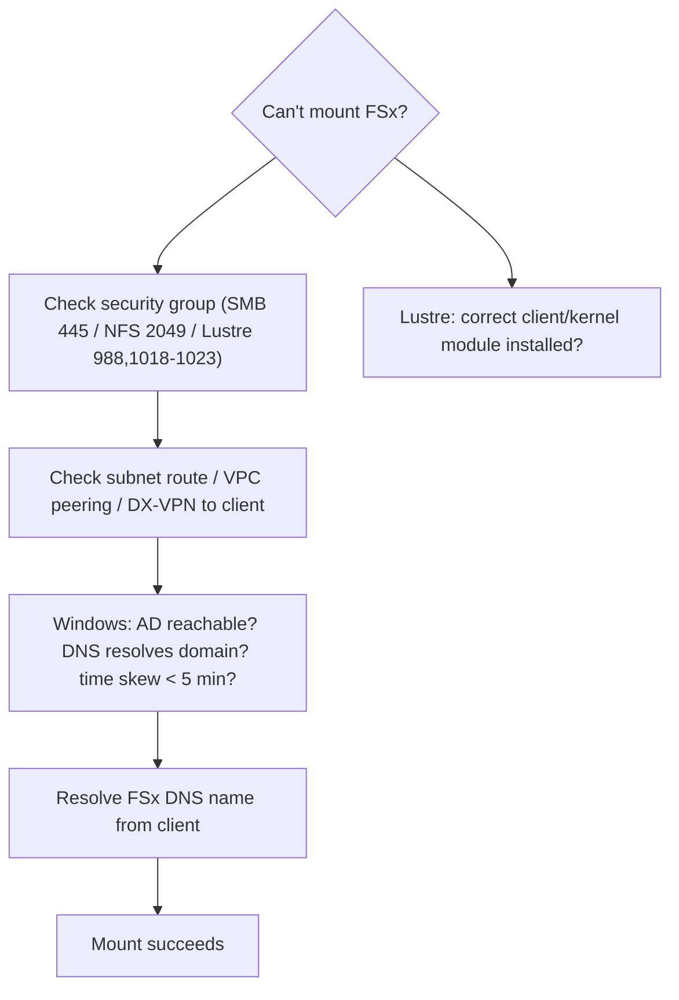

# FSx SRE Troubleshooting & Exam Scenarios - SAA-C03 Deep Dive

> Operational reality + exam practice for all four FSx types: the **errors you actually hit** (AD join failures, SMB/NFS mount issues, Lustre client mounts, scratch data loss, Multi-AZ failover), **best practices**, **cost optimization**, and **12 scenario-based questions** focused on the exam's favourite skill - **"which FSx type / EFS vs FSx".**

See also: [01 - FSx Intro & Overview](01%20-%20FSx%20Intro%20%26%20Overview.md) · [02 - FSx for Windows File Server](02%20-%20FSx%20for%20Windows%20File%20Server.md) · [03 - FSx for Lustre](03%20-%20FSx%20for%20Lustre.md) · [04 - FSx for NetApp ONTAP & OpenZFS](04%20-%20FSx%20for%20NetApp%20ONTAP%20%26%20OpenZFS.md) · [01 - EFS Intro & Architecture](01%20-%20EFS%20Intro%20%26%20Architecture.md) · [01 - S3 Intro & Core Concepts](01%20-%20S3%20Intro%20%26%20Core%20Concepts.md)

---

## Table of Contents

- [1. Connectivity & Security Group Issues](#1-connectivity--security-group-issues)
- [2. Windows - AD Join & SMB Failures](#2-windows---ad-join--smb-failures)
- [3. Lustre - Client Mount Issues](#3-lustre---client-mount-issues)
- [4. Scratch Data Loss & Multi-AZ Failover](#4-scratch-data-loss--multi-az-failover)
- [5. ONTAP & OpenZFS NFS Mount Issues](#5-ontap--openzfs-nfs-mount-issues)
- [6. Best Practices](#6-best-practices)
- [7. Cost Optimization](#7-cost-optimization)
- [8. Exam Scenario Questions](#8-exam-scenario-questions)
- [Summary](#summary)

---

---

## 1. Connectivity & Security Group Issues

Most FSx mount failures are **network**, not FSx.

| Symptom                      | Likely cause                            | Fix                                                                                                        |
| :--------------------------- | :-------------------------------------- | :--------------------------------------------------------------------------------------------------------- |
| Mount hangs / times out      | Security group blocks the protocol port | Allow inbound from client SG: **SMB 445**, **NFS 2049** (+111), **Lustre 988 & 1018-1023**, **iSCSI 3260** |
| Can't reach FSx from on-prem | No DX/VPN route, DNS not resolvable     | Establish Direct Connect/VPN; ensure DNS resolution of the FSx endpoint                                    |
| Cross-VPC access fails       | No peering/TGW                          | Add VPC peering or Transit Gateway + routes                                                                |

> 🎯 **Tip:** FSx exposes a **DNS name** - always mount by DNS name, and verify the client can resolve it and reach the right port.

[⬆ Back to top](#table-of-contents)

---

## 2. Windows - AD Join & SMB Failures

| Symptom                           | Likely cause                                                       | Fix                                                                              |
| :-------------------------------- | :----------------------------------------------------------------- | :------------------------------------------------------------------------------- |
| File system stuck "Misconfigured" | Self-managed AD details wrong (DNS IPs, service account perms, OU) | Verify domain DNS, service account has rights to join computers, correct OU path |
| Cannot authenticate               | **Time skew** > 5 min (Kerberos)                                   | Ensure NTP/time sync between clients, AD, and FSx                                |
| Access denied to shares           | NTFS ACLs / AD group membership                                    | Fix NTFS permissions; confirm user in correct AD group                           |
| Can't join domain                 | DNS can't resolve domain controllers                               | Point FSx/VPC DHCP options to AD DNS servers                                     |

> ⚠️ **Exam-adjacent:** FSx for Windows **requires AD**; a misconfigured directory is the #1 cause of a failed/Misconfigured file system.

[⬆ Back to top](#table-of-contents)

---

## 3. Lustre - Client Mount Issues

- Install the **Lustre client** matching your **kernel version** (mismatched client/kernel is the classic failure).
- Open Lustre ports in the security group (**988**, **1018-1023**).
- For **S3-linked** file systems, files appear via metadata but data **lazy-loads on first read** - first access is slower (expected, not a bug).
- If exported data isn't in S3, verify the **Data Repository Association** and that an **export task** ran.

[⬆ Back to top](#table-of-contents)

---

## 4. Scratch Data Loss & Multi-AZ Failover

- **Lustre scratch** = **no replication, no failover**. A failed file server **loses data**. Mitigate by sourcing from S3 and exporting results back; for durability use **persistent**.
- **Multi-AZ (Windows/ONTAP/OpenZFS)** provides a **synchronous standby + automatic failover** - failover is transparent but in-flight SMB sessions may briefly reconnect.
- **Single-AZ** survives within-AZ hardware failures (data is replicated in the AZ) but **not an AZ outage** - no cross-AZ failover.

> 🎯 **Tip:** "Must remain available if an AZ fails" -> **Multi-AZ**. "Data must survive file-server failure on Lustre" -> **persistent**, not scratch.

[⬆ Back to top](#table-of-contents)

---

## 5. ONTAP & OpenZFS NFS Mount Issues

| Symptom                 | Likely cause                         | Fix                                             |
| :---------------------- | :----------------------------------- | :---------------------------------------------- |
| NFS mount refused       | SG blocks 2049/111; export policy    | Open NFS ports; check ONTAP export policy/rules |
| ONTAP SMB access denied | SVM not joined to AD / wrong ACL     | Join Storage VM to AD; fix SMB share ACLs       |
| iSCSI LUN not visible   | SG blocks 3260; initiator not mapped | Open 3260; map LUN to the host initiator group  |
| OpenZFS poor latency    | Undersized throughput/IOPS           | Provision higher throughput/IOPS capacity       |

[⬆ Back to top](#table-of-contents)

---

## 6. Best Practices

- **Choose Multi-AZ** for production HA (Windows/ONTAP/OpenZFS); Single-AZ for dev/test.
- **Right-size throughput capacity** (Windows) and **per-TiB tier** (Lustre) for the workload.
- **Enable encryption** at rest (KMS) and in transit; restrict access with **security groups** (least privilege).
- **Use AWS Backup** for centralized, policy-based backups; enable **automatic daily backups**.
- **Windows:** enable **Shadow Copies** for self-service restore, **Deduplication** to cut cost.
- **Lustre:** keep S3 as system of record; use scratch for transient compute.
- **ONTAP:** enable **storage efficiency** (dedup/compression) and **tiering** to the capacity pool.
- Monitor with **CloudWatch** metrics (throughput, IOPS, storage, free capacity) and set alarms.

[⬆ Back to top](#table-of-contents)

---

## 7. Cost Optimization

- **Windows:** use **HDD** storage for throughput-oriented/less latency-sensitive shares; enable **Deduplication**.
- **Lustre:** use **scratch** for temporary jobs (cheapest); HDD + SSD cache for sequential workloads; enable **compression**.
- **ONTAP:** rely on **capacity pool tiering** (S3-backed) to push cold data to low-cost storage automatically; enable **dedup/compression/compaction**.
- **OpenZFS:** enable **in-place compression**; right-size SSD capacity.
- **All:** delete unused backups, right-size throughput, and avoid over-provisioning storage.

[⬆ Back to top](#table-of-contents)

---

## 8. Exam Scenario Questions

**Q1.** A team runs a **Windows .NET application** that needs a **shared file store** with **Active Directory authentication** and **NTFS permissions**. Which service?
**A:** **FSx for Windows File Server.** _Explanation:_ SMB + AD + NTFS is the exact Windows File Server profile. EFS is Linux/NFS only.

**Q2.** A genomics company needs a **file system delivering hundreds of GB/s** to a GPU fleet, processing data stored in **S3** and writing results back to S3. Which?
**A:** **FSx for Lustre** (with an S3 data repository). _Explanation:_ Extreme performance + native S3 lazy-load/export is unique to Lustre.

**Q3.** Both **Linux (NFS)** and **Windows (SMB)** servers must access the **same dataset** from one managed file system. Which?
**A:** **FSx for NetApp ONTAP.** _Explanation:_ Only ONTAP is truly multi-protocol (NFS + SMB + iSCSI).

**Q4.** A company runs **NetApp on-prem** and wants to migrate to AWS using **SnapMirror** while keeping **FlexClone**. Which?
**A:** **FSx for NetApp ONTAP.** _Explanation:_ Native ONTAP features (SnapMirror replication, FlexClone) make this the lift-and-shift target.

**Q5.** You need a **serverless, auto-scaling, shared POSIX file system for Linux** EC2 with no vendor-specific features. Which?
**A:** **Amazon EFS** (not FSx). _Explanation:_ Generic shared Linux NFS that auto-scales = EFS. FSx is for specific file systems.

**Q6.** An **HPC scratch** workload uses **FSx for Lustre scratch**. After a file server failure, data is gone. Why, and how to prevent?
**A:** Scratch has **no replication/failover**. _Explanation:_ Use a **persistent** deployment for durability, or keep S3 as the source of record and re-load.

**Q7.** Users must **self-service restore previous versions** of files on a Windows share without admin help. What feature?
**A:** **Shadow Copies** on FSx for Windows. _Explanation:_ Surfaces "Previous Versions" in Windows Explorer.

**Q8.** A production Windows file system must **stay available if an entire AZ fails**. Which deployment?
**A:** **Multi-AZ** FSx for Windows. _Explanation:_ Synchronous standby + automatic failover across AZs. Single-AZ does not survive AZ loss.

**Q9.** A team migrating an **on-prem ZFS NAS** wants the **lowest-latency NFS** with **ZFS snapshots and compression**. Which?
**A:** **FSx for OpenZFS.** _Explanation:_ Managed OpenZFS over NFS, sub-ms latency, ZFS features, ideal migration fidelity.

**Q10.** An ONTAP file system should **automatically move cold data to a cheaper tier** while keeping hot data fast. What feature?
**A:** **ONTAP capacity pool tiering** (S3-backed). _Explanation:_ Auto-tiers infrequently accessed data off the SSD primary tier.

**Q11.** A developer wants **instant, writable, zero-copy copies** of a production volume for testing, without doubling storage. Which feature/service?
**A:** **FlexClone** on **FSx for NetApp ONTAP.** _Explanation:_ FlexClone creates space-efficient writable clones instantly.

**Q12.** An application needs **shared block (iSCSI) storage** plus **file (NFS)** from a single managed file system. Which?
**A:** **FSx for NetApp ONTAP.** _Explanation:_ ONTAP serves iSCSI block alongside NFS/SMB file - no other FSx type offers iSCSI.

> 🎯 **Meta-tip:** Map keywords -> type. **AD/SMB/NTFS** = Windows; **HPC/ML/S3/GB-per-sec** = Lustre; **multi-protocol/NetApp/SnapMirror/FlexClone/iSCSI/tiering** = ONTAP; **ZFS/low-latency NFS migration** = OpenZFS; **generic serverless Linux NFS** = EFS.

[⬆ Back to top](#table-of-contents)

---

## Summary

Operationally, most FSx failures are **network (security groups/DNS)** or, for Windows, **Active Directory** misconfiguration. Remember **scratch loses data** and **Multi-AZ provides automatic failover**. For the exam, the decisive skill is **keyword -> FSx type** selection (and **EFS vs FSx**): the 12 scenarios above cover the patterns AWS reuses repeatedly.

[⬆ Back to top](#table-of-contents)
