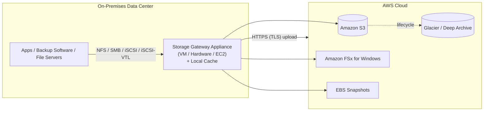
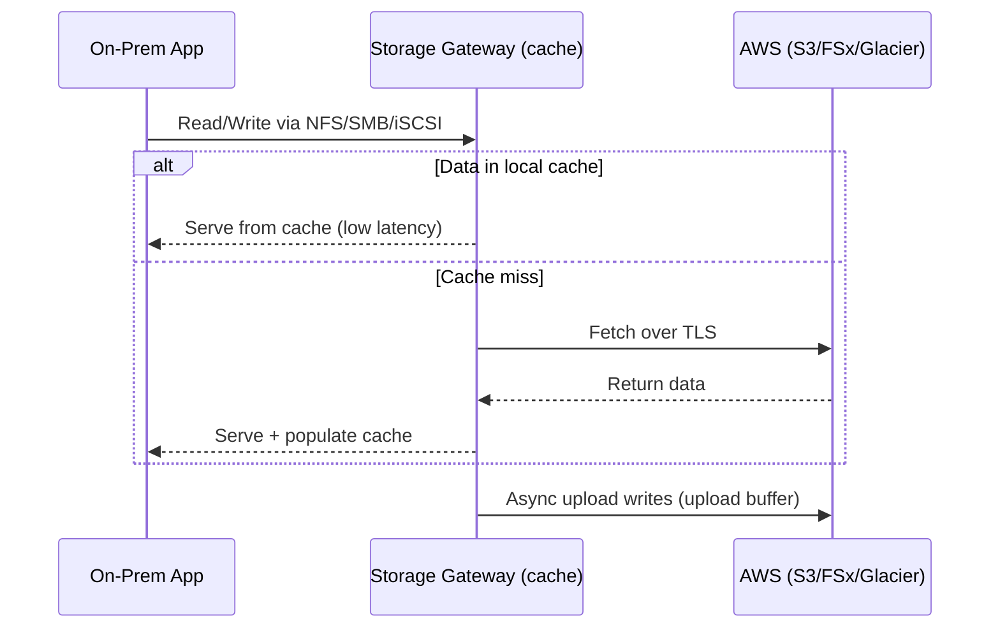

# AWS Storage Gateway Intro & Types - SAA-C03 Deep Dive

> **AWS Storage Gateway** is a hybrid-cloud storage service: an on-premises (or EC2) appliance that gives your local applications **near-unlimited cloud storage** in S3/Glacier/FSx while keeping a **local cache** for low-latency access over standard protocols (NFS, SMB, iSCSI, iSCSI-VTL).

See also: [02 - Storage Gateway Deep Dive (File S3 FSx Volume Tape)](02%20-%20Storage%20Gateway%20Deep%20Dive%20%28File%20S3%20FSx%20Volume%20Tape%29.md) · [03 - Storage Gateway SRE & Exam Scenarios](03%20-%20Storage%20Gateway%20SRE%20%26%20Exam%20Scenarios.md) · [01 - S3 Intro & Core Concepts](01%20-%20S3%20Intro%20%26%20Core%20Concepts.md) · [01 - FSx Intro & Overview](01%20-%20FSx%20Intro%20%26%20Overview.md) · [01 - AWS Backup Intro & Core Concepts](01%20-%20AWS%20Backup%20Intro%20%26%20Core%20Concepts.md)

---

## Table of Contents

- [1. What Storage Gateway Is](#1-what-storage-gateway-is)
- [2. Why Hybrid Storage (Use Cases)](#2-why-hybrid-storage-use-cases)
- [3. Deployment Options (VM / Hardware / EC2)](#3-deployment-options-vm--hardware--ec2)
- [4. The Four Gateway Types](#4-the-four-gateway-types)
- [5. Gateway Type Comparison Table](#5-gateway-type-comparison-table)
- [6. How a Request Flows (Local Cache)](#6-how-a-request-flows-local-cache)
- [7. Choosing the Right Gateway (Decision Guide)](#7-choosing-the-right-gateway-decision-guide)
- [8. Exam Tips (SAA-C03)](#8-exam-tips-saa-c03)
- [Summary](#summary)

---

---

## 1. What Storage Gateway Is

Storage Gateway is a **bridge between on-premises environments and AWS storage**. You run a lightweight **gateway appliance** in your data center; it presents **standard storage protocols** to your local apps, then transparently stores the data in AWS.

| Property          | Detail                                                                                |
| :---------------- | :------------------------------------------------------------------------------------ |
| Category          | **Hybrid cloud storage**                                                              |
| Local presence    | A gateway VM / hardware / EC2 instance with local disks                               |
| Cloud backend     | S3, S3 Glacier, S3 Glacier Deep Archive, FSx for Windows, EBS Snapshots               |
| Protocols exposed | **NFS, SMB** (file), **iSCSI** (block), **iSCSI-VTL** (tape)                          |
| Transport to AWS  | All data in transit is **encrypted with TLS/HTTPS**                                   |
| Key benefit       | Apps see local storage; data lives durably in AWS with a **local cache** for hot data |

> 🎯 **Exam framing:** Storage Gateway is the answer when an on-prem app must keep using **existing protocols/backup software** but you want the **data backed by AWS** (low-latency local access + durable cloud tier). It is **not** a bulk one-time data-transfer tool - that is [DataSync](#7-choosing-the-right-gateway-decision-guide).

[⬆ Back to top](#table-of-contents)

---

## 2. Why Hybrid Storage (Use Cases)

- **Cloud bursting / cost** - move cold data to cheap S3/Glacier while keeping hot data local.
- **Backup & archive** - replace tape libraries/offsite tape vaulting with virtual tapes in S3/Glacier.
- **Disaster recovery** - on-prem volumes asynchronously snapshotted to AWS as EBS snapshots.
- **File share modernization** - present NFS/SMB shares to users while objects land in S3 (data lake, analytics).
- **Low-latency access to FSx** - cache an Amazon FSx for Windows file system at a branch office/remote site.

[⬆ Back to top](#table-of-contents)

---

## 3. Deployment Options (VM / Hardware / EC2)

The gateway is a **software appliance** you deploy in one of three form factors:

| Form factor             | What it is                                                                          | When to use                                                                       |
| :---------------------- | :---------------------------------------------------------------------------------- | :-------------------------------------------------------------------------------- |
| **Virtual machine**     | Image for **VMware ESXi, Microsoft Hyper-V, or Linux KVM** running on your hardware | Default on-prem option when you have a hypervisor                                 |
| **Hardware appliance**  | A **physical 1U appliance** purchased from AWS, pre-loaded                          | Sites with **no existing virtualization** infrastructure (e.g. small branch/edge) |
| **Amazon EC2 instance** | The gateway runs as an EC2 AMI **inside AWS**                                       | DR target, in-cloud testing, or when the "on-prem" workload is itself in EC2      |

- The appliance needs **local disks** assigned for **cache storage** and (for some types) an **upload buffer**.
- After deployment you **activate** the gateway (it registers with the regional Storage Gateway service endpoint).

> 💡 You can use a **VPC endpoint (PrivateLink)** so gateway-to-AWS traffic stays on the private network instead of traversing the public internet.

[⬆ Back to top](#table-of-contents)

---

## 4. The Four Gateway Types

| #   | Gateway type                          | Backs onto                             | Mental model                                                             |
| :-- | :------------------------------------ | :------------------------------------- | :----------------------------------------------------------------------- |
| 1   | **Amazon S3 File Gateway**            | **S3 objects**                         | Files written to NFS/SMB share become **S3 objects** (1 file = 1 object) |
| 2   | **Amazon FSx File Gateway**           | **Amazon FSx for Windows File Server** | **Local SMB cache** in front of an FSx for Windows file system           |
| 3   | **Volume Gateway** (Cached or Stored) | **S3 + EBS Snapshots**                 | Block volumes (iSCSI) backed by S3, snapshot to EBS                      |
| 4   | **Tape Gateway (VTL)**                | **S3 / Glacier / Deep Archive**        | A **virtual tape library** to your backup software                       |

The two **File Gateways** speak file protocols; **Volume Gateway** speaks **block (iSCSI)**; **Tape Gateway** speaks **iSCSI-VTL** to backup applications.

[⬆ Back to top](#table-of-contents)

---

## 5. Gateway Type Comparison Table

| Gateway                     | Protocol      | Cloud backend                   | Primary copy location                   | Local cache?    | Classic use case                                                  |
| :-------------------------- | :------------ | :------------------------------ | :-------------------------------------- | :-------------- | :---------------------------------------------------------------- |
| **S3 File Gateway**         | NFS / SMB     | **S3** (objects)                | **Cloud (S3)**                          | ✅ Yes          | File share → S3 (data lake, ingest, tiering)                      |
| **FSx File Gateway**        | SMB           | **FSx for Windows**             | **Cloud (FSx)**                         | ✅ Yes          | Low-latency on-prem cache of FSx Windows shares                   |
| **Volume Gateway - Cached** | iSCSI (block) | **S3**                          | **Cloud (S3)**, hot data cached locally | ✅ Yes          | Extend on-prem block storage into AWS, keep small local footprint |
| **Volume Gateway - Stored** | iSCSI (block) | **S3 (EBS snapshots)**          | **On-premises (full dataset)**          | N/A (all local) | Low-latency full local volumes + async backup/DR to AWS           |
| **Tape Gateway (VTL)**      | iSCSI-VTL     | **S3 → Glacier / Deep Archive** | **Cloud**                               | ✅ Yes          | Replace physical tape backups / offsite vaulting                  |

> 🎯 **The single highest-yield distinction:** **Cached** volumes keep the **primary dataset in S3** (only hot data local) → use when local capacity is limited. **Stored** volumes keep the **entire dataset on-prem** and async-backup to S3 → use when you need **low-latency access to all data** plus cloud DR.

[⬆ Back to top](#table-of-contents)

---

## 6. How a Request Flows (Local Cache)

- **Local cache** holds **recently/frequently accessed (hot) data** for low-latency reads.
- Writes are buffered locally then **asynchronously uploaded** to AWS over TLS.
- The cache and upload buffer are sized using **local block storage** you attach to the appliance.

[⬆ Back to top](#table-of-contents)

---

## 7. Choosing the Right Gateway (Decision Guide)

| You need...                                                                                | Choose                                 |
| :----------------------------------------------------------------------------------------- | :------------------------------------- |
| On-prem **NFS/SMB share** whose files should become **S3 objects**                         | **S3 File Gateway**                    |
| **Low-latency local access** to an existing **FSx for Windows** file system                | **FSx File Gateway**                   |
| **Block (iSCSI) volumes** with most data in cloud, small local cache                       | **Volume Gateway - Cached**            |
| **Block volumes** with the full dataset on-prem + cloud DR snapshots                       | **Volume Gateway - Stored**            |
| Replace **physical tape / offsite vaulting** with cloud-backed virtual tapes               | **Tape Gateway (VTL)**                 |
| **One-time or scheduled bulk data migration/sync**, no ongoing local protocol presentation | **AWS DataSync** (NOT Storage Gateway) |
| **Petabyte/offline** transfer with no/poor network                                         | **AWS Snow Family**                    |

> ⚠️ **Storage Gateway vs DataSync trap:** DataSync = **online transfer/migration & replication** agent (large one-time or scheduled copies between on-prem ↔ AWS or AWS ↔ AWS). Storage Gateway = **ongoing hybrid storage access** that keeps presenting NFS/SMB/iSCSI to apps. If the workload must keep _using_ local storage protocols → Gateway. If it just needs to _move_ data → DataSync.

[⬆ Back to top](#table-of-contents)

---

## 8. Exam Tips (SAA-C03)

- ✅ Storage Gateway = **hybrid** storage; deploy as **VM, hardware appliance, or EC2**.
- ✅ Four types: **S3 File GW (NFS/SMB→S3)**, **FSx File GW (SMB cache for FSx Windows)**, **Volume GW (iSCSI)**, **Tape GW (iSCSI-VTL→S3/Glacier)**.
- ✅ **Cached volumes** = primary data in **S3**, hot data local. **Stored volumes** = primary data **on-prem**, async EBS-snapshot backup.
- ✅ Tape Gateway replaces **physical tapes**; tapes archive to **Glacier / Deep Archive**.
- ✅ All transfer is **TLS-encrypted**; use **VPC endpoint (PrivateLink)** to avoid public internet.
- ❌ Don't pick Storage Gateway for a pure **bulk migration** → that's **DataSync**; offline/PB → **Snow**.

[⬆ Back to top](#table-of-contents)

---

## Summary

AWS Storage Gateway bridges on-premises apps to AWS storage by running a **gateway appliance** (VM, hardware, or EC2) that exposes **NFS/SMB/iSCSI/iSCSI-VTL** locally while persisting data durably in **S3, Glacier, FSx, or EBS snapshots**, with a **local cache** for low-latency hot-data access. The four types - **S3 File Gateway, FSx File Gateway, Volume Gateway (Cached vs Stored), and Tape Gateway** - map to file, FSx-cache, block, and tape-replacement use cases respectively. The defining exam choices are **Cached vs Stored volumes** and **Storage Gateway vs DataSync**. The next note drills into each type in depth.

[⬆ Back to top](#table-of-contents)
