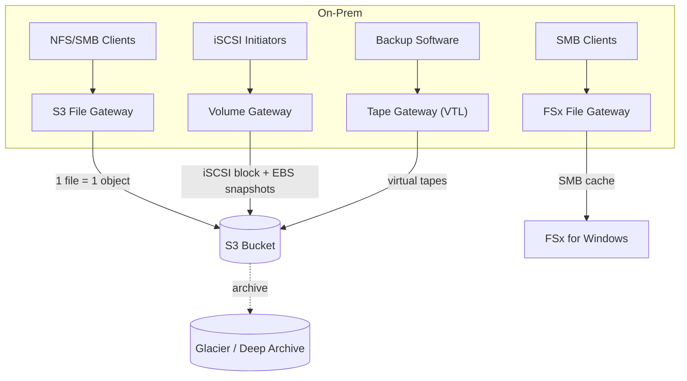

# AWS Storage Gateway Deep Dive (File S3 FSx Volume Tape) - SAA-C03 Deep Dive

> A type-by-type deep dive into **S3 File Gateway**, **FSx File Gateway**, **Volume Gateway (Cached vs Stored)**, and **Tape Gateway (VTL)** - their data flow, protocols, cloud mapping, snapshots, plus **local cache / upload buffer sizing** and **bandwidth throttling**.

See also: [01 - Storage Gateway Intro & Types](01%20-%20Storage%20Gateway%20Intro%20%26%20Types.md) · [03 - Storage Gateway SRE & Exam Scenarios](03%20-%20Storage%20Gateway%20SRE%20%26%20Exam%20Scenarios.md) · [01 - S3 Intro & Core Concepts](01%20-%20S3%20Intro%20%26%20Core%20Concepts.md) · [01 - FSx Intro & Overview](01%20-%20FSx%20Intro%20%26%20Overview.md) · [01 - AWS Backup Intro & Core Concepts](01%20-%20AWS%20Backup%20Intro%20%26%20Core%20Concepts.md)

---

## Table of Contents

- [1. Amazon S3 File Gateway](#1-amazon-s3-file-gateway)
- [2. Amazon FSx File Gateway](#2-amazon-fsx-file-gateway)
- [3. Volume Gateway - Cached](#3-volume-gateway---cached)
- [4. Volume Gateway - Stored](#4-volume-gateway---stored)
- [5. Cached vs Stored (Side by Side)](#5-cached-vs-stored-side-by-side)
- [6. Tape Gateway (VTL)](#6-tape-gateway-vtl)
- [7. Local Cache & Upload Buffer Sizing](#7-local-cache--upload-buffer-sizing)
- [8. Bandwidth Throttling & Network](#8-bandwidth-throttling--network)
- [9. Exam Tips (SAA-C03)](#9-exam-tips-saa-c03)
- [Summary](#summary)

---

---

## 1. Amazon S3 File Gateway

Presents **NFS (v3/v4.1)** and **SMB (v2/v3)** file shares on-prem; each file written becomes a **standalone S3 object** in a bucket you map.

| Aspect          | Detail                                                                                    |
| :-------------- | :---------------------------------------------------------------------------------------- |
| Protocol        | **NFS** and/or **SMB**                                                                    |
| Cloud mapping   | **1 file ↔ 1 S3 object** (file metadata stored as object metadata)                        |
| Bucket mapping  | Each **file share maps to one S3 bucket** (or prefix)                                     |
| Storage classes | Write directly to **S3 Standard, S3 Standard-IA, S3 One Zone-IA, S3 Intelligent-Tiering** |
| Lifecycle       | Use **S3 Lifecycle rules** to transition objects to IA/Glacier/Deep Archive               |
| Auth (SMB)      | Integrates with **Active Directory** (Microsoft AD) or guest access                       |
| Cache           | **Local cache** holds recently used files for low-latency reads                           |

- Because files become **native S3 objects**, other AWS services (Athena, EMR, Glue, Lambda) can read them directly - great for **data-lake ingest**.
- Supports **S3 Object Lock / versioning** at the bucket level and **bucket policies/KMS encryption (SSE-S3 / SSE-KMS)**.

> 🎯 **Exam cue:** "On-prem app writes files; we want them queryable as **S3 objects** / feed an analytics pipeline / apply S3 lifecycle to archive" → **S3 File Gateway**.

> ⚠️ Modifying objects **directly in S3** (outside the gateway) is allowed, but the gateway must **refresh its cache** (`RefreshCache` API / automatic refresh) to see external changes.

[⬆ Back to top](#table-of-contents)

---

## 2. Amazon FSx File Gateway

A **low-latency local SMB cache** in front of an **Amazon FSx for Windows File Server** file system.

| Aspect             | Detail                                                                     |
| :----------------- | :------------------------------------------------------------------------- |
| Protocol           | **SMB only** (Windows-native)                                              |
| Cloud backend      | **Amazon FSx for Windows File Server** (the file system lives in AWS)      |
| Purpose            | Give **remote/branch offices** fast local access to centralized FSx shares |
| Caching            | Frequently accessed data cached **on-prem**; reduces latency & WAN traffic |
| Auth               | **Active Directory** integrated (same as FSx for Windows)                  |
| Features preserved | NTFS ACLs, shadow copies, DFS, full Windows file-system semantics          |

- Solves the problem of users at a remote site experiencing **high latency** reading directly from a cloud FSx file system.
- The **authoritative copy stays in FSx (AWS)**; the gateway just caches.

> 🎯 **Exam cue:** "Branch office users complain about **latency** accessing a Windows (SMB) file share hosted on **FSx for Windows**" → **FSx File Gateway** (local cache). Do **not** confuse with S3 File Gateway (that backs onto S3 objects, not FSx).

[⬆ Back to top](#table-of-contents)

---

## 3. Volume Gateway - Cached

Block storage volumes over **iSCSI** where the **primary dataset lives in S3** and only **frequently accessed data is cached locally**.

| Aspect                | Detail                                                                 |
| :-------------------- | :--------------------------------------------------------------------- |
| Protocol              | **iSCSI** (block)                                                      |
| Primary data location | **Amazon S3** (managed by the service, not directly browsable)         |
| Local storage         | **Cache** (hot data) + **upload buffer** (staging writes)              |
| Volume size           | Up to **32 TB** per volume; up to **32 cached volumes** (≈1 PiB total) |
| Backup                | Point-in-time **EBS snapshots** stored in S3 (incremental)             |
| Best for              | Limited on-prem capacity; want to **extend storage into AWS**          |

- Minimizes the local footprint: you only keep cache locally; the full volume is in S3.
- Snapshots can be **restored as EBS volumes** in AWS (useful for DR / cloud migration).

[⬆ Back to top](#table-of-contents)

---

## 4. Volume Gateway - Stored

Block volumes over **iSCSI** where the **entire dataset is stored on-premises** and **asynchronously backed up to S3 as EBS snapshots**.

| Aspect                | Detail                                                                   |
| :-------------------- | :----------------------------------------------------------------------- |
| Protocol              | **iSCSI** (block)                                                        |
| Primary data location | **On-premises (local disks)** - full dataset                             |
| Cloud role            | **Async backup** → point-in-time **EBS snapshots** in S3                 |
| Volume size           | Up to **16 TB** per volume; up to **32 stored volumes** (≈512 TiB total) |
| Latency               | **Lowest** - all reads served locally                                    |
| Best for              | Need **low-latency access to the entire dataset** + off-site DR backup   |

- All data is local, so reads never wait on the cloud; the cloud copy exists for **durability/DR**.
- On disaster, restore the EBS snapshots in AWS and run workloads on EC2/EBS.

> ⚠️ **Trap:** "Stored" can be misread as "stored in the cloud." It means the **primary copy is stored on-prem**. **Cached** = primary in cloud.

[⬆ Back to top](#table-of-contents)

---

## 5. Cached vs Stored (Side by Side)

| Dimension        | **Cached Volume**                              | **Stored Volume**                                 |
| :--------------- | :--------------------------------------------- | :------------------------------------------------ |
| Primary data     | **In S3 (cloud)**                              | **On-premises**                                   |
| Local disks hold | **Cache + upload buffer**                      | **Full dataset (+ upload buffer)**                |
| Max volume size  | **32 TB**                                      | **16 TB**                                         |
| Total capacity   | ~**1 PiB** (32 × 32 TB)                        | ~**512 TiB** (32 × 16 TB)                         |
| Read latency     | Local for hot data; S3 fetch on miss           | **All local (lowest, consistent)**                |
| Backup           | EBS snapshots (incremental)                    | EBS snapshots (incremental, async)                |
| Choose when      | Local capacity is **limited**; extend into AWS | Need **full low-latency local access** + cloud DR |

> 🎯 **One-liner to memorize:** _Cached = cloud-primary, small local cache. Stored = local-primary, cloud backup._

[⬆ Back to top](#table-of-contents)

---

## 6. Tape Gateway (VTL)

Presents a **Virtual Tape Library (VTL)** over **iSCSI-VTL** to existing backup applications (Veeam, Veritas NetBackup/Backup Exec, Commvault, Dell NetWorker, etc.). Virtual tapes are stored in S3 and archived to Glacier.

| Aspect         | Detail                                                                                        |
| :------------- | :-------------------------------------------------------------------------------------------- |
| Protocol       | **iSCSI-VTL** (looks like a physical tape library + tape drives + media changer)              |
| Backup apps    | Works with leading enterprise backup software unchanged                                       |
| Active tapes   | Stored in **S3** (Virtual Tape Library)                                                       |
| Archived tapes | Move to **S3 Glacier Flexible Retrieval** or **S3 Glacier Deep Archive** (Virtual Tape Shelf) |
| Benefit        | Eliminate physical tapes, tape drives, and **off-site vaulting**                              |

- The backup admin **ejects** a virtual tape → it is **archived** to Glacier/Deep Archive (cheapest long-term).
- To restore, **retrieve** the tape from the shelf back into the library, then restore via the backup app.

> 🎯 **Exam cue:** "Replace **physical tape backups / off-site tape vaulting** while keeping existing **backup software**" → **Tape Gateway**. "Long-term, rarely-accessed archive, lowest cost" → archive tapes to **Deep Archive**.

[⬆ Back to top](#table-of-contents)

---

## 7. Local Cache & Upload Buffer Sizing

The gateway uses **local block storage** (disks you attach) for two roles:

| Disk role         | Purpose                                                      | Used by                                    |
| :---------------- | :----------------------------------------------------------- | :----------------------------------------- |
| **Cache storage** | Holds **recently accessed (hot)** data for low-latency reads | File GW, FSx GW, Cached Volume GW, Tape GW |
| **Upload buffer** | **Stages write data** before it is uploaded to AWS over TLS  | Volume/Tape gateways                       |

Sizing guidance:

- **Provision enough cache** to hold your **working set** - too small → frequent cache misses → slow reads and more S3 GET cost.
- **Provision enough upload buffer** for your **write throughput × upload latency** - too small → the **upload buffer fills**, which **throttles/blocks writes** (see [03 - Storage Gateway SRE & Exam Scenarios](03%20-%20Storage%20Gateway%20SRE%20%26%20Exam%20Scenarios.md)).
- Use **CloudWatch metrics** (`CachePercentUsed`, `CachePercentDirty`, `UploadBufferPercentUsed`) to right-size; add disks if persistently high.
- AWS recommends cache ≥ ~20% of your active dataset as a starting point and adjusting from metrics.

> 💡 Cache/upload-buffer disks should be **fast (SSD)** local storage; their performance directly affects gateway throughput.

[⬆ Back to top](#table-of-contents)

---

## 8. Bandwidth Throttling & Network

- **Bandwidth rate limiting** can cap the gateway's **upload** and **download** rates (KiB/s) so it doesn't saturate a shared WAN link. Configurable per gateway (and schedulable).
- Requires outbound **HTTPS (TCP 443)** to the Storage Gateway and S3 endpoints; supports a **VPC endpoint (PrivateLink)** to keep traffic private.
- **Activation** requires reaching the gateway's local HTTP endpoint to obtain an activation key, then registering to a region.
- Time sync (**NTP**) matters - clock skew can break activation/SMB/AD.

> 🎯 **Exam cue:** "Gateway is **consuming all WAN bandwidth** / impacting other apps" → configure **bandwidth throttling (rate limits)**.

[⬆ Back to top](#table-of-contents)

---

## 9. Exam Tips (SAA-C03)

- ✅ **S3 File GW** → NFS/SMB, **1 file = 1 S3 object**, supports **lifecycle** to IA/Glacier, AD for SMB.
- ✅ **FSx File GW** → **SMB**, local **cache for FSx for Windows**; fixes branch-office latency.
- ✅ **Cached Volume** = primary in **S3** (32 TB/vol). **Stored Volume** = primary **on-prem** (16 TB/vol), async EBS-snapshot backup.
- ✅ **Tape GW (VTL)** → iSCSI-VTL to backup software; tapes in **S3**, archive to **Glacier / Deep Archive**.
- ✅ **Upload buffer full** → writes throttle; **cache too small** → slow reads. Watch **CloudWatch** & add disks.
- ✅ Cap WAN usage with **bandwidth rate limits**; keep traffic private with **VPC endpoint**.

[⬆ Back to top](#table-of-contents)

---

## Summary

Each Storage Gateway type targets a distinct workload: **S3 File Gateway** turns NFS/SMB files into **S3 objects** (lifecycle-friendly, data-lake ready); **FSx File Gateway** caches an **FSx for Windows** SMB file system locally for low latency; **Volume Gateway Cached** keeps the **primary block data in S3** with a small local cache while **Stored** keeps the **full dataset on-prem** with async **EBS-snapshot** backup; **Tape Gateway** presents an **iSCSI-VTL** to backup software with tapes living in **S3 → Glacier/Deep Archive**. Correctly **sizing cache and upload buffer** (watch CloudWatch) and applying **bandwidth throttling / VPC endpoints** are the operational levers. The final note covers troubleshooting, cost, and scenario questions.

[⬆ Back to top](#table-of-contents)
