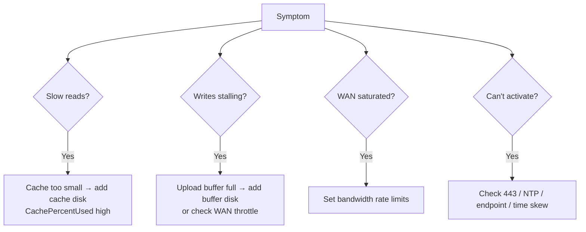

# AWS Storage Gateway SRE & Exam Scenarios - SAA-C03 Deep Dive

> Operational troubleshooting (cache/upload-buffer issues, bandwidth, activation/network, recovery), best practices, cost levers, and **10 scenario-based exam questions** focused on **choosing the right gateway type** and the **Storage Gateway vs DataSync** distinction.

See also: [01 - Storage Gateway Intro & Types](01%20-%20Storage%20Gateway%20Intro%20%26%20Types.md) · [02 - Storage Gateway Deep Dive (File S3 FSx Volume Tape)](02%20-%20Storage%20Gateway%20Deep%20Dive%20%28File%20S3%20FSx%20Volume%20Tape%29.md) · [01 - S3 Intro & Core Concepts](01%20-%20S3%20Intro%20%26%20Core%20Concepts.md) · [01 - FSx Intro & Overview](01%20-%20FSx%20Intro%20%26%20Overview.md) · [01 - AWS Backup Intro & Core Concepts](01%20-%20AWS%20Backup%20Intro%20%26%20Core%20Concepts.md)

---

## Table of Contents

- [1. Common Errors & Troubleshooting](#1-common-errors--troubleshooting)
- [2. Recovery & High Availability](#2-recovery--high-availability)
- [3. Best Practices](#3-best-practices)
- [4. Cost Optimization](#4-cost-optimization)
- [5. Storage Gateway vs DataSync vs Snow](#5-storage-gateway-vs-datasync-vs-snow)
- [6. Scenario Questions (1-5)](#6-scenario-questions-1-5)
- [7. Scenario Questions (6-10)](#7-scenario-questions-6-10)
- [8. Exam Tips (SAA-C03)](#8-exam-tips-saa-c03)
- [Summary](#summary)

---

---

## 1. Common Errors & Troubleshooting

| Symptom                               | Likely cause                                                   | Fix                                                                                 |
| :------------------------------------ | :------------------------------------------------------------- | :---------------------------------------------------------------------------------- |
| **Slow reads / high latency**         | Cache too small → frequent cache misses (data fetched from S3) | Add **cache disk**; check `CachePercentUsed`; size cache to working set             |
| **Writes stall / throttled / errors** | **Upload buffer full** (uploads slower than writes)            | Add **upload buffer disk**; increase WAN bandwidth; check `UploadBufferPercentUsed` |
| **High `CachePercentDirty`**          | Lots of unwritten data still in cache (not yet uploaded)       | Risk of data loss if appliance fails; ensure upload throughput keeps up             |
| **WAN saturated, other apps suffer**  | No bandwidth limit                                             | Configure **bandwidth rate limiting** (upload/download caps, schedulable)           |
| **Activation fails**                  | Port 443 blocked, wrong region endpoint, or **clock skew**     | Open outbound **443**, fix **NTP** time sync, verify endpoint/VPC endpoint          |
| **SMB share auth fails**              | AD/Kerberos issue, time skew                                   | Re-join **Active Directory**, fix NTP                                               |
| **Files changed in S3 not visible**   | Cache stale (object modified outside gateway)                  | Run **RefreshCache** / enable automatic cache refresh (S3 File GW)                  |
| **Gateway unreachable / VM down**     | Host/hardware failure                                          | Recover gateway (see next section); cloud data is durable                           |

> 💡 Drive troubleshooting from **CloudWatch metrics**: `CachePercentUsed`, `CachePercentDirty`, `UploadBufferPercentUsed`, `CloudBytesUploaded/Downloaded`, `IoWaitPercent`, and `HealthNotifications`.

[⬆ Back to top](#table-of-contents)

---

## 2. Recovery & High Availability

- **Data durability:** primary data in **S3/FSx/Glacier** is highly durable regardless of appliance health (for Stored volumes the durable copy is the **EBS snapshots**).
- **Appliance failure:** deploy a **new gateway** and re-attach/restore. For **cached volumes**, you can recover from the latest **EBS snapshot**.
- **VMware HA:** running the gateway VM on **VMware vSphere HA** provides resilience against host failures (AWS supports/validates this).
- **Cache disk loss:** if a cache disk fails, un-uploaded (**dirty**) data not yet sent to AWS can be lost - this is why keeping `CachePercentDirty` low and the upload buffer healthy matters.
- **DR pattern:** Stored/Cached volume EBS snapshots can be restored as **EBS volumes** and attached to **EC2** in AWS for failover.

[⬆ Back to top](#table-of-contents)

---

## 3. Best Practices

- **Right-size cache & upload buffer** from CloudWatch; use **SSD-backed** local disks.
- **Enable bandwidth throttling** on shared/limited WAN links; schedule higher limits off-hours.
- **Use a VPC endpoint (PrivateLink)** to keep gateway↔AWS traffic off the public internet.
- **Encrypt at rest** with **SSE-S3 or SSE-KMS**; data in transit is always **TLS**.
- **Integrate SMB with Active Directory** and keep **NTP** synced.
- **Apply S3 Lifecycle** rules to tier File Gateway objects to IA/Glacier for cost.
- **Monitor** `CachePercentDirty` and **HealthNotifications**; set CloudWatch alarms.
- **Test recovery** (snapshot restore, gateway re-activation) before relying on it for DR.

[⬆ Back to top](#table-of-contents)

---

## 4. Cost Optimization

| Lever                                   | Effect                                                                        |
| :-------------------------------------- | :---------------------------------------------------------------------------- |
| **S3 storage class + Lifecycle**        | Tier File Gateway objects / volume data to IA, Glacier, Deep Archive          |
| **Tape Gateway → Glacier Deep Archive** | Cheapest long-term archive for backup tapes                                   |
| **Cached vs Stored choice**             | Cached keeps less data on costly local disk; Stored needs full local capacity |
| **Bandwidth limits**                    | Avoid over-provisioning WAN; control egress patterns                          |
| **Right-size local disks**              | Don't over-allocate SSD cache beyond the working set                          |

Storage Gateway pricing = **per-GB data stored in AWS** (S3/Glacier/FSx/snapshots) + **request/retrieval** + **data transfer out** + a small **gateway/usage** charge. Transfer **into** AWS is free.

[⬆ Back to top](#table-of-contents)

---

## 5. Storage Gateway vs DataSync vs Snow

| Need                                                                                               | Service                                                 |
| :------------------------------------------------------------------------------------------------- | :------------------------------------------------------ |
| **Ongoing hybrid access** - apps keep using NFS/SMB/iSCSI/tape, data backed by AWS                 | **Storage Gateway**                                     |
| **Online bulk migration / scheduled replication** (on-prem↔AWS, AWS↔AWS), large file/object copies | **AWS DataSync**                                        |
| **Offline / PB-scale** transfer, poor or no network                                                | **AWS Snow Family** (Snowball/Snowmobile)               |
| **Direct private network link** to AWS (not a transfer tool itself)                                | **Direct Connect** (often paired with DataSync/Gateway) |

> ⚠️ **Top exam trap:** Both Storage Gateway and DataSync move data on-prem↔AWS. **DataSync = transfer/migration agent** (move data efficiently, verify, schedule, then often _stop_). **Storage Gateway = persistent storage front-end** (apps continuously read/write via local protocols). A "migrate 50 TB of files once to S3" question → **DataSync**. A "keep serving an on-prem NFS share but back it with S3" question → **S3 File Gateway**.

[⬆ Back to top](#table-of-contents)

---

## 6. Scenario Questions (1-5)

**Q1.** An on-prem app writes files via **NFS**. The business wants those files available as **S3 objects** for an Athena analytics pipeline, with old files auto-archived to Glacier. Which solution?

> ✅ **S3 File Gateway** + **S3 Lifecycle** rules. Files become native S3 objects (queryable by Athena), and lifecycle transitions them to Glacier. _Tip: "files become objects + analytics + lifecycle" = S3 File Gateway._

**Q2.** Users at a **branch office** complain of **high latency** when accessing a Windows **SMB** share that is centrally hosted on **Amazon FSx for Windows File Server**. Lowest-effort fix?

> ✅ **FSx File Gateway** at the branch - provides a **local SMB cache** of the FSx file system, cutting latency while FSx remains authoritative. _Trap: S3 File Gateway is wrong (backs S3 objects, not FSx)._

**Q3.** A company must **migrate 80 TB** of files from an on-prem NAS to S3 **once**, over an existing internet link, with integrity verification, then decommission the NAS. No ongoing local access needed.

> ✅ **AWS DataSync** - purpose-built for one-time/scheduled online transfer with verification. _Trap: Storage Gateway is for ongoing hybrid access, not a one-shot migration._

**Q4.** A datacenter has **limited local disk** but needs to present **iSCSI block volumes** to apps while keeping most data in AWS, with periodic snapshots.

> ✅ **Volume Gateway - Cached** (primary data in S3, hot data cached locally; EBS snapshots for backup). _Tip: limited local capacity + iSCSI + cloud-primary = Cached._

**Q5.** An application needs **low-latency access to its entire dataset** on-prem via iSCSI, but also requires **off-site DR backups** in AWS.

> ✅ **Volume Gateway - Stored** - full dataset stays on-prem (lowest latency for all reads), async **EBS-snapshot** backups to S3 for DR. _Trap: Cached only keeps hot data local._

[⬆ Back to top](#table-of-contents)

---

## 7. Scenario Questions (6-10)

**Q6.** A company runs nightly backups with **Veritas NetBackup** to **physical tapes** shipped off-site. They want to eliminate tape hardware and off-site vaulting while keeping their backup software.

> ✅ **Tape Gateway (VTL)** - presents a virtual tape library to NetBackup; tapes stored in S3, archived to **Glacier/Deep Archive**. _Tip: "existing backup software + replace physical tapes" = Tape Gateway._

**Q7.** After deploying a Volume Gateway, **write operations begin failing/slowing** during the day. CloudWatch shows **`UploadBufferPercentUsed` near 100%**. Fix?

> ✅ The **upload buffer is full** (uploads can't keep pace with writes). **Add more upload buffer disk** and/or increase WAN bandwidth. _Tip: buffer full → writes throttle._

**Q8.** The Storage Gateway is **consuming the entire WAN link**, degrading other business traffic during the day. What should you configure?

> ✅ **Bandwidth rate limiting** (cap upload/download throughput), optionally **scheduled** to allow higher limits at night.

**Q9.** During initial setup, **gateway activation fails**. The appliance has internet access but the time on the host is **15 minutes off**. Likely cause?

> ✅ **Clock skew** - fix **NTP** time synchronization (also verify outbound **443** and the correct regional/VPC endpoint).

**Q10.** A security team requires that **no Storage Gateway traffic traverse the public internet** and that data be encrypted. What do you implement?

> ✅ Use a **VPC endpoint (AWS PrivateLink)** for Storage Gateway/S3 so traffic stays private; data in transit is already **TLS**, and enable **SSE-KMS** at rest.

[⬆ Back to top](#table-of-contents)

---

## 8. Exam Tips (SAA-C03)

- ✅ **Files → S3 objects + lifecycle/analytics** = **S3 File Gateway**.
- ✅ **Branch-office latency to FSx for Windows** = **FSx File Gateway** (SMB cache).
- ✅ **Cached** = cloud-primary + small local cache; **Stored** = local-primary (full dataset) + EBS-snapshot DR.
- ✅ **Replace physical tape backups** keeping backup software = **Tape Gateway → Glacier/Deep Archive**.
- ✅ **Upload buffer full → writes stall**; **cache too small → slow reads**. Add disks, watch CloudWatch.
- ✅ **WAN saturated → bandwidth throttling**; **private traffic → VPC endpoint**; **activation fail → 443/NTP/endpoint**.
- ❌ **One-time/scheduled bulk migration = DataSync**, not Storage Gateway; **offline/PB = Snow Family**.

[⬆ Back to top](#table-of-contents)

---

## Summary

Operationally, Storage Gateway problems cluster into **cache too small (slow reads)**, **upload buffer full (stalled writes)**, **WAN saturation (need throttling)**, and **activation/network/NTP** issues - all diagnosable via **CloudWatch** and fixed by adding disks, limiting bandwidth, or correcting connectivity/time. Durable data lives in **S3/FSx/Glacier/EBS snapshots**, enabling **snapshot-based recovery and DR**. Cost is controlled through **storage-class lifecycle, Deep Archive for tapes, and right-sized local disks**. For the exam, lock in the **gateway-type selection** patterns and the decisive **Storage Gateway (ongoing hybrid access) vs DataSync (bulk transfer/migration) vs Snow (offline/PB)** distinction.

[⬆ Back to top](#table-of-contents)
