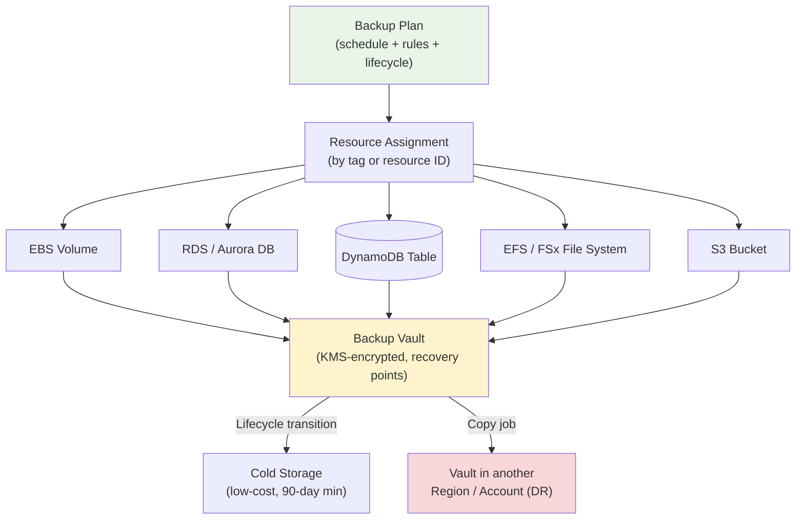

# AWS Backup - Intro & Core Concepts - SAA-C03 Deep Dive

> AWS Backup is a **centralized, fully-managed, policy-driven** backup service that automates and consolidates data protection across many AWS services (EBS, EC2, RDS, DynamoDB, EFS, FSx, S3, Storage Gateway, and more) from a single place. On SAA-C03 it is the go-to answer whenever a scenario asks for **centralized backup, compliance, cross-region/cross-account DR, or immutable/ransomware-proof backups** instead of per-service native snapshots.

See also: [02 - AWS Backup Vault Lock Policies & Cross-Region](02%20-%20AWS%20Backup%20Vault%20Lock%20Policies%20%26%20Cross-Region.md) · [03 - AWS Backup SRE Troubleshooting & Exam Scenarios](03%20-%20AWS%20Backup%20SRE%20Troubleshooting%20%26%20Exam%20Scenarios.md) · [02 - EBS Snapshots & Encryption](02%20-%20EBS%20Snapshots%20%26%20Encryption.md) · [04 - S3 Versioning Replication & Data Protection](04%20-%20S3%20Versioning%20Replication%20%26%20Data%20Protection.md) · [02 - Glacier Retrieval & Vault Operations](02%20-%20Glacier%20Retrieval%20%26%20Vault%20Operations.md)

---

## Table of Contents

- [1. What Is AWS Backup?](#1-what-is-aws-backup)
- [2. Supported Services](#2-supported-services)
- [3. Core Concepts (Vault, Plan, Rules, Assignment)](#3-core-concepts-vault-plan-rules-assignment)
- [4. Backup Plans & Backup Rules](#4-backup-plans--backup-rules)
- [5. Lifecycle: Warm → Cold Storage](#5-lifecycle-warm--cold-storage)
- [6. Resource Assignment (Tags vs Resource IDs)](#6-resource-assignment-tags-vs-resource-ids)
- [7. On-Demand vs Scheduled Backups](#7-on-demand-vs-scheduled-backups)
- [8. RPO / RTO & Backup Frequency](#8-rpo--rto--backup-frequency)
- [9. Continuous Backup & Point-in-Time Recovery (PITR)](#9-continuous-backup--point-in-time-recovery-pitr)
- [10. Key Exam Traps & Takeaways](#10-key-exam-traps--takeaways)

---



---

AWS Backup removes the need to script, schedule, and monitor backups per service. Instead of writing Lambda + EventBridge + DLM for EBS, separate snapshot logic for RDS, and a different job for DynamoDB, you define **one backup plan** and let AWS Backup orchestrate everything, store recovery points in a vault, and enforce retention/lifecycle/compliance centrally.

---

## 1. What Is AWS Backup?

AWS Backup is a **fully-managed backup service** for **centralized policy-based data protection** across AWS services and on-premises (via Storage Gateway / hybrid).

### Core characteristics

| Property                         | Detail                                                                 |
| :------------------------------- | :--------------------------------------------------------------------- |
| **Centralized**                  | One console / API to back up many services across accounts and Regions |
| **Policy-driven**                | Backup **plans** define schedule, retention, lifecycle, and copy rules |
| **Fully managed**                | No servers, agents (mostly), or custom scripts to maintain             |
| **Tag-based**                    | Assign resources to plans automatically via **tags**                   |
| **Encrypted**                    | Recovery points encrypted at rest with **KMS**; in transit via TLS     |
| **Compliant**                    | **Vault Lock (WORM)** + **Audit Manager** for governance/compliance    |
| **Cross-Region / Cross-Account** | Built-in **copy jobs** for DR and isolation                            |

💡 **Mental model:** AWS Backup is the "single control plane" for all your backups — define the policy once, apply it everywhere by tag.

🎯 **Exam trigger phrases:** "centralized backup", "single place to manage backups across services/accounts", "automate and enforce retention", "compliance/immutable backups", "cross-region disaster recovery copies".

[⬆ Back to top](#table-of-contents)

---

## 2. Supported Services

AWS Backup integrates with a broad set of services. You don't need every one memorized, but know the **major categories**.

| Category             | Supported Resources                                                           |
| :------------------- | :---------------------------------------------------------------------------- |
| **Compute / Block**  | **EC2 instances** (AMI-based), **EBS volumes**                                |
| **Databases**        | **RDS**, **Aurora**, **DynamoDB**, **DocumentDB**, **Neptune**, **Redshift**  |
| **File / NAS**       | **EFS**, **Amazon FSx** (Windows, Lustre, ONTAP, OpenZFS)                     |
| **Object**           | **Amazon S3** (continuous + periodic backups)                                 |
| **Hybrid / On-Prem** | **AWS Storage Gateway** (Volume Gateway), **VMware** (on-prem & Cloud on AWS) |
| **Other**            | **CloudFormation stacks**, **SAP HANA on EC2**, **Timestream**                |

🎯 **Exam tip:** If a scenario lists **multiple different services** that all need consistent backup policy/retention, the answer is almost always **AWS Backup**, not per-service tooling (DLM, RDS automated backups, etc.).

⚠️ **Trap:** EC2 backup creates an **AMI + EBS snapshots** behind the scenes — AWS Backup manages this for you as a single recovery point.

[⬆ Back to top](#table-of-contents)

---

## 3. Core Concepts (Vault, Plan, Rules, Assignment)

| Concept                 | What It Is                                                                                                                        |
| :---------------------- | :-------------------------------------------------------------------------------------------------------------------------------- |
| **Backup Vault**        | A logical, **KMS-encrypted container** that stores **recovery points** (backups). Access controlled by a resource (vault) policy. |
| **Recovery Point**      | A single backup of a resource at a point in time (e.g., an EBS snapshot, RDS snapshot, EFS backup). Identified by ARN.            |
| **Backup Plan**         | A policy document containing one or more **backup rules** + resource assignments.                                                 |
| **Backup Rule**         | Defines **when** (schedule), **how long to keep** (retention), **lifecycle** (warm→cold), target **vault**, and **copy** targets. |
| **Resource Assignment** | Selects **which resources** the plan protects — by **tag** or **resource ID**.                                                    |
| **Backup Job**          | An execution of a rule against a resource (succeeds/fails).                                                                       |
| **Copy Job**            | Copies a recovery point to another **vault / Region / account**.                                                                  |

💡 **Default vault:** AWS Backup creates a `Default` vault automatically, but best practice is **purpose-built vaults** (e.g., a locked DR vault) — see [02 - AWS Backup Vault Lock Policies & Cross-Region](02%20-%20AWS%20Backup%20Vault%20Lock%20Policies%20%26%20Cross-Region.md).

[⬆ Back to top](#table-of-contents)

---

## 4. Backup Plans & Backup Rules

A **backup plan** is the heart of AWS Backup. It bundles scheduling, retention, lifecycle, and copy behavior.

### What a backup rule specifies

- **Backup frequency / window** — cron or rate schedule (e.g., daily, hourly, weekly) plus a **start window** and **completion window**.
- **Target backup vault** — where recovery points land.
- **Retention period** — how long to keep (e.g., 35 days, 7 years).
- **Lifecycle** — when to transition to **cold storage** (see §5).
- **Copy actions** — copy recovery points to another Region/account vault for DR.
- **Tags on recovery points** — for organization and cost allocation.

### Example backup plan (JSON-style)

```json
{
  "BackupPlanName": "prod-daily-35d-with-dr-copy",
  "Rules": [
    {
      "RuleName": "DailyBackups",
      "TargetBackupVaultName": "prod-vault",
      "ScheduleExpression": "cron(0 5 ? * * *)",
      "StartWindowMinutes": 60,
      "CompletionWindowMinutes": 180,
      "Lifecycle": {
        "MoveToColdStorageAfterDays": 30,
        "DeleteAfterDays": 365
      },
      "CopyActions": [
        {
          "DestinationBackupVaultArn": "arn:aws:backup:us-west-2:111122223333:backup-vault:dr-vault",
          "Lifecycle": { "DeleteAfterDays": 365 }
        }
      ]
    }
  ]
}
```

🎯 **Exam tip:** A single plan can have **multiple rules** (e.g., hourly with short retention + monthly with long retention) — mimicking a grandfather-father-son tape rotation.

[⬆ Back to top](#table-of-contents)

---

## 5. Lifecycle: Warm → Cold Storage

To cut cost, AWS Backup can move recovery points from **warm storage** (fast, default) to **cold storage** (cheaper, archival).

| Tier             | Behavior                                                                          |
| :--------------- | :-------------------------------------------------------------------------------- |
| **Warm storage** | Default. Fast restores. Higher $/GB.                                              |
| **Cold storage** | Low-cost archival. Restores take longer. **Minimum 90-day storage** once in cold. |

### Lifecycle rules to remember

- A recovery point must spend **at least the warm period before transition**, and the rule must keep it **≥ 90 days total** if moved to cold (the cold tier has a **90-day minimum**).
- `MoveToColdStorageAfterDays` + at least 90 days must be ≤ `DeleteAfterDays`.
- Not all services support cold storage tiering (e.g., it's common for EFS, DynamoDB, VMware; check service support).
- ⚠️ **Deleting early from cold storage still incurs the 90-day minimum charge** — same gotcha as Glacier (see [02 - Glacier Retrieval & Vault Operations](02%20-%20Glacier%20Retrieval%20%26%20Vault%20Operations.md)).

💡 Cold storage is conceptually similar to **Glacier-class** archival — cheap to keep, slower/costlier to restore.

[⬆ Back to top](#table-of-contents)

---

## 6. Resource Assignment (Tags vs Resource IDs)

AWS Backup decides which resources a plan protects via **resource assignment**:

| Method                   | Behavior                                                                                                | Best For                          |
| :----------------------- | :------------------------------------------------------------------------------------------------------ | :-------------------------------- |
| **By tag**               | "Back up everything tagged `Backup=Daily`." New resources with that tag are **automatically included**. | Scalable, dynamic environments ✅ |
| **By resource ID / ARN** | Explicitly list specific resources.                                                                     | Small, fixed sets                 |
| **By resource type**     | All resources of a type (e.g., all EBS) within scope.                                                   | Broad coverage                    |

🎯 **Exam tip:** **Tag-based assignment** is the standard answer for "automatically protect newly created resources without manual updates." Tag a new EBS volume `Backup=Daily` and the plan picks it up on the next run.

⚠️ **Trap:** Resources only get backed up if they match an assignment **and** the AWS Backup **service role** has permission to access them (see [03 - AWS Backup SRE Troubleshooting & Exam Scenarios](03%20-%20AWS%20Backup%20SRE%20Troubleshooting%20%26%20Exam%20Scenarios.md)).

[⬆ Back to top](#table-of-contents)

---

## 7. On-Demand vs Scheduled Backups

| Type          | Description                                                                                                                                     |
| :------------ | :---------------------------------------------------------------------------------------------------------------------------------------------- |
| **Scheduled** | Driven by a **backup plan rule** on a cron/rate schedule. The normal, automated mode.                                                           |
| **On-demand** | A **one-off backup** of a single resource you trigger manually (console/API) — independent of any plan. Useful before a risky change/migration. |

💡 On-demand backups still land in a **vault** and can have their own retention/lifecycle.

[⬆ Back to top](#table-of-contents)

---

## 8. RPO / RTO & Backup Frequency

AWS Backup directly influences your DR objectives:

| Term                               | Meaning                                     | AWS Backup Lever                                                        |
| :--------------------------------- | :------------------------------------------ | :---------------------------------------------------------------------- |
| **RPO** (Recovery Point Objective) | Max acceptable **data loss** (how far back) | **Backup frequency** — hourly backups → ~1 hr RPO; continuous → seconds |
| **RTO** (Recovery Time Objective)  | Max acceptable **downtime to restore**      | **Warm vs cold storage**, restore size, cross-Region copy availability  |

- Want **lower RPO**? Increase frequency or use **continuous backup / PITR** (§9).
- Want **lower RTO**? Keep recovery points in **warm storage** and **pre-position copies in the DR Region**.

🎯 **Exam tip:** "Minimize data loss to a few minutes" → continuous backup / PITR. "Restore quickly in another Region after a disaster" → cross-Region **copy** so the recovery point already exists in the DR Region.

[⬆ Back to top](#table-of-contents)

---

## 9. Continuous Backup & Point-in-Time Recovery (PITR)

For supported services (**S3, RDS, Aurora, SAP HANA**), AWS Backup offers **continuous backups** enabling **point-in-time recovery** to any second within a retention window (up to **35 days** for PITR).

- **Periodic (snapshot) backup** = restore to discrete backup times → coarser RPO.
- **Continuous backup** = restore to **any point in time** in the window → near-zero RPO.

⚠️ **Trap:** Continuous backup is **not** supported for every service — EBS/EFS/DynamoDB use periodic recovery points (though DynamoDB itself has native PITR). Know that **RDS/Aurora/S3** are the headline continuous-backup services in AWS Backup.

[⬆ Back to top](#table-of-contents)

---

## 10. Key Exam Traps & Takeaways

- ✅ AWS Backup = **centralized, policy-based** backup across many services and accounts/Regions.
- ✅ Core objects: **Vault** (storage), **Plan** (policy), **Rule** (schedule/retention/lifecycle/copy), **Assignment** (tags).
- ✅ **Tag-based assignment** auto-protects new resources — the standard "scales automatically" answer.
- ✅ **Lifecycle to cold storage** lowers cost; **90-day minimum** in cold (early delete = full charge).
- ✅ **Cross-Region / cross-account copy** is built in for DR — see [02 - AWS Backup Vault Lock Policies & Cross-Region](02%20-%20AWS%20Backup%20Vault%20Lock%20Policies%20%26%20Cross-Region.md).
- ✅ **RPO ↔ frequency** (or continuous/PITR); **RTO ↔ warm storage + pre-positioned copies**.
- ⚠️ Use AWS Backup over per-service tools (DLM, RDS automated backups) when the scenario needs **central policy/compliance across multiple services**.
- ⚠️ Continuous backup / PITR (35-day window) is limited to **RDS, Aurora, S3, SAP HANA**.
- ⚠️ Backups fail silently if the **IAM service role** lacks permissions or **KMS access** — covered in [03 - AWS Backup SRE Troubleshooting & Exam Scenarios](03%20-%20AWS%20Backup%20SRE%20Troubleshooting%20%26%20Exam%20Scenarios.md).

[⬆ Back to top](#table-of-contents)
