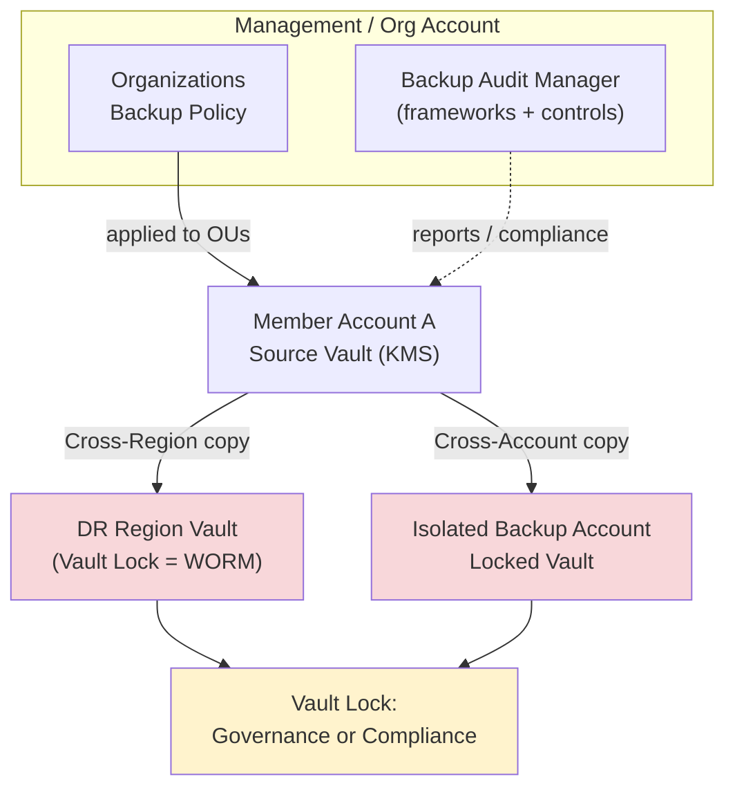

# AWS Backup - Vault Lock, Policies & Cross-Region - SAA-C03 Deep Dive

> This is the **compliance and DR** half of AWS Backup. **Vault Lock** enforces **WORM (write-once-read-many) immutability** to defend against accidental deletion and **ransomware/insider threats**, while **cross-Region / cross-account copy** plus **Organizations backup policies** centralize and harden disaster recovery. AWS Backup Audit Manager proves it all to auditors. These topics are the **highest-yield AWS Backup exam material**.

See also: [01 - AWS Backup Intro & Core Concepts](01%20-%20AWS%20Backup%20Intro%20%26%20Core%20Concepts.md) · [03 - AWS Backup SRE Troubleshooting & Exam Scenarios](03%20-%20AWS%20Backup%20SRE%20Troubleshooting%20%26%20Exam%20Scenarios.md) · [02 - EBS Snapshots & Encryption](02%20-%20EBS%20Snapshots%20%26%20Encryption.md) · [04 - S3 Versioning Replication & Data Protection](04%20-%20S3%20Versioning%20Replication%20%26%20Data%20Protection.md) · [02 - Glacier Retrieval & Vault Operations](02%20-%20Glacier%20Retrieval%20%26%20Vault%20Operations.md)

---

## Table of Contents

- [1. AWS Backup Vault Lock (WORM Immutability)](#1-aws-backup-vault-lock-worm-immutability)
- [2. Governance Mode vs Compliance Mode](#2-governance-mode-vs-compliance-mode)
- [3. Ransomware & Insider-Threat Protection](#3-ransomware--insider-threat-protection)
- [4. Cross-Region Backup Copy](#4-cross-region-backup-copy)
- [5. Cross-Account Backup Copy (via Organizations)](#5-cross-account-backup-copy-via-organizations)
- [6. Backup Policies in AWS Organizations](#6-backup-policies-in-aws-organizations)
- [7. Encryption with KMS](#7-encryption-with-kms)
- [8. Restore Testing](#8-restore-testing)
- [9. AWS Backup Audit Manager](#9-aws-backup-audit-manager)
- [10. Comparison: AWS Backup vs DLM vs S3 Replication](#10-comparison-aws-backup-vs-dlm-vs-s3-replication)
- [11. Key Exam Traps & Takeaways](#11-key-exam-traps--takeaways)

---

---

A robust enterprise backup posture combines **immutable, locked vaults** (so nothing — not even an admin or attacker — can delete backups early) with **copies in a separate Region and a separate, isolated account**, all governed by **Organizations policies** and **audited** continuously.

---

## 1. AWS Backup Vault Lock (WORM Immutability)

**AWS Backup Vault Lock** enforces a **WORM** model on a backup vault: once applied, recovery points **cannot be deleted before their retention expires**, and **retention policies cannot be shortened**.

### What Vault Lock protects against

- Accidental deletion of backups by an operator.
- **Malicious deletion** by a compromised/insider IAM principal — even the **root user** cannot bypass a Compliance-mode lock.
- Retention being **shortened** to expire backups early.

### What it enforces

- Minimum and maximum retention periods.
- Backups are **immutable** for the locked retention duration.
- Applies to **all current and future** recovery points in the vault.

💡 Conceptually this is the AWS Backup equivalent of **S3 Object Lock** and **Glacier Vault Lock** — but spanning **all** AWS Backup-supported services in one vault.

[⬆ Back to top](#table-of-contents)

---

## 2. Governance Mode vs Compliance Mode

Vault Lock has **two modes** — this distinction is a classic exam question.

| Aspect                         | **Governance Mode**                                   | **Compliance Mode**                                                          |
| :----------------------------- | :---------------------------------------------------- | :--------------------------------------------------------------------------- |
| **Can it be removed/changed?** | Yes — by principals with **special IAM permissions**  | **No** — irreversible once the cooling-off period ends, **not even by root** |
| **Purpose**                    | Prevent accidental changes, allow privileged override | Hard regulatory immutability (SEC 17a-4, FINRA, etc.)                        |
| **Cooling-off / grace period** | N/A (changeable)                                      | **3-day minimum** "grace time" before lock becomes permanent                 |
| **Use when**                   | You want guardrails but keep an escape hatch          | You must **guarantee** backups cannot be altered/deleted by anyone           |

🎯 **Exam decoder:**

- "Prevent **accidental** deletion but allow authorized admins to adjust" → **Governance mode**.
- "**Regulatory / WORM / cannot be deleted by anyone including root / ransomware-proof**" → **Compliance mode**.

⚠️ **Trap:** Once **Compliance mode** lock is finalized (after the grace period), it is **immutable and irreversible** — you cannot shorten retention, delete the vault, or remove the lock. Test thoroughly before locking.

[⬆ Back to top](#table-of-contents)

---

## 3. Ransomware & Insider-Threat Protection

A common SAA-C03 scenario: "protect backups from ransomware / a compromised admin."

**Defense-in-depth recipe:**

1. **Vault Lock in Compliance mode** → backups are immutable; attacker cannot delete or shorten retention.
2. **Cross-account copy to an isolated "backup account"** → attacker with access to the production account still can't reach the copies.
3. **Cross-Region copy** → survives a Regional event or a Region-scoped compromise.
4. **KMS encryption** with tightly controlled key policies.
5. **Least-privilege IAM** + **SCPs** restricting who can touch vaults.

🎯 **Exam tip:** When the question says **"ransomware," "immutable," "cannot be deleted even by an administrator"** → the keyword answer is **AWS Backup Vault Lock (Compliance mode)**, often combined with a **separate backup account**.

[⬆ Back to top](#table-of-contents)

---

## 4. Cross-Region Backup Copy

AWS Backup can automatically **copy recovery points to a vault in another Region** as part of a backup rule's **copy action**, or on demand.

- Provides **DR resilience** against a full Region outage.
- The copy lands in a **destination vault** that can have its **own lifecycle and Vault Lock**.
- If the source uses a **customer-managed KMS key**, the destination Region needs an accessible key (AWS Backup re-encrypts with the destination vault's key).

🎯 **Exam tip:** "Restore quickly in another Region after a disaster" → enable **cross-Region copy** so the recovery point is **already pre-positioned** in the DR Region (improves RTO).

[⬆ Back to top](#table-of-contents)

---

## 5. Cross-Account Backup Copy (via Organizations)

AWS Backup can **copy recovery points to a vault in a different AWS account** — typically a **dedicated, isolated backup/archive account**.

### Requirements

- Must be within the **same AWS Organization**.
- **Cross-account backup must be enabled** in AWS Backup settings (management account).
- The **destination vault's access policy** must allow copies from the source account.
- KMS key policies must permit the cross-account operation.

💡 **Why:** Isolating backups in a separate account creates a **blast-radius boundary** — a compromise or fat-finger in the production account cannot destroy the backups stored elsewhere.

⚠️ **Trap:** Cross-account copy + **Vault Lock (Compliance)** in the destination = the gold-standard ransomware/insider-threat architecture.

[⬆ Back to top](#table-of-contents)

---

## 6. Backup Policies in AWS Organizations

**Backup policies** are an **AWS Organizations policy type** that let the **management account** centrally define backup plans and **push them to member accounts / OUs**.

| Feature           | Detail                                                              |
| :---------------- | :------------------------------------------------------------------ |
| **Scope**         | Attach to **root, OUs, or accounts** — inherited down the tree      |
| **Effect**        | Enforces consistent backup plans org-wide without per-account setup |
| **Combined with** | **Cross-account monitoring** (central view of all backup jobs)      |
| **Governance**    | Member accounts cannot remove org-enforced backup plans             |

🎯 **Exam tip:** "Enforce a **consistent backup policy across all accounts** in the organization, centrally managed" → **AWS Organizations backup policies** + AWS Backup. This is a **service control / data-protection** style answer, not per-account configuration.

[⬆ Back to top](#table-of-contents)

---

## 7. Encryption with KMS

- Recovery points in a vault are **encrypted at rest with KMS** (AWS-managed or **customer-managed CMK**).
- The **vault's KMS key** governs encryption for backups stored there — independent of the source resource's encryption in many cases (AWS Backup can **re-encrypt** to the vault key).
- For **cross-account / cross-Region copy**, the **KMS key policy** must grant the necessary `kms:` permissions to AWS Backup / the destination account, or the copy job **fails**.

⚠️ **Trap (very common):** A cross-account copy job fails because the **destination KMS key policy** doesn't allow the source account. Always grant cross-account `kms:Decrypt`, `kms:GenerateDataKey`, `kms:CreateGrant` appropriately (see [03 - AWS Backup SRE Troubleshooting & Exam Scenarios](03%20-%20AWS%20Backup%20SRE%20Troubleshooting%20%26%20Exam%20Scenarios.md)).

[⬆ Back to top](#table-of-contents)

---

## 8. Restore Testing

**AWS Backup restore testing** lets you **automatically and periodically validate that backups are restorable** — proving recoverability for compliance and confidence.

- Define a **restore testing plan**: which recovery points, how often, target settings.
- AWS Backup performs an automated **test restore** and reports **success/failure** and **restore time**.
- Helps validate **RTO** assumptions and detect silently broken backups.

🎯 **Exam tip:** "Regularly verify that backups can actually be restored / meet RTO without manual effort" → **AWS Backup restore testing**.

[⬆ Back to top](#table-of-contents)

---

## 9. AWS Backup Audit Manager

**AWS Backup Audit Manager** continuously **audits and reports** on backup activity against your defined requirements.

| Component             | Purpose                                                                                                                                        |
| :-------------------- | :--------------------------------------------------------------------------------------------------------------------------------------------- |
| **Framework**         | A collection of **controls** that represent your backup requirements                                                                           |
| **Control**           | A rule to evaluate, e.g., "resources are backed up daily," "backups retained ≥ 35 days," "backups copied to another Region," "vault is locked" |
| **Report**            | Compliance evidence (CSV/JSON to S3) showing pass/fail per resource                                                                            |
| **Compliance status** | Continuous evaluation; flags non-compliant resources                                                                                           |

💡 Built on **AWS Config** under the hood — controls evaluate the actual backup state of resources.

🎯 **Exam tip:** "Prove to auditors that all required resources are being backed up per policy / generate compliance reports" → **AWS Backup Audit Manager** (frameworks → controls → reports).

[⬆ Back to top](#table-of-contents)

---

## 10. Comparison: AWS Backup vs DLM vs S3 Replication

| Capability               | **AWS Backup**                                      | **EBS Data Lifecycle Manager (DLM)**   | **S3 Replication (CRR/SRR)**             |
| :----------------------- | :-------------------------------------------------- | :------------------------------------- | :--------------------------------------- |
| **Scope**                | Many services (EBS, RDS, DynamoDB, EFS, FSx, S3, …) | **EBS snapshots & AMIs only**          | **S3 objects only**                      |
| **Centralized policy**   | ✅ Yes (plans, tags, Org policies)                  | Per-account EBS lifecycle policies     | Per-bucket replication rules             |
| **Cross-Region**         | ✅ Copy jobs                                        | ✅ Cross-Region snapshot copy          | ✅ CRR (object copy)                     |
| **Cross-Account**        | ✅ (via Organizations)                              | Limited (snapshot share/copy)          | ✅ (cross-account replication)           |
| **Immutability / WORM**  | ✅ **Vault Lock**                                   | ❌ (rely on IAM only)                  | ✅ **Object Lock** (separate feature)    |
| **Compliance reporting** | ✅ **Audit Manager**                                | ❌                                     | Via S3 + Config                          |
| **Restore testing**      | ✅                                                  | ❌                                     | N/A (live copy)                          |
| **Best for**             | Centralized, multi-service, compliant backup & DR   | Simple automated EBS snapshot rotation | Continuous object-level S3 redundancy/DR |

🎯 **When to choose which:**

- **Multiple services / central policy / compliance / immutability** → **AWS Backup**.
- **Only EBS snapshots, simple rotation, no central console needed** → **DLM** (cheaper/simpler — see [02 - EBS Snapshots & Encryption](02%20-%20EBS%20Snapshots%20%26%20Encryption.md)).
- **Continuous, low-RPO S3 object copies to another Region/account** → **S3 Replication** (see [04 - S3 Versioning Replication & Data Protection](04%20-%20S3%20Versioning%20Replication%20%26%20Data%20Protection.md)).

⚠️ **Trap:** S3 Replication and DLM are **not backups** in the WORM sense by themselves — replication copies deletes/overwrites too (unless versioning + delete-marker handling). For **immutable, retained backups**, AWS Backup Vault Lock or S3 Object Lock is the answer.

[⬆ Back to top](#table-of-contents)

---

## 11. Key Exam Traps & Takeaways

- ✅ **Vault Lock = WORM immutability** for backups across all supported services.
- ✅ **Governance mode** = removable by privileged IAM; **Compliance mode** = **irreversible, not even root**, with a **3-day grace period**.
- ✅ **Ransomware/insider answer** = Vault Lock **Compliance** + **cross-account isolated vault** (+ cross-Region).
- ✅ **Cross-Region copy** improves DR/RTO (pre-positioned recovery points).
- ✅ **Cross-account copy** requires the **same Organization**, enabled cross-account setting, vault access policy, and **KMS permissions**.
- ✅ **Organizations backup policies** enforce backup plans org-wide centrally.
- ✅ **Audit Manager** (frameworks → controls → reports) proves compliance; **restore testing** proves recoverability.
- ⚠️ Cross-account/Region copy fails on **misconfigured destination KMS key policies** — extremely common.
- ⚠️ Choose **AWS Backup** over DLM/S3 Replication when you need **multi-service, central, compliant, immutable** protection.

[⬆ Back to top](#table-of-contents)
