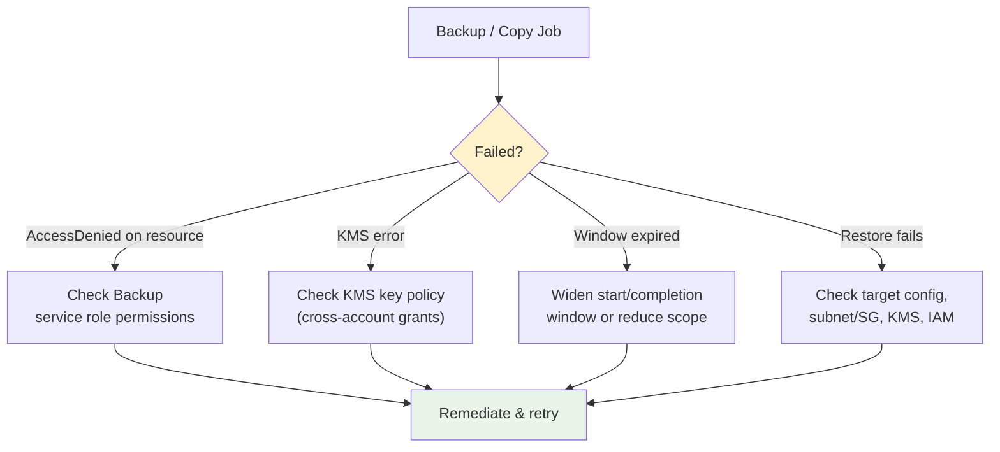

# AWS Backup - SRE Troubleshooting & Exam Scenarios - SAA-C03 Deep Dive

> The operational reality: most AWS Backup failures come down to **IAM service-role permissions**, **KMS key policies (especially cross-account)**, **backup windows / SLA misses**, and **restore configuration**. This file covers how to diagnose and fix those, the **best practices** (centralized vault, Vault Lock, cross-Region DR, least privilege), **cost** considerations, and **10 scenario-based exam questions** with answers, explanations, and exam tips.

See also: [01 - AWS Backup Intro & Core Concepts](01%20-%20AWS%20Backup%20Intro%20%26%20Core%20Concepts.md) · [02 - AWS Backup Vault Lock Policies & Cross-Region](02%20-%20AWS%20Backup%20Vault%20Lock%20Policies%20%26%20Cross-Region.md) · [02 - EBS Snapshots & Encryption](02%20-%20EBS%20Snapshots%20%26%20Encryption.md) · [04 - S3 Versioning Replication & Data Protection](04%20-%20S3%20Versioning%20Replication%20%26%20Data%20Protection.md) · [02 - Glacier Retrieval & Vault Operations](02%20-%20Glacier%20Retrieval%20%26%20Vault%20Operations.md)

---

## Table of Contents

- [1. Common Errors & Troubleshooting](#1-common-errors--troubleshooting)
- [2. IAM Service Role & Permissions](#2-iam-service-role--permissions)
- [3. KMS Access for Cross-Account / Cross-Region](#3-kms-access-for-cross-account--cross-region)
- [4. Restore Failures](#4-restore-failures)
- [5. Backup Window & SLA Misses](#5-backup-window--sla-misses)
- [6. Monitoring & Alerting](#6-monitoring--alerting)
- [7. Best Practices](#7-best-practices)
- [8. Cost Considerations](#8-cost-considerations)
- [9. Scenario-Based Exam Questions](#9-scenario-based-exam-questions)
- [10. Final Exam Tips](#10-final-exam-tips)

---



---

## 1. Common Errors & Troubleshooting

| Symptom                                   | Likely Cause                                               | Fix                                                                                               |
| :---------------------------------------- | :--------------------------------------------------------- | :------------------------------------------------------------------------------------------------ |
| Backup job **fails: AccessDenied**        | Backup **service role** lacks permission on the resource   | Attach/repair the AWS Backup IAM service role (§2)                                                |
| Copy job **fails (cross-account/Region)** | **KMS key policy** doesn't grant the destination/source    | Add cross-account KMS permissions + vault access policy (§3)                                      |
| Job **expired / window too small**        | `StartWindow` / `CompletionWindow` too short for data size | Widen the window; stagger schedules (§5)                                                          |
| **No resources backed up**                | Tag/assignment mismatch or role can't see resources        | Verify tag keys/values and assignment; check role (§2)                                            |
| **Restore fails**                         | Wrong target settings, missing subnet/SG/KMS, role perms   | Validate restore parameters (§4)                                                                  |
| **Cannot delete recovery point / vault**  | **Vault Lock** active (esp. Compliance mode)               | Expected — immutability is by design (see [02 - AWS Backup Vault Lock Policies & Cross-Region](02%20-%20AWS%20Backup%20Vault%20Lock%20Policies%20%26%20Cross-Region.md)) |
| Backup **stuck/pending**                  | Resource busy, concurrent snapshot limits, throttling      | Retry; check service snapshot quotas                                                              |

💡 **First diagnostic step:** open the **Backup job** (or Copy job) details — the **Status message** usually names the exact failure (AccessDenied, KMS, window expired).

[⬆ Back to top](#table-of-contents)

---

## 2. IAM Service Role & Permissions

AWS Backup assumes an **IAM service role** to access resources, create/copy/restore recovery points, and write to vaults.

- AWS provides the **`AWSBackupDefaultServiceRole`** with managed policies:
  - `AWSBackupServiceRolePolicyForBackup`
  - `AWSBackupServiceRolePolicyForRestores`
  - (and a copy/S3 variant for those features)
- The role needs a **trust policy** allowing `backup.amazonaws.com` to assume it.
- For **least privilege**, scope custom roles to specific resource ARNs/tags rather than `*`.

### Common IAM failure pattern

```text
Backup job failed: "Access Denied" — the IAM role
arn:aws:iam::111122223333:role/AWSBackupDefaultServiceRole
is not authorized to perform: ec2:CreateSnapshot on the resource.
```

**Fix:** ensure the service role has the relevant `Backup`/`Restore` managed policies (or equivalent permissions) and a valid trust relationship.

🎯 **Exam tip:** "Backup jobs fail with AccessDenied" → the **AWS Backup service role / IAM permissions** are the answer, not the network or the vault.

[⬆ Back to top](#table-of-contents)

---

## 3. KMS Access for Cross-Account / Cross-Region

KMS is the **#1 cause of failed copy jobs** in real life and on the exam.

- Vault recovery points are **KMS-encrypted**. Copying to another **account/Region** requires the operation to **decrypt with the source key** and **re-encrypt with the destination vault key**.
- The **destination KMS key policy** must allow the **source account / AWS Backup** to use it (`kms:Decrypt`, `kms:GenerateDataKey`, `kms:CreateGrant`, `kms:DescribeKey`).
- The **destination vault access policy** must allow copies from the source.
- Cross-account copy must be **enabled** in the management account, and accounts must share an **Organization**.

⚠️ **Trap:** Using a **default AWS-managed KMS key** for cross-account copy **won't work** — AWS-managed keys can't be shared cross-account. You **must** use a **customer-managed CMK** with an appropriate key policy.

🎯 **Exam tip:** "Cross-account backup copy fails / can't decrypt" → fix the **customer-managed KMS key policy** to grant the other account.

[⬆ Back to top](#table-of-contents)

---

## 4. Restore Failures

Restores create **new resources** from a recovery point; failures usually stem from **target configuration**:

| Cause                           | Detail / Fix                                                                                                 |
| :------------------------------ | :----------------------------------------------------------------------------------------------------------- |
| **Missing restore permissions** | Service role needs the **Restores** policy (e.g., `ec2:RunInstances`, `rds:RestoreDBInstanceFromDBSnapshot`) |
| **KMS access**                  | The role must `Decrypt` with the recovery point's key                                                        |
| **Networking**                  | Restored RDS/EC2 needs valid **subnet/SG/parameter group**; mismatch fails the restore                       |
| **Cold storage delay**          | Recovery points in **cold storage** take longer to restore — not a failure, just latency                     |
| **Service quotas**              | Hitting EBS/RDS limits in the target Region/account                                                          |

💡 **Validate proactively** with **restore testing** (see [02 - AWS Backup Vault Lock Policies & Cross-Region](02%20-%20AWS%20Backup%20Vault%20Lock%20Policies%20%26%20Cross-Region.md)) so you discover broken restores **before** a real disaster.

[⬆ Back to top](#table-of-contents)

---

## 5. Backup Window & SLA Misses

Each rule has a **start window** (must begin within) and **completion window** (must finish within).

- If a job **doesn't start within the start window**, it's **abandoned** (counts as failed/expired).
- Large datasets + short windows → missed completion → **SLA miss**.

**Fixes:**

- Increase **CompletionWindowMinutes** for big resources.
- **Stagger schedules** to avoid contention (many jobs at the same minute throttle/queue).
- Reduce the number of resources per single window, or split into multiple rules.

🎯 **Exam tip:** "Backups intermittently fail to complete in time / window expired" → adjust **start/completion windows** and **stagger schedules**.

[⬆ Back to top](#table-of-contents)

---

## 6. Monitoring & Alerting

| Tool                               | Use                                                          |
| :--------------------------------- | :----------------------------------------------------------- |
| **AWS Backup console / Jobs view** | See backup, copy, restore job status & messages              |
| **EventBridge**                    | React to backup job state changes (e.g., notify on `FAILED`) |
| **Amazon SNS**                     | Backup **vault notifications** for job events → email/Slack  |
| **CloudWatch**                     | Metrics on jobs; alarm on failures                           |
| **AWS Backup Audit Manager**       | Continuous compliance evaluation & reports                   |

🎯 **Exam tip:** "Get notified when a backup job fails" → **EventBridge rule** (or vault SNS notifications) → **SNS**.

[⬆ Back to top](#table-of-contents)

---

## 7. Best Practices

- ✅ **Centralize** with AWS Backup + **tag-based assignment** so new resources are auto-protected.
- ✅ **Separate vaults** by purpose/sensitivity; use a **dedicated, isolated backup account**.
- ✅ **Vault Lock (Compliance mode)** for regulated/ransomware-sensitive data — but **test first** (irreversible).
- ✅ **Cross-Region copy** for DR; **cross-account copy** for blast-radius isolation.
- ✅ **Least-privilege** service roles scoped to ARNs/tags; restrict vault access via resource policies + **SCPs**.
- ✅ **Customer-managed KMS keys** with explicit policies for cross-account/Region.
- ✅ **Restore testing** + **Audit Manager** to prove recoverability and compliance.
- ✅ Use **Organizations backup policies** for org-wide consistency.
- ✅ Tune **windows** and **stagger schedules** to meet SLAs.

[⬆ Back to top](#table-of-contents)

---

## 8. Cost Considerations

| Cost Driver                  | Notes                                                               |
| :--------------------------- | :------------------------------------------------------------------ |
| **Warm storage**             | Per-GB-month of backup data; higher than cold                       |
| **Cold storage**             | Cheaper per-GB, but **90-day minimum** (early delete = full charge) |
| **Restore**                  | Charged per GB restored (varies by service/tier)                    |
| **Cross-Region copy**        | **Data transfer** + storage in the destination Region               |
| **Cross-account copy**       | Storage in destination account's vault                              |
| **Continuous backup / PITR** | Additional cost for change-data capture                             |

💡 **Cost levers:** lifecycle to **cold storage** for long retention, avoid over-frequent backups (balance against RPO), and **expire** recovery points you no longer need (subject to Vault Lock).

⚠️ **Trap:** Over-aggressive backup frequency or keeping everything in **warm** storage indefinitely inflates cost. Match **frequency to RPO** and **lifecycle to retention need**.

[⬆ Back to top](#table-of-contents)

---

## 9. Scenario-Based Exam Questions

**Q1.** A company runs EBS, RDS, DynamoDB, and EFS and wants a **single place** to define and enforce backup schedules and retention across all of them. What should they use?

- **A:** **AWS Backup** with a backup plan and tag-based resource assignment.
- **Why:** Centralized, multi-service, policy-based backup — exactly AWS Backup's purpose. Per-service tools (DLM, RDS automated backups) don't centralize.
- 🎯 _Tip:_ "single place / multiple services / enforce retention" = AWS Backup.

**Q2.** A regulated firm must ensure backups **cannot be deleted by anyone — including the root user — for 7 years**. What configuration?

- **A:** AWS Backup **Vault Lock in Compliance mode** with a 7-year retention.
- **Why:** Compliance mode is **irreversible**; not even root can shorten retention or delete recovery points.
- 🎯 _Tip:_ "cannot be deleted even by root / regulatory WORM" = Compliance mode.

**Q3.** Backups must survive an **entire AWS Region outage** and allow fast restore elsewhere. What do you configure?

- **A:** A **cross-Region copy** action in the backup rule to a vault in the DR Region.
- **Why:** Pre-positioned recovery points in another Region give Regional DR and better RTO.
- 🎯 _Tip:_ "survive a Region outage / restore in another Region" = cross-Region copy.

**Q4.** Security wants backups protected so that **even a compromised production-account admin** cannot delete them. Best approach?

- **A:** **Cross-account copy** to an **isolated backup account** + **Vault Lock (Compliance)** on the destination vault.
- **Why:** Isolation across accounts + immutability defeats insider/ransomware deletion.
- 🎯 _Tip:_ "compromised admin / ransomware / isolate backups" = separate account + Vault Lock.

**Q5.** A cross-account copy job **fails with a KMS error**. The vault uses the **default AWS-managed key**. Fix?

- **A:** Re-encrypt with a **customer-managed CMK** and grant the destination account permissions in its **key policy**.
- **Why:** AWS-managed keys **cannot be shared cross-account**; only CMKs with explicit policies work.
- 🎯 _Tip:_ cross-account KMS = customer-managed key + key policy grants.

**Q6.** Backup jobs fail with **"Access Denied"** when creating EBS snapshots. Most likely cause?

- **A:** The **AWS Backup service role** lacks the required permissions / trust.
- **Why:** AWS Backup assumes a service role; missing backup permissions cause AccessDenied.
- 🎯 _Tip:_ AccessDenied on backup = IAM service role.

**Q7.** The company must **prove to auditors** that every tagged resource is backed up daily and copied to a second Region. What feature provides continuous compliance reports?

- **A:** **AWS Backup Audit Manager** (frameworks → controls → reports).
- **Why:** It evaluates resources against controls and generates compliance reports.
- 🎯 _Tip:_ "prove compliance / audit reports for backups" = Audit Manager.

**Q8.** They want to **regularly verify backups are actually restorable** and measure restore time, without manual effort. What should they enable?

- **A:** **AWS Backup restore testing** (restore testing plan).
- **Why:** Automates periodic test restores and reports success/time.
- 🎯 _Tip:_ "verify restorability / validate RTO automatically" = restore testing.

**Q9.** New EC2 volumes are created frequently and must be **automatically included** in backups without editing the plan each time. How?

- **A:** Use **tag-based resource assignment** (e.g., `Backup=Daily`); tag new volumes accordingly.
- **Why:** Tag-based selection dynamically includes any matching resource.
- 🎯 _Tip:_ "automatically protect new resources" = tag-based assignment.

**Q10.** Across a 50-account AWS Organization, leadership wants a **uniform backup policy enforced centrally** that member accounts cannot remove. What's the solution?

- **A:** **AWS Organizations backup policies** (managed in the management account, attached to OUs).
- **Why:** Org backup policies push and enforce plans org-wide; members can't delete them.
- 🎯 _Tip:_ "enforce backup policy across all org accounts centrally" = Organizations backup policies.

[⬆ Back to top](#table-of-contents)

---

## 10. Final Exam Tips

- ✅ **Centralized, multi-service backup** → **AWS Backup** (over DLM / native snapshots).
- ✅ **Immutable / ransomware / "even root can't delete"** → **Vault Lock Compliance mode**; **"admins can still override"** → **Governance mode**.
- ✅ **Region DR** → **cross-Region copy**; **isolation from compromise** → **cross-account copy** to a separate backup account.
- ✅ **Cross-account/Region copy needs a customer-managed KMS key** with proper key policy — default keys fail.
- ✅ **AccessDenied backups** → fix the **service role**; **window expired** → widen windows / stagger.
- ✅ **Compliance proof** → **Audit Manager**; **recoverability proof** → **restore testing**.
- ✅ **Org-wide enforcement** → **Organizations backup policies**.
- ✅ **Auto-include new resources** → **tag-based assignment**.
- ✅ **Cost:** match **frequency↔RPO**, **lifecycle↔retention**; remember the **90-day cold minimum**.
- ⚠️ Vault Lock Compliance is **irreversible** — never the answer if the requirement says "must be able to undo."

[⬆ Back to top](#table-of-contents)
