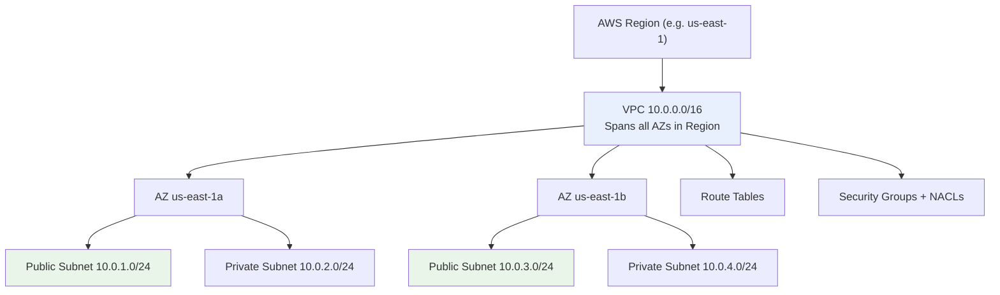

# VPC Fundamentals & Architecture - SAA-C03 Deep Dive

> An **Amazon VPC** is a logically isolated, software-defined network in the AWS cloud where you launch resources into a virtual network you fully control - IP ranges, subnets, route tables, and gateways. The foundation of the entire Networking domain.

See also: [02 - Subnets, Route Tables & Gateways (IGW, NAT)](02%20-%20Subnets%2C%20Route%20Tables%20%26%20Gateways%20%28IGW%2C%20NAT%29.md) · [03 - Security Groups & Network ACLs](03%20-%20Security%20Groups%20%26%20Network%20ACLs.md) · [04 - VPC Endpoints & PrivateLink Basics](04%20-%20VPC%20Endpoints%20%26%20PrivateLink%20Basics.md) · [05 - VPC Peering, DNS & Flow Logs](05%20-%20VPC%20Peering%2C%20DNS%20%26%20Flow%20Logs.md) · [06 - VPC Exam Scenarios & Cheat Sheet](06%20-%20VPC%20Exam%20Scenarios%20%26%20Cheat%20Sheet.md)

---

## Table of Contents

- [What Is a VPC?](#what-is-a-vpc)
- [VPC Scope: Region, AZ, and Account](#vpc-scope-region-az-and-account)
- [CIDR Blocks: Sizing Your VPC (/16 to /28)](#cidr-blocks-sizing-your-vpc-16-to-28)
- [Default VPC vs Custom VPC](#default-vpc-vs-custom-vpc)
- [Reserved IP Addresses (The Magic 5)](#reserved-ip-addresses-the-magic-5)
- [IPv4 and IPv6 in a VPC](#ipv4-and-ipv6-in-a-vpc)
- [Secondary CIDR Blocks](#secondary-cidr-blocks)
- [Tenancy: Default vs Dedicated](#tenancy-default-vs-dedicated)
- [VPC Planning & Sizing Best Practices](#vpc-planning--sizing-best-practices)
- [Summary: Key Takeaways for SAA-C03](#summary-key-takeaways-for-saa-c03)

---



---

## What Is a VPC?

A **Virtual Private Cloud (VPC)** is your own private, isolated section of the AWS cloud. It behaves like a traditional on-premises network but with the elasticity and scale of AWS. Within a VPC you control:

| Control               | Description                                                      |
| :-------------------- | :--------------------------------------------------------------- |
| **IP address ranges** | The CIDR block(s) the VPC uses                                   |
| **Subnets**           | Subdivisions of the CIDR mapped to specific AZs                  |
| **Route tables**      | Where traffic from subnets is directed                           |
| **Gateways**          | Internet Gateway, NAT Gateway, VPN, Transit Gateway, etc.        |
| **Security**          | Security Groups (instance level) and Network ACLs (subnet level) |

Key facts:

- A VPC is **isolated by default** - nothing inside can reach the internet until you add an Internet Gateway and routes.
- Resources in a VPC are launched **into subnets**, never directly into the VPC.
- You can have **up to 5 VPCs per Region** by default (soft limit, raise via quota increase).

> **Exam Tip:** A VPC is a regional construct - it cannot span multiple AWS Regions. To connect VPCs across Regions you use **VPC Peering** or **Transit Gateway** (inter-region peering).

[⬆ Back to top](#table-of-contents)

---

## VPC Scope: Region, AZ, and Account

Understanding the scope of each component is a frequent exam point.

| Resource              | Scope           | Notes                                             |
| :-------------------- | :-------------- | :------------------------------------------------ |
| **VPC**               | Region          | Spans **all** Availability Zones in the Region    |
| **Subnet**            | Single AZ       | A subnet lives in exactly one AZ; cannot span AZs |
| **Availability Zone** | Within a Region | Physically isolated datacenters                   |
| **Route Table**       | VPC (Region)    | Associated with subnets                           |
| **Internet Gateway**  | VPC (Region)    | One per VPC                                       |
| **Security Group**    | VPC (Region)    | Cannot be referenced across VPCs unless peered    |

> **Exam Trap:** "A subnet spans multiple AZs" is **false**. A VPC spans all AZs, but each subnet is tied to one AZ. For high availability you create one subnet per AZ.

[⬆ Back to top](#table-of-contents)

---

## CIDR Blocks: Sizing Your VPC (/16 to /28)

A VPC's IP range is defined by a **CIDR (Classless Inter-Domain Routing)** block. AWS restricts the primary IPv4 CIDR to between **/16 (65,536 IPs)** and **/28 (16 IPs)**.

| CIDR  | Total IPs | Usable (per VPC math) | Typical Use          |
| :---- | :-------- | :-------------------- | :------------------- |
| `/16` | 65,536    | Largest allowed       | Large production VPC |
| `/20` | 4,096     | Mid-size              | Common subnet sizing |
| `/24` | 256       | 251 usable per subnet | Standard subnet      |
| `/28` | 16        | 11 usable per subnet  | Smallest allowed     |

### RFC 1918 Private Ranges (recommended)

| Range                             | CIDR             |
| :-------------------------------- | :--------------- |
| `10.0.0.0` – `10.255.255.255`     | `10.0.0.0/8`     |
| `172.16.0.0` – `172.31.255.255`   | `172.16.0.0/12`  |
| `192.168.0.0` – `192.168.255.255` | `192.168.0.0/16` |

> **Exam Tip:** You **cannot change or resize** a VPC's primary CIDR after creation. You can only **add secondary CIDR blocks**. Plan large enough up front (a `/16` is the common safe default).

> **Exam Trap:** The CIDR must be `/16` to `/28`. A `/8` or `/30` for the **VPC primary** range is invalid. (Subnets follow the VPC's allowed range.)

[⬆ Back to top](#table-of-contents)

---

## Default VPC vs Custom VPC

Every AWS account comes with a **default VPC** in each Region so you can launch instances immediately.

| Feature                   | Default VPC                           | Custom VPC                     |
| :------------------------ | :------------------------------------ | :----------------------------- |
| **CIDR**                  | `172.31.0.0/16` (fixed)               | You choose (/16–/28)           |
| **Subnets**               | One public `/20` per AZ, auto-created | None until you create them     |
| **Internet Gateway**      | Pre-attached                          | You must create & attach       |
| **Auto-assign public IP** | Enabled on subnets                    | Disabled by default            |
| **Route to internet**     | Pre-configured                        | You must add `0.0.0.0/0` route |
| **DNS hostnames**         | Enabled                               | Disabled by default            |

> **Exam Tip:** Instances launched into the **default VPC** get a public IP automatically and can reach the internet immediately. In a **custom VPC**, nothing is public until you configure an IGW, route, and enable public IP assignment. This explains many "instance can't reach the internet" scenarios.

If you delete the default VPC, you can recreate it from the console (the only way to "create" a default VPC).

[⬆ Back to top](#table-of-contents)

---

## Reserved IP Addresses (The Magic 5)

AWS reserves **5 IP addresses in every subnet** - the first four and the last one. These are **not usable** by your resources.

For a subnet `10.0.0.0/24`:

| Address      | Purpose                                                     |
| :----------- | :---------------------------------------------------------- |
| `10.0.0.0`   | Network address                                             |
| `10.0.0.1`   | VPC router (default gateway)                                |
| `10.0.0.2`   | AWS DNS (Route 53 Resolver / "base+2")                      |
| `10.0.0.3`   | Reserved for future AWS use                                 |
| `10.0.0.255` | Network broadcast (broadcast not supported, still reserved) |

So a `/24` (256 addresses) gives you **251 usable** IPs, not 256.

> **Exam Tip (must memorize):** Usable IPs = `2^(32 - prefix) - 5`. A `/28` has 16 addresses → **11 usable**. This is a classic calculation question.

> **Exam Trap:** The DNS server is always at the VPC CIDR **base + 2** (e.g., `10.0.0.2` for `10.0.0.0/16`), AND reachable at the link-local `169.254.169.253`.

[⬆ Back to top](#table-of-contents)

---

## IPv4 and IPv6 in a VPC

| Aspect                | IPv4                               | IPv6                                        |
| :-------------------- | :--------------------------------- | :------------------------------------------ |
| **Mandatory?**        | Yes - every VPC has an IPv4 CIDR   | Optional - you add a `/56`                  |
| **Subnet size**       | You choose (/16–/28)               | Fixed `/64` per subnet                      |
| **Public vs private** | Has both private + optional public | IPv6 addresses are **always public/global** |
| **Internet egress**   | NAT Gateway (private→out)          | **Egress-Only IGW** for private outbound    |
| **Address source**    | RFC 1918 or AWS-provided           | Amazon-provided `/56` or BYOIP              |

Key IPv6 points:

- IPv6 is **dual-stack** in AWS - you cannot run an IPv6-only VPC for the primary range; IPv4 is always required (though IPv6-only **subnets** are now supported for specific instance types).
- IPv6 addresses are **globally routable** (no concept of "private" IPv6). To allow outbound-only IPv6 you use an **Egress-Only Internet Gateway** (the IPv6 equivalent of a NAT Gateway).

> **Exam Tip:** NAT Gateway is **IPv4 only**. For IPv6 private outbound use the **Egress-Only Internet Gateway**. See [02 - Subnets, Route Tables & Gateways (IGW, NAT)](02%20-%20Subnets%2C%20Route%20Tables%20%26%20Gateways%20%28IGW%2C%20NAT%29.md).

[⬆ Back to top](#table-of-contents)

---

## Secondary CIDR Blocks

When your VPC runs out of IP space, you can **add up to 4 secondary IPv4 CIDR blocks** (5 total including primary; can be raised via quota).

Rules for secondary CIDRs:

- Must **not overlap** with the primary CIDR or any other associated CIDR.
- Cannot be in a **different RFC 1918 range size constraints** that conflict with the primary's range restrictions (e.g., if primary is in `10.0.0.0/8`, restrictions apply).
- The primary CIDR cannot be removed; secondary CIDRs can be removed if no subnets use them.

```bash
# Add a secondary CIDR to an existing VPC
aws ec2 associate-vpc-cidr-block \
    --vpc-id vpc-0abc123 \
    --cidr-block 10.1.0.0/16
```

> **Exam Tip:** If a scenario says "the VPC is out of IP addresses and you cannot recreate it," the answer is **add a secondary CIDR block**, not resize the primary (resizing is impossible).

[⬆ Back to top](#table-of-contents)

---

## Tenancy: Default vs Dedicated

VPC tenancy controls whether instances run on shared or dedicated hardware.

| Tenancy              | Meaning                                             | Cost     | Use Case               |
| :------------------- | :-------------------------------------------------- | :------- | :--------------------- |
| **Default (shared)** | Instances run on shared host hardware               | Standard | Almost all workloads   |
| **Dedicated**        | Instances run on hardware dedicated to your account | Higher   | Compliance / licensing |

- Tenancy is set at the **VPC level** and optionally overridden per instance.
- If a VPC is set to **Dedicated**, you **cannot** override to default per instance; if VPC is Default, instances can request Dedicated.

> **Exam Tip:** Choose **Dedicated tenancy** only when the question mentions regulatory/compliance requirements for physical isolation or BYOL licensing that requires dedicated hardware. Otherwise default tenancy is always the cost-effective answer.

[⬆ Back to top](#table-of-contents)

---

## VPC Planning & Sizing Best Practices

| Best Practice                           | Why                                                 |
| :-------------------------------------- | :-------------------------------------------------- |
| **Use a /16 for production VPCs**       | Maximum room to grow; avoids re-architecting        |
| **Avoid overlapping CIDRs across VPCs** | Required for future peering / Transit Gateway / VPN |
| **Leave room between subnets**          | Allows future subnet expansion                      |
| **Plan one subnet per AZ per tier**     | High availability across AZs                        |
| **Reserve ranges for on-prem**          | Prevents conflicts with VPN / Direct Connect        |
| **Document CIDR allocation centrally**  | Multi-account orgs need an IPAM strategy            |

### AWS IP Address Manager (IPAM)

For large multi-account, multi-Region environments, **Amazon VPC IPAM** centrally plans, tracks, and allocates CIDR blocks - preventing overlaps automatically. Mentioned increasingly in SAA-C03 for "how do I manage IP allocation at scale" scenarios.

> **Exam Tip:** Overlapping CIDR blocks break **VPC Peering** and complicate **Transit Gateway / VPN** routing. Always design non-overlapping ranges from day one. See [05 - VPC Peering, DNS & Flow Logs](05%20-%20VPC%20Peering%2C%20DNS%20%26%20Flow%20Logs.md).

[⬆ Back to top](#table-of-contents)

---

## Summary: Key Takeaways for SAA-C03

| Concept             | What You Must Know                                              |
| :------------------ | :-------------------------------------------------------------- |
| **VPC scope**       | Regional - spans all AZs; subnets are per-AZ                    |
| **CIDR range**      | Primary IPv4 must be /16 to /28; cannot resize after creation   |
| **Reserved IPs**    | 5 per subnet (first 4 + last); usable = `2^(32-prefix) - 5`     |
| **DNS server**      | Always at VPC base + 2 (e.g., `10.0.0.2`)                       |
| **Default VPC**     | `172.31.0.0/16`, IGW pre-attached, auto public IP               |
| **Custom VPC**      | Fully private until you add IGW + routes + public IP            |
| **IPv6**            | Optional `/56`, always public; use Egress-Only IGW for outbound |
| **Secondary CIDRs** | Add up to 4 more (non-overlapping) to grow a full VPC           |
| **Tenancy**         | Default (shared) vs Dedicated (compliance/BYOL)                 |
| **IPAM**            | Centralized CIDR management for multi-account orgs              |

[⬆ Back to top](#table-of-contents)

---
