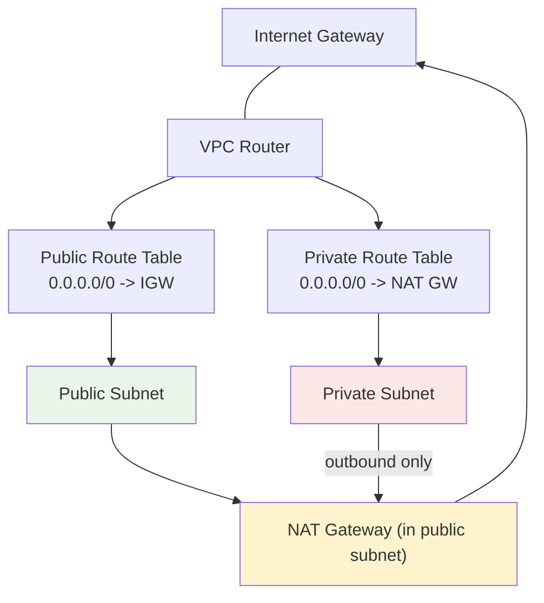
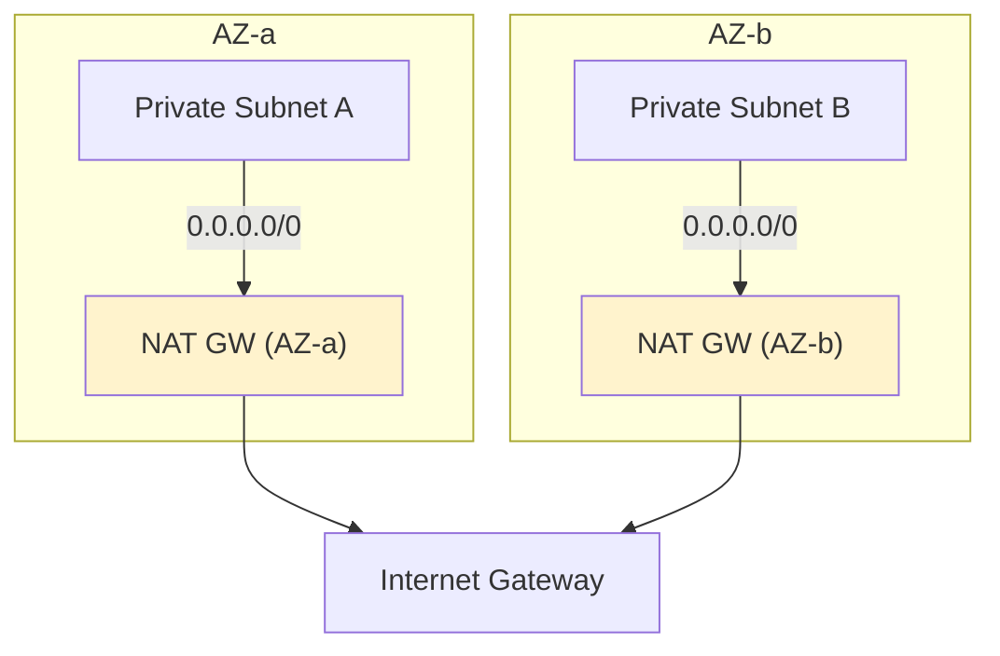

# Subnets, Route Tables & Gateways (IGW, NAT) - SAA-C03 Deep Dive

> Subnets carve a VPC into AZ-scoped IP ranges; **route tables** decide where their traffic goes; an **Internet Gateway** enables inbound/outbound internet, and a **NAT Gateway** lets private subnets reach out without being reachable. Master this and most VPC connectivity questions fall into place.

See also: [01 - VPC Fundamentals & Architecture](01%20-%20VPC%20Fundamentals%20%26%20Architecture.md) · [03 - Security Groups & Network ACLs](03%20-%20Security%20Groups%20%26%20Network%20ACLs.md) · [04 - VPC Endpoints & PrivateLink Basics](04%20-%20VPC%20Endpoints%20%26%20PrivateLink%20Basics.md) · [05 - VPC Peering, DNS & Flow Logs](05%20-%20VPC%20Peering%2C%20DNS%20%26%20Flow%20Logs.md) · [06 - VPC Exam Scenarios & Cheat Sheet](06%20-%20VPC%20Exam%20Scenarios%20%26%20Cheat%20Sheet.md)

---

## Table of Contents

- [Subnet Types: Public, Private, Isolated](#subnet-types-public-private-isolated)
- [Route Tables: Main vs Custom](#route-tables-main-vs-custom)
- [Internet Gateway (IGW)](#internet-gateway-igw)
- [NAT Gateway vs NAT Instance](#nat-gateway-vs-nat-instance)
- [NAT High Availability Across AZs](#nat-high-availability-across-azs)
- [Egress-Only Internet Gateway (IPv6)](#egress-only-internet-gateway-ipv6)
- [Default Routes & Longest-Prefix Match](#default-routes--longest-prefix-match)
- [Blast Radius & HA Design](#blast-radius--ha-design)
- [Summary: Key Takeaways for SAA-C03](#summary-key-takeaways-for-saa-c03)

---



---

## Subnet Types: Public, Private, Isolated

A subnet's "type" is **not a setting** - it's determined entirely by its **route table**.

| Subnet Type  | Definition                                       | Route to `0.0.0.0/0` |
| :----------- | :----------------------------------------------- | :------------------- |
| **Public**   | Has a route to an **Internet Gateway**           | → `igw-xxxx`         |
| **Private**  | Has a route to a **NAT Gateway** (outbound only) | → `nat-xxxx`         |
| **Isolated** | No route to internet at all                      | none (local only)    |

- A subnet is **public** only if (1) its route table has a default route to an IGW AND (2) the resource has a public IP.
- A subnet is **private** if it can reach out via NAT but cannot be reached from the internet.
- An **isolated** subnet has only the implicit `local` route - good for databases (e.g., RDS) that should never touch the internet.

> **Exam Tip:** "Public subnet" = route to IGW. Just having a public IP on an instance is **not** enough; without the IGW route the instance still has no internet access.

[⬆ Back to top](#table-of-contents)

---

## Route Tables: Main vs Custom

Every VPC has a **main route table** created automatically. You can also create **custom route tables** and explicitly associate subnets with them.

| Aspect                 | Main Route Table                             | Custom Route Table                       |
| :--------------------- | :------------------------------------------- | :--------------------------------------- |
| **Created**            | Automatically with VPC                       | By you                                   |
| **Subnet association** | Any subnet not explicitly associated uses it | Explicitly associated subnets            |
| **Default route**      | Contains only the `local` route initially    | You add routes (IGW, NAT, peering, etc.) |
| **Best practice**      | Keep it **private/minimal** (no IGW route)   | Use custom tables per tier               |

Every route table contains an un-removable **`local` route** covering the VPC CIDR - this is what lets all subnets in a VPC communicate by default.

```text
Destination        Target
10.0.0.0/16        local        (cannot be removed)
0.0.0.0/0          igw-0abc123  (makes the subnet public)
```

> **Exam Trap:** A common mistake is adding an IGW route to the **main route table**, accidentally making every unassociated subnet public. Best practice: leave the main route table without an internet route, and use explicit custom tables for public subnets.

[⬆ Back to top](#table-of-contents)

---

## Internet Gateway (IGW)

An **Internet Gateway** is a horizontally scaled, redundant, highly available VPC component that allows communication between the VPC and the internet.

Properties:

- **One IGW per VPC** (one-to-one); you attach it to the VPC.
- Performs **1:1 NAT** for public IPv4 addresses (maps the public IP to the instance's private IP).
- **Highly available and scales automatically** - no bandwidth bottleneck, no AZ affinity.
- An instance needs **all three** to reach the internet over IPv4: a public IP (or EIP), a route to the IGW, and permissive SG/NACL.

```bash
# Create and attach an Internet Gateway
aws ec2 create-internet-gateway
aws ec2 attach-internet-gateway --vpc-id vpc-0abc123 --internet-gateway-id igw-0abc123
```

> **Exam Tip:** The IGW does **not** allocate public IPs - it only translates them. If an instance has only a private IP, attaching an IGW does nothing for it; that instance needs NAT instead.

[⬆ Back to top](#table-of-contents)

---

## NAT Gateway vs NAT Instance

A **NAT (Network Address Translation)** device lets instances in **private subnets** initiate **outbound** connections to the internet (e.g., to download patches) while preventing the internet from initiating connections **inbound**.

| Feature                       | NAT Gateway (managed)                | NAT Instance (EC2)                        |
| :---------------------------- | :----------------------------------- | :---------------------------------------- |
| **Management**                | Fully managed by AWS                 | You manage the EC2 instance               |
| **Availability**              | Highly available **within one AZ**   | Single point of failure (you build HA)    |
| **Bandwidth**                 | Up to 100 Gbps, scales automatically | Depends on instance type                  |
| **Maintenance**               | None                                 | OS patching, AMI updates                  |
| **Public IP**                 | Requires an Elastic IP               | Requires an EIP                           |
| **Security Groups**           | **Cannot** attach an SG              | **Can** attach an SG                      |
| **Port forwarding / bastion** | Not supported                        | Supported (can double as bastion)         |
| **Source/dest check**         | N/A (managed)                        | Must **disable** source/destination check |
| **Cost**                      | Per-hour + per-GB data processing    | EC2 instance cost only                    |

> **Exam Tip:** NAT Gateway is the **default recommended** answer for "private instances need outbound internet" - it's managed, scalable, and HA within an AZ. Choose a **NAT Instance** only if you need to attach a Security Group, do port forwarding, or use it as a bastion (rare/legacy).

> **Exam Trap:** On a **NAT Instance** you must **disable the source/destination check** flag, or it will drop forwarded traffic. NAT Gateways handle this automatically.

The NAT device **must live in a public subnet** (it needs a route to the IGW), while the private subnet's route table points `0.0.0.0/0` at the NAT device.

[⬆ Back to top](#table-of-contents)

---

## NAT High Availability Across AZs

A NAT Gateway is **AZ-bound** - it is resilient within its AZ but **fails entirely if that AZ fails**. For a multi-AZ HA design:



HA rules:

- Deploy **one NAT Gateway per AZ**.
- Each AZ's private subnets route to the **NAT Gateway in their own AZ** (avoids cross-AZ data charges and removes the AZ single point of failure).
- A single NAT Gateway across AZs = both a cross-AZ data cost **and** an availability risk.

> **Exam Tip:** "Cost-effective and highly available NAT" → one NAT Gateway **per AZ**, each private subnet routing to the NAT in its own AZ. A single NAT Gateway shared by all AZs is the wrong answer for HA.

[⬆ Back to top](#table-of-contents)

---

## Egress-Only Internet Gateway (IPv6)

NAT Gateways only handle **IPv4**. For **IPv6**, since all IPv6 addresses are globally routable, you use an **Egress-Only Internet Gateway (EIGW)** to allow **outbound-only** IPv6 traffic from private instances.

| Device               | Protocol    | Direction                          |
| :------------------- | :---------- | :--------------------------------- |
| **NAT Gateway**      | IPv4        | Outbound only (private → internet) |
| **Egress-Only IGW**  | IPv6        | Outbound only (private → internet) |
| **Internet Gateway** | IPv4 + IPv6 | Bidirectional                      |

- The EIGW is **stateful** - it allows return traffic for connections initiated from inside.
- Route table entry: `::/0` → `eigw-xxxx`.

> **Exam Tip:** If a question mentions IPv6 instances that need to **download updates but not be reachable**, the answer is an **Egress-Only Internet Gateway**, never a NAT Gateway (NAT is IPv4 only).

[⬆ Back to top](#table-of-contents)

---

## Default Routes & Longest-Prefix Match

When AWS evaluates routes, it uses **longest-prefix match** (most specific route wins).

```text
Destination     Target          Notes
10.0.0.0/16     local           VPC CIDR - most specific local
10.0.1.0/24     pcx-0abc123     peering - more specific, wins over 0.0.0.0/0
0.0.0.0/0       igw-0abc123     default route - catch-all (least specific)
```

- The `0.0.0.0/0` default route is the **catch-all** - it matches anything not matched by a more specific route.
- A more specific route (e.g., `/24`) always wins over `0.0.0.0/0`.
- The `local` route for the VPC CIDR is the most specific for in-VPC traffic and cannot be overridden.

> **Exam Tip:** When traffic should reach a peering connection or VPN for a specific range but the internet otherwise, add a **specific route** for that range pointing at the peering/VGW target; longest-prefix match handles the rest.

[⬆ Back to top](#table-of-contents)

---

## Blast Radius & HA Design

Designing subnets and gateways with failure domains in mind:

| Principle                | Recommendation                                            |
| :----------------------- | :-------------------------------------------------------- |
| **Multi-AZ everything**  | One subnet per tier per AZ (minimum 2 AZs)                |
| **NAT per AZ**           | Avoid a single NAT as an AZ-wide SPOF                     |
| **Isolate data tier**    | Put RDS/databases in isolated subnets (no internet route) |
| **Smaller blast radius** | Separate route tables per tier limit accidental exposure  |
| **IGW route discipline** | Never add IGW route to the main route table               |

> **Exam Tip:** "Highly available web app" almost always means resources spread across **at least 2 AZs**, with public subnets (ALB), private app subnets (EC2/ASG), and isolated DB subnets - plus a NAT Gateway per AZ.

[⬆ Back to top](#table-of-contents)

---

## Summary: Key Takeaways for SAA-C03

| Concept              | What You Must Know                                       |
| :------------------- | :------------------------------------------------------- |
| **Subnet type**      | Determined by route table, not a setting                 |
| **Public subnet**    | Route to IGW + resource has public IP                    |
| **Private subnet**   | Route to NAT Gateway (outbound only)                     |
| **Isolated subnet**  | Only the `local` route (databases)                       |
| **IGW**              | One per VPC, HA, performs 1:1 public NAT                 |
| **NAT Gateway**      | Managed, HA within one AZ, no SG, IPv4 only              |
| **NAT Instance**     | EC2-based, can have SG/be bastion, disable src/dst check |
| **NAT HA**           | One NAT Gateway per AZ, route to NAT in same AZ          |
| **Egress-Only IGW**  | IPv6 outbound-only equivalent of NAT                     |
| **Routing**          | Longest-prefix match; `0.0.0.0/0` is catch-all           |
| **Main route table** | Keep minimal (no IGW route)                              |

[⬆ Back to top](#table-of-contents)

---
