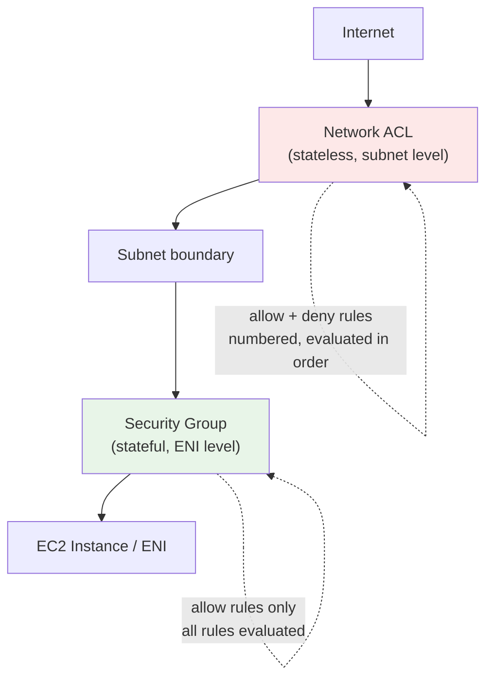

# Security Groups & Network ACLs - SAA-C03 Deep Dive

> **Security Groups** are _stateful_ firewalls at the instance/ENI level; **Network ACLs** are _stateless_ firewalls at the subnet level. Knowing the stateful-vs-stateless difference, ephemeral ports, and rule evaluation order wins a surprising number of exam questions.

See also: [01 - VPC Fundamentals & Architecture](01%20-%20VPC%20Fundamentals%20%26%20Architecture.md) · [02 - Subnets, Route Tables & Gateways (IGW, NAT)](02%20-%20Subnets%2C%20Route%20Tables%20%26%20Gateways%20%28IGW%2C%20NAT%29.md) · [04 - VPC Endpoints & PrivateLink Basics](04%20-%20VPC%20Endpoints%20%26%20PrivateLink%20Basics.md) · [05 - VPC Peering, DNS & Flow Logs](05%20-%20VPC%20Peering%2C%20DNS%20%26%20Flow%20Logs.md) · [06 - VPC Exam Scenarios & Cheat Sheet](06%20-%20VPC%20Exam%20Scenarios%20%26%20Cheat%20Sheet.md)

---

## Table of Contents

- [The Two Layers of VPC Firewalling](#the-two-layers-of-vpc-firewalling)
- [Security Groups: Stateful Deep Dive](#security-groups-stateful-deep-dive)
- [Network ACLs: Stateless Deep Dive](#network-acls-stateless-deep-dive)
- [SG vs NACL: The Master Comparison](#sg-vs-nacl-the-master-comparison)
- [Stateful vs Stateless & Ephemeral Ports](#stateful-vs-stateless--ephemeral-ports)
- [Referencing Security Groups (Chaining)](#referencing-security-groups-chaining)
- [Default vs Custom NACL](#default-vs-custom-nacl)
- [Rule Evaluation Order](#rule-evaluation-order)
- [Common Exam Traps](#common-exam-traps)
- [Summary: Key Takeaways for SAA-C03](#summary-key-takeaways-for-saa-c03)

---



---

## The Two Layers of VPC Firewalling

AWS gives you **two independent firewall layers**. Traffic must be allowed by **both** to reach an instance.

| Layer              | Operates At     | Type      | Applies To                  |
| :----------------- | :-------------- | :-------- | :-------------------------- |
| **Network ACL**    | Subnet boundary | Stateless | All resources in the subnet |
| **Security Group** | ENI / instance  | Stateful  | Specific instances/ENIs     |

Order for **inbound** traffic: `Internet → NACL (in) → Security Group (in) → Instance`.
Order for **outbound** traffic: `Instance → Security Group (out) → NACL (out) → Internet`.

[⬆ Back to top](#table-of-contents)

---

## Security Groups: Stateful Deep Dive

A **Security Group (SG)** acts as a virtual firewall at the **elastic network interface (ENI)** level.

Key properties:

- **Stateful** - if you allow an inbound request, the response is automatically allowed out (and vice versa). You don't need a matching return rule.
- **Allow rules only** - you cannot create an explicit deny. Anything not allowed is implicitly denied.
- **All rules are evaluated** - rules are not ordered/numbered.
- Can reference **other Security Groups** (and prefix lists, CIDR, IPs).
- Default SG behavior: **deny all inbound**, **allow all outbound**.
- An ENI can have **multiple SGs**; rules are cumulative (union of all allows).

```text
Inbound rule example
Type        Protocol   Port    Source
HTTPS       TCP        443     0.0.0.0/0
SSH         TCP        22      203.0.113.0/24
```

> **Exam Tip:** Because SGs are stateful, you almost never need to manage return traffic. If a question shows return traffic being blocked, the culprit is usually a **NACL** (stateless), not a Security Group.

[⬆ Back to top](#table-of-contents)

---

## Network ACLs: Stateless Deep Dive

A **Network ACL (NACL)** is a firewall at the **subnet** level.

Key properties:

- **Stateless** - return traffic must be **explicitly allowed** by a separate rule (this is where ephemeral ports matter).
- Supports **both Allow and Deny** rules - the only way to explicitly block a specific IP at the network layer.
- Rules are **numbered** and evaluated **in ascending order**; the first match wins (lowest number first).
- Each subnet must be associated with **exactly one** NACL; a NACL can cover multiple subnets.
- Rule `*` is the implicit final deny.

```text
Inbound rules (evaluated low->high)
Rule #   Type     Protocol   Port Range     Source           Allow/Deny
100      HTTPS    TCP        443            0.0.0.0/0        ALLOW
200      Custom   TCP        1024-65535     0.0.0.0/0        ALLOW (ephemeral)
*        ALL      ALL        ALL            0.0.0.0/0        DENY
```

> **Exam Tip:** NACLs are the right tool to **block a specific malicious IP address** across an entire subnet - Security Groups cannot deny.

[⬆ Back to top](#table-of-contents)

---

## SG vs NACL: The Master Comparison

| Dimension              | Security Group             | Network ACL                                     |
| :--------------------- | :------------------------- | :---------------------------------------------- |
| **Level**              | Instance / ENI             | Subnet                                          |
| **State**              | Stateful                   | Stateless                                       |
| **Rule types**         | Allow only                 | Allow **and** Deny                              |
| **Rule evaluation**    | All rules evaluated        | Numbered, lowest-first, first match wins        |
| **Return traffic**     | Automatically allowed      | Must add explicit ephemeral-port rule           |
| **Default inbound**    | Deny all                   | Default NACL allows all; custom NACL denies all |
| **Default outbound**   | Allow all                  | Default NACL allows all; custom NACL denies all |
| **Can reference SGs?** | Yes                        | No (CIDR/IP only)                               |
| **Applies to**         | Only ENIs it's attached to | Every resource in associated subnet(s)          |
| **Block a single IP?** | No                         | Yes (Deny rule)                                 |
| **Max per resource**   | Multiple SGs per ENI       | 1 NACL per subnet                               |

> **Exam Trap:** "Default Security Group" denies inbound but allows outbound. "Default NACL" allows ALL traffic both ways. A "custom NACL" denies ALL until you add rules. Don't conflate these defaults.

[⬆ Back to top](#table-of-contents)

---

## Stateful vs Stateless & Ephemeral Ports

This is the single most tested NACL concept.

**Ephemeral ports** are the temporary high-numbered ports a client uses for the source of an outbound connection (and thus the destination for the server's response). Ranges:

| OS / Stack               | Ephemeral Range |
| :----------------------- | :-------------- |
| Linux kernels            | `32768–60999`   |
| Windows / many services  | `49152–65535`   |
| NAT Gateway              | `1024–65535`    |
| Safe catch-all for NACLs | `1024–65535`    |

Because **NACLs are stateless**, when a client connects to your server on port 443:

- **Inbound NACL rule** must allow `TCP 443` from the client.
- **Outbound NACL rule** must allow the **ephemeral port range** (`1024–65535`) back to the client, or the response is dropped.

With a **Security Group**, the response is allowed automatically - no ephemeral rule needed.

> **Exam Tip:** If a NACL allows inbound on 443 but connections still hang, the missing piece is almost always an **outbound rule for ephemeral ports** `1024–65535`. This is the classic stateless gotcha.

[⬆ Back to top](#table-of-contents)

---

## Referencing Security Groups (Chaining)

Security Groups can reference **other Security Groups** as the source/destination instead of a CIDR. This enables clean tier-to-tier rules that don't depend on IP addresses.

```text
Web tier SG (sg-web): inbound 443 from 0.0.0.0/0
App tier SG (sg-app): inbound 8080 from sg-web   <- references the web SG
DB tier SG (sg-db):  inbound 3306 from sg-app    <- references the app SG
```

Benefits:

- Auto-scaling instances are automatically covered (no IP churn to track).
- Self-referencing SGs allow members of the same SG to talk to each other (common for cluster nodes).
- Works across **peered VPCs** in the same Region (you can reference an SG in the peer VPC).

> **Exam Tip:** "Allow only the app tier to reach the database, regardless of how many instances scale up" → reference the **app tier's Security Group** as the source in the DB SG, not a CIDR range.

[⬆ Back to top](#table-of-contents)

---

## Default vs Custom NACL

| Aspect                 | Default NACL           | Custom NACL                  |
| :--------------------- | :--------------------- | :--------------------------- |
| **Inbound**            | Allows all             | Denies all until rules added |
| **Outbound**           | Allows all             | Denies all until rules added |
| **Created**            | Automatically with VPC | By you                       |
| **Subnet association** | All subnets initially  | Subnets you associate        |

When you create a custom NACL it starts with only the implicit `* DENY` rule for both directions - **nothing passes** until you add explicit allow rules (including ephemeral return ports).

> **Exam Trap:** Newly created custom NACLs block everything. If a scenario says "after creating and associating a new NACL nothing works," it's because no allow rules were added.

[⬆ Back to top](#table-of-contents)

---

## Rule Evaluation Order

| Firewall           | How Rules Are Evaluated                                                                                        |
| :----------------- | :------------------------------------------------------------------------------------------------------------- |
| **Security Group** | **All** rules evaluated together; if any allows, traffic passes (no order; no deny possible)                   |
| **Network ACL**    | Rules processed in **ascending number order**; the **first matching rule wins**; lower numbers take precedence |

NACL example - rule 100 ALLOW vs rule 200 DENY for the same IP: rule **100 wins** because it's evaluated first. To deny an IP, its DENY rule must have a **lower number** than any conflicting ALLOW.

> **Exam Tip:** Leave gaps (100, 200, 300) between NACL rule numbers so you can insert rules later without renumbering.

[⬆ Back to top](#table-of-contents)

---

## Common Exam Traps

| Trap                                    | Reality                                              |
| :-------------------------------------- | :--------------------------------------------------- |
| "Add a deny rule to a Security Group"   | Impossible - SGs are allow-only. Use a NACL.         |
| "SG blocks return traffic"              | No - SGs are stateful; suspect the NACL.             |
| "Custom NACL allows traffic by default" | No - custom NACLs deny all until rules added.        |
| "NACL inbound 443 is enough"            | No - stateless; need outbound ephemeral ports too.   |
| "Multiple SGs conflict"                 | They don't - rules are cumulative (union of allows). |
| "Block one bad IP with an SG"           | Can't - use a NACL deny rule.                        |
| "Subnet can have many NACLs"            | No - exactly one NACL per subnet.                    |

[⬆ Back to top](#table-of-contents)

---

## Summary: Key Takeaways for SAA-C03

| Concept             | What You Must Know                                      |
| :------------------ | :------------------------------------------------------ |
| **Security Group**  | Stateful, ENI level, allow-only, all rules evaluated    |
| **Network ACL**     | Stateless, subnet level, allow + deny, numbered/ordered |
| **Stateful**        | Return traffic auto-allowed (SG)                        |
| **Stateless**       | Must allow ephemeral return ports `1024–65535` (NACL)   |
| **Block an IP**     | Only a NACL can deny                                    |
| **Default SG**      | Deny inbound, allow outbound                            |
| **Default NACL**    | Allow all; custom NACL denies all                       |
| **SG referencing**  | Reference other SGs for tier-to-tier rules              |
| **NACL evaluation** | Lowest rule number first; first match wins              |
| **Both layers**     | Traffic must pass NACL **and** SG                       |

[⬆ Back to top](#table-of-contents)

---
