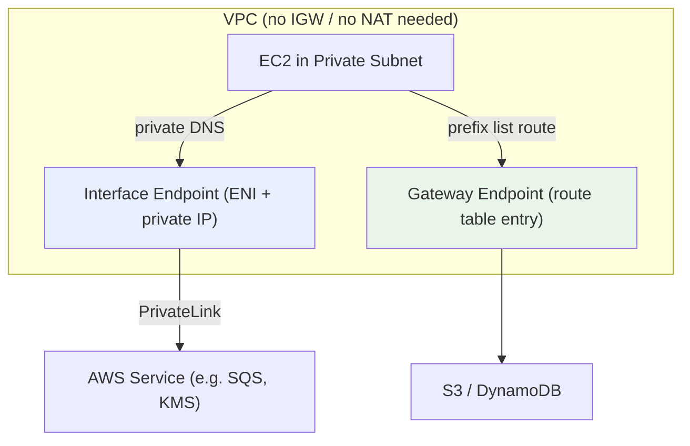
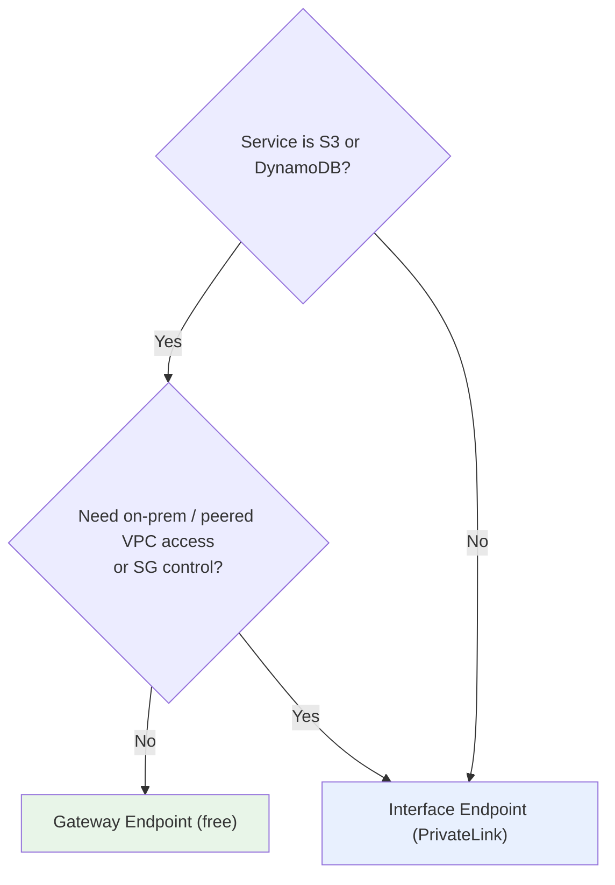

# VPC Endpoints & PrivateLink Basics - SAA-C03 Deep Dive

> **VPC Endpoints** let resources reach AWS services **privately** - without an Internet Gateway, NAT, or public IPs. Two flavors: **Gateway endpoints** (free, S3 & DynamoDB only) and **Interface endpoints** (PrivateLink/ENI, almost every other service). Knowing which to pick is a guaranteed exam point.

See also: [01 - VPC Fundamentals & Architecture](01%20-%20VPC%20Fundamentals%20%26%20Architecture.md) · [02 - Subnets, Route Tables & Gateways (IGW, NAT)](02%20-%20Subnets%2C%20Route%20Tables%20%26%20Gateways%20%28IGW%2C%20NAT%29.md) · [03 - Security Groups & Network ACLs](03%20-%20Security%20Groups%20%26%20Network%20ACLs.md) · [05 - VPC Peering, DNS & Flow Logs](05%20-%20VPC%20Peering%2C%20DNS%20%26%20Flow%20Logs.md) · [06 - VPC Exam Scenarios & Cheat Sheet](06%20-%20VPC%20Exam%20Scenarios%20%26%20Cheat%20Sheet.md)

---

## Table of Contents

- [Why VPC Endpoints Exist](#why-vpc-endpoints-exist)
- [Gateway Endpoints (S3 & DynamoDB)](#gateway-endpoints-s3--dynamodb)
- [Interface Endpoints (PrivateLink / ENI)](#interface-endpoints-privatelink--eni)
- [Gateway vs Interface: Comparison](#gateway-vs-interface-comparison)
- [Endpoint Policies](#endpoint-policies)
- [DNS Behavior (Private DNS)](#dns-behavior-private-dns)
- [Cost Considerations](#cost-considerations)
- [Choosing the Right Endpoint](#choosing-the-right-endpoint)
- [Summary: Key Takeaways for SAA-C03](#summary-key-takeaways-for-saa-c03)

---



---

## Why VPC Endpoints Exist

By default, calling an AWS service API (e.g., S3) from a private instance routes over the **public internet** via a NAT Gateway/IGW. That means:

- Traffic leaves your VPC and traverses the public AWS network.
- You pay for NAT Gateway processing and data transfer.
- You expose an internet egress path you may want to eliminate for security/compliance.

**VPC Endpoints** keep this traffic **entirely on the AWS private network** - no IGW, no NAT, no public IP required.

| Benefit                  | Detail                                    |
| :----------------------- | :---------------------------------------- |
| **Private connectivity** | Traffic never touches the public internet |
| **No NAT needed**        | Saves NAT Gateway data processing cost    |
| **Security**             | Endpoint policies + SGs control access    |
| **Compliance**           | Keeps data within the AWS network         |

> **Exam Tip:** "Access S3 from private subnet **without** a NAT Gateway / Internet Gateway" → **VPC Gateway Endpoint** for S3. This is the single most common endpoint question.

[⬆ Back to top](#table-of-contents)

---

## Gateway Endpoints (S3 & DynamoDB)

A **Gateway Endpoint** is a target you add to a **route table**. It supports only two services:

- **Amazon S3**
- **Amazon DynamoDB**

How it works:

- You add a route in the subnet's route table whose destination is an AWS-managed **prefix list** (e.g., `pl-xxxx` for S3) and target is the gateway endpoint (`vpce-xxxx`).
- **No ENI, no private IP, no DNS change** - it's purely a routing construct.
- **Free** - no hourly or data charges.

```text
Route table entry
Destination          Target
pl-63a5400a (S3)     vpce-0abc123
```

> **Exam Trap:** Gateway endpoints work **only within the same Region** and **cannot** be accessed from on-premises (over Direct Connect/VPN) or from a peered VPC. If on-prem needs private S3 access, you need an **Interface endpoint** for S3 instead.

[⬆ Back to top](#table-of-contents)

---

## Interface Endpoints (PrivateLink / ENI)

An **Interface Endpoint** is powered by **AWS PrivateLink**. It provisions an **Elastic Network Interface (ENI)** with a **private IP** inside your chosen subnet(s), and supports **most AWS services** (SQS, SNS, KMS, Systems Manager, ECR, CloudWatch, API Gateway, and many more) plus third-party/SaaS services.

How it works:

- An ENI with a private IP is created in each subnet/AZ you select.
- You access the service via that private IP (Private DNS maps the service's public name to the ENI).
- **Security Groups apply** to the endpoint ENI (you control access).
- Reachable from **on-premises** over VPN/Direct Connect and from **peered VPCs** - unlike gateway endpoints.

> **Exam Tip:** Interface endpoints (PrivateLink) are the answer when you need private access from **on-premises** or a **peered VPC**, or for any service **other than** S3/DynamoDB. Deep dive: [01 - PrivateLink & VPC Endpoints Deep Dive](01%20-%20PrivateLink%20%26%20VPC%20Endpoints%20Deep%20Dive.md).

[⬆ Back to top](#table-of-contents)

---

## Gateway vs Interface: Comparison

| Dimension             | Gateway Endpoint              | Interface Endpoint (PrivateLink)  |
| :-------------------- | :---------------------------- | :-------------------------------- |
| **Services**          | S3, DynamoDB only             | Most AWS services + SaaS          |
| **Mechanism**         | Route table prefix-list entry | ENI with private IP               |
| **Cost**              | **Free**                      | Hourly per-AZ + per-GB data       |
| **Security Groups**   | Not applicable                | Yes - controls endpoint ENI       |
| **Endpoint policy**   | Yes                           | Yes                               |
| **On-prem access**    | **No**                        | **Yes** (via VPN/DX)              |
| **Peered VPC access** | **No**                        | **Yes**                           |
| **DNS change**        | None                          | Private DNS overrides public name |
| **HA**                | Region-wide (managed)         | Deploy one ENI per AZ             |

> **Exam Tip:** For S3/DynamoDB **within the VPC only and free**, choose **Gateway**. If you also need S3 access from **on-prem** or want SG control, choose an **Interface endpoint** (S3 supports both types).

[⬆ Back to top](#table-of-contents)

---

## Endpoint Policies

Both endpoint types support an **endpoint policy** - an IAM resource policy attached to the endpoint that controls **which actions/resources/principals** can be reached through it.

```json
{
  "Version": "2012-10-17",
  "Statement": [
    {
      "Effect": "Allow",
      "Principal": "*",
      "Action": ["s3:GetObject", "s3:PutObject"],
      "Resource": "arn:aws:s3:::my-approved-bucket/*"
    }
  ]
}
```

- The endpoint policy does **not** grant permissions on its own - it's an **additional filter** combined with IAM policies and bucket/resource policies.
- Common use: restrict an S3 gateway endpoint so it can only reach **specific buckets** (prevents data exfiltration to arbitrary buckets).

> **Exam Tip:** To ensure instances can only access **your** S3 buckets and not any bucket on the internet, combine an **S3 gateway endpoint** with a restrictive **endpoint policy** (and optionally `aws:SourceVpce` conditions on the bucket policy).

[⬆ Back to top](#table-of-contents)

---

## DNS Behavior (Private DNS)

- **Gateway endpoints:** no DNS changes - resolution of S3/DynamoDB names is unaffected; routing is handled by the prefix-list route.
- **Interface endpoints:** by default get a unique regional DNS name. Enabling **Private DNS** makes the standard public service hostname (e.g., `sqs.us-east-1.amazonaws.com`) resolve to the **private endpoint IP** inside the VPC - so existing apps work unchanged.
- Private DNS requires the VPC to have **`enableDnsSupport`** and **`enableDnsHostnames`** set to `true`. See [05 - VPC Peering, DNS & Flow Logs](05%20-%20VPC%20Peering%2C%20DNS%20%26%20Flow%20Logs.md).

> **Exam Trap:** If an interface endpoint exists but apps still hit the public endpoint, **Private DNS is disabled** or the VPC's DNS attributes are off.

[⬆ Back to top](#table-of-contents)

---

## Cost Considerations

| Endpoint                    | Pricing                                                       |
| :-------------------------- | :------------------------------------------------------------ |
| **Gateway (S3/DynamoDB)**   | **No charge** for the endpoint or data                        |
| **Interface (PrivateLink)** | Hourly charge per endpoint **per AZ** + per-GB data processed |

Cost-optimization angles:

- Use **gateway endpoints** for S3/DynamoDB whenever possible - they're free and remove NAT data-processing charges.
- Interface endpoints save NAT data-processing cost but add their own hourly + data cost - weigh the trade-off for low-traffic services.

> **Exam Tip:** "Reduce cost of S3 access from private subnets" → **Gateway endpoint** (free, eliminates NAT data processing). Don't pick an interface endpoint for plain in-VPC S3 access - it costs more.

[⬆ Back to top](#table-of-contents)

---

## Choosing the Right Endpoint



[⬆ Back to top](#table-of-contents)

---

## Summary: Key Takeaways for SAA-C03

| Concept                     | What You Must Know                                    |
| :-------------------------- | :---------------------------------------------------- |
| **Purpose**                 | Private access to AWS services - no IGW/NAT/public IP |
| **Gateway endpoint**        | S3 & DynamoDB only; route-table entry; **free**       |
| **Interface endpoint**      | PrivateLink ENI; most services; hourly + data cost    |
| **On-prem / peered access** | Only **interface** endpoints support it               |
| **Security Groups**         | Apply to interface endpoints, not gateway             |
| **Endpoint policy**         | Filters actions/resources through the endpoint        |
| **Private DNS**             | Interface endpoints; needs DNS support + hostnames on |
| **Cost optimization**       | Prefer gateway endpoint for S3/DynamoDB               |

[⬆ Back to top](#table-of-contents)

---
