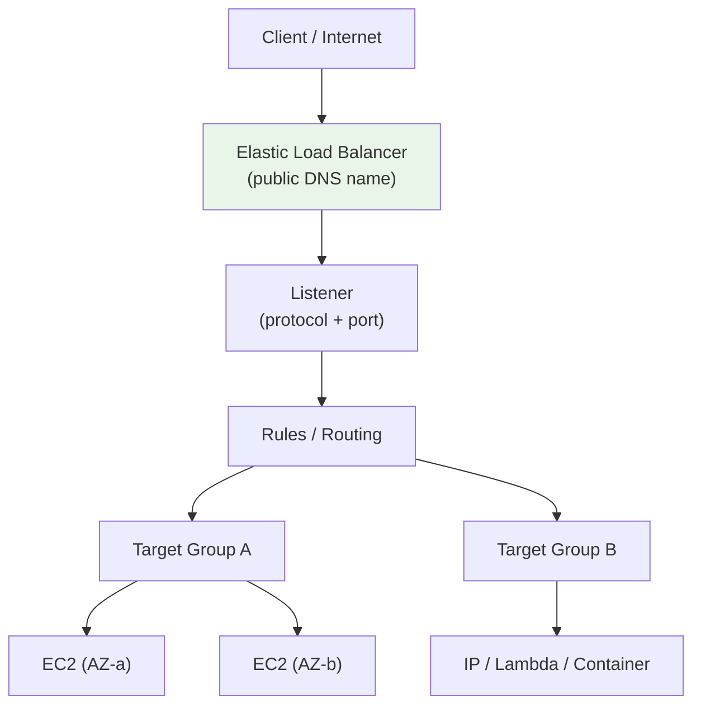
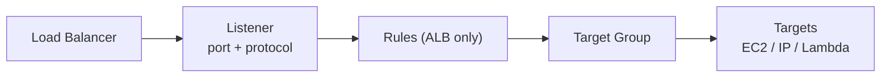
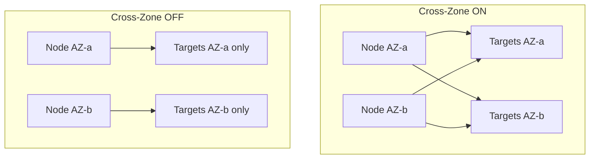
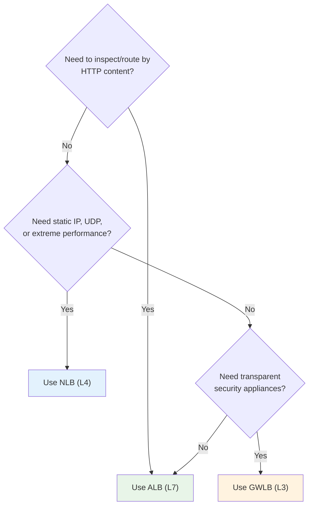

# ELB Fundamentals & Types - SAA-C03 Deep Dive

> Elastic Load Balancing distributes incoming traffic across multiple targets (EC2, IP, Lambda, containers) in one or more AZs. AWS offers **4 load balancer types** - ALB (L7), NLB (L4), GWLB (L3), and the legacy CLB. Knowing **which one to pick** is the single most tested ELB skill on SAA-C03.

See also: [02 - Application Load Balancer (ALB) Deep Dive](02%20-%20Application%20Load%20Balancer%20%28ALB%29%20Deep%20Dive.md) · [03 - Network Load Balancer (NLB) & Gateway Load Balancer](03%20-%20Network%20Load%20Balancer%20%28NLB%29%20%26%20Gateway%20Load%20Balancer.md) · [04 - ELB Features (Stickiness, Health Checks, SSL, Cross-Zone, Connection Draining)](04%20-%20ELB%20Features%20%28Stickiness%2C%20Health%20Checks%2C%20SSL%2C%20Cross-Zone%2C%20Connection%20Draining%29.md) · [05 - ELB Exam Scenarios & Cheat Sheet](05%20-%20ELB%20Exam%20Scenarios%20%26%20Cheat%20Sheet.md)

---

## Table of Contents

- [Part 1: What ELB Does & Why It Exists](#part-1-what-elb-does--why-it-exists)
- [Part 2: The Four Load Balancer Types](#part-2-the-four-load-balancer-types)
- [Part 3: Core Building Blocks - Listeners, Target Groups, Targets](#part-3-core-building-blocks---listeners-target-groups-targets)
- [Part 4: Internet-Facing vs Internal Load Balancers](#part-4-internet-facing-vs-internal-load-balancers)
- [Part 5: Cross-Zone Load Balancing Intro](#part-5-cross-zone-load-balancing-intro)
- [Part 6: Health Checks Intro](#part-6-health-checks-intro)
- [Part 7: When to Pick Which (Decision Guide)](#part-7-when-to-pick-which-decision-guide)
- [Summary: Key Takeaways for SAA-C03](#summary-key-takeaways-for-saa-c03)

---



---

Elastic Load Balancing (ELB) is a fully managed, highly available AWS service that spreads traffic across healthy targets. It is the front door for most resilient architectures and integrates tightly with [06 - EC2 Auto Scaling (ASG)](06%20-%20EC2%20Auto%20Scaling%20%28ASG%29.md), [01 - Route 53 Fundamentals & Hosted Zones](01%20-%20Route%2053%20Fundamentals%20%26%20Hosted%20Zones.md), and [01 - Global Accelerator Fundamentals & Architecture](01%20-%20Global%20Accelerator%20Fundamentals%20%26%20Architecture.md).

---

## Part 1: What ELB Does & Why It Exists

### The Core Job

A load balancer accepts client connections on a public or private endpoint and **forwards** them to one of many backend targets. This delivers:

| Benefit               | Explanation                                                           |
| :-------------------- | :-------------------------------------------------------------------- |
| **High availability** | Spreads traffic across multiple AZs; routes around failed targets/AZs |
| **Health checking**   | Stops sending traffic to unhealthy instances automatically            |
| **Decoupling**        | Clients hit one stable DNS name; backends can scale/replace freely    |
| **SSL/TLS offload**   | Terminates HTTPS at the LB so backends do less crypto work            |
| **Elasticity**        | Scales capacity automatically with demand (managed by AWS)            |

### Managed vs Self-Managed

> **Exam Tip:** ELB is a **managed** service - you never run the LB software yourself. If a question asks for a "no-ops, auto-scaling" load balancer, ELB beats running HAProxy/NGINX on EC2.

### The DNS Name (Never an IP for ALB)

- ALB/CLB give you a **DNS name only** (the underlying IPs change). You CNAME/Alias to it via [01 - Route 53 Fundamentals & Hosted Zones](01%20-%20Route%2053%20Fundamentals%20%26%20Hosted%20Zones.md).
- NLB gives you a **static IP per AZ** (and supports Elastic IPs).

[⬆ Back to top](#table-of-contents)

---

## Part 2: The Four Load Balancer Types

| Type                     | OSI Layer             | Protocols                    | Use Case                                    | Key Differentiator                       |
| :----------------------- | :-------------------- | :--------------------------- | :------------------------------------------ | :--------------------------------------- |
| **Application LB (ALB)** | Layer 7               | HTTP, HTTPS, gRPC, WebSocket | Web apps, microservices, containers         | Content-based routing (host/path/header) |
| **Network LB (NLB)**     | Layer 4               | TCP, UDP, TLS                | Extreme performance, static IP, low latency | Millions of req/s, static/Elastic IP     |
| **Gateway LB (GWLB)**    | Layer 3 (gateway) + 4 | IP (GENEVE 6081)             | Transparent 3rd-party security appliances   | Inline firewalls/IDS/IPS                 |
| **Classic LB (CLB)**     | Layer 4 & 7           | TCP, SSL, HTTP, HTTPS        | **Legacy only** - avoid for new builds      | Deprecated; no advanced features         |

### Generation Naming

- **CLB** = "v1" / previous generation. AWS recommends **never** choosing it for new designs.
- **ALB, NLB, GWLB** = "v2" / current generation with target groups, rules, and richer features.

> **Exam Trap:** If a new architecture question lists CLB as an option, it is almost always a distractor. Pick ALB or NLB instead unless the scenario explicitly needs a legacy feature like **TCP + HTTP on the same CLB** or EC2-Classic.

### Quick Mental Model

```
HTTP/HTTPS smart routing      -> ALB  (Layer 7)
Raw TCP/UDP, static IP, speed -> NLB  (Layer 4)
Inspect ALL traffic w/ appliances -> GWLB (Layer 3)
Old account / legacy app      -> CLB  (avoid)
```

[⬆ Back to top](#table-of-contents)

---

## Part 3: Core Building Blocks - Listeners, Target Groups, Targets

All v2 load balancers (ALB/NLB/GWLB) share the same three-layer model.



### Listener

A **listener** checks for connection requests using a configured **protocol and port** (e.g., HTTPS:443). It evaluates rules (ALB) or simply forwards (NLB) to a target group.

### Target Group

A **target group** routes requests to one or more registered targets and runs **health checks** against them. A target group has its own protocol, port, and health-check config.

| Target Type       | Supported By | Notes                                             |
| :---------------- | :----------- | :------------------------------------------------ |
| **Instance**      | ALB, NLB     | Register by instance ID; uses primary private IP  |
| **IP**            | ALB, NLB     | Any private IP in VPC/peered/on-prem (via DX/VPN) |
| **Lambda**        | **ALB only** | Invoke a Lambda function as the target            |
| **ALB-as-target** | **NLB only** | Put an ALB behind an NLB (static IP + L7 routing) |

> **Exam Tip:** A single target group cannot mix target types. **Lambda targets are ALB-only.** **ALB can be a target of an NLB** (gives you static IP + L7 routing combined).

### Targets

The actual compute: EC2 instances, IP addresses (including on-prem reachable over VPN/Direct Connect), Lambda functions, or containers (via ECS/EKS which register tasks/pods as IP targets).

[⬆ Back to top](#table-of-contents)

---

## Part 4: Internet-Facing vs Internal Load Balancers

You choose the **scheme** at creation time and it cannot be changed afterward.

| Scheme              | Nodes Get                     | Reachable From                | Typical Use                            |
| :------------------ | :---------------------------- | :---------------------------- | :------------------------------------- |
| **Internet-facing** | **Public** IP addresses       | The internet (public subnets) | Public web tier                        |
| **Internal**        | **Private** IP addresses only | Within VPC / peered / on-prem | App tier, microservices, internal APIs |

### Subnet Requirements

- Place the LB in **at least 2 AZs** (subnets) for high availability.
- **Internet-facing** LB nodes must sit in **public subnets** (with an Internet Gateway route).
- **Internal** LB nodes sit in private subnets.

> **Exam Trap:** An internet-facing ALB needs **public subnets** with an IGW route. If the LB "won't accept internet traffic," check the subnet is public and the security group allows inbound 80/443.

### Tiered Architecture Pattern

```
Internet -> Internet-facing ALB (public subnets)
         -> Web tier (private subnets)
         -> Internal ALB / NLB (private subnets)
         -> App tier (private subnets)
```

[⬆ Back to top](#table-of-contents)

---

## Part 5: Cross-Zone Load Balancing Intro

**Cross-zone load balancing** controls whether a load balancer node distributes traffic to targets in **all** AZs or only its **own** AZ.



### Default Behavior & Cost (Must Memorize)

| LB Type  | Cross-Zone Default                          | Inter-AZ Data Charge     |
| :------- | :------------------------------------------ | :----------------------- |
| **ALB**  | **ON** (always, cannot disable at LB level) | **No charge**            |
| **NLB**  | **OFF** by default                          | **Charged** when enabled |
| **GWLB** | **OFF** by default                          | **Charged** when enabled |
| **CLB**  | OFF by default (on via API/console)         | No charge                |

> **Exam Tip:** **ALB cross-zone is always on and free.** For **NLB/GWLB it is OFF by default and you pay inter-AZ data transfer when you turn it on.** This is a frequent answer to "why is one AZ overloaded?" (uneven targets + cross-zone off on NLB). Full deep dive in [04 - ELB Features (Stickiness, Health Checks, SSL, Cross-Zone, Connection Draining)](04%20-%20ELB%20Features%20%28Stickiness%2C%20Health%20Checks%2C%20SSL%2C%20Cross-Zone%2C%20Connection%20Draining%29.md).

[⬆ Back to top](#table-of-contents)

---

## Part 6: Health Checks Intro

Health checks let the LB send traffic **only to healthy targets**.

| Parameter               | Meaning                                        |
| :---------------------- | :--------------------------------------------- |
| **Protocol / Port**     | How the LB probes (HTTP/HTTPS/TCP)             |
| **Path** (HTTP/S)       | e.g. `/health` - the URL probed                |
| **Interval**            | Seconds between checks (default 30s)           |
| **Timeout**             | Seconds to wait for a response                 |
| **Healthy threshold**   | Consecutive successes to mark healthy          |
| **Unhealthy threshold** | Consecutive failures to mark unhealthy         |
| **Matcher** (ALB)       | Expected HTTP code(s), e.g. `200` or `200-299` |

- **ALB** health checks are **HTTP/HTTPS** (Layer 7, can check a path + status code).
- **NLB** health checks can be **TCP, HTTP, or HTTPS**.

> **Exam Tip:** If an instance is "InService" but failing, the health-check **path** or **matcher** code is usually wrong, or the **security group** blocks the health-check port. Tuning details in [04 - ELB Features (Stickiness, Health Checks, SSL, Cross-Zone, Connection Draining)](04%20-%20ELB%20Features%20%28Stickiness%2C%20Health%20Checks%2C%20SSL%2C%20Cross-Zone%2C%20Connection%20Draining%29.md).

[⬆ Back to top](#table-of-contents)

---

## Part 7: When to Pick Which (Decision Guide)



### Cheat Picks

| The Question Mentions...                                                       | Pick           |
| :----------------------------------------------------------------------------- | :------------- |
| Path/host routing, microservices, containers, Lambda backend, WAF              | **ALB**        |
| Static IP / Elastic IP, millions of req/s, ultra-low latency, UDP, PrivateLink | **NLB**        |
| Preserve client source IP at L4, TLS passthrough to TCP backend                | **NLB**        |
| Third-party firewall / IDS / IPS inline traffic inspection                     | **GWLB**       |
| Legacy app, must support EC2-Classic                                           | **CLB** (rare) |

> **Exam Tip:** "**gRPC** or **WebSocket** + HTTP routing" -> **ALB**. "**UDP** (e.g. gaming, DNS, IoT)" -> **NLB** (ALB cannot do UDP).

[⬆ Back to top](#table-of-contents)

---

## Summary: Key Takeaways for SAA-C03

| Concept             | What You Must Know                                                      |
| :------------------ | :---------------------------------------------------------------------- |
| **4 types**         | ALB (L7), NLB (L4), GWLB (L3), CLB (legacy - avoid)                     |
| **Building blocks** | Listener -> (Rules) -> Target Group -> Targets                          |
| **Target types**    | Instance, IP, Lambda (**ALB only**), ALB-as-target (**NLB only**)       |
| **Scheme**          | Internet-facing (public subnets) vs Internal (private), set at creation |
| **Cross-zone**      | ALB always ON & free; NLB/GWLB OFF by default & charged                 |
| **DNS**             | ALB/CLB = DNS name; NLB = static IP per AZ (+ Elastic IP)               |
| **UDP**             | NLB only (never ALB)                                                    |
| **Decision**        | Content routing -> ALB; speed/static IP/UDP -> NLB; appliances -> GWLB  |

[⬆ Back to top](#table-of-contents)

---
