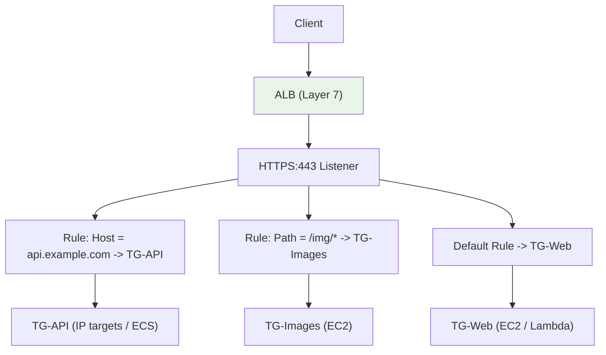
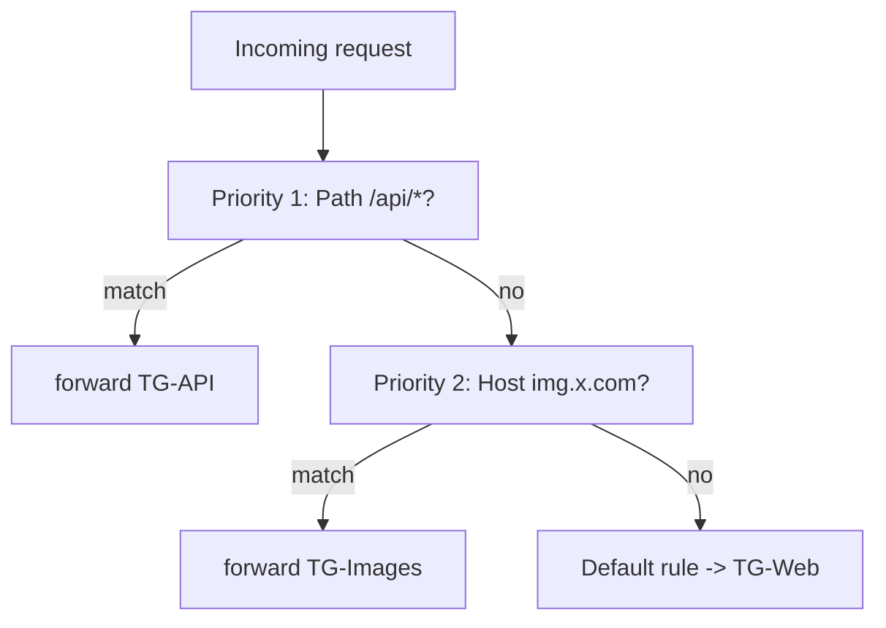
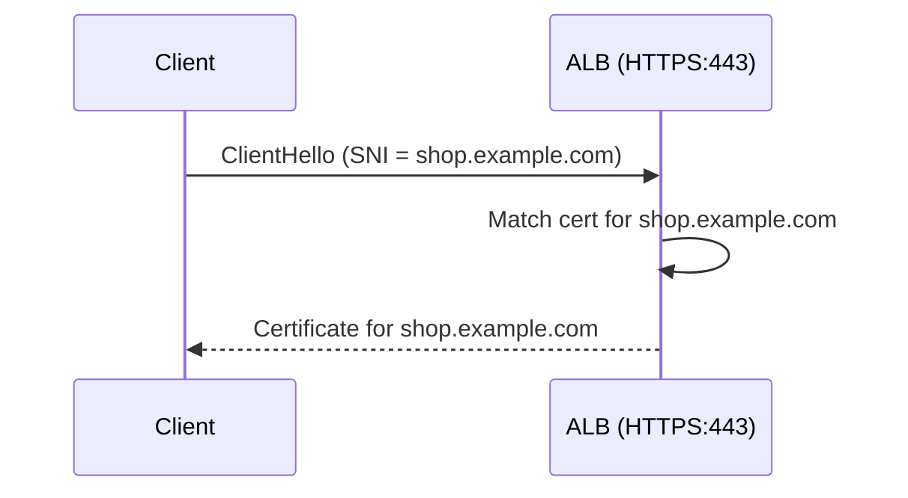

# Application Load Balancer (ALB) Deep Dive - SAA-C03 Deep Dive

> The ALB is a **Layer 7 (HTTP/HTTPS)** load balancer that routes on **host, path, header, query string, HTTP method, and source IP**. It supports instance/IP/**Lambda** targets, native HTTP->HTTPS redirects, fixed responses, sticky sessions, SNI multi-cert, and integrates with WAF. It is the default choice for modern web apps and microservices.

See also: [01 - ELB Fundamentals & Types](01%20-%20ELB%20Fundamentals%20%26%20Types.md) · [03 - Network Load Balancer (NLB) & Gateway Load Balancer](03%20-%20Network%20Load%20Balancer%20%28NLB%29%20%26%20Gateway%20Load%20Balancer.md) · [04 - ELB Features (Stickiness, Health Checks, SSL, Cross-Zone, Connection Draining)](04%20-%20ELB%20Features%20%28Stickiness%2C%20Health%20Checks%2C%20SSL%2C%20Cross-Zone%2C%20Connection%20Draining%29.md) · [05 - ELB Exam Scenarios & Cheat Sheet](05%20-%20ELB%20Exam%20Scenarios%20%26%20Cheat%20Sheet.md)

---

## Table of Contents

- [Part 1: ALB Overview & Where It Fits](#part-1-alb-overview--where-it-fits)
- [Part 2: Layer 7 Routing - Listener Rules](#part-2-layer-7-routing---listener-rules)
- [Part 3: Target Types (Instance / IP / Lambda)](#part-3-target-types-instance--ip--lambda)
- [Part 4: HTTP to HTTPS Redirect & Fixed Responses](#part-4-http-to-https-redirect--fixed-responses)
- [Part 5: Listener Rule Priority & Evaluation](#part-5-listener-rule-priority--evaluation)
- [Part 6: Sticky Sessions (App & Duration Cookies)](#part-6-sticky-sessions-app--duration-cookies)
- [Part 7: SNI & Multiple Certificates](#part-7-sni--multiple-certificates)
- [Part 8: WAF Integration & Security](#part-8-waf-integration--security)
- [Part 9: Access Logs, Desync Mitigation & X-Forwarded-For](#part-9-access-logs-desync-mitigation--x-forwarded-for)
- [Summary: Key Takeaways for SAA-C03](#summary-key-takeaways-for-saa-c03)

---



---

The Application Load Balancer operates at the application layer, so it can read HTTP requests and make intelligent routing decisions. This makes it ideal for microservices, container workloads (with [06 - EC2 Auto Scaling (ASG)](06%20-%20EC2%20Auto%20Scaling%20%28ASG%29.md) and ECS/EKS), and any app needing content-based routing.

---

## Part 1: ALB Overview & Where It Fits

### Key Properties

| Property           | Value                                       |
| :----------------- | :------------------------------------------ |
| **Layer**          | 7 (Application / HTTP)                      |
| **Protocols**      | HTTP, HTTPS, HTTP/2, gRPC, WebSocket        |
| **Endpoint**       | DNS name only (IPs change - never hardcode) |
| **Targets**        | Instance, IP, **Lambda**                    |
| **Cross-zone**     | Always ON, free                             |
| **Security group** | Yes (ALB has its own SG)                    |

### What ALB Sees

Because it terminates HTTP, the ALB can inspect headers, URLs, methods, and cookies - enabling routing, redirects, authentication, and sticky sessions that an NLB (L4) cannot do.

> **Exam Tip:** "Route traffic to different microservices based on URL path or hostname" is the textbook ALB signal. NLB cannot route on HTTP content.

[⬆ Back to top](#table-of-contents)

---

## Part 2: Layer 7 Routing - Listener Rules

A listener has an **ordered list of rules**. Each rule = **conditions** + **actions**. The first matching rule wins; if none match, the **default rule** applies.

### Routing Conditions Available

| Condition            | Example                        | Use Case                               |
| :------------------- | :----------------------------- | :------------------------------------- |
| **Host header**      | `api.example.com`              | Multi-tenant / subdomain routing       |
| **Path**             | `/images/*`, `/api/*`          | Microservice / static-vs-dynamic split |
| **HTTP header**      | `User-Agent` contains `Mobile` | Device-based routing                   |
| **Query string**     | `?version=2`                   | Canary / version routing               |
| **HTTP method**      | `POST`, `GET`                  | Separate read/write services           |
| **Source IP (CIDR)** | `203.0.113.0/24`               | Restrict/route by client network       |

### Rule Actions

| Action                           | Description                                                              |
| :------------------------------- | :----------------------------------------------------------------------- |
| **forward**                      | Send to one or more target groups (with optional weights for blue/green) |
| **redirect**                     | HTTP 301/302 (e.g., HTTP->HTTPS, host/path rewrite)                      |
| **fixed-response**               | Return a static body + status code (e.g., 503 maintenance page)          |
| **authenticate-cognito / -oidc** | Authenticate users before forwarding                                     |

```json
{
  "Conditions": [
    { "Field": "path-pattern", "Values": ["/api/*"] },
    { "Field": "http-header", "HttpHeaderName": "X-Tenant", "Values": ["acme"] }
  ],
  "Actions": [
    {
      "Type": "forward",
      "TargetGroupArn": "arn:aws:...:targetgroup/tg-api/..."
    }
  ]
}
```

> **Exam Tip:** **Weighted target groups** on a forward action enable **blue/green and canary** deployments at the ALB level (e.g., 90% to v1, 10% to v2).

[⬆ Back to top](#table-of-contents)

---

## Part 3: Target Types (Instance / IP / Lambda)

| Target Type  | What It Means                                        | Notes                                                                    |
| :----------- | :--------------------------------------------------- | :----------------------------------------------------------------------- |
| **Instance** | EC2 by instance ID                                   | Uses instance primary private IP; source IP visible to instance          |
| **IP**       | Any private IP (VPC, peered VPC, on-prem via DX/VPN) | Required for ECS awsvpc / EKS pods; client IP NOT preserved (LB IP seen) |
| **Lambda**   | Invokes a Lambda function                            | **ALB-exclusive**; request mapped to JSON event                          |

### Lambda as a Target

The ALB synchronously invokes the function, passing the HTTP request as a JSON event and returning the function's response to the client.

```json
{
  "statusCode": 200,
  "statusDescription": "200 OK",
  "headers": { "Content-Type": "text/html" },
  "body": "<h1>Hello from Lambda</h1>",
  "isBase64Encoded": false
}
```

> **Exam Tip:** Need a serverless HTTP backend behind a load balancer (not API Gateway)? **ALB + Lambda target** is the answer. NLB cannot target Lambda.

### Source IP Behavior

- **Instance/IP targets:** the backend sees the **ALB's** IP. The real client IP arrives in the **`X-Forwarded-For`** header (see Part 9).

[⬆ Back to top](#table-of-contents)

---

## Part 4: HTTP to HTTPS Redirect & Fixed Responses

### Native HTTP->HTTPS Redirect

The ALB can redirect at the listener/rule level - **no backend code or instance needed**.

```bash
# Port 80 listener default action: 301 redirect to HTTPS:443
aws elbv2 create-listener \
  --load-balancer-arn $ALB_ARN \
  --protocol HTTP --port 80 \
  --default-actions '[{
    "Type":"redirect",
    "RedirectConfig":{"Protocol":"HTTPS","Port":"443","StatusCode":"HTTP_301"}
  }]'
```

> **Exam Tip:** "Force all users to HTTPS without changing the application" -> configure an **ALB 80->443 redirect rule (HTTP_301)**. This is cleaner than redirecting in app code.

### Fixed Responses

Return a static response directly from the ALB - great for maintenance pages or blocking paths.

```json
{
  "Type": "fixed-response",
  "FixedResponseConfig": {
    "StatusCode": "503",
    "ContentType": "text/html",
    "MessageBody": "<h1>Under maintenance</h1>"
  }
}
```

[⬆ Back to top](#table-of-contents)

---

## Part 5: Listener Rule Priority & Evaluation

- Rules are evaluated in **ascending priority order** (1 first, then 2, ...).
- The **first** rule whose conditions all match is applied; evaluation stops.
- The **default rule** has no conditions and runs only if no other rule matches.



> **Exam Trap:** A more specific rule placed at a **higher priority number** (later) than a broad rule will **never fire**, because the broad rule matches first. Order rules **most-specific first**.

[⬆ Back to top](#table-of-contents)

---

## Part 6: Sticky Sessions (App & Duration Cookies)

Sticky sessions (session affinity) bind a client to the **same target** for the life of a cookie. Configured on the **target group**.

| Cookie Type           | Who Generates It            | Name                                    | Duration Control            |
| :-------------------- | :-------------------------- | :-------------------------------------- | :-------------------------- |
| **Duration-based**    | The **ALB**                 | `AWSALB` (and `AWSALBCORS`)             | 1 sec - 7 days (you set it) |
| **Application-based** | Your **app** (ALB wraps it) | `AWSALBAPP` wrapping your custom cookie | App controls lifetime       |

```bash
aws elbv2 modify-target-group-attributes \
  --target-group-arn $TG_ARN \
  --attributes \
    Key=stickiness.enabled,Value=true \
    Key=stickiness.type,Value=lb_cookie \
    Key=stickiness.lb_cookie.duration_seconds,Value=86400
```

> **Exam Tip:** Stickiness helps stateful apps but **can unbalance load**. The better long-term fix is to externalize session state (e.g., ElastiCache/DynamoDB) so any target can serve any request. Deep dive in [04 - ELB Features (Stickiness, Health Checks, SSL, Cross-Zone, Connection Draining)](04%20-%20ELB%20Features%20%28Stickiness%2C%20Health%20Checks%2C%20SSL%2C%20Cross-Zone%2C%20Connection%20Draining%29.md).

[⬆ Back to top](#table-of-contents)

---

## Part 7: SNI & Multiple Certificates

**Server Name Indication (SNI)** lets a single ALB listener serve **multiple TLS certificates** (multiple domains) on the same port. The client tells the LB which hostname it wants during the TLS handshake, and the LB picks the matching cert.



- Add a **default certificate** plus additional certs to the listener.
- Certificates are managed by **AWS Certificate Manager (ACM)** (free public certs) or imported.

> **Exam Tip:** "Host many HTTPS sites/domains on one load balancer" -> **ALB (or NLB) with SNI / multiple certificates**. CLB supports only **one** certificate per LB (no SNI).

[⬆ Back to top](#table-of-contents)

---

## Part 8: WAF Integration & Security

| Feature                 | Detail                                                                                              |
| :---------------------- | :-------------------------------------------------------------------------------------------------- |
| **AWS WAF**             | Attach a **Web ACL directly to the ALB** for L7 filtering (SQLi, XSS, rate-limit, geo, bot control) |
| **Security groups**     | ALB has its own SG; lock backend SGs to **allow only the ALB's SG**                                 |
| **Cognito / OIDC auth** | ALB can authenticate users before requests reach targets                                            |
| **TLS / SSL**           | Terminate HTTPS at the ALB using ACM certs                                                          |

> **Exam Tip:** **WAF attaches to ALB (and CloudFront / API Gateway / AppSync), NOT to NLB.** If a scenario needs L7 protection at the load balancer, the LB must be an **ALB**. For NLB you front it with CloudFront or use AWS Network Firewall. See [03 - Network Load Balancer (NLB) & Gateway Load Balancer](03%20-%20Network%20Load%20Balancer%20%28NLB%29%20%26%20Gateway%20Load%20Balancer.md).

### Backend Lockdown Pattern

```bash
# Backend instances accept traffic ONLY from the ALB security group
aws ec2 authorize-security-group-ingress \
  --group-id sg-backend \
  --protocol tcp --port 80 \
  --source-group sg-alb
```

[⬆ Back to top](#table-of-contents)

---

## Part 9: Access Logs, Desync Mitigation & X-Forwarded-For

### Access Logs

- ALB can write detailed **access logs to S3** (request time, client IP, latency, target, response code).
- **Disabled by default**; enabling them is free (you pay only for S3 storage).

> **Exam Tip:** "Capture detailed records of every request to the load balancer" -> **enable ALB access logs to S3**. For real-time API call auditing of the _ELB API_ itself, that's **CloudTrail**.

### X-Forwarded Headers

Because the ALB terminates the connection, backends see the ALB IP. The originals are forwarded as headers:

| Header                | Carries                        |
| :-------------------- | :----------------------------- |
| **X-Forwarded-For**   | Original **client IP**         |
| **X-Forwarded-Proto** | Original protocol (http/https) |
| **X-Forwarded-Port**  | Original port                  |

### Desync Mitigation Mode

Protects against **HTTP desync / request smuggling** attacks caused by malformed requests.

| Mode                    | Behavior                                           |
| :---------------------- | :------------------------------------------------- |
| **Defensive** (default) | Mitigates while allowing compliant traffic through |
| **Strictest**           | Rejects any non-RFC-7230-compliant request         |
| **Monitor**             | Only logs, takes no action                         |

[⬆ Back to top](#table-of-contents)

---

## Summary: Key Takeaways for SAA-C03

| Concept         | What You Must Know                                           |
| :-------------- | :----------------------------------------------------------- |
| **Layer**       | 7 - routes on host, path, header, query, method, source IP   |
| **Targets**     | Instance, IP, **Lambda** (Lambda is ALB-only)                |
| **HTTPS**       | 80->443 **redirect (301)** at the ALB; ACM certs             |
| **Rules**       | Evaluated by priority, first match wins, most-specific first |
| **Stickiness**  | Duration cookie `AWSALB`; app cookie `AWSALBAPP`             |
| **SNI**         | Multiple certs/domains on one listener                       |
| **WAF**         | Attaches to **ALB** (not NLB)                                |
| **Client IP**   | In **X-Forwarded-For** header (backend sees ALB IP)          |
| **Access logs** | To **S3**, disabled by default                               |
| **Blue/green**  | Weighted target groups                                       |

[⬆ Back to top](#table-of-contents)

---
