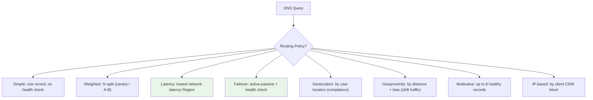
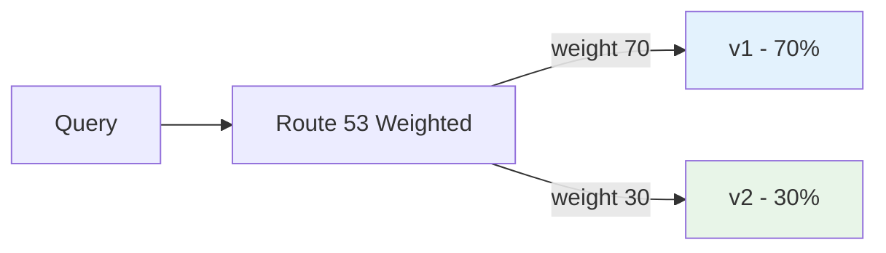
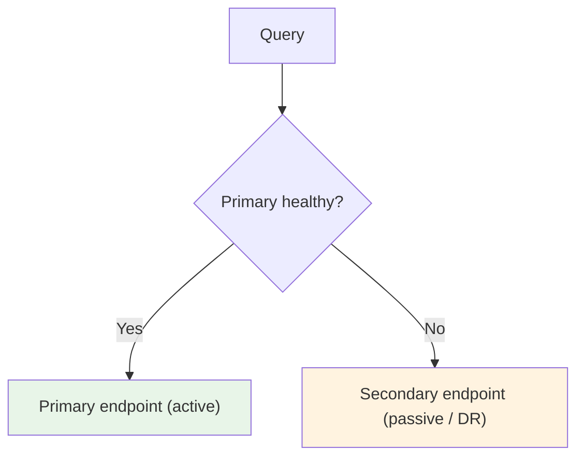
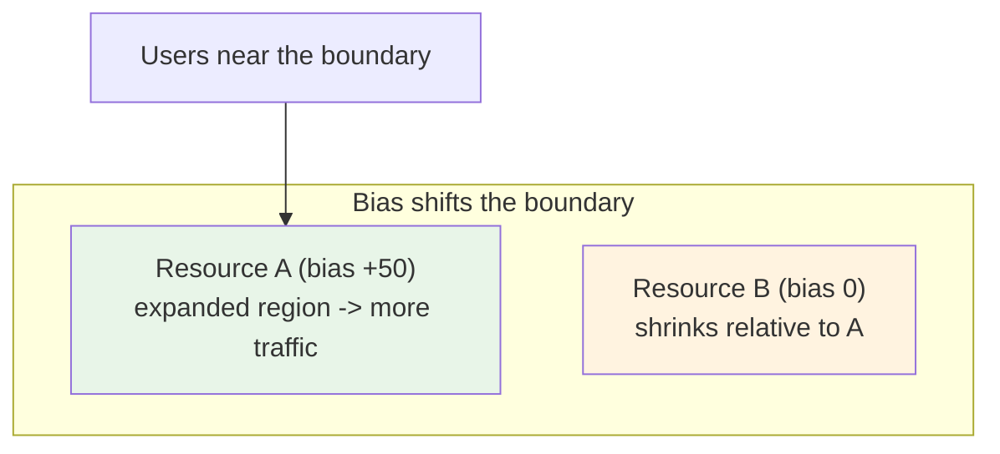

# Routing Policies Deep Dive - SAA-C03 Deep Dive

> Route 53 routing policies decide **which answer** a DNS query returns: **Simple, Weighted, Latency-based, Failover, Geolocation, Geoproximity, Multivalue Answer,** and **IP-based**. Matching the scenario keyword to the right policy is the single highest-yield Route 53 skill on the exam.

See also: [01 - Route 53 Fundamentals & Hosted Zones](01%20-%20Route%2053%20Fundamentals%20%26%20Hosted%20Zones.md) · [02 - Record Types & Alias vs CNAME](02%20-%20Record%20Types%20%26%20Alias%20vs%20CNAME.md) · [04 - Health Checks, DNSSEC, Resolver & Hybrid DNS](04%20-%20Health%20Checks%2C%20DNSSEC%2C%20Resolver%20%26%20Hybrid%20DNS.md) · [05 - Route 53 Exam Scenarios & Cheat Sheet](05%20-%20Route%2053%20Exam%20Scenarios%20%26%20Cheat%20Sheet.md)

---

## Table of Contents

- [Part 1: Simple Routing](#part-1-simple-routing)
- [Part 2: Weighted Routing](#part-2-weighted-routing)
- [Part 3: Latency-Based Routing](#part-3-latency-based-routing)
- [Part 4: Failover Routing (Active-Passive)](#part-4-failover-routing-active-passive)
- [Part 5: Geolocation Routing](#part-5-geolocation-routing)
- [Part 6: Geoproximity Routing (+ Bias & Traffic Flow)](#part-6-geoproximity-routing--bias--traffic-flow)
- [Part 7: Multivalue Answer Routing](#part-7-multivalue-answer-routing)
- [Part 8: IP-Based Routing](#part-8-ip-based-routing)
- [Part 9: Geolocation vs Geoproximity vs Latency](#part-9-geolocation-vs-geoproximity-vs-latency)
- [Summary: Key Takeaways for SAA-C03](#summary-key-takeaways-for-saa-c03)

---

---

Every routing policy except **Simple** and **Multivalue** can use **Route 53 record-set IDs** and most integrate with **health checks** (covered in [04 - Health Checks, DNSSEC, Resolver & Hybrid DNS](04%20-%20Health%20Checks%2C%20DNSSEC%2C%20Resolver%20%26%20Hybrid%20DNS.md)).

---

## Part 1: Simple Routing

**How it works:** Routes traffic to a single resource. One record, no health checks. If the record contains multiple IPs, Route 53 returns **all of them in random order** and the client picks one.

| Aspect              | Detail                                                         |
| :------------------ | :------------------------------------------------------------- |
| **Health checks**   | ❌ Not supported                                               |
| **Multiple values** | Multiple IPs allowed, returned all at once (client chooses)    |
| **Use case**        | A single resource that serves the domain (e.g. one web server) |

> **Exam Trap:** Simple routing **cannot** do health-check-based failover. If a scenario needs health-aware multiple answers, use **Multivalue Answer**, not Simple.

[⬆ Back to top](#table-of-contents)

---

## Part 2: Weighted Routing

**How it works:** Splits traffic across multiple resources by an assigned **weight** (relative integer). A record's share = its weight ÷ sum of all weights. Setting a weight to **0** stops sending traffic to that record (unless all are 0, then all are returned equally).

| Aspect            | Detail                                                                       |
| :---------------- | :--------------------------------------------------------------------------- |
| **Health checks** | ✅ Supported                                                                 |
| **Use case**      | **Canary / blue-green / A-B testing**, gradual deployment, load distribution |
| **Set weight 0**  | Drain traffic from a resource                                                |

> **Exam Tip:** Keywords **"gradual rollout", "canary", "A/B test", "send X% of traffic"** → **Weighted routing**.

[⬆ Back to top](#table-of-contents)

---

## Part 3: Latency-Based Routing

**How it works:** Routes the user to the AWS **Region** that gives the **lowest network latency** for that user, based on AWS's latency measurements (not raw geographic distance). Records are tied to a Region.

| Aspect            | Detail                                                  |
| :---------------- | :------------------------------------------------------ |
| **Health checks** | ✅ Supported                                            |
| **Granularity**   | Per **AWS Region**                                      |
| **Use case**      | Global apps where **performance/speed** is the priority |

> **Exam Tip:** **"Lowest latency", "best performance for global users"** → **Latency-based routing**. Note latency ≠ distance; AWS bases it on measured latency to Regions.

[⬆ Back to top](#table-of-contents)

---

## Part 4: Failover Routing (Active-Passive)

**How it works:** One **primary** record and one **secondary** record. Route 53 monitors the primary via a **health check**; if it fails, Route 53 returns the secondary. This is the classic **active-passive disaster recovery** pattern.

| Aspect            | Detail                                           |
| :---------------- | :----------------------------------------------- |
| **Health checks** | ✅ **Required** on the primary                   |
| **Records**       | Exactly one Primary + one Secondary              |
| **Use case**      | **Disaster recovery**, active-passive failover   |
| **Secondary**     | Can be a static "site down" S3 page if both fail |

> **Exam Tip:** **"Automatic failover", "disaster recovery", "active-passive"** → **Failover routing + health check**.

[⬆ Back to top](#table-of-contents)

---

## Part 5: Geolocation Routing

**How it works:** Routes based on the **physical location of the user** (by Continent, Country, or US State). It is about **where the user is**, not latency. You should configure a **Default** record to catch locations with no specific match.

| Aspect             | Detail                                                                                |
| :----------------- | :------------------------------------------------------------------------------------ |
| **Health checks**  | ✅ Supported                                                                          |
| **Match levels**   | Continent → Country → US State (most specific wins)                                   |
| **Default record** | Recommended for unmatched locations                                                   |
| **Use case**       | **Compliance / data sovereignty**, localized content, geo-restriction, language sites |

> **Exam Tip:** **"Restrict content by country", "serve French users a French site", "data must stay in EU", "block a country"** → **Geolocation routing**.

> **Exam Trap:** If no location matches and there is **no Default record**, Route 53 returns **"no answer"**. Always set a default.

[⬆ Back to top](#table-of-contents)

---

## Part 6: Geoproximity Routing (+ Bias & Traffic Flow)

**How it works:** Routes based on the **geographic distance** between users and resources, and lets you **shift traffic** to resources by adjusting a **bias** value.

- **Positive bias** → expands a resource's region, sending it **more** traffic.
- **Negative bias** → shrinks it, sending it **less** traffic.

Geoproximity **requires Route 53 Traffic Flow** (the visual policy editor / traffic policy feature).

| Aspect            | Detail                                                       |
| :---------------- | :----------------------------------------------------------- |
| **Health checks** | ✅ Supported                                                 |
| **Requires**      | **Traffic Flow** (traffic policies)                          |
| **Bias**          | -99 to +99, expands/shrinks a resource's geographic region   |
| **Use case**      | Shift traffic between Regions/data centers by adjusting bias |

> **Exam Tip:** Keyword **"bias"** or **"shift more traffic to one Region/data center"** → **Geoproximity** (and it needs **Traffic Flow**).

[⬆ Back to top](#table-of-contents)

---

## Part 7: Multivalue Answer Routing

**How it works:** Returns **up to 8 healthy records** chosen at random, each optionally tied to its own **health check**. Unhealthy records are excluded from responses. It is **client-side load balancing / availability**, _not_ a substitute for an actual load balancer.

| Aspect            | Detail                                                    |
| :---------------- | :-------------------------------------------------------- |
| **Health checks** | ✅ Per record                                             |
| **Max returned**  | 8 healthy records                                         |
| **Use case**      | Improve availability of multiple resources without an ELB |

> **Exam Trap:** Multivalue is **not** a load balancer - there is no traffic management or SSL termination. If the scenario needs real load balancing use an [ELB](01%20-%20ELB%20Fundamentals%20%26%20Types.md); if it just needs DNS to skip unhealthy IPs across several endpoints, Multivalue fits.

> **Difference from Simple with multiple IPs:** Simple returns all IPs but does **no** health checking; Multivalue returns only **healthy** ones.

[⬆ Back to top](#table-of-contents)

---

## Part 8: IP-Based Routing

**How it works:** Routes based on the **client's source IP / CIDR block**. You define **CIDR collections** mapping IP ranges to endpoints. Useful when you know your users' network ranges (e.g. specific ISPs) and want to optimize routing or cost.

| Aspect            | Detail                                                                                                           |
| :---------------- | :--------------------------------------------------------------------------------------------------------------- |
| **Health checks** | ✅ Supported                                                                                                     |
| **Input**         | Client IP / CIDR collections                                                                                     |
| **Use case**      | Route specific ISPs/networks to specific endpoints; performance/cost optimization based on known client networks |

> **Exam Tip:** **"Route based on the user's IP address / CIDR / known ISP ranges"** → **IP-based routing**.

[⬆ Back to top](#table-of-contents)

---

## Part 9: Geolocation vs Geoproximity vs Latency

These three confuse candidates the most. Compare them directly.

| Policy            | Decision Basis                                             | Adjustable?        | Primary Use Case                                         |
| :---------------- | :--------------------------------------------------------- | :----------------- | :------------------------------------------------------- |
| **Latency-based** | Measured **network latency** to AWS Regions                | No                 | **Performance** - fastest response globally              |
| **Geolocation**   | The user's **physical location** (continent/country/state) | No (fixed mapping) | **Compliance / localization** - control by where user is |
| **Geoproximity**  | **Distance** between user and resource                     | **Yes, via bias**  | **Shift traffic** between Regions/sites                  |

### One-Line Disambiguation

- "**Fastest**" → **Latency**
- "**Where the user is** / country / compliance / language" → **Geolocation**
- "**Shift / bias** traffic toward a Region/data center" → **Geoproximity**

> **Exam Trap:** Latency picks the **lowest-latency Region**, which is usually but **not always** the geographically nearest one. Do not equate latency routing with "nearest Region."

[⬆ Back to top](#table-of-contents)

---

## Summary: Key Takeaways for SAA-C03

| Policy           | Health Checks   | Trigger Keywords                                          |
| :--------------- | :-------------- | :-------------------------------------------------------- |
| **Simple**       | ❌              | Single resource, no failover                              |
| **Weighted**     | ✅              | Canary, A/B, gradual rollout, % split                     |
| **Latency**      | ✅              | Lowest latency, best performance, global speed            |
| **Failover**     | ✅ (required)   | DR, active-passive, automatic failover                    |
| **Geolocation**  | ✅              | Compliance, by country/continent, localization, geo-block |
| **Geoproximity** | ✅              | Bias, shift traffic between Regions (needs Traffic Flow)  |
| **Multivalue**   | ✅ (per record) | Up to 8 healthy IPs, availability w/o ELB                 |
| **IP-based**     | ✅              | Route by client CIDR / ISP range                          |

**Remember:** Only **Simple** lacks health-check support; **Geoproximity** needs **Traffic Flow**; **Failover** _requires_ a health check on the primary.

[⬆ Back to top](#table-of-contents)

---
