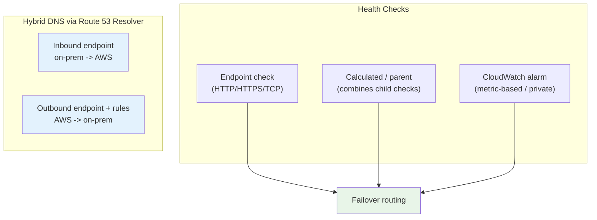
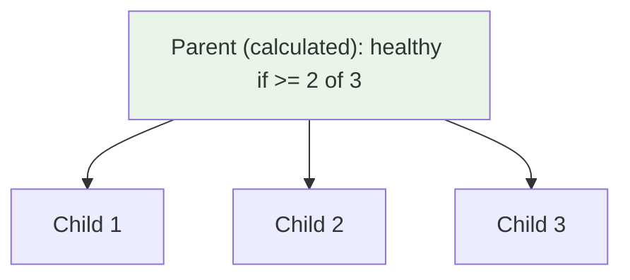
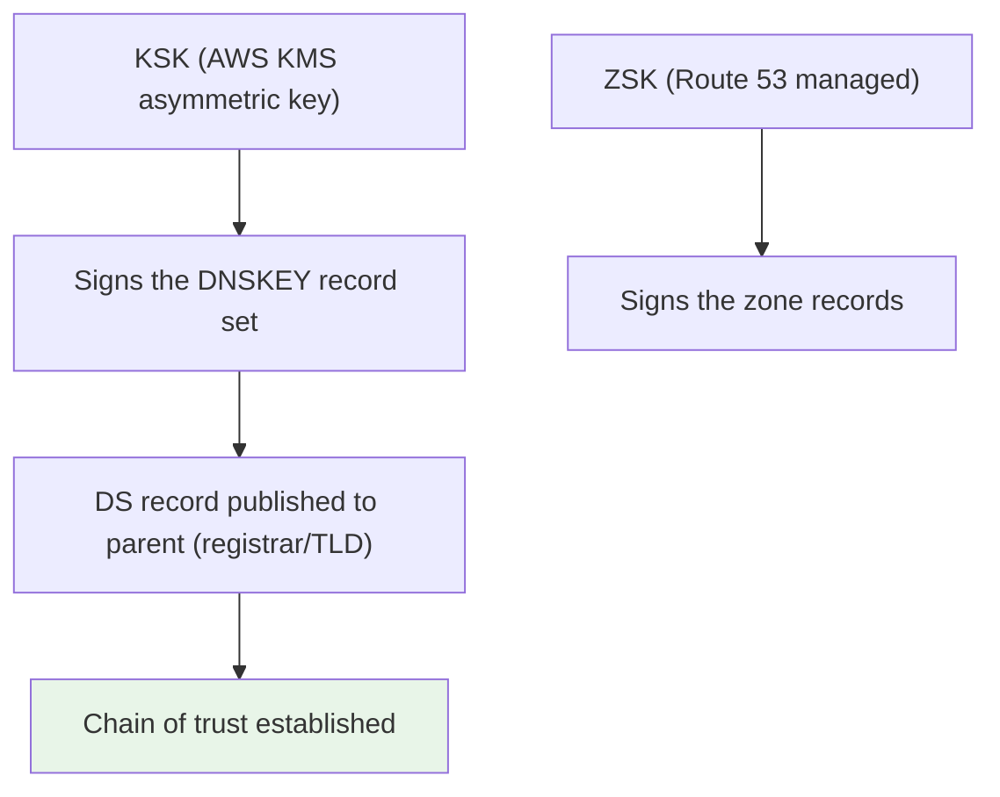
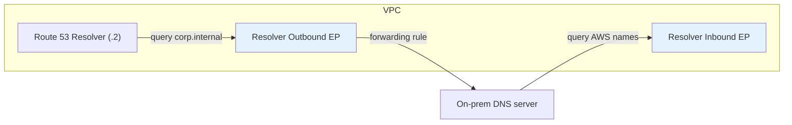

# Health Checks, DNSSEC, Resolver & Hybrid DNS - SAA-C03 Deep Dive

> Route 53 **health checks** drive failover, **DNSSEC** signs responses to prevent spoofing, and **Route 53 Resolver** (inbound/outbound endpoints + forwarding rules) bridges **on-prem and VPC DNS** for hybrid environments.

See also: [01 - Route 53 Fundamentals & Hosted Zones](01%20-%20Route%2053%20Fundamentals%20%26%20Hosted%20Zones.md) · [02 - Record Types & Alias vs CNAME](02%20-%20Record%20Types%20%26%20Alias%20vs%20CNAME.md) · [03 - Routing Policies Deep Dive](03%20-%20Routing%20Policies%20Deep%20Dive.md) · [05 - Route 53 Exam Scenarios & Cheat Sheet](05%20-%20Route%2053%20Exam%20Scenarios%20%26%20Cheat%20Sheet.md)

---

## Table of Contents

- [Part 1: Health Check Types](#part-1-health-check-types)
- [Part 2: Endpoint Health Checks (Details)](#part-2-endpoint-health-checks-details)
- [Part 3: Calculated (Parent) Health Checks](#part-3-calculated-parent-health-checks)
- [Part 4: CloudWatch Alarm Health Checks](#part-4-cloudwatch-alarm-health-checks)
- [Part 5: Health Checks + Failover Behaviour](#part-5-health-checks--failover-behaviour)
- [Part 6: DNSSEC Signing](#part-6-dnssec-signing)
- [Part 7: Route 53 Resolver & Hybrid DNS](#part-7-route-53-resolver--hybrid-dns)
- [Part 8: Private Hosted Zone Resolution Across VPCs](#part-8-private-hosted-zone-resolution-across-vpcs)
- [Summary: Key Takeaways for SAA-C03](#summary-key-takeaways-for-saa-c03)

---



---

Health checks power the failover discussed in [03 - Routing Policies Deep Dive](03%20-%20Routing%20Policies%20Deep%20Dive.md); the Resolver section is heavily tested for hybrid/on-prem scenarios.

---

## Part 1: Health Check Types

Route 53 offers **three** types of health checks. Know what each monitors.

| Type                    | Monitors                                         | Best For                                    |
| :---------------------- | :----------------------------------------------- | :------------------------------------------ |
| **Endpoint**            | An IP/domain endpoint via HTTP, HTTPS, or TCP    | Public-facing endpoints                     |
| **Calculated (parent)** | The status of **other health checks** (children) | Combining multiple checks with AND/OR logic |
| **CloudWatch alarm**    | The state of a **CloudWatch alarm**              | **Private resources** & custom metrics      |

> **Exam Tip:** To health-check a **private** resource (private IP, no public access), you **cannot** use a direct endpoint check (Route 53 health checkers live on the public internet). Instead, publish a metric to **CloudWatch** and use a **CloudWatch alarm health check**.

[⬆ Back to top](#table-of-contents)

---

## Part 2: Endpoint Health Checks (Details)

Route 53 has a fleet of **global health checkers** that probe your endpoint.

| Setting                     | Detail                                                             |
| :-------------------------- | :----------------------------------------------------------------- |
| **Protocols**               | HTTP, HTTPS, TCP                                                   |
| **String matching**         | Optionally check the first 5,120 bytes of the body for a string    |
| **Interval**                | Standard (30s) or **Fast (10s)**                                   |
| **Failure threshold**       | Default 3 consecutive failures before "Unhealthy"                  |
| **Healthy/Unhealthy logic** | Endpoint is healthy if **> 18% of checkers** report healthy        |
| **Source IPs**              | Must allow Route 53 health-checker IP ranges through firewalls/SGs |

> **Exam Trap:** If health checks fail unexpectedly for a public endpoint, the **security group / NACL / firewall** may be blocking Route 53's health-checker IP ranges. Allow those ranges.

> **Exam Tip:** HTTPS health checks **do not validate** the SSL certificate (no SNI for cert validation in the basic sense) - the check is about reachability, not cert trust.

[⬆ Back to top](#table-of-contents)

---

## Part 3: Calculated (Parent) Health Checks

A **calculated** health check combines the results of up to **256 child** health checks using a rule: healthy if **at least N of M** children are healthy (effectively AND/OR logic).

**Use cases:**

- Treat a site as healthy only if a minimum number of servers are healthy.
- Perform **maintenance** without triggering failover (invert/disable a child).
- Aggregate many micro-checks into one parent that failover routing references.



[⬆ Back to top](#table-of-contents)

---

## Part 4: CloudWatch Alarm Health Checks

This type ties a health check to a **CloudWatch alarm** state. Essential for resources Route 53 cannot reach directly.

| Aspect                | Detail                                                              |
| :-------------------- | :------------------------------------------------------------------ |
| **How**               | Health check follows the alarm: `ALARM` → unhealthy, `OK` → healthy |
| **Private resources** | The **only** way to health-check private/internal endpoints         |
| **Custom metrics**    | Health based on any metric (e.g. queue depth, error rate)           |

**Pattern for a private EC2:** publish a custom metric (or use an existing one) → create a CloudWatch alarm → create a Route 53 health check of type **CloudWatch alarm** → use it in failover routing.

[⬆ Back to top](#table-of-contents)

---

## Part 5: Health Checks + Failover Behaviour

When a health check goes **unhealthy**, Route 53 stops returning the associated record (failover routing) or excludes it (multivalue).

| Scenario                                | Behaviour                                                                                             |
| :-------------------------------------- | :---------------------------------------------------------------------------------------------------- |
| **Failover routing, primary unhealthy** | Route 53 returns the **secondary** record                                                             |
| **Alias with "Evaluate Target Health"** | Route 53 inherits the AWS target's health automatically (no separate check needed for ELB/CloudFront) |
| **Multivalue**                          | Unhealthy records are removed from the (max 8) answer set                                             |
| **All endpoints unhealthy**             | Failover may return the primary anyway as a last resort (better than no answer)                       |

> **Exam Tip:** For an **Alias to an ELB**, set **Evaluate Target Health = true** instead of building a separate health check - the ELB's own target health propagates up.

[⬆ Back to top](#table-of-contents)

---

## Part 6: DNSSEC Signing

**DNSSEC** (DNS Security Extensions) cryptographically **signs** DNS responses so resolvers can verify they were not **tampered with** (defends against DNS spoofing / cache poisoning / man-in-the-middle).

| Aspect                  | Detail                                                                                                                       |
| :---------------------- | :--------------------------------------------------------------------------------------------------------------------------- |
| **Scope**               | Supported for **public hosted zones** (signing) and for **domain registration**                                              |
| **Keys**                | Uses a **KSK** (Key Signing Key, backed by **AWS KMS** asymmetric key) and a **ZSK** (Zone Signing Key, managed by Route 53) |
| **Chain of trust**      | A **DS record** is added to the **parent zone** (registrar/TLD) to establish trust                                           |
| **What it does NOT do** | DNSSEC does **not encrypt** data - it only **authenticates/integrity-checks** responses                                      |



> **Exam Tip:** **"Prevent DNS spoofing / cache poisoning / tampering"** → enable **DNSSEC signing**. Remember it needs a **KMS** key for the KSK and a **DS record** at the parent zone. DNSSEC ≠ encryption.

[⬆ Back to top](#table-of-contents)

---

## Part 7: Route 53 Resolver & Hybrid DNS

Inside every VPC there is the **Route 53 Resolver** (the `.2` address, the "AmazonProvidedDNS" / VPC+2). For **hybrid** setups - resolving names between **on-premises DNS** and **AWS VPC DNS** - you create **Resolver endpoints** plus **forwarding rules**.

| Component             | Direction         | Purpose                                                           |
| :-------------------- | :---------------- | :---------------------------------------------------------------- |
| **Inbound endpoint**  | **On-prem → AWS** | On-prem servers resolve **AWS** (private hosted zone) names       |
| **Outbound endpoint** | **AWS → On-prem** | VPC resources resolve **on-prem** names via forwarding rules      |
| **Forwarding rules**  | (with outbound)   | "For domain `corp.internal`, forward to on-prem DNS at 10.1.0.10" |



### Connectivity

Resolver endpoints require connectivity between VPC and on-prem - typically **Direct Connect** or a **Site-to-Site VPN**. (See [01 - VPC Fundamentals & Architecture](01%20-%20VPC%20Fundamentals%20%26%20Architecture.md).)

> **Exam Tip:**
>
> - **On-prem needs to resolve AWS private names** → **Inbound** endpoint.
> - **AWS needs to resolve on-prem names** → **Outbound** endpoint + **forwarding rules**.
>   Mnemonic: the **direction of the DNS query** names the endpoint (queries coming _in_ from on-prem = inbound).

[⬆ Back to top](#table-of-contents)

---

## Part 8: Private Hosted Zone Resolution Across VPCs

A **private hosted zone** (PHZ) answers queries only for **associated VPCs**.

| Requirement                   | Detail                                                                                                                               |
| :---------------------------- | :----------------------------------------------------------------------------------------------------------------------------------- |
| **VPC DNS settings**          | `enableDnsSupport` **and** `enableDnsHostnames` must be `true`                                                                       |
| **Multiple VPCs**             | Associate several VPCs with the same PHZ for shared internal DNS                                                                     |
| **Cross-account association** | Use the CLI: `create-vpc-association-authorization` in the PHZ account, then `associate-vpc-with-hosted-zone` from the other account |
| **Overlapping names**         | Most specific PHZ wins; PHZ takes precedence over public for associated VPCs (split-horizon)                                         |

```bash
# Cross-account PHZ association
# 1) In the account that OWNS the private hosted zone:
aws route53 create-vpc-association-authorization \
    --hosted-zone-id Z123PRIVATE \
    --vpc VPCRegion=us-east-1,VPCId=vpc-0bbb \
# 2) In the account that OWNS the VPC:
aws route53 associate-vpc-with-hosted-zone \
    --hosted-zone-id Z123PRIVATE \
    --vpc VPCRegion=us-east-1,VPCId=vpc-0bbb
```

> **Exam Trap:** Private hosted zone records **not resolving** inside the VPC → check that **both** `enableDnsSupport` and `enableDnsHostnames` are enabled, and that the VPC is **associated** with the zone.

[⬆ Back to top](#table-of-contents)

---

## Summary: Key Takeaways for SAA-C03

| Concept                           | What You Must Know                                                                       |
| :-------------------------------- | :--------------------------------------------------------------------------------------- |
| **Endpoint health check**         | HTTP/HTTPS/TCP; allow Route 53 checker IPs; healthy if >18% checkers OK                  |
| **Calculated health check**       | Combines child checks (N of M); good for maintenance/aggregation                         |
| **CloudWatch alarm health check** | Only way to check **private** resources / custom metrics                                 |
| **Evaluate Target Health**        | For Alias to ELB/CloudFront - inherits target health, no separate check                  |
| **Failover**                      | Unhealthy primary → returns secondary                                                    |
| **DNSSEC**                        | Signs responses (anti-spoofing); KSK in **KMS**, **DS record** at parent; not encryption |
| **Inbound Resolver EP**           | On-prem resolves AWS names                                                               |
| **Outbound Resolver EP + rules**  | AWS resolves on-prem names                                                               |
| **Hybrid connectivity**           | Needs Direct Connect or VPN                                                              |
| **Private hosted zone**           | Needs DNS support + hostnames; associate VPCs (cross-account via CLI)                    |

[⬆ Back to top](#table-of-contents)

---
