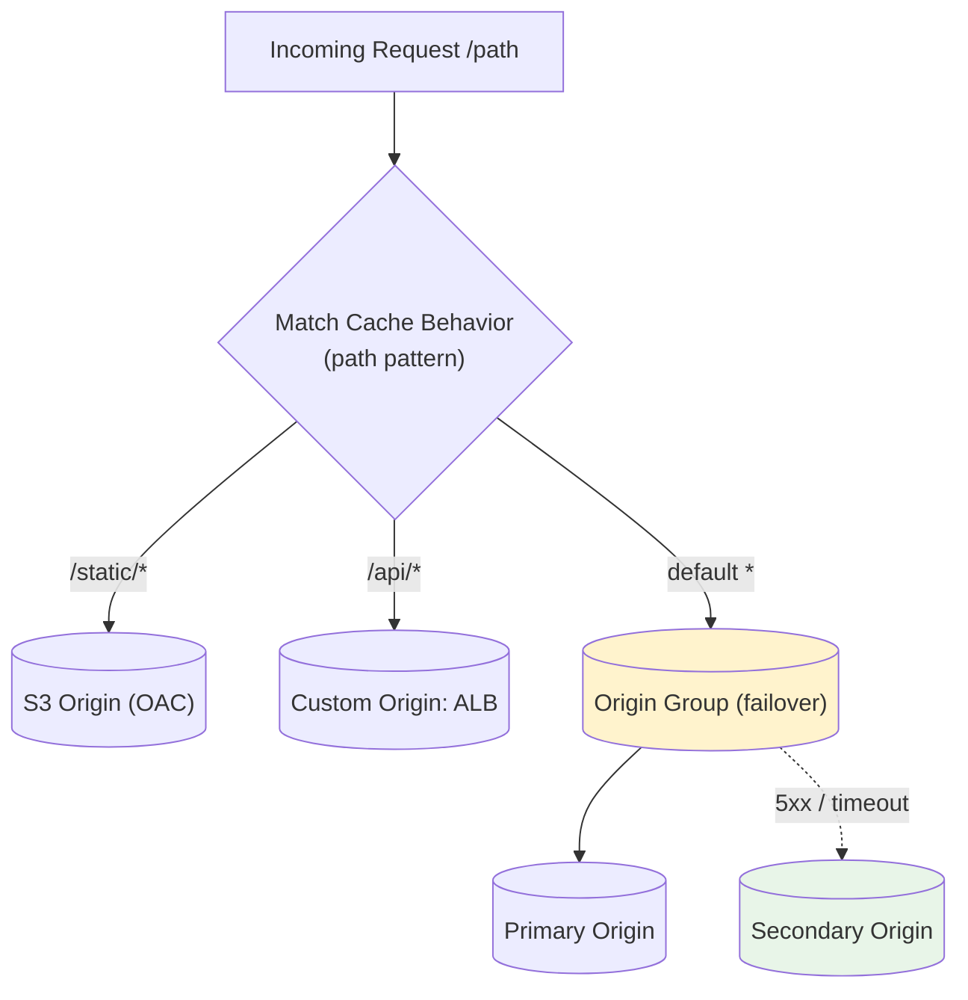

# CloudFront Origins, Cache Behaviors & TTL - SAA-C03 Deep Dive

> An origin is where CloudFront fetches content on a cache miss. Cache behaviors route paths to origins and define the cache key; TTLs and policies control how long and how content is cached.

See also: [01 - CloudFront Fundamentals & Architecture](01%20-%20CloudFront%20Fundamentals%20%26%20Architecture.md) · [03 - CloudFront Security (OAC, Signed URLs, WAF, Geo, Field-Level Encryption)](03%20-%20CloudFront%20Security%20%28OAC%2C%20Signed%20URLs%2C%20WAF%2C%20Geo%2C%20Field-Level%20Encryption%29.md) · [04 - Edge Functions (CloudFront Functions vs Lambda@Edge)](04%20-%20Edge%20Functions%20%28CloudFront%20Functions%20vs%20Lambda%40Edge%29.md) · [05 - CloudFront Exam Scenarios & Cheat Sheet](05%20-%20CloudFront%20Exam%20Scenarios%20%26%20Cheat%20Sheet.md)

---

## Table of Contents

- [Origin Types](#origin-types)
- [Origin Groups (Automatic Failover)](#origin-groups-automatic-failover)
- [Cache Behaviors & Path Patterns](#cache-behaviors--path-patterns)
- [The Cache Key (Headers, Cookies, Query Strings)](#the-cache-key-headers-cookies-query-strings)
- [Cache Policies vs Origin Request Policies](#cache-policies-vs-origin-request-policies)
- [TTL: Minimum, Default, and Maximum](#ttl-minimum-default-and-maximum)
- [Invalidations vs Versioned Objects](#invalidations-vs-versioned-objects)
- [Compression at the Edge](#compression-at-the-edge)
- [Summary: Key Takeaways for SAA-C03](#summary-key-takeaways-for-saa-c03)

---



---

A single CloudFront distribution can serve from multiple origins, routing requests by path pattern. The **cache key** determines what counts as a unique object, and **TTLs** govern freshness. These mechanics drive many SAA-C03 caching questions.

---

## Origin Types

An **origin** is the source CloudFront pulls from on a cache miss. A distribution can have **multiple origins**.

| Origin Type                           | Description                       | Notes                                                                       |
| :------------------------------------ | :-------------------------------- | :-------------------------------------------------------------------------- |
| **S3 bucket (REST endpoint)**         | Standard S3 origin                | Secure with **OAC** so the bucket stays private                             |
| **S3 static website endpoint**        | S3 configured as a website        | Treated as a **custom origin** (HTTP only); needed for redirects/index docs |
| **Custom HTTP origin**                | Any HTTP/HTTPS server             | EC2, on-prem server, or external URL                                        |
| **Application Load Balancer (ALB)**   | Custom origin in front of EC2/ECS | Common for dynamic apps                                                     |
| **EC2 instance**                      | Direct custom origin              | Less common than ALB                                                        |
| **AWS MediaStore / MediaPackage**     | Media-optimized origins           | Live/VOD video streaming                                                    |
| **API Gateway / Lambda Function URL** | Custom origin                     | Edge-fronted APIs                                                           |

### S3 REST Endpoint vs S3 Website Endpoint

|                              | S3 REST Endpoint | S3 Website Endpoint    |
| :--------------------------- | :--------------- | :--------------------- |
| Origin classification        | S3 origin        | **Custom origin**      |
| Private bucket support (OAC) | ✅ Yes           | ❌ No (must be public) |
| Index documents / redirects  | ❌ No            | ✅ Yes                 |
| HTTPS to origin              | ✅ Yes           | ❌ HTTP only           |

> **Exam Trap:** If you need S3 **website redirects or index documents**, you must use the S3 **website endpoint**, which is a _custom_ origin and **cannot use OAC** (the bucket must be public). To keep the bucket private, use the **REST endpoint with OAC** and lose website features.

[⬆ Back to top](#table-of-contents)

---

## Origin Groups (Automatic Failover)

An **origin group** pairs a **primary** and a **secondary** origin for **high availability**.

### How Failover Works

1. CloudFront sends the request to the **primary** origin.
2. If the primary returns a configured **failover status code** (e.g., 500, 502, 503, 504) or **times out / connection error**, CloudFront automatically retries the **secondary**.
3. The viewer is unaware — they get one successful response.

### Common Patterns

| Pattern                        | Setup                                                         |
| :----------------------------- | :------------------------------------------------------------ |
| **S3 multi-region resilience** | Primary S3 bucket (region A) → Secondary S3 bucket (region B) |
| **App DR**                     | Primary ALB → Secondary ALB in another region                 |

> **Exam Tip:** "CloudFront should automatically serve from a backup origin if the primary fails" → **Origin Group with failover**. Failover triggers only on the **specified error codes** or connection failures, not on 4xx like 404.

[⬆ Back to top](#table-of-contents)

---

## Cache Behaviors & Path Patterns

A **cache behavior** maps a URL **path pattern** to an origin and a set of caching/security settings. This is how one distribution serves static + dynamic content differently.

### Ordering and Matching

- Behaviors are evaluated **in order of precedence**; the **first matching** path pattern wins.
- There is always **one Default (`*`) behavior** that catches anything unmatched (lowest precedence).

| Path Pattern   | Behavior Example                                             |
| :------------- | :----------------------------------------------------------- |
| `/images/*`    | S3 origin, long TTL, cache aggressively                      |
| `/api/*`       | ALB origin, forward all headers/cookies, TTL 0 (don't cache) |
| `/*` (default) | Fallback origin                                              |

### What a Cache Behavior Controls

- Target origin or origin group
- Viewer protocol policy (redirect HTTP→HTTPS, HTTPS only)
- Allowed HTTP methods (GET/HEAD, or full GET/PUT/POST/DELETE...)
- Cache policy & origin request policy
- Field-level encryption, function associations (CloudFront Functions / Lambda@Edge)
- Restrict viewer access (signed URLs/cookies)

> **Exam Tip:** "Serve static assets from S3 and dynamic API from an ALB through one distribution" → multiple **cache behaviors** with different **path patterns** pointing to different origins.

[⬆ Back to top](#table-of-contents)

---

## The Cache Key (Headers, Cookies, Query Strings)

The **cache key** is the unique identifier CloudFront uses to decide whether it already has a cached object. By default it's just the **host + path**. You can add components:

| Cache Key Component | Effect of Including                                                |
| :------------------ | :----------------------------------------------------------------- |
| **Query strings**   | Separate cached copy per query string value (e.g., `?size=large`)  |
| **Headers**         | Separate copy per header value (e.g., `CloudFront-Viewer-Country`) |
| **Cookies**         | Separate copy per cookie value                                     |

### The Trade-off

- **More cache key components** → more uniqueness → **lower cache hit ratio** (more variants stored, more origin fetches).
- **Fewer components** → higher hit ratio → better performance/offload.

> **Exam Trap:** Forwarding **all headers/cookies/query strings** to the cache key destroys the cache hit ratio (every request becomes "unique"). To personalize via headers **without** wrecking caching, forward needed values in the **origin request policy** but keep them **out of the cache key** where possible.

### Cache Key vs Origin Request

A subtle but tested distinction:

- **Cache policy** → defines the **cache key** (what makes an object unique) **and** what's forwarded to origin for those values.
- **Origin request policy** → forwards **additional** values to the origin **without** adding them to the cache key.

[⬆ Back to top](#table-of-contents)

---

## Cache Policies vs Origin Request Policies

CloudFront uses **managed and custom policies** (the modern replacement for legacy "forward headers/cookies/query strings" settings).

| Policy Type                 | Controls                                                                                   | Affects Cache Key? |
| :-------------------------- | :----------------------------------------------------------------------------------------- | :----------------- |
| **Cache Policy**            | TTLs + which headers/cookies/query strings form the **cache key** (and are sent to origin) | ✅ Yes             |
| **Origin Request Policy**   | Additional headers/cookies/query strings forwarded to **origin only**                      | ❌ No              |
| **Response Headers Policy** | Adds/modifies response headers (CORS, HSTS, security headers) without code                 | N/A                |

### Managed Policies (Know These Names)

| Managed Cache Policy                     | Behavior                                                                 |
| :--------------------------------------- | :----------------------------------------------------------------------- |
| `CachingOptimized`                       | No headers/cookies/query strings in key; best hit ratio (static content) |
| `CachingDisabled`                        | TTL 0, nothing cached (dynamic/API content)                              |
| `CachingOptimizedForUncompressedObjects` | For large uncompressed objects                                           |

> **Exam Tip:** Need a value at the origin for logic but **don't** want it to fragment the cache → put it in an **Origin Request Policy**, not the cache policy.

[⬆ Back to top](#table-of-contents)

---

## TTL: Minimum, Default, and Maximum

**TTL (Time To Live)** controls how long an object stays cached at the edge before CloudFront revalidates with the origin.

| TTL Setting     | Meaning                                                                |
| :-------------- | :--------------------------------------------------------------------- |
| **Minimum TTL** | Floor — object cached at least this long, regardless of origin headers |
| **Default TTL** | Used when the origin sends **no** cache directive                      |
| **Maximum TTL** | Ceiling — caps how long even if origin requests longer                 |

### Interaction with Origin Cache Headers

The origin can send `Cache-Control: max-age=...` or `Expires`:

- If origin specifies a value, CloudFront clamps it between **Min** and **Max** TTL.
- If origin sends nothing, **Default TTL** applies.
- `Cache-Control: no-cache` / `no-store` / `private` can prevent caching (respecting Min TTL).

```
Effective TTL = clamp(origin max-age, MinTTL, MaxTTL)
If no origin header → DefaultTTL (still bounded by Min/Max)
```

> **Exam Tip:** Default TTL is **24 hours (86400s)** unless changed. To force CloudFront to honor origin headers exactly, set Min=0 and a high Max, and let the origin drive caching with `Cache-Control`.

[⬆ Back to top](#table-of-contents)

---

## Invalidations vs Versioned Objects

When content changes before its TTL expires, you have two ways to serve fresh content.

| Approach                   | How It Works                                                               | Cost / Trade-off                                                                 |
| :------------------------- | :------------------------------------------------------------------------- | :------------------------------------------------------------------------------- |
| **Invalidation**           | Tell CloudFront to remove objects from edge caches now (e.g., `/images/*`) | First 1,000 paths/month free, then **charged per path**; takes time to propagate |
| **Versioned object names** | Change the filename/URL (`logo_v2.png`, `app.abc123.js`)                   | **Free**, instant, cache-friendly; old + new coexist; recommended best practice  |

### Invalidation Mechanics

- You can invalidate specific paths or wildcards (`/*` invalidates everything — expensive).
- Useful for emergency purges or content you can't rename.

```bash
aws cloudfront create-invalidation \
    --distribution-id E1ABCDEF2GHIJK \
    --paths "/index.html" "/css/*"
```

> **Exam Tip:** "Best practice / cost-effective way to push updates" → **versioned file names** (cache busting). "Immediately remove a specific outdated object" → **invalidation**. Don't invalidate `/*` routinely — it's slow and costs money.

[⬆ Back to top](#table-of-contents)

---

## Compression at the Edge

CloudFront can **automatically compress** eligible objects (Gzip and Brotli), reducing transfer size and improving load times.

### Requirements for Automatic Compression

- Enable **"Compress objects automatically"** in the cache behavior.
- The viewer must send `Accept-Encoding: gzip` (or `br`).
- File size between **1,000 and 10,000,000 bytes**.
- Content type must be compressible (text, JS, CSS, JSON, etc.) — already-compressed formats (JPEG, MP4) are skipped.

| Benefit                  | Result                          |
| :----------------------- | :------------------------------ |
| Smaller payloads         | Faster downloads, lower latency |
| Lower data transfer cost | Fewer bytes billed out          |

> **Exam Tip:** "Reduce the size of text-based files served to users without changing the application" → enable **CloudFront automatic compression** (and ensure the cache policy includes the `Accept-Encoding` header behavior).

[⬆ Back to top](#table-of-contents)

---

## Summary: Key Takeaways for SAA-C03

| Concept                            | What You Must Know                                                                                  |
| :--------------------------------- | :-------------------------------------------------------------------------------------------------- |
| **Origin types**                   | S3 REST (OAC, private), S3 website (custom origin, public), ALB/EC2/HTTP custom origins, MediaStore |
| **Origin groups**                  | Primary + secondary for **automatic failover** on configured error codes                            |
| **Cache behaviors**                | Path patterns route to origins; first match wins; default `*` is fallback                           |
| **Cache key**                      | Host+path by default; add headers/cookies/query strings carefully (hurts hit ratio)                 |
| **Cache vs origin request policy** | Cache policy = cache key; origin request policy = forward to origin only                            |
| **TTL**                            | Min / Default (24h) / Max; origin `Cache-Control` clamped between Min and Max                       |
| **Freshness**                      | Versioned filenames (best practice) vs invalidations (immediate, costs after 1k/month)              |
| **Compression**                    | Auto Gzip/Brotli for 1KB–10MB compressible files when viewer sends `Accept-Encoding`                |

[⬆ Back to top](#table-of-contents)

---
