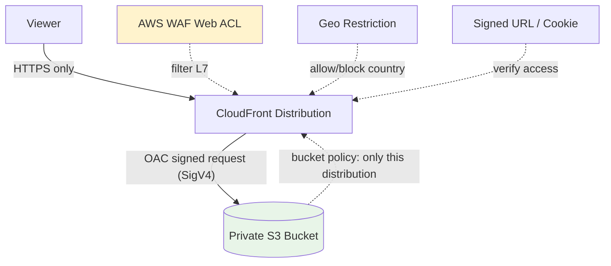

# CloudFront Security: OAC, Signed URLs, WAF, Geo & Field-Level Encryption - SAA-C03 Deep Dive

> CloudFront security spans locking origins (OAC), restricting viewers (signed URLs/cookies, geo), filtering attacks (WAF, Shield), and encrypting sensitive fields end-to-end. This is heavy SAA-C03 territory.

See also: [01 - CloudFront Fundamentals & Architecture](01%20-%20CloudFront%20Fundamentals%20%26%20Architecture.md) · [02 - Origins, Cache Behaviors & TTL](02%20-%20Origins%2C%20Cache%20Behaviors%20%26%20TTL.md) · [04 - Edge Functions (CloudFront Functions vs Lambda@Edge)](04%20-%20Edge%20Functions%20%28CloudFront%20Functions%20vs%20Lambda%40Edge%29.md) · [05 - CloudFront Exam Scenarios & Cheat Sheet](05%20-%20CloudFront%20Exam%20Scenarios%20%26%20Cheat%20Sheet.md)

---

## Table of Contents

- [Origin Access Control (OAC) vs Legacy OAI](#origin-access-control-oac-vs-legacy-oai)
- [Restricting Viewer Access: Signed URLs vs Signed Cookies](#restricting-viewer-access-signed-urls-vs-signed-cookies)
- [AWS WAF Integration](#aws-waf-integration)
- [Geographic (Geo) Restriction](#geographic-geo-restriction)
- [HTTPS / TLS and Custom SSL via ACM](#https--tls-and-custom-ssl-via-acm)
- [AWS Shield (DDoS Protection)](#aws-shield-ddos-protection)
- [Field-Level Encryption](#field-level-encryption)
- [Summary: Key Takeaways for SAA-C03](#summary-key-takeaways-for-saa-c03)

---



---

CloudFront security questions appear constantly on SAA-C03. The key is matching the **requirement keyword** to the right control: private origin → OAC; individual files → signed URL; whole library → signed cookies; block countries → geo restriction; filter malicious requests → WAF.

---

## Origin Access Control (OAC) vs Legacy OAI

To keep an **S3 origin private** (reachable only via CloudFront, never directly), you bind CloudFront to the bucket and lock the bucket policy.

| Feature                     | **OAC (Origin Access Control)** — current | **OAI (Origin Access Identity)** — legacy |
| :-------------------------- | :---------------------------------------- | :---------------------------------------- |
| Status                      | **Recommended**                           | Deprecated for new use                    |
| Signing                     | **SigV4**, supports SSE-KMS               | SigV3-era; limited KMS support            |
| KMS-encrypted S3 objects    | ✅ Supported                              | ❌ Not supported                          |
| Dynamic requests (POST/PUT) | ✅ Supported                              | ❌ Limited                                |
| Coverage                    | S3, plus MediaStore/Lambda URLs           | S3 only                                   |

### How OAC Locks Down S3

1. Create an OAC and attach it to the S3 origin in the distribution.
2. Add an S3 **bucket policy** allowing the CloudFront **service principal** to `s3:GetObject`, scoped to the specific distribution ARN.
3. **Block all public access** on the bucket — viewers can no longer hit S3 directly.

```json
{
  "Version": "2012-10-17",
  "Statement": [
    {
      "Sid": "AllowCloudFrontServicePrincipalReadOnly",
      "Effect": "Allow",
      "Principal": { "Service": "cloudfront.amazonaws.com" },
      "Action": "s3:GetObject",
      "Resource": "arn:aws:s3:::my-private-bucket/*",
      "Condition": {
        "StringEquals": {
          "AWS:SourceArn": "arn:aws:cloudfront::111122223333:distribution/E1ABCDEF2GHIJK"
        }
      }
    }
  ]
}
```

> **Exam Tip:** "Serve private S3 content through CloudFront and prevent direct S3 access" → **OAC** + bucket policy + Block Public Access. If the bucket uses **SSE-KMS**, you **must** use **OAC** (OAI cannot decrypt KMS objects).

[⬆ Back to top](#table-of-contents)

---

## Restricting Viewer Access: Signed URLs vs Signed Cookies

For **paid / private content** (premium video, member downloads), you require viewers to present a **signed** credential generated by a **trusted key group**.

|                                     | **Signed URL**                                | **Signed Cookies**                        |
| :---------------------------------- | :-------------------------------------------- | :---------------------------------------- |
| Scope                               | **One file per URL**                          | **Multiple files / whole library**        |
| Use case                            | Individual download link, single-file rentals | Authenticated user accessing many objects |
| URL changes                         | Yes — each file needs its own signed URL      | No — original URLs unchanged              |
| Works when client can't set cookies | ✅ Yes                                        | ❌ No                                     |
| RTMP / legacy media                 | Signed URLs only                              | —                                         |

### Mechanics

- A **policy** embedded in the signature can restrict by **expiry time**, **IP range**, and **date**.
- Signing uses a **CloudFront key pair** managed in a **key group** (modern approach; the old root-account "trusted signer" is legacy).

```bash
# Conceptual: generate a canned signed URL (expires in 1 hour)
aws cloudfront sign \
    --url https://d111abcdef.cloudfront.net/private/video.mp4 \
    --key-pair-id K2JCJMDEHXQW5F \
    --private-key file://private_key.pem \
    --date-less-than 2026-05-27T12:00:00Z
```

> **Exam Tip:** "Grant access to **individual files**" → **Signed URL**. "Grant access to **multiple files / an entire content library** without changing URLs" → **Signed Cookies". Both differ from **S3 presigned URLs\*\*, which bypass CloudFront and hit S3 directly.

### CloudFront Signed URL vs S3 Presigned URL

|                         | CloudFront Signed URL          | S3 Presigned URL                        |
| :---------------------- | :----------------------------- | :-------------------------------------- |
| Served through          | CloudFront (cached, edge)      | S3 directly                             |
| Caching / edge benefits | ✅ Yes                         | ❌ No                                   |
| Best for                | Edge-delivered private content | Quick temp access directly to an object |

[⬆ Back to top](#table-of-contents)

---

## AWS WAF Integration

**AWS WAF** attaches a **web ACL** to a CloudFront distribution to filter **layer 7** (HTTP) traffic at the edge.

| WAF Capability       | Example                                                                |
| :------------------- | :--------------------------------------------------------------------- |
| Managed rule groups  | OWASP Top 10, known bad inputs, IP reputation                          |
| Rate-based rules     | Block IPs exceeding N requests / 5 min (mitigates floods, brute force) |
| String / regex match | Block SQLi, XSS patterns in URI/body/headers                           |
| Geo match            | Allow/block by country at the WAF layer                                |
| IP set               | Allow/deny specific CIDRs                                              |

### Key Requirement

- A WAF web ACL for CloudFront must use the **`CLOUDFRONT` (Global) scope**, created in **us-east-1**.
- Inspection happens at the **edge** before requests reach the origin.

> **Exam Tip:** "Filter malicious requests / SQL injection / rate-limit attackers at the edge" → **AWS WAF on CloudFront**. For pure volumetric DDoS, pair with **Shield**.

[⬆ Back to top](#table-of-contents)

---

## Geographic (Geo) Restriction

CloudFront can **allow or block** viewers by **country**, based on the viewer's IP (via GeoIP database).

| Mode          | Behavior                                             |
| :------------ | :--------------------------------------------------- |
| **Allowlist** | Only listed countries can access; all others blocked |
| **Blocklist** | Listed countries blocked; all others allowed         |

- Restriction is at the **country level** only (native geo restriction).
- Blocked viewers get a **403**.
- For more granular control (regions, custom logic), use **WAF geo match rules** instead.

> **Exam Tip:** "Restrict content to specific countries for licensing/compliance" → **CloudFront Geo Restriction**. Need finer control or to combine geo with other conditions → **WAF geo match**.

[⬆ Back to top](#table-of-contents)

---

## HTTPS / TLS and Custom SSL via ACM

CloudFront supports HTTPS on **both** legs: viewer↔CloudFront and CloudFront↔origin.

| Setting                    | Options                                             |
| :------------------------- | :-------------------------------------------------- |
| **Viewer Protocol Policy** | HTTP & HTTPS / Redirect HTTP→HTTPS / **HTTPS Only** |
| **Origin Protocol Policy** | HTTP Only / HTTPS Only / Match Viewer               |
| **Default cert**           | Free `*.cloudfront.net` certificate                 |
| **Custom domain cert**     | Provision in **ACM**, attach to distribution        |

### The us-east-1 Rule (Critical)

> An **ACM certificate** used with CloudFront for a custom domain (alternate domain name / CNAME) **MUST be in the us-east-1 (N. Virginia) region**, because CloudFront is a global service that reads certs from us-east-1.

- You may also import a third-party cert into ACM us-east-1.
- Choose a **security policy (minimum TLS version)** per distribution.

> **Exam Trap:** "Custom SSL certificate can't be selected for the distribution" → the cert is **not in us-east-1**. This is one of the single most common CloudFront exam answers.

[⬆ Back to top](#table-of-contents)

---

## AWS Shield (DDoS Protection)

CloudFront sits at the edge, making it a natural DDoS mitigation layer.

| Tier                | What You Get                                                                                             | Cost                |
| :------------------ | :------------------------------------------------------------------------------------------------------- | :------------------ |
| **Shield Standard** | Automatic L3/L4 DDoS protection for all CloudFront/Route 53/Global Accelerator                           | **Free**, always on |
| **Shield Advanced** | Enhanced detection, 24/7 DDoS Response Team (DRT), cost-protection against scaling charges, WAF included | ~$3,000/month       |

- CloudFront + Shield + WAF is the canonical **edge defense** stack.
- See [01 - Global Accelerator Fundamentals & Architecture](01%20-%20Global%20Accelerator%20Fundamentals%20%26%20Architecture.md) — Global Accelerator is also Shield-protected.

> **Exam Tip:** "Protect a web app from large-scale DDoS with a dedicated response team and bill protection" → **Shield Advanced**. Basic DDoS resilience is already free via **Shield Standard** behind CloudFront.

[⬆ Back to top](#table-of-contents)

---

## Field-Level Encryption

**Field-level encryption** lets CloudFront encrypt **specific sensitive fields** (e.g., credit card, SSN) in a POST request **at the edge**, using a public key, so only the **intended backend service** holding the private key can decrypt them.

### How It Works

1. Upload a **public key** to CloudFront; configure a field-level encryption profile naming the fields to encrypt.
2. Viewer submits a form; CloudFront encrypts the designated fields **at the edge** with the public key.
3. Encrypted fields stay encrypted as they pass through your stack (ALB, app tier, logs).
4. Only the component with the matching **private key** can decrypt them.

| Property   | Detail                                                                            |
| :--------- | :-------------------------------------------------------------------------------- |
| Encrypts   | Up to **10 specific fields** in a POST body                                       |
| Where      | At the **edge**, before reaching origin                                           |
| Asymmetric | Public key encrypts; private key (held by your service) decrypts                  |
| Benefit    | Sensitive data protected through the entire application path, not just in transit |

> **Exam Tip:** "Ensure sensitive form fields (like card numbers) stay encrypted **throughout the application stack** and are only readable by a specific backend" → **CloudFront Field-Level Encryption** (not just HTTPS, which only protects in transit to the edge).

[⬆ Back to top](#table-of-contents)

---

## Summary: Key Takeaways for SAA-C03

| Requirement                                   | Right Control                                          |
| :-------------------------------------------- | :----------------------------------------------------- |
| **Private S3, only via CloudFront**           | **OAC** + bucket policy + Block Public Access          |
| **S3 with SSE-KMS**                           | Must use **OAC** (OAI can't decrypt KMS)               |
| **Restrict access to one file**               | **Signed URL**                                         |
| **Restrict access to many files / library**   | **Signed Cookies**                                     |
| **Filter SQLi/XSS, rate-limit at edge**       | **AWS WAF** (CLOUDFRONT scope, us-east-1)              |
| **Allow/block by country**                    | **Geo Restriction** (or WAF geo match for granularity) |
| **Custom domain HTTPS**                       | **ACM cert in us-east-1**                              |
| **DDoS with response team + bill protection** | **Shield Advanced** (Standard is free)                 |
| **Encrypt sensitive fields end-to-end**       | **Field-Level Encryption**                             |

[⬆ Back to top](#table-of-contents)

---
