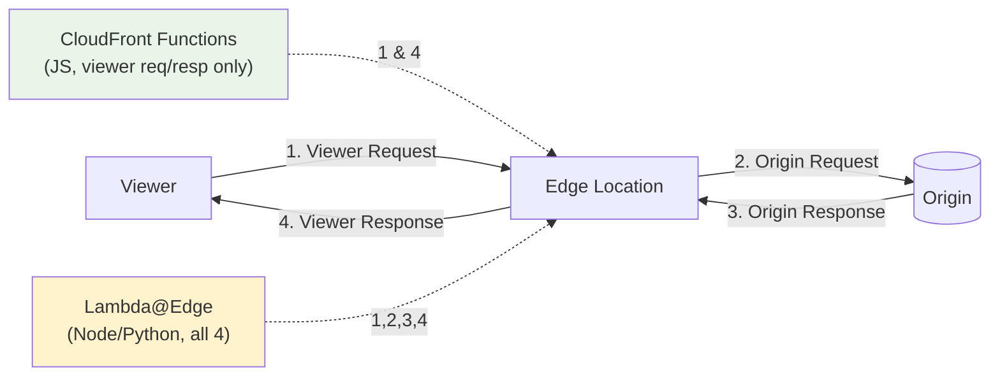

# CloudFront Edge Functions: CloudFront Functions vs Lambda@Edge - SAA-C03 Deep Dive

> Edge functions run code close to viewers. CloudFront Functions are ultra-light JS for viewer request/response; Lambda@Edge is heavier Node/Python running at all four trigger points. Picking the right one is a common exam decision.

See also: [01 - CloudFront Fundamentals & Architecture](01%20-%20CloudFront%20Fundamentals%20%26%20Architecture.md) · [02 - Origins, Cache Behaviors & TTL](02%20-%20Origins%2C%20Cache%20Behaviors%20%26%20TTL.md) · [03 - CloudFront Security (OAC, Signed URLs, WAF, Geo, Field-Level Encryption)](03%20-%20CloudFront%20Security%20%28OAC%2C%20Signed%20URLs%2C%20WAF%2C%20Geo%2C%20Field-Level%20Encryption%29.md) · [05 - CloudFront Exam Scenarios & Cheat Sheet](05%20-%20CloudFront%20Exam%20Scenarios%20%26%20Cheat%20Sheet.md)

---

## Table of Contents

- [Why Run Code at the Edge?](#why-run-code-at-the-edge)
- [The Four Trigger Points](#the-four-trigger-points)
- [CloudFront Functions Explained](#cloudfront-functions-explained)
- [Lambda@Edge Explained](#lambdaedge-explained)
- [Head-to-Head Comparison](#head-to-head-comparison)
- [Use Cases & Which to Pick](#use-cases--which-to-pick)
- [Limits & Constraints](#limits--constraints)
- [Summary: Key Takeaways for SAA-C03](#summary-key-takeaways-for-saa-c03)

---

---

Both services let you customize content delivery without managing servers, but they differ sharply in scale, latency, capability, and which trigger points they support. The exam loves to test **"sub-millisecond, millions of requests, simple header rewrite"** vs **"needs network/SDK calls, longer execution."**

---

## Why Run Code at the Edge?

Running logic at edge locations lets you transform requests/responses **without a round trip to the origin**, reducing latency and offloading the backend.

Common goals:

- Rewrite or redirect URLs
- Add/modify/normalize HTTP headers (security headers, cache-control)
- Authenticate / authorize requests (token check)
- A/B testing and traffic routing
- Generate simple responses directly at the edge

[⬆ Back to top](#table-of-contents)

---

## The Four Trigger Points

CloudFront can invoke functions at four points in the request lifecycle:

| #   | Trigger             | When It Fires                                     | CloudFront Functions | Lambda@Edge |
| :-- | :------------------ | :------------------------------------------------ | :------------------: | :---------: |
| 1   | **Viewer Request**  | After CF receives request, before cache lookup    |          ✅          |     ✅      |
| 2   | **Origin Request**  | Before CF forwards to origin (only on cache miss) |          ❌          |     ✅      |
| 3   | **Origin Response** | After CF receives origin response (cache miss)    |          ❌          |     ✅      |
| 4   | **Viewer Response** | Before CF returns response to viewer              |          ✅          |     ✅      |

> **Exam Tip:** **CloudFront Functions only run at Viewer Request & Viewer Response.** If a scenario needs logic at the **origin request/response** (e.g., modify the request sent to the origin, inspect origin response), it **must be Lambda@Edge**.

[⬆ Back to top](#table-of-contents)

---

## CloudFront Functions Explained

A lightweight, **JavaScript** function that runs in CloudFront's own edge runtime — purpose-built for **high-volume, ultra-low-latency** request/response manipulation.

| Property            | Detail                                           |
| :------------------ | :----------------------------------------------- |
| Language            | JavaScript (ECMAScript 5.1-compliant subset)     |
| Runs at             | **600+ edge locations** (the PoPs themselves)    |
| Triggers            | Viewer Request, Viewer Response only             |
| Execution time      | **Sub-millisecond** (< 1 ms)                     |
| Scale               | **Millions of requests/second**                  |
| Memory              | ~2 MB                                            |
| Network/file access | **None** — no network calls, no disk, no AWS SDK |
| Cost                | ~1/6th the price of Lambda@Edge                  |

### Typical Uses

- URL rewrites/redirects
- Header manipulation (add security headers)
- Cache-key normalization
- Simple request authorization (validate a token/JWT signature with no external call)
- Generating simple responses (redirects)

[⬆ Back to top](#table-of-contents)

---

## Lambda@Edge Explained

Full **AWS Lambda** functions (authored in **us-east-1** and replicated to edge) — more powerful, supports **all four trigger points**, and can make network/SDK calls.

| Property           | Detail                                                     |
| :----------------- | :--------------------------------------------------------- |
| Language           | **Node.js / Python**                                       |
| Authored in        | **us-east-1**, replicated globally                         |
| Runs at            | **Regional Edge Caches** (not the PoPs themselves)         |
| Triggers           | **All four** (viewer req/resp, origin req/resp)            |
| Execution time     | Up to **5s** (viewer triggers) / **30s** (origin triggers) |
| Memory             | 128 MB – up to 10 GB (origin triggers)                     |
| Network/SDK access | ✅ Yes — call other AWS services, external APIs            |
| Cost               | Higher; billed per request + duration                      |

### Typical Uses

- Logic requiring an **AWS SDK call** (e.g., fetch from DynamoDB, S3)
- Heavier request/response transforms
- Origin selection / dynamic origin routing (origin request)
- SSR-style content generation, image manipulation
- Bot detection requiring external lookups

> **Exam Trap:** Lambda@Edge functions are **created in us-east-1** even though they execute globally. If a question says you can't find your Lambda@Edge function in another region — that's expected.

[⬆ Back to top](#table-of-contents)

---

## Head-to-Head Comparison

| Dimension               | **CloudFront Functions**             | **Lambda@Edge**               |
| :---------------------- | :----------------------------------- | :---------------------------- |
| Language                | JavaScript (lightweight runtime)     | Node.js / Python              |
| Trigger points          | Viewer Request & Response only       | All four                      |
| Where it runs           | Edge locations (PoPs)                | Regional Edge Caches          |
| Max execution time      | **< 1 ms**                           | 5 s (viewer) / 30 s (origin)  |
| Scale                   | Millions req/s                       | Thousands req/s               |
| Memory                  | ~2 MB                                | 128 MB – 10 GB                |
| Network / AWS SDK calls | ❌ No                                | ✅ Yes                        |
| Access to request body  | Limited                              | ✅ Yes (configurable)         |
| Cost                    | Lowest                               | Higher                        |
| Best for                | High-volume, simple, fast transforms | Complex logic, external calls |

> **Exam Tip:** Keywords **"sub-millisecond," "millions of requests," "simple header/URL rewrite," "lowest cost"** → **CloudFront Functions**. Keywords **"call another AWS service/API," "modify request to origin," "longer processing," "Node.js/Python"** → **Lambda@Edge**.

[⬆ Back to top](#table-of-contents)

---

## Use Cases & Which to Pick

| Use Case                                            | Best Choice              | Why                                      |
| :-------------------------------------------------- | :----------------------- | :--------------------------------------- |
| Add HSTS / security headers to responses            | **CloudFront Functions** | Simple viewer-response edit, high volume |
| Redirect / rewrite URLs (e.g., `/` → `/index.html`) | **CloudFront Functions** | Lightweight viewer-request logic         |
| Normalize cache key (lowercase headers)             | **CloudFront Functions** | Runs before cache lookup, ultra-fast     |
| Validate a simple JWT signature                     | **CloudFront Functions** | No external call needed                  |
| A/B testing (route by cookie)                       | Either                   | Simple = CFF; complex = L@E              |
| Authenticate against an external IdP / DynamoDB     | **Lambda@Edge**          | Needs network/SDK calls                  |
| Dynamically choose origin based on request          | **Lambda@Edge**          | Requires **origin request** trigger      |
| Modify origin response before caching               | **Lambda@Edge**          | Requires **origin response** trigger     |
| Image resizing / content generation                 | **Lambda@Edge**          | Heavier compute, libraries               |

[⬆ Back to top](#table-of-contents)

---

## Limits & Constraints

### CloudFront Functions

- Max code size ~10 KB; ~2 MB memory.
- No access to request body, no network, no disk, no environment variables.
- ECMAScript 5.1-ish; not full modern Node.
- Only viewer triggers.

### Lambda@Edge

- Author in **us-east-1** only; deploy a **numbered version** (no `$LATEST`, no aliases).
- Viewer triggers: ≤ 5 s, ≤ 128 MB, response/body limits tighter.
- Origin triggers: ≤ 30 s, up to 10 GB memory, larger payloads.
- No VPC access at the edge; cannot use Lambda layers in the same way.
- Higher latency than CloudFront Functions (runs at REC, cold starts possible).

> **Exam Tip:** If a scenario forbids modifying application code and just needs **header insertion at scale and minimal cost**, the answer is **CloudFront Functions**, not Lambda@Edge.

[⬆ Back to top](#table-of-contents)

---

## Summary: Key Takeaways for SAA-C03

| Concept                  | What You Must Know                                                                       |
| :----------------------- | :--------------------------------------------------------------------------------------- |
| **CloudFront Functions** | JS, sub-ms, millions req/s, viewer req/resp only, no network/SDK, cheapest               |
| **Lambda@Edge**          | Node/Python, all 4 triggers, can call AWS/external APIs, heavier, costlier               |
| **Trigger points**       | Viewer Req, Origin Req, Origin Response, Viewer Resp — CFF only does the two viewer ones |
| **Where they run**       | CFF at edge PoPs; Lambda@Edge at Regional Edge Caches                                    |
| **Authoring region**     | Lambda@Edge created in **us-east-1**, replicated globally                                |
| **Pick CFF when**        | Simple, fast, high-volume header/URL rewrites, lowest cost                               |
| **Pick L@E when**        | Need SDK/network calls, origin-side logic, or heavier compute                            |

[⬆ Back to top](#table-of-contents)

---
