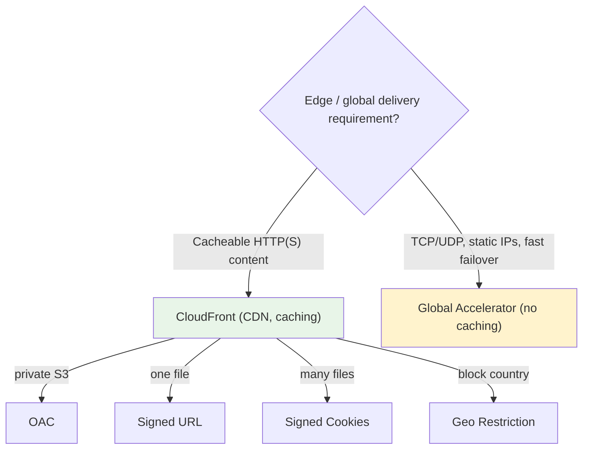

# CloudFront Exam Scenarios & Cheat Sheet - SAA-C03 Deep Dive

> Rapid-fire scenario decisions and a keyword-to-answer table for CloudFront, plus the critical CloudFront vs Global Accelerator distinction. This is your final review before the exam.

See also: [01 - CloudFront Fundamentals & Architecture](01%20-%20CloudFront%20Fundamentals%20%26%20Architecture.md) · [02 - Origins, Cache Behaviors & TTL](02%20-%20Origins%2C%20Cache%20Behaviors%20%26%20TTL.md) · [03 - CloudFront Security (OAC, Signed URLs, WAF, Geo, Field-Level Encryption)](03%20-%20CloudFront%20Security%20%28OAC%2C%20Signed%20URLs%2C%20WAF%2C%20Geo%2C%20Field-Level%20Encryption%29.md) · [04 - Edge Functions (CloudFront Functions vs Lambda@Edge)](04%20-%20Edge%20Functions%20%28CloudFront%20Functions%20vs%20Lambda%40Edge%29.md)

---

## Table of Contents

- [Scenario Walkthroughs](#scenario-walkthroughs)
- ["Question Says X → Pick Y" Quick Table](#question-says-x--pick-y-quick-table)
- [CloudFront vs Global Accelerator (Critical Distinction)](#cloudfront-vs-global-accelerator-critical-distinction)
- [Important-Facts Cheat Table](#important-facts-cheat-table)
- [Common Traps & Distractors](#common-traps--distractors)
- [Summary: Key Takeaways for SAA-C03](#summary-key-takeaways-for-saa-c03)

---

---

Use this file as a last-mile review. Each scenario maps a realistic prompt to the correct CloudFront feature and explains _why_ the alternatives are wrong.

---

## Scenario Walkthroughs

### Scenario 1: Private S3 Content

**Prompt:** A company stores assets in a private S3 bucket and serves them through CloudFront. They must ensure users **cannot bypass CloudFront** and access S3 directly.

**Answer:** Use **Origin Access Control (OAC)**, add an S3 bucket policy granting the CloudFront service principal read access (scoped to the distribution ARN), and enable **Block Public Access**.

**Why not OAI?** OAI is legacy and can't decrypt **SSE-KMS** objects; OAC is the current recommendation.

---

### Scenario 2: Restrict Premium Video to One File

**Prompt:** A media site sells individual movie downloads; each purchase should grant temporary access to **a single file**.

**Answer:** **Signed URL** with an expiry policy.

**Why not signed cookies?** Cookies are for granting access to **many** files; here it's one file per purchase.

---

### Scenario 3: Authenticated Access to a Whole Library

**Prompt:** Subscribers should stream **any** video in a large catalog after login, without generating a URL per file.

**Answer:** **Signed Cookies** — one credential covers many objects, URLs unchanged.

---

### Scenario 4: Country-Based Licensing

**Prompt:** Content is licensed only in specific countries; block everyone else.

**Answer:** **CloudFront Geo Restriction** (allowlist of permitted countries).

**Finer control?** Use **WAF geo match** if combining geo with other conditions.

---

### Scenario 5: Static + Dynamic on One Domain

**Prompt:** Serve static assets from **S3** and a dynamic API from an **ALB** under a single domain/distribution.

**Answer:** One distribution, **multiple cache behaviors** with **path patterns** — `/static/*` → S3 (long TTL), `/api/*` → ALB (CachingDisabled).

---

### Scenario 6: Origin High Availability

**Prompt:** If the primary S3 bucket/region fails, CloudFront should automatically serve from a backup.

**Answer:** **Origin Group** with primary + secondary and failover status codes (500/502/503/504).

---

### Scenario 7: Push Content Updates Cheaply

**Prompt:** A team deploys frequent JS/CSS updates and wants users to get new versions immediately at minimal cost.

**Answer:** **Versioned object names** (cache busting, e.g., `app.v2.js`) — free and instant.

**Why not invalidations?** Invalidations cost money beyond 1,000 paths/month and take time to propagate.

---

### Scenario 8: Add Security Headers at Scale

**Prompt:** Add HSTS and other security headers to **millions** of responses with **sub-millisecond** overhead and lowest cost, no app change.

**Answer:** **CloudFront Function** on the viewer-response trigger (or a **Response Headers Policy** for standard headers, no code at all).

**Why not Lambda@Edge?** Overkill and costlier for a simple header insert.

---

### Scenario 9: Custom Domain HTTPS Fails

**Prompt:** A custom SSL certificate **won't attach** to the distribution.

**Answer:** The **ACM certificate must be in us-east-1**. Re-issue/import it there.

---

### Scenario 10: Encrypt Sensitive Form Fields End-to-End

**Prompt:** Credit-card fields in a POST must remain encrypted **throughout the app stack**, readable only by a specific backend.

**Answer:** **Field-Level Encryption** (CloudFront encrypts the fields at the edge with a public key; only the holder of the private key decrypts).

[⬆ Back to top](#table-of-contents)

---

## "Question Says X → Pick Y" Quick Table

| Question Says...                                               | Pick                                          |
| :------------------------------------------------------------- | :-------------------------------------------- |
| Private S3, no direct access, prevent bypass                   | **OAC** + bucket policy + Block Public Access |
| S3 objects encrypted with **SSE-KMS** via CloudFront           | **OAC** (not OAI)                             |
| Grant temporary access to **one file**                         | **Signed URL**                                |
| Grant access to **many files / whole library**                 | **Signed Cookies**                            |
| Restrict / block by **country**                                | **Geo Restriction** (or WAF geo match)        |
| Filter **SQLi / XSS**, rate-limit attackers                    | **AWS WAF** (CLOUDFRONT scope, us-east-1)     |
| **Static + dynamic** on one domain                             | Multiple **cache behaviors** + path patterns  |
| Automatic **origin failover**                                  | **Origin Group**                              |
| Push updates **cheaply & instantly**                           | **Versioned filenames**                       |
| Immediately purge a specific stale object                      | **Invalidation**                              |
| **Sub-ms**, millions req/s, simple header/URL rewrite          | **CloudFront Functions**                      |
| Need **AWS SDK / external call** or origin-side logic          | **Lambda@Edge**                               |
| Custom domain cert won't attach                                | **ACM cert in us-east-1**                     |
| Encrypt specific fields end-to-end                             | **Field-Level Encryption**                    |
| Reduce text payload size                                       | **Automatic compression** (Gzip/Brotli)       |
| DDoS with response team + bill protection                      | **Shield Advanced**                           |
| Cacheable global content for worldwide users                   | **CloudFront**                                |
| Non-HTTP (TCP/UDP), static anycast IPs, fast regional failover | **Global Accelerator**                        |

[⬆ Back to top](#table-of-contents)

---

## CloudFront vs Global Accelerator (Critical Distinction)

Both use AWS's global edge network, but they solve different problems — a frequent SAA-C03 trap. See [01 - Global Accelerator Fundamentals & Architecture](01%20-%20Global%20Accelerator%20Fundamentals%20%26%20Architecture.md).

| Dimension       | **CloudFront**                    | **Global Accelerator**                                  |
| :-------------- | :-------------------------------- | :------------------------------------------------------ |
| Primary purpose | **CDN** — cache & deliver content | **Network accelerator** — route to optimal endpoint     |
| Caching         | ✅ Yes (core feature)             | ❌ **No caching**                                       |
| Protocols       | HTTP / HTTPS (web content)        | **TCP & UDP** (any protocol)                            |
| IP addresses    | Uses CloudFront domain (dynamic)  | **2 static anycast IPs**                                |
| Content served  | Cacheable + dynamic web content   | Non-cacheable apps, gaming, IoT, VoIP                   |
| Failover        | Origin groups (origin-level)      | **Fast regional failover** (~seconds) via health checks |
| Termination     | At edge (caches content)          | Proxies/routes traffic (no caching)                     |
| Use case        | Websites, media, downloads        | Gaming, real-time apps, non-HTTP, fixed-IP requirements |

> **Exam Tip:** **Caching / web content** → **CloudFront**. **Static IPs, TCP/UDP, non-HTTP, fast cross-region failover, no caching** → **Global Accelerator**. If the question stresses "**static IP addresses**" or "**UDP/non-HTTP**," it's Global Accelerator.

[⬆ Back to top](#table-of-contents)

---

## Important-Facts Cheat Table

| Fact                       | Detail                                                   |
| :------------------------- | :------------------------------------------------------- |
| **Edge locations**         | 600+ PoPs globally                                       |
| **Regional Edge Caches**   | ~13, automatic, free, larger cache between edge & origin |
| **Default TTL**            | 24 hours (86,400 s) when origin sends no cache header    |
| **Invalidation free tier** | First 1,000 paths/month free                             |
| **Price classes**          | All / 200 / 100 (100 = US, Canada, Europe only)          |
| **Shield Standard**        | Free, automatic L3/L4 DDoS                               |
| **ACM cert region**        | **us-east-1** for CloudFront custom domains              |
| **WAF web ACL**            | **CLOUDFRONT (Global)** scope, created in us-east-1      |
| **Lambda@Edge authoring**  | us-east-1, numbered version (no `$LATEST`/alias)         |
| **CloudFront Functions**   | JS, < 1 ms, viewer triggers only, no network             |
| **Compression**            | Auto Gzip/Brotli, files 1 KB–10 MB                       |
| **Field-level encryption** | Up to 10 POST fields, asymmetric keys                    |
| **Origin group failover**  | 500/502/503/504, timeouts, connection errors             |
| **S3 website endpoint**    | Custom origin, HTTP-only, can't use OAC                  |

[⬆ Back to top](#table-of-contents)

---

## Common Traps & Distractors

| Trap                                                     | Reality                                              |
| :------------------------------------------------------- | :--------------------------------------------------- |
| "CloudFront only caches static content"                  | False — accelerates static **and** dynamic           |
| "Use OAI for KMS-encrypted S3"                           | OAI can't decrypt SSE-KMS; use **OAC**               |
| "Put ACM cert in the distribution's region"              | CloudFront is global; cert must be **us-east-1**     |
| "Forward all headers/cookies to improve personalization" | Tanks cache hit ratio; minimize cache-key components |
| "Invalidate `/*` to deploy every release"                | Slow + costly; prefer **versioned filenames**        |
| "CloudFront gives you static IPs"                        | No — that's **Global Accelerator**                   |
| "Use Lambda@Edge for a simple header add"                | Overkill — **CloudFront Function** is cheaper/faster |
| "Signed cookies for a single file download"              | Use a **signed URL** for one file                    |
| "Geo restriction blocks by region/city"                  | Native geo is **country-level**; use WAF for more    |

[⬆ Back to top](#table-of-contents)

---

## Summary: Key Takeaways for SAA-C03

| Concept                   | What You Must Know                                                           |
| :------------------------ | :--------------------------------------------------------------------------- |
| **Private S3**            | OAC + bucket policy + Block Public Access (OAC required for KMS)             |
| **Viewer access**         | Signed URL (one file) vs Signed Cookies (many files)                         |
| **Geo & WAF**             | Geo restriction = country; WAF = L7 filtering, rate limits, granular geo     |
| **Static+dynamic**        | Cache behaviors + path patterns; origin groups for failover                  |
| **Freshness**             | Versioned filenames (best) vs invalidations (immediate, costs after 1k)      |
| **Edge code**             | CloudFront Functions (light/fast/cheap) vs Lambda@Edge (powerful, SDK calls) |
| **us-east-1 rule**        | ACM custom certs + WAF for CF + Lambda@Edge authoring                        |
| **vs Global Accelerator** | CloudFront caches HTTP; GA = static IPs, TCP/UDP, no caching, fast failover  |

[⬆ Back to top](#table-of-contents)

---
