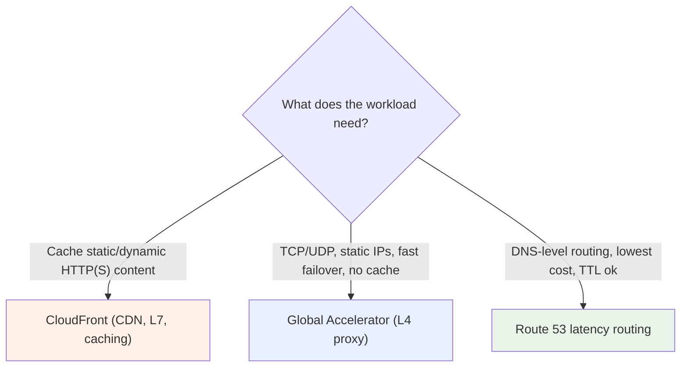
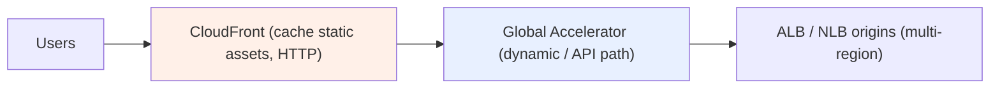

# Global Accelerator vs CloudFront & Use Cases - SAA-C03 Deep Dive

> Both ride the AWS edge network, but **CloudFront caches HTTP(S) content** at the edge while **Global Accelerator is a non-caching L4 (TCP/UDP) proxy** that gives static IPs and fast regional failover - this distinction is a frequent exam pivot.

See also: [01 - Global Accelerator Fundamentals & Architecture](01%20-%20Global%20Accelerator%20Fundamentals%20%26%20Architecture.md) · [03 - Global Accelerator Exam Scenarios & Facts](03%20-%20Global%20Accelerator%20Exam%20Scenarios%20%26%20Facts.md)

---

## Table of Contents

- [The One-Sentence Difference](#the-one-sentence-difference)
- [Detailed Comparison Table](#detailed-comparison-table)
- [How Each Service Routes Traffic](#how-each-service-routes-traffic)
- [When to Use Global Accelerator](#when-to-use-global-accelerator)
- [When to Use CloudFront](#when-to-use-cloudfront)
- [Global Accelerator vs Route 53 Latency Routing](#global-accelerator-vs-route-53-latency-routing)
- [Using Them Together](#using-them-together)
- [Bring Your Own IP (BYOIP)](#bring-your-own-ip-byoip)
- [Decision Cheat Sheet](#decision-cheat-sheet)
- [Summary: Key Takeaways for SAA-C03](#summary-key-takeaways-for-saa-c03)

---



---

## The One-Sentence Difference

> **CloudFront** improves performance by **caching content** at edge locations (a CDN, HTTP/HTTPS, Layer 7). **Global Accelerator** improves performance by **routing TCP/UDP traffic over the AWS backbone** to the best endpoint, with **2 static IPs** and **fast regional failover** - and it caches **nothing**.

Both use the same global edge footprint as an **ingress point**, which is why they are constantly compared. The deciding factor is almost always **protocol (HTTP vs any TCP/UDP)** and **caching (yes vs no)**.

[⬆ Back to top](#table-of-contents)

---

## Detailed Comparison Table

| Dimension               | Global Accelerator                                  | CloudFront ([01 - CloudFront Fundamentals & Architecture](01%20-%20CloudFront%20Fundamentals%20%26%20Architecture.md)) |
| :---------------------- | :-------------------------------------------------- | :----------------------------------------------------------- |
| **Primary purpose**     | Optimize routing & availability for any TCP/UDP app | Content delivery network (cache & serve content)             |
| **OSI layer**           | Layer 4 (TCP/UDP)                                   | Layer 7 (HTTP/HTTPS)                                         |
| **Protocols**           | **TCP and UDP**                                     | **HTTP/HTTPS only**                                          |
| **Caching**             | **No caching**                                      | **Caches** static & cacheable dynamic content at edge        |
| **Entry address**       | **2 static anycast IPs**                            | DNS name (CNAME); **no static IP** by default                |
| **Content served from** | Always the origin/endpoint (proxy)                  | Edge cache when possible, else origin                        |
| **Failover**            | **Fast** cross-region failover (seconds, no DNS)    | Origin failover via origin groups (HTTP)                     |
| **Traffic shaping**     | Traffic dial (per region), endpoint weights         | Cache behaviors, origins, Lambda@Edge                        |
| **Typical endpoints**   | ALB, NLB, EC2, Elastic IP                           | S3, ALB, EC2, any HTTP origin                                |
| **Best for**            | Gaming, IoT, VoIP, non-HTTP, static-IP needs        | Websites, APIs, video streaming, static assets               |
| **DDoS protection**     | AWS Shield Standard (built-in)                      | AWS Shield Standard + WAF integration                        |

> **Exam Tip:** The fastest way to choose: **HTTP + cacheable content → CloudFront. Non-HTTP (UDP/TCP) OR static IP OR fast failover → Global Accelerator.**

[⬆ Back to top](#table-of-contents)

---

## How Each Service Routes Traffic

### CloudFront (Cache-First)

```
User → Nearest Edge → [Cache hit? serve from edge]
                     → [Cache miss? fetch from origin, cache, serve]
```

CloudFront's value is **returning content from the edge cache**, eliminating the round trip to the origin for repeated requests.

### Global Accelerator (Proxy + Optimal Routing)

```
User → Nearest Edge (static IP) → AWS Backbone → Best healthy endpoint
       (every request proxied; nothing cached)
```

GA's value is **getting packets onto the AWS backbone immediately** and steering them to the optimal healthy regional endpoint - it never stores a response.

[⬆ Back to top](#table-of-contents)

---

## When to Use Global Accelerator

Choose GA when the scenario includes any of these signals:

| Signal in the Question                          | Why GA Fits                                              |
| :---------------------------------------------- | :------------------------------------------------------- |
| **Non-HTTP protocols** (raw TCP/UDP, MQTT, SIP) | CloudFront can't proxy non-HTTP; GA handles any TCP/UDP  |
| **Online gaming**                               | UDP, low latency, deterministic routing (custom routing) |
| **IoT / device fleets**                         | Devices hardcode static IPs; no DNS available            |
| **VoIP / real-time media**                      | UDP, jitter-sensitive, needs backbone routing            |
| **Static IP whitelisting**                      | Partners/firewalls whitelist the 2 fixed IPs             |
| **Fast regional failover**                      | Reroutes in seconds without DNS TTL dependency           |
| **A/B testing or blue/green by region**         | Traffic dial shifts % of traffic between regions         |
| **Static IP in front of an ALB**                | ALB has no static IP; GA provides one                    |

### Worked Reasoning

> "A multiplayer game uses **UDP**, needs the **lowest latency** for a **global** player base, and players must reach **specific** session servers." → **Global Accelerator (custom routing)**. UDP rules out CloudFront; the backbone gives low latency; custom routing maps users to specific instances.

[⬆ Back to top](#table-of-contents)

---

## When to Use CloudFront

Choose CloudFront when:

- The content is **HTTP/HTTPS** (websites, REST/GraphQL APIs, static assets).
- **Caching** would reduce latency and origin load (images, JS/CSS, video segments).
- You need **edge compute** (Lambda@Edge / CloudFront Functions) or **WAF at the edge**.
- You are serving **static content from S3** to a global audience.

> **Exam Trap:** "Globally distribute and **cache** a static website / video / API responses" → **CloudFront**, never Global Accelerator. GA cannot cache.

[⬆ Back to top](#table-of-contents)

---

## Global Accelerator vs Route 53 Latency Routing

This is a subtler comparison than CloudFront, because both can direct global users to the closest region.

| Dimension                     | Global Accelerator                    | Route 53 Latency-Based Routing ([01 - Route 53 Fundamentals & Hosted Zones](01%20-%20Route%2053%20Fundamentals%20%26%20Hosted%20Zones.md)) |
| :---------------------------- | :------------------------------------ | :----------------------------------------------------------------------------- |
| **Mechanism**                 | Anycast IP + AWS backbone routing     | DNS returns the lowest-latency region's record                                 |
| **Entry point**               | 2 static IPs                          | DNS name resolving to changing IPs                                             |
| **Path**                      | AWS private backbone end-to-end       | Public internet (DNS only chooses the target)                                  |
| **Failover speed**            | **Seconds** (no client re-resolution) | Bound by **DNS TTL** + client cache                                            |
| **Caching/stickiness issues** | None - IP is constant                 | Clients may cache stale DNS during failover                                    |
| **Cost**                      | Fixed hourly + DT-premium             | Pay per query (cheaper)                                                        |
| **Protocol**                  | TCP/UDP                               | Any (DNS is protocol-agnostic, but only resolves names)                        |

### The Key Distinction

- **Route 53** only decides **which IP a name resolves to** - the actual data path is still the **public internet**, and failover waits for **DNS TTL**.
- **Global Accelerator** controls the **entire data path** over the AWS backbone and fails over **without any DNS dependency**.

> **Exam Tip:** "Fastest failover, **no reliance on DNS caching/TTL**, static IP, traffic over the AWS network" → **Global Accelerator**. "Route users to nearest region, cost-sensitive, DNS-based, TTL acceptable" → **Route 53 latency routing**.

[⬆ Back to top](#table-of-contents)

---

## Using Them Together

GA and CloudFront are **complementary**, not mutually exclusive:



A common pattern: **CloudFront** serves and caches static content at the edge, while **dynamic/API traffic** is sent through **Global Accelerator** to multi-region backends for optimized routing and fast failover.

[⬆ Back to top](#table-of-contents)

---

## Bring Your Own IP (BYOIP)

Both GA and other AWS services support **BYOIP**, letting you advertise your own public IPv4 range from AWS.

| Benefit                    | Why It Matters                                                    |
| :------------------------- | :---------------------------------------------------------------- |
| **Preserve IP reputation** | Email/sender reputation tied to your IPs is retained              |
| **No re-whitelisting**     | Partners' firewalls already trust your existing IPs               |
| **Seamless migration**     | Move workloads to AWS without changing the public IPs clients use |

With GA, you can assign your **own IP range** as the accelerator's static anycast addresses, combining BYOIP benefits with backbone routing.

> **Exam Tip:** "Migrate to AWS but **keep our existing public IP addresses** that partners have whitelisted" → **BYOIP** (often paired with Global Accelerator for static anycast IPs).

[⬆ Back to top](#table-of-contents)

---

## Decision Cheat Sheet

```
Is the traffic HTTP/HTTPS AND cacheable?
   └─ YES → CloudFront
   └─ NO  → Is it TCP/UDP needing static IP / fast failover / backbone?
              └─ YES → Global Accelerator
              └─ NO  → Just nearest-region DNS, cost-sensitive, TTL ok?
                         └─ YES → Route 53 latency routing
```

| If the Question Emphasizes...                          | Pick                         |
| :----------------------------------------------------- | :--------------------------- |
| Caching, CDN, static assets, HTTP                      | **CloudFront**               |
| UDP/TCP, gaming, IoT, VoIP, static IP, fast failover   | **Global Accelerator**       |
| Lowest cost, DNS-based, nearest region, TTL acceptable | **Route 53 latency routing** |
| Keep existing public IPs during migration              | **BYOIP** (with GA)          |

[⬆ Back to top](#table-of-contents)

---

## Summary: Key Takeaways for SAA-C03

| Concept                       | What You Must Know                                                                |
| :---------------------------- | :-------------------------------------------------------------------------------- |
| **CloudFront = caching CDN**  | L7, HTTP/HTTPS, caches at edge                                                    |
| **GA = non-caching L4 proxy** | TCP/UDP, 2 static IPs, backbone routing, no cache                                 |
| **Protocol decides**          | Non-HTTP → GA; HTTP+cache → CloudFront                                            |
| **GA use cases**              | Gaming, IoT, VoIP, static-IP whitelisting, fast failover, regional A/B            |
| **GA vs Route 53**            | GA fails over in seconds with no DNS TTL dependency; R53 is DNS-bound but cheaper |
| **They combine**              | CloudFront for static, GA for dynamic/multi-region backends                       |
| **BYOIP**                     | Keep your own public IPs; pairs with GA's static anycast IPs                      |
