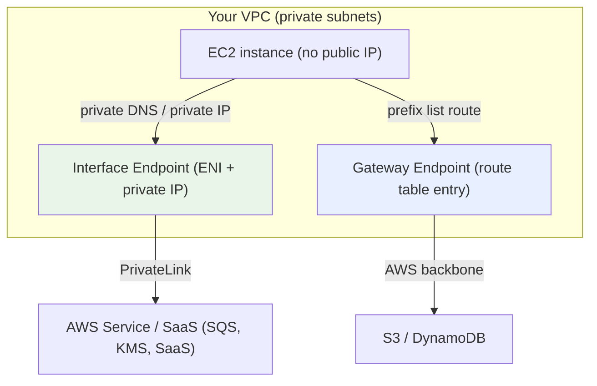
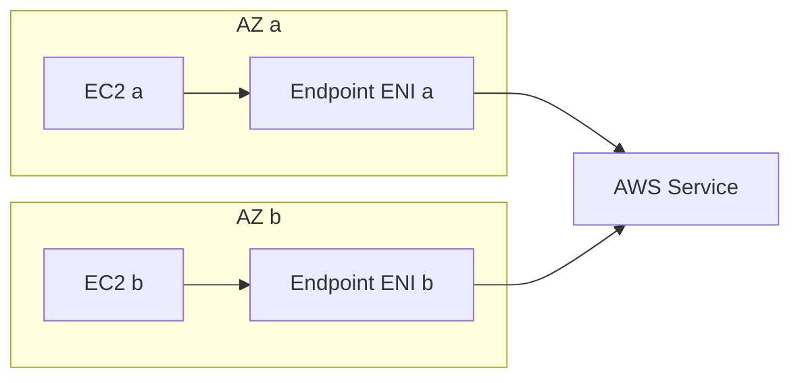

# PrivateLink & VPC Endpoints Deep Dive - SAA-C03 Deep Dive

> AWS PrivateLink provides **private connectivity** to AWS services, SaaS, and your own services using **Interface Endpoints (ENIs with private IPs)** and **Gateway Endpoints (S3/DynamoDB only)** — no Internet Gateway, NAT, VPC peering, or public internet required.

See also: [02 - Endpoint Services & Architecture Patterns](02%20-%20Endpoint%20Services%20%26%20Architecture%20Patterns.md) · [03 - PrivateLink Exam Scenarios & Facts](03%20-%20PrivateLink%20Exam%20Scenarios%20%26%20Facts.md)

---

## Table of Contents

- [Part 1: What PrivateLink Solves](#part-1-what-privatelink-solves)
- [Part 2: Interface Endpoints (ENI + Private IP)](#part-2-interface-endpoints-eni--private-ip)
- [Part 3: Gateway Endpoints (S3 & DynamoDB Only)](#part-3-gateway-endpoints-s3--dynamodb-only)
- [Part 4: Interface vs Gateway Endpoint Comparison](#part-4-interface-vs-gateway-endpoint-comparison)
- [Part 5: Endpoint Policies](#part-5-endpoint-policies)
- [Part 6: Private DNS Option](#part-6-private-dns-option)
- [Part 7: Security Groups on Interface Endpoints](#part-7-security-groups-on-interface-endpoints)
- [Part 8: Cross-AZ Behaviour & High Availability](#part-8-cross-az-behaviour--high-availability)
- [Part 9: Cost Model](#part-9-cost-model)
- [Part 10: AWS Service vs Partner/SaaS Endpoints](#part-10-aws-service-vs-partnersaas-endpoints)
- [Summary: Key Takeaways for SAA-C03](#summary-key-takeaways-for-saa-c03)

---



---

AWS PrivateLink and VPC Endpoints are heavily tested in the SAA-C03 Networking domain. They let resources in a private VPC reach AWS and third-party services without ever traversing the public internet.

---

## Part 1: What PrivateLink Solves

### The Problem

By default, AWS service APIs (S3, SQS, KMS, etc.) have **public endpoints** (e.g. `sqs.us-east-1.amazonaws.com`). An EC2 instance in a private subnet reaching those APIs traditionally needed one of:

- An **Internet Gateway (IGW)** — requires a public IP, exposes the instance.
- A **NAT Gateway** — costs money per hour + per GB, traffic still leaves to the public AWS edge.
- **VPC Peering / Transit Gateway** — for reaching another VPC's service, but couples networks and needs non-overlapping CIDRs.

### The PrivateLink Solution

| Benefit                     | Detail                                                                                  |
| :-------------------------- | :-------------------------------------------------------------------------------------- |
| **No public internet**      | Traffic stays on the AWS private network / backbone                                     |
| **No IGW or NAT required**  | Private subnets reach services with no internet path                                    |
| **No CIDR overlap concern** | Interface endpoints work even with overlapping VPC CIDRs (no routing of whole networks) |
| **No transitive routing**   | Only the specific service is exposed, not the entire VPC                                |
| **Granular security**       | Security groups + endpoint policies scope access                                        |

> **Exam Tip:** If a question says "access an AWS service **privately** without an Internet Gateway / NAT," the answer is almost always a **VPC Endpoint (PrivateLink)**.

[⬆ Back to top](#table-of-contents)

---

## Part 2: Interface Endpoints (ENI + Private IP)

An **Interface Endpoint** is an **Elastic Network Interface (ENI)** placed into one or more of your subnets, with a **private IP address** from each subnet's range. It is the PrivateLink "consumer" side.

### Key Facts

- Powered by **AWS PrivateLink**.
- One ENI per subnet/AZ you enable — give it private IPs so resources resolve to a local AZ.
- Supports **most AWS services** (SQS, SNS, KMS, Secrets Manager, Systems Manager, CloudWatch, ECR, API Gateway, etc.), **partner/SaaS services**, and **your own services**.
- DNS name like `vpce-xxxx.sqs.us-east-1.vpce.amazonaws.com`, or use **Private DNS** to keep the standard service hostname.
- **Hourly charge per endpoint per AZ** + **per-GB data processing** charge.
- Controlled by a **security group** (unlike gateway endpoints).

### Traffic Flow

```bash
# EC2 in private subnet calls SQS
# With Private DNS enabled, the standard name resolves to the endpoint ENI's private IP
nslookup sqs.us-east-1.amazonaws.com
# -> 10.0.1.45 (the interface endpoint ENI, not a public IP)

aws sqs list-queues --region us-east-1   # flows over PrivateLink, never the internet
```

[⬆ Back to top](#table-of-contents)

---

## Part 3: Gateway Endpoints (S3 & DynamoDB Only)

A **Gateway Endpoint** is a target you add to your **route table**. It is **not** an ENI and has **no private IP** and **no security group**.

### Key Facts

- **Only supports two services: Amazon S3 and DynamoDB.** (Memorize this.)
- Added as a **route table entry** pointing a **managed prefix list** (e.g. `pl-xxxx`) to the gateway endpoint target.
- **No additional cost** — free to use (you still pay normal S3/DynamoDB and data transfer).
- Access is controlled by an **endpoint policy** (and bucket/resource policies), **not** a security group.
- Only reachable **from within the same VPC** — cannot be accessed from on-premises (over VPN/Direct Connect), from peered VPCs, or across regions.

> **Exam Trap:** S3 also offers an **Interface Endpoint** (PrivateLink) variant. Use the **Gateway Endpoint** when free and only same-VPC access is needed; use the **S3 Interface Endpoint** when you must reach S3 from **on-premises** or another VPC privately.

```bash
# Route table entry created by a gateway endpoint for S3
# Destination (prefix list)        Target
# pl-63a5400a (com.amazonaws.s3)   vpce-0abc123  (gateway endpoint)
```

[⬆ Back to top](#table-of-contents)

---

## Part 4: Interface vs Gateway Endpoint Comparison

| Attribute                       | Interface Endpoint                   | Gateway Endpoint                                    |
| :------------------------------ | :----------------------------------- | :-------------------------------------------------- |
| **Technology**                  | AWS PrivateLink (ENI)                | Route table prefix-list entry                       |
| **Supported services**          | Most AWS services, SaaS, custom      | **S3 and DynamoDB only**                            |
| **Has private IP / ENI**        | ✅ Yes                               | ❌ No                                               |
| **Security group**              | ✅ Yes (controls access)             | ❌ No                                               |
| **Endpoint policy**             | ✅ Yes                               | ✅ Yes                                              |
| **Cost**                        | Hourly + per-GB processed            | **Free**                                            |
| **On-premises access (VPN/DX)** | ✅ Yes (via private IP)              | ❌ No (same VPC only)                               |
| **Peered VPC / TGW access**     | ✅ Yes                               | ❌ No                                               |
| **DNS**                         | New regional DNS name or Private DNS | Uses public S3/DynamoDB DNS, routed via prefix list |

> **Exam Tip:** "Free + S3/DynamoDB + same VPC" → **Gateway Endpoint**. "On-prem needs private S3 access" → **Interface Endpoint**.

[⬆ Back to top](#table-of-contents)

---

## Part 5: Endpoint Policies

An **endpoint policy** is a resource-based IAM policy attached to the endpoint that controls **which principals/actions/resources** can be reached **through that endpoint**. It does **not** grant permissions on its own — it intersects with IAM and resource policies.

```json
{
  "Statement": [
    {
      "Sid": "AllowOneBucketOnly",
      "Effect": "Allow",
      "Principal": "*",
      "Action": ["s3:GetObject", "s3:PutObject"],
      "Resource": "arn:aws:s3:::my-corp-bucket/*"
    }
  ]
}
```

- Default endpoint policy allows **full access** to the service.
- Use it to lock an S3 gateway endpoint to **only your buckets**, preventing data exfiltration to arbitrary buckets.
- Works alongside **SCPs** ([08 - SCP](08%20-%20SCP.md)) and condition keys like `aws:SourceVpce` for a data perimeter.

> **Exam Tip:** Preventing instances from copying data to _external_ S3 buckets via the endpoint = **endpoint policy** scoped to your bucket ARNs.

[⬆ Back to top](#table-of-contents)

---

## Part 6: Private DNS Option

When you enable **Private DNS** on an Interface Endpoint, the **standard public service hostname** (e.g. `sqs.us-east-1.amazonaws.com`) resolves to the endpoint's **private IP** inside your VPC.

### Requirements & Behaviour

- The VPC must have `enableDnsSupport` and `enableDnsHostnames` set to **true**.
- No application code change — existing SDKs/CLI keep using the default endpoint name but now route privately.
- Without Private DNS, you must call the **endpoint-specific DNS name**.

> **Exam Trap:** If Private DNS isn't working, check that **DNS hostnames and DNS resolution are enabled** on the VPC. This is the classic gotcha.

[⬆ Back to top](#table-of-contents)

---

## Part 7: Security Groups on Interface Endpoints

The endpoint ENI is protected by a **security group**. To allow your instances to use the endpoint, the SG must **allow inbound HTTPS (TCP 443)** from the source security group or CIDR.

```bash
# Endpoint SG: allow 443 inbound from the app-tier security group
aws ec2 authorize-security-group-ingress \
  --group-id sg-endpoint123 \
  --protocol tcp --port 443 \
  --source-group sg-apptier456
```

- Forgetting to open **443 inbound** is a common "endpoint times out" cause.
- Gateway endpoints have **no** security group — access is governed by route tables + endpoint policy.

[⬆ Back to top](#table-of-contents)

---

## Part 8: Cross-AZ Behaviour & High Availability

- Deploy the interface endpoint into **one subnet per AZ** that you use, so traffic stays in-AZ and survives an AZ failure.
- Each enabled AZ gets its **own ENI + private IP**; the regional Private DNS name resolves to the nearest one.
- **Cross-AZ data** between instance and endpoint may incur normal cross-AZ transfer charges — keep them in the same AZ when possible.



[⬆ Back to top](#table-of-contents)

---

## Part 9: Cost Model

| Endpoint Type               | Hourly Charge           | Data Processing      | Notes                        |
| :-------------------------- | :---------------------- | :------------------- | :--------------------------- |
| **Interface (PrivateLink)** | Per endpoint **per AZ** | Per **GB processed** | Cost scales with AZs enabled |
| **Gateway (S3/DynamoDB)**   | **None**                | **None**             | Completely free              |

- Cost-optimization questions favour **Gateway Endpoints** for S3/DynamoDB because they are free and remove NAT Gateway data charges.
- Replacing a **NAT Gateway** with endpoints can cut costs when most traffic is to AWS services.

> **Exam Tip:** "Reduce NAT Gateway costs for S3 access" → add an **S3 Gateway Endpoint** (free).

[⬆ Back to top](#table-of-contents)

---

## Part 10: AWS Service vs Partner/SaaS Endpoints

| Endpoint Provider                  | What You Connect To                     | Mechanism                                                                                                |
| :--------------------------------- | :-------------------------------------- | :------------------------------------------------------------------------------------------------------- |
| **AWS services**                   | SQS, KMS, ECR, SSM, etc.                | Interface (most) or Gateway (S3/DDB)                                                                     |
| **AWS Marketplace / Partner SaaS** | Datadog, Snowflake, MongoDB Atlas, etc. | Interface endpoint to a partner **Endpoint Service**                                                     |
| **Your own service**               | An internal microservice behind an NLB  | Interface endpoint to **your** Endpoint Service (see [02 - Endpoint Services & Architecture Patterns](02%20-%20Endpoint%20Services%20%26%20Architecture%20Patterns.md)) |

PrivateLink lets a consumer reach a SaaS product **privately**, with traffic never leaving the AWS network — a key compliance and security selling point.

[⬆ Back to top](#table-of-contents)

---

## Summary: Key Takeaways for SAA-C03

| Concept                  | What You Must Know                                                                        |
| :----------------------- | :---------------------------------------------------------------------------------------- |
| **Interface Endpoint**   | ENI + private IP, PrivateLink, most services, has a security group, costs hourly + per GB |
| **Gateway Endpoint**     | Route table entry, **S3 & DynamoDB only**, free, no SG, same-VPC only                     |
| **No IGW/NAT**           | Endpoints give private access with no internet path                                       |
| **Endpoint policy**      | Resource policy scoping which resources the endpoint can reach (anti-exfiltration)        |
| **Private DNS**          | Standard hostname resolves to private IP; needs VPC DNS settings enabled                  |
| **Security group**       | Must allow **443 inbound** on interface endpoints                                         |
| **On-prem S3 privately** | Use S3 **Interface** endpoint, not Gateway                                                |
| **Cost cut for S3**      | Use the free **Gateway endpoint** to avoid NAT data charges                               |

[⬆ Back to top](#table-of-contents)

---
