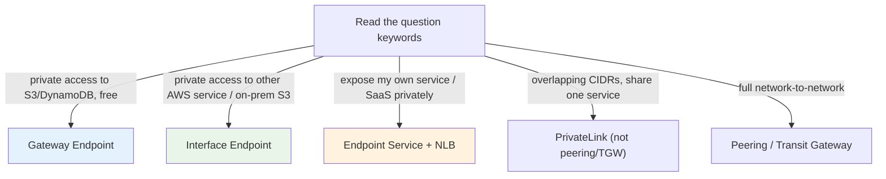

# PrivateLink Exam Scenarios & Facts - SAA-C03 Deep Dive

> Scenario-driven drill for **AWS PrivateLink & VPC Endpoints** - decode the keywords ("expose SaaS privately," "overlapping CIDRs," "access S3 privately") and map them straight to the right endpoint choice.

See also: [01 - PrivateLink & VPC Endpoints Deep Dive](01%20-%20PrivateLink%20%26%20VPC%20Endpoints%20Deep%20Dive.md) · [02 - Endpoint Services & Architecture Patterns](02%20-%20Endpoint%20Services%20%26%20Architecture%20Patterns.md)

---

## Table of Contents

- [Part 1: Scenario Q&A Walkthroughs](#part-1-scenario-qa-walkthroughs)
- [Part 2: Question Says X to Pick Y Quick Table](#part-2-question-says-x-to-pick-y-quick-table)
- [Part 3: Important Facts Cheat Table](#part-3-important-facts-cheat-table)
- [Part 4: Common Traps & Distractor Killers](#part-4-common-traps--distractor-killers)
- [Summary: Key Takeaways for SAA-C03](#summary-key-takeaways-for-saa-c03)

---

---

This file is pure exam preparation: realistic scenarios, keyword-to-answer mapping, and a dense facts table for last-minute review.

---

## Part 1: Scenario Q&A Walkthroughs

### Scenario 1: Private S3 Access With No NAT Cost

**Question:** EC2 instances in private subnets download objects from Amazon S3. The team wants to **eliminate NAT Gateway data-processing charges** for this S3 traffic while keeping access private. What should they do?

**Answer:** Create an **S3 Gateway Endpoint** and add it to the private subnets' route tables.

**Why:** Gateway endpoints for S3/DynamoDB are **free** and keep traffic on the AWS network, removing the need to route S3 traffic through the (paid) NAT Gateway. No hourly or per-GB endpoint charge applies.

### Scenario 2: Private Access to SQS From Private Subnet

**Question:** A Lambda function (or EC2) in a **private subnet with no Internet route** must call **Amazon SQS**. How do you enable this privately?

**Answer:** Create an **Interface Endpoint** for SQS (`com.amazonaws.<region>.sqs`) and enable **Private DNS**.

**Why:** SQS is **not** an S3/DynamoDB service, so a gateway endpoint is impossible. The interface endpoint puts an ENI with a private IP into the subnet; Private DNS makes `sqs.<region>.amazonaws.com` resolve to it - no code change.

### Scenario 3: Expose an Internal API to Many Partner Accounts

**Question:** A company runs an internal API and must expose it **privately to hundreds of customer AWS accounts**, exposing **only that service** (not the whole VPC), with **self-service onboarding**. What architecture?

**Answer:** Front the API with a **Network Load Balancer**, create a **VPC Endpoint Service**, and **allowlist** the customer account principals. Customers create **interface endpoints** to the service.

**Why:** Endpoint Service + NLB is the PrivateLink **provider** pattern - scales one-to-thousands, exposes only the single service, and avoids a peering mesh.

### Scenario 4: Overlapping CIDR Blocks

**Question:** Two companies merged. Both VPCs use **10.0.0.0/16** (overlapping). Company A needs to consume **one specific application** hosted in Company B's VPC. Peering fails due to overlap. What works?

**Answer:** Company B publishes the app via a **PrivateLink Endpoint Service (NLB)**; Company A connects with an **interface endpoint**.

**Why:** PrivateLink connects to a **specific ENI**, not by routing whole networks, so **overlapping CIDRs are irrelevant**. VPC Peering and Transit Gateway both **require non-overlapping** CIDRs.

### Scenario 5: Private S3 Access From On-Premises

**Question:** An on-premises data center connected via **Direct Connect** needs to reach **Amazon S3 privately** (no public internet). Which endpoint?

**Answer:** Use an **S3 Interface Endpoint** (PrivateLink), not a Gateway Endpoint.

**Why:** **Gateway endpoints cannot be reached from on-premises** (or peered VPCs). Only an **interface endpoint** exposes a private IP that on-prem traffic over DX/VPN can route to.

### Scenario 6: Prevent Data Exfiltration to Unknown Buckets

**Question:** Security requires that instances using the S3 endpoint can only access **company-owned buckets**, blocking copies to arbitrary external buckets. How?

**Answer:** Attach an **endpoint policy** to the S3 endpoint that allows actions only on the company's bucket ARNs (or uses `aws:ResourceOrgID`).

**Why:** The endpoint policy filters which **resources** are reachable through the endpoint, forming a data perimeter alongside SCPs.

### Scenario 7: Connect Privately to a SaaS Product (Datadog/Snowflake)

**Question:** A regulated customer must use a **third-party SaaS** offered in **AWS Marketplace** but **cannot send data over the public internet**. How do they connect?

**Answer:** The SaaS vendor exposes a **PrivateLink Endpoint Service**; the customer creates an **interface endpoint** to it.

**Why:** PrivateLink keeps SaaS traffic entirely on the AWS network - the standard compliant SaaS delivery model.

### Scenario 8: Endpoint Created but Calls Time Out

**Question:** An interface endpoint for SSM exists and Private DNS is on, but Session Manager connections still **time out**. What is the most likely fix?

**Answer:** Update the **endpoint's security group** to **allow inbound TCP 443** from the instances' security group/CIDR.

**Why:** The interface endpoint ENI is guarded by a security group; without inbound 443 the TLS calls never reach it. (Also verify the VPC has DNS hostnames/resolution enabled.)

[⬆ Back to top](#table-of-contents)

---

## Part 2: Question Says X to Pick Y Quick Table

| Question Says...                                                  | Pick This                                               |
| :---------------------------------------------------------------- | :------------------------------------------------------ |
| Access **S3 or DynamoDB** privately, **free**, same VPC           | **Gateway Endpoint**                                    |
| Access **any other AWS service** (SQS, KMS, SSM...) privately     | **Interface Endpoint**                                  |
| Access **S3 from on-premises / peered VPC** privately             | **S3 Interface Endpoint** (not Gateway)                 |
| **Expose my own service / SaaS** privately to other VPCs/accounts | **VPC Endpoint Service + NLB**                          |
| Inline **firewall / IDS appliance** in the path                   | **Endpoint Service + GWLB**                             |
| **Overlapping CIDRs** but must share one service                  | **PrivateLink** (not peering/TGW)                       |
| **Full network-to-network** access between two VPCs               | **VPC Peering**                                         |
| **Many VPCs + on-prem**, transitive hub routing                   | **Transit Gateway**                                     |
| **Reduce NAT Gateway cost** for S3 traffic                        | **S3 Gateway Endpoint** (free)                          |
| Keep using **standard service hostname**, no code change          | **Enable Private DNS** on the interface endpoint        |
| Stop copying to **external S3 buckets** via endpoint              | **Endpoint policy** scoped to your buckets              |
| Manage **private instances** (no SSH/bastion/NAT)                 | **SSM + SSMMessages + EC2Messages** interface endpoints |
| Provider must **approve each consumer**                           | Endpoint Service with **acceptance required**           |

[⬆ Back to top](#table-of-contents)

---

## Part 3: Important Facts Cheat Table

| #   | Fact                                                                                                       |
| :-- | :--------------------------------------------------------------------------------------------------------- |
| 1   | **Gateway Endpoints support ONLY S3 and DynamoDB** - everything else needs an Interface Endpoint.          |
| 2   | Gateway Endpoints are **free**; Interface Endpoints cost **hourly per AZ + per-GB** processing.            |
| 3   | Interface Endpoint = **ENI + private IP** in your subnet, powered by **PrivateLink**.                      |
| 4   | Gateway Endpoint = **route table entry** pointing a **managed prefix list** to the gateway target.         |
| 5   | Gateway Endpoints **cannot** be reached from **on-premises, peered VPCs, or other regions**.               |
| 6   | Interface Endpoints **can** be reached from on-premises (via VPN/DX) and peered/TGW VPCs.                  |
| 7   | **Private DNS** makes the standard service hostname resolve to the private endpoint IP (no code change).   |
| 8   | Private DNS requires the VPC to have **DNS hostnames** and **DNS resolution** enabled.                     |
| 9   | Interface Endpoints have a **security group**; Gateway Endpoints do **not**.                               |
| 10  | Open **TCP 443 inbound** on the interface endpoint SG or calls time out.                                   |
| 11  | **Endpoint policies** filter which resources/actions are reachable; they don't grant IAM permissions.      |
| 12  | A **VPC Endpoint Service** must be fronted by an **NLB** (or **GWLB**); **ALB is not directly supported**. |
| 13  | PrivateLink **allows overlapping CIDRs**; Peering and Transit Gateway **do not**.                          |
| 14  | Endpoint Service scales to **thousands of consumers** with no peering mesh and **no transitive routing**.  |
| 15  | Provider controls access via **acceptance required** and **allowlisted principals**.                       |
| 16  | Custom private DNS name on an Endpoint Service requires **domain-ownership (TXT) verification**.           |
| 17  | Deploy interface endpoints in **one subnet per AZ** for HA and to avoid cross-AZ charges.                  |
| 18  | `aws:SourceVpce` / `aws:SourceVpc` condition keys restrict access to traffic via a specific endpoint.      |

[⬆ Back to top](#table-of-contents)

---

## Part 4: Common Traps & Distractor Killers

> **Exam Trap:** "Use a **Gateway Endpoint** to access SQS/KMS" - **wrong**. Gateway endpoints only do **S3 and DynamoDB**. Pick an interface endpoint.

> **Exam Trap:** "Access S3 from **on-premises** via a **Gateway Endpoint**" - **wrong**. Gateway endpoints are same-VPC only; use an **S3 Interface Endpoint**.

> **Exam Trap:** "Use **VPC Peering** to share a service when CIDRs **overlap**" - **wrong**. Peering forbids overlapping CIDRs; use **PrivateLink**.

> **Exam Trap:** "Put an **ALB** behind a VPC Endpoint Service directly" - **wrong**. Endpoint Services need an **NLB** (or GWLB). An ALB can sit **behind** the NLB.

> **Exam Trap:** "Interface endpoint is free" - **wrong**. Only **Gateway** endpoints are free; interface endpoints incur hourly + data-processing charges.

> **Exam Tip:** When both a **Gateway** and **Interface** option exist for S3, default to the **free Gateway** unless the scenario needs **on-premises / cross-VPC / private-DNS** S3 access.

> **Exam Tip:** "Manage instances in a private subnet with **no Internet, no bastion**" almost always means **Systems Manager interface endpoints** (SSM, SSMMessages, EC2Messages).

[⬆ Back to top](#table-of-contents)

---

## Summary: Key Takeaways for SAA-C03

| Concept                        | What You Must Know                              |
| :----------------------------- | :---------------------------------------------- |
| **S3/DynamoDB private + free** | Gateway Endpoint (same-VPC only)                |
| **Any other service private**  | Interface Endpoint (ENI, has SG, costs money)   |
| **On-prem private S3**         | S3 Interface Endpoint, never Gateway            |
| **Expose your own service**    | Endpoint Service + NLB (GWLB for appliances)    |
| **Overlapping CIDRs**          | PrivateLink, not Peering/TGW                    |
| **Full network access**        | Peering (2 VPCs) or Transit Gateway (hub)       |
| **No code change**             | Enable Private DNS (+ VPC DNS settings)         |
| **Anti-exfiltration**          | Endpoint policy scoped to your resources        |
| **Timeouts**                   | Open 443 inbound on the endpoint security group |

See also: [04 - VPC Endpoints & PrivateLink Basics](04%20-%20VPC%20Endpoints%20%26%20PrivateLink%20Basics.md) · [03 - Network Load Balancer (NLB) & Gateway Load Balancer](03%20-%20Network%20Load%20Balancer%20%28NLB%29%20%26%20Gateway%20Load%20Balancer.md) · [01 - Transit Gateway Fundamentals & Architecture](01%20-%20Transit%20Gateway%20Fundamentals%20%26%20Architecture.md)

[⬆ Back to top](#table-of-contents)

---
