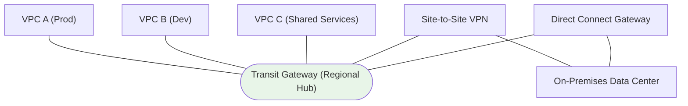

# AWS Transit Gateway Fundamentals & Architecture - SAA-C03 Deep Dive

> Transit Gateway (TGW) is a **regional, highly available hub-and-spoke router** that connects thousands of VPCs and on-premises networks through a single transitive attachment point, replacing the unscalable full-mesh of VPC peering.

See also: [02 - Route Tables, Peering & Sharing](02%20-%20Route%20Tables%2C%20Peering%20%26%20Sharing.md) · [03 - Transit Gateway Exam Scenarios & Facts](03%20-%20Transit%20Gateway%20Exam%20Scenarios%20%26%20Facts.md)

---

## Table of Contents

- [The Problem: Full-Mesh VPC Peering Does Not Scale](#the-problem-full-mesh-vpc-peering-does-not-scale)
- [What Is a Transit Gateway?](#what-is-a-transit-gateway)
- [TGW Attachment Types](#tgw-attachment-types)
- [Transitive Routing: The Killer Feature](#transitive-routing-the-killer-feature)
- [Availability Zones & Appliance Mode](#availability-zones--appliance-mode)
- [MTU, Jumbo Frames & Bandwidth](#mtu-jumbo-frames--bandwidth)
- [Cost Model](#cost-model)
- [Summary: Key Takeaways for SAA-C03](#summary-key-takeaways-for-saa-c03)

---



---

Transit Gateway is one of the most heavily tested networking services on the SAA-C03 exam. Almost any scenario that says "connect many VPCs", "central inspection", or "simplify a complex peering mesh" is pointing at TGW.

---

## The Problem: Full-Mesh VPC Peering Does Not Scale

Before TGW, connecting multiple VPCs (and on-premises networks) meant building a **full mesh of VPC peering connections**. The number of peering connections grows quadratically.

### The n² Problem

To fully connect **n** VPCs, you need:

```
connections = n * (n - 1) / 2
```

| Number of VPCs | Peering Connections Required |
| :------------- | :--------------------------- |
| 3              | 3                            |
| 5              | 10                           |
| 10             | 45                           |
| 50             | 1,225                        |
| 100            | 4,950                        |

### Why Peering Hurts at Scale

| Limitation of Full-Mesh Peering | Consequence                                                |
| :------------------------------ | :--------------------------------------------------------- |
| **Not transitive**              | A↔B and B↔C does NOT give A↔C; you must add A↔C explicitly |
| **Route table sprawl**          | Every VPC needs a route entry for every peer               |
| **Operational burden**          | Adding one VPC means N new peering links + route updates   |
| **No central control**          | No single place to inspect, segment, or manage traffic     |

> **Exam Trap:** VPC peering is **never transitive**. If a question describes traffic that must flow through an intermediate VPC/network, peering is the wrong answer - think Transit Gateway.

[⬆ Back to top](#table-of-contents)

---

## What Is a Transit Gateway?

A **Transit Gateway** is a fully managed, regional network transit hub. Each attached network connects **once** to the TGW, and the TGW routes traffic between them - turning an O(n²) mesh into an O(n) hub-and-spoke topology.

### Core Characteristics

| Characteristic        | Detail                                                               |
| :-------------------- | :------------------------------------------------------------------- |
| **Scope**             | Regional (one TGW lives in one AWS Region)                           |
| **Topology**          | Hub-and-spoke; spokes are _attachments_                              |
| **Transitive**        | Yes - attachments can route to each other through the hub            |
| **Scale**             | Thousands of VPC attachments per TGW                                 |
| **High availability** | Managed, redundant across AZs by design                              |
| **Cross-account**     | Shareable via AWS RAM (see [02 - Route Tables, Peering & Sharing](02%20-%20Route%20Tables%2C%20Peering%20%26%20Sharing.md)) |
| **Cross-region**      | Connect TGWs in different regions via TGW **peering**                |

### TGW vs Other Connectivity Options (Quick Frame)

| Option              | Connects                      | Transitive?            | Scale                    |
| :------------------ | :---------------------------- | :--------------------- | :----------------------- |
| **VPC Peering**     | 2 VPCs                        | No                     | Point-to-point only      |
| **Transit Gateway** | Many VPCs + on-prem           | Yes                    | Thousands of attachments |
| **PrivateLink**     | Consumer VPC → single service | N/A (service exposure) | Per-service endpoints    |

> **Exam Tip:** TGW is **regional**. To connect VPCs in _different_ regions you peer two Transit Gateways together. There is no single global TGW.

[⬆ Back to top](#table-of-contents)

---

## TGW Attachment Types

An **attachment** is how a network connects to the TGW. Each attachment is associated with one TGW route table and can propagate routes into route tables.

| Attachment Type            | What It Connects                | Notes                                                                 |
| :------------------------- | :------------------------------ | :-------------------------------------------------------------------- |
| **VPC attachment**         | A VPC to the TGW                | You select one subnet per AZ; TGW places an ENI in each chosen subnet |
| **VPN attachment**         | Site-to-Site VPN to TGW         | Supports ECMP across multiple tunnels for higher aggregate throughput |
| **Direct Connect Gateway** | DX → TGW                        | Use a **Transit VIF** + DX Gateway to reach the TGW privately         |
| **TGW Peering attachment** | TGW ↔ TGW (cross-region)        | Enables inter-region routing; uses encrypted AWS backbone             |
| **Connect attachment**     | SD-WAN / third-party appliances | Uses GRE + BGP over an existing VPC or DX attachment                  |

### VPC Attachment Subnet Detail

- You choose **one subnet per Availability Zone** for the TGW to use.
- TGW creates an **elastic network interface (ENI)** in each selected subnet.
- For an AZ to reach the TGW, the **subnet must be in an AZ enabled on the attachment**. If no TGW ENI exists in an AZ, instances in that AZ cannot reach the TGW.

> **Exam Tip:** A Connect attachment (GRE + BGP) is the answer when the question mentions **SD-WAN appliances** or third-party virtual routers needing dynamic routing into the TGW.

[⬆ Back to top](#table-of-contents)

---

## Transitive Routing: The Killer Feature

The single biggest reason to use TGW is **transitive routing**: any attachment can reach any other attachment (subject to route tables), without explicit point-to-point links.

### How Traffic Flows

```
EC2 in VPC A  --> VPC A route table (0.0.0.0/0 -> tgw-xxxx)
              --> Transit Gateway
              --> TGW route table lookup (dest VPC B CIDR -> VPC B attachment)
              --> VPC B route table (local)
              --> EC2 in VPC B
```

### Two Layers of Routing You Must Configure

| Layer               | Where                     | What You Add                                                       |
| :------------------ | :------------------------ | :----------------------------------------------------------------- |
| **VPC route table** | Inside each VPC's subnets | Route to remote CIDRs (or `0.0.0.0/0`) with target = the TGW       |
| **TGW route table** | On the Transit Gateway    | Associations + propagations deciding which attachments reach which |

Both layers must align. A common failure is adding the TGW route in the VPC but forgetting the **return route** in the destination VPC, or the TGW route table lacking a propagated/static route. Details on association vs propagation are in [02 - Route Tables, Peering & Sharing](02%20-%20Route%20Tables%2C%20Peering%20%26%20Sharing.md).

> **Exam Trap:** "Connectivity works one direction only" almost always means a **missing return route** in the destination VPC's subnet route table or in the TGW route table.

[⬆ Back to top](#table-of-contents)

---

## Availability Zones & Appliance Mode

### AZ Affinity (Default Behavior)

By default, TGW keeps traffic in the **same AZ** when possible. For a flow entering the TGW in AZ-a, it tries to exit toward the destination using the AZ-a appliance/ENI. This is fine for stateless routing but **breaks stateful appliances**.

### The Stateful Appliance Problem

When you route traffic through a stateful network appliance (firewall, NGFW, IDS/IPS) in an inspection VPC, the **forward and return paths may use different AZs**. A stateful firewall in AZ-a never sees the return packet that came back through AZ-b, so it drops the connection.

### The Fix: Appliance Mode

| Setting                          | Behavior                                                                               |
| :------------------------------- | :------------------------------------------------------------------------------------- |
| **Appliance mode OFF (default)** | TGW uses AZ affinity per direction - asymmetric paths possible                         |
| **Appliance mode ON**            | TGW pins the **entire bidirectional flow** to a single AZ/appliance using flow hashing |

Enable **appliance mode on the VPC attachment** that contains the stateful appliance (the inspection/security VPC). This guarantees symmetric routing so the same firewall instance sees both directions of a flow.

> **Exam Tip:** Centralized inspection VPC + stateful firewall + asymmetric/dropped traffic across AZs → **enable appliance mode** on the inspection VPC's TGW attachment.

[⬆ Back to top](#table-of-contents)

---

## MTU, Jumbo Frames & Bandwidth

### MTU by Attachment Type

| Path                                          | Maximum MTU                                    |
| :-------------------------------------------- | :--------------------------------------------- |
| **VPC, Direct Connect, TGW Connect, peering** | 8500 bytes (jumbo frames)                      |
| **Site-to-Site VPN attachment**               | 1500 bytes (VPN does NOT support jumbo frames) |

> **Exam Trap:** Jumbo frames (up to 8500 bytes) are supported on VPC/DX/peering/Connect attachments but **NOT over Site-to-Site VPN**, which caps at 1500 bytes.

### Bandwidth

| Boundary               | Limit                                                              |
| :--------------------- | :----------------------------------------------------------------- |
| **Per VPC attachment** | Up to ~100 Gbps burst aggregate                                    |
| **Per VPN tunnel**     | ~1.25 Gbps per tunnel; scale with **ECMP** across multiple tunnels |
| **Connect (GRE)**      | Up to ~5 Gbps per Connect peer (BGP), scalable with multiple peers |

ECMP (Equal-Cost Multi-Path) lets a VPN or Connect attachment spread traffic across multiple equal-cost paths/tunnels to exceed a single tunnel's throughput.

[⬆ Back to top](#table-of-contents)

---

## Cost Model

TGW pricing has **two dimensions** - you pay for connection-hours AND data processed.

| Cost Component             | How It Is Billed                                      |
| :------------------------- | :---------------------------------------------------- |
| **Attachment hours**       | Hourly charge **per attachment** connected to the TGW |
| **Data processing**        | Per-GB charge for data sent through the TGW           |
| **Cross-region (peering)** | Standard inter-region data transfer rates also apply  |

### Cost Implications

- Many attachments + high data volume can make TGW noticeably more expensive than a couple of VPC peering links.
- **VPC peering has no per-GB processing charge within the same AZ** and no hourly attachment fee, so for _just two_ VPCs peering is usually cheaper.
- TGW wins on **scale and operational simplicity**, not on raw cost for tiny topologies.

> **Exam Tip:** If the scenario is just **two VPCs** that need low-cost connectivity, **VPC peering** is the cost-optimized answer. TGW becomes justified once you have many VPCs and/or hybrid (on-prem) connectivity.

[⬆ Back to top](#table-of-contents)

---

## Summary: Key Takeaways for SAA-C03

| Concept             | What You Must Know                                              |
| :------------------ | :-------------------------------------------------------------- |
| **Purpose**         | Regional hub-and-spoke router; replaces full-mesh peering       |
| **n² problem**      | Peering needs n(n-1)/2 links and is not transitive              |
| **Transitive**      | TGW IS transitive; VPC peering is NOT                           |
| **Scope**           | Regional; use TGW peering for cross-region                      |
| **Attachments**     | VPC, VPN, Direct Connect Gateway, TGW peering, Connect (SD-WAN) |
| **Appliance mode**  | Pins bidirectional flows to one AZ for stateful firewalls       |
| **MTU**             | 8500 jumbo on VPC/DX/peering/Connect; 1500 on VPN               |
| **ECMP**            | Scales VPN/Connect throughput across multiple tunnels/peers     |
| **Cost**            | Per-attachment-hour + per-GB data processing                    |
| **When NOT to use** | Just two VPCs → VPC peering is cheaper                          |

[⬆ Back to top](#table-of-contents)
